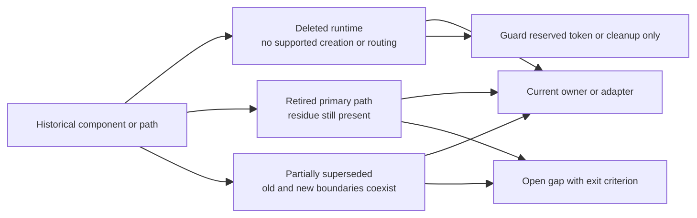
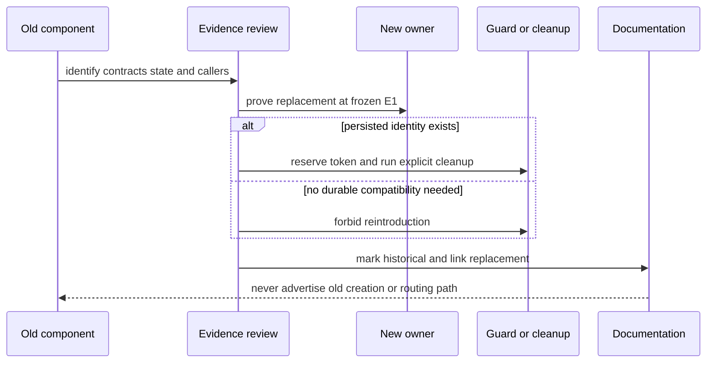

# 已退役与被替代组件：删除什么、由谁接管、留下什么约束

> 版本与结论：本章是 `historical` 删除索引，不是兼容指南。A2A runtime、StateMirror、SkillRunner runtime、独立 Maker capability/Host 与一批旧 demo 已从冻结基线的活跃路径删除；MassTransit runtime 已删除但 package/guard 残留仍在；Lark 中立化只完成了部分边界，CardKit 状态和 typed metadata 仍存在。删除事实不能被反向解释为“功能从未存在”，残留也不能被包装成受支持入口。

## 设计抽象与事实源

- `tools/ci/architecture_guards.sh:578-592`、`:1501-1531`：禁止 SkillRunner runtime、独立 Maker projects/endpoints 回流，说明替代边界已成为 current guard。
- `docs/canon/cqrs-projection.md:9-32`、`:104-129`：当前写侧、projection/read model 与 Maker plugin 边界，说明 StateMirror 和独立 Maker CQRS 被什么模型替代。
- `agents/Aevatar.GAgents.Channel.Runtime/ChannelMetadataKeys.cs:24-78`：generic delivery address 与 Lark-specific identity metadata 同时存在，证明 Channel 中立化尚未完成，不能笼统写成“旧 Lark contracts 全部删除”。

## 先建立模型：退役不是同一种状态



| 对象 | 冻结基线状态 | 当前替代者 | 保留教训 |
|---|---|---|---|
| A2A adapter/runtime | 已删除 | Host/adapter 仍应把外部协议翻译为 `EventEnvelope`，actor + EventStore/read model 保持事实权威 | 外部 task store 不能成为第二事实源 |
| MassTransit runtime | 主运行路径已删除，治理残留未清 | Orleans runtime/stream 与 Kafka provider | 删除 runtime 后还要同步 package、guard、ADR；`#2209` 仍未决 |
| StateMirror | 已删除 | committed-state publication + typed projection/read model | 通用 JSON state mirror 会模糊领域事件、版本与 query contract |
| SkillRunnerGAgent | runtime/model 已删除 | `ScheduledDispatchGAgent` + workflow/team service invocation | schedule、credential、execution 与 delivery 不能塞进一个 runner actor |
| Lark-specific contracts | 部分被替代 | channel-neutral activity/address/intent + Lark adapter | 中立化必须逐字段、逐状态 owner 完成，不能只改类型名 |
| 独立 Maker capability/Host | 已删除；Maker 能力仍在 | Workflow extension module pack | plugin 可扩展 kernel，但不应拥有平行 Host/CQRS 主链 |
| 旧 demo projects | 已删除或失去运行入口 | current workflows、tests 与 `11` 场景教程 | Git 历史是归档，不是受支持安装源 |

## A2A：删除 adapter runtime，保留 Host-boundary 原则

历史提交 `8bfd8605c` 删除了 `Aevatar.Interop.A2A.Abstractions`、`Application`、`Hosting` 与 tests；冻结树中三套目录均不存在。冻结历史文档仍描述 A2A Task/AgentCard 映射，但那是历史设计，不是可调用 endpoint。

被替代的不是“跨系统集成”这一需求，而是 process-local A2A task facts：若未来重新引入协议 adapter，外部 request 应在 Host boundary 收敛为 actor command，状态查询应回到 committed fact/read model。不能因为 A2A 自带 task status 就绕开 actor owner，再造一套内存权威。

为什么选择删除而不是保留 dormant adapter？没有活跃调用方却保留协议 DTO、task store 和 endpoint 会制造“看似可用”的 public surface，还要求持续追随外部协议版本。当前没有批准的新 A2A contract，因此最小且诚实的状态是历史索引。

## MassTransit：runtime 已退役，residue 仍是 open drift

历史提交 `9aa72b49b` 删除 Orleans/MassTransit queue adapter、stream provider、Kafka transport implementation 与大批集成测试；冻结树没有任何 `.csproj` 消费 MassTransit。当前分布式链路见 [10/02 Orleans](../10/02-orleans-runtime.md) 与 [10/04 streaming/Kafka](../10/04-streaming-transport-and-kafka.md)。

但“彻底清理完成”不成立：`Directory.Packages.props:21-22`、`:211-217` 仍集中声明 MassTransit packages，`tools/ci/architecture_guards.sh:1369-1383` 仍守 v8/v9，另有旧 implementation reference guard。冻结 issue `#2209` 正是对这组 residue 的未决清理。

为什么保留这条不整齐的结论？runtime zero-consumer 证明它不是现役 transport；package/guard residue 又证明治理面没有闭合。删掉后一半会误导依赖审计，删掉前一半则会把残留误报成可用能力。退出条件进入 [12/05](05-open-gaps-and-canon-drift.md)，本章不替 open issue 拍板。

## StateMirror：从全量镜像回到 committed fact 与 typed read model

历史提交 `da7944cf2` 删除 `Aevatar.CQRS.Projection.StateMirror`、`IStateMirrorProjection`、JSON mirror service 与 tests。冻结代码中不存在这些精确类型；测试里出现的 `CommittedStateMirror` 只是测试变量命名，不是复活的组件。

当前模型由 actor 提交 domain event/committed-state publication，Projection Core 按 descriptor/materializer 生成领域 read model，查询端读取 versioned document。详见 [05/01](../05/01-command-event-projection-readmodel.md) 与 [05/04](../05/04-readmodel-stores-versioning-and-rebuild.md)。

为什么 typed projection 比“把整个 state JSON 镜像出来”更合适？read model 需要明确 owner、schema、版本、授权与 rebuild 语义；通用 mirror 容易把 actor 内部状态暴露为公共查询契约，也让消费者依赖不稳定字段。代价是每个领域必须显式写 materializer 与迁移策略，不能靠一个万能镜像省掉设计。

## SkillRunnerGAgent：删除一体化 runner，拆开 schedule 与 execution owner

`#2731–#2733` 对应的历史实现最终由提交 `d828358f8` 删除：`SkillRunnerGAgent`、command/query/cron ports、proto、projection、read model 和 tests 在活跃 `.cs/.proto` 全树零命中。current guard 会拒绝这些名字重新进入 agents、src 或 test 扫描根。

替代链不是一个改名后的 runner：

1. `ScheduledDispatchGAgent` 拥有 schedule、callback lease、fire 与 credential lifecycle facts；
2. workflow/team service contract 拥有实际执行；
3. committed-state projection 拥有查询副本；
4. Channel adapter/intent 拥有交付；
5. generic skill loading 留在 AI/tool-provider path。

历史 kind/type token 只允许出现在 retired-actor cleanup 或 reserved proto number/name，不能用于 create、routing、schedule 或 query。完整 current contract 见 [09/01](../09/01-automation-resource-api-and-readmodels.md) 与 [09/02](../09/02-scheduled-actor-callback-and-fire.md)。

为什么不保留 SkillRunner 作为兼容 facade？它把 schedule owner、LLM/tool execution、外部 trigger、streaming delivery 与读模型聚成一个 actor，任何 credential 或 Channel 演进都会侵入 runner state。直接删除并以 reserved token + cleanup 承接历史数据，比让新请求继续走兼容分支更小、更可审计。

## Lark-specific contracts：独立包与 prompt 特例已退役，核心残留仍在

这条演进只能逐层陈述：

- `#2735` 删除 standalone `Aevatar.GAgents.Authoring.Lark`，authoring 迁入 generic scheduled tools；
- `#2684` 把 scheduled delivery target 收敛为 provider slug + generic address/fallback；
- `#2931` 移除 relay prompt/context 中的 Lark literal 和 `lark_union_id/lark_chat_id` 注入；
- `#2609` 让 interaction notification 走 channel-neutral relay port。

与此同时，冻结树仍在 `ChannelMetadataKeys` 暴露 Lark identity/operator/subject keys，`AgentRunGAgent.LarkCardDelivery.cs:13-64` 仍由 NyxIdChat actor 持有 CardKit phase、card id、generation 与 timeout。`#2632` 关闭但分类为 `failed/abandoned`，不能用它宣称 outbound platform boundary 已完成。

所以 current 结论是“通用 activity/address/intent 骨干已经形成，Lark adapter 与部分 core-owned Lark state 并存”。为什么不一次把所有字段都改成 `Dictionary<string,string>`？那只会隐藏 provider coupling，失去 wire migration、字段 owner 与 authorization review；真正中立化需要 typed provider-neutral operation，再由 adapter 独占平台 schema。剩余项进入 [12/05](05-open-gaps-and-canon-drift.md)。

## Maker：退役的是独立 capability，不是 Maker modules

历史提交 `e2cfe6935` 删除 legacy Maker project set、独立 Maker Host/API/application/infrastructure，并把能力迁入 `src/workflow/extensions/Aevatar.Workflow.Extensions.Maker`。冻结 guard 禁止 legacy projects、`AddMakerCapability` 与 `/api/maker` 回流；但 `maker_vote`、`maker_recursive` module pack 仍是 current plugin。

替代设计见 [03/04 primitives](../03/04-primitives-catalog.md) 与 [01/02 Host composition](../01/02-hosts-and-composition.md)：Mainnet 选择是否装配 Maker extension，Workflow Core 不反向依赖 plugin，run actor 仍拥有执行状态。

为什么不保留独立 Maker Host？Maker 没有独立于 Workflow 的命令、状态或查询权威；独立 Host 会复制入口、CQRS 和 observation 生命周期。插件化保留算法能力，同时删除第二主链。

## 旧 demos 与路径：Git 可追溯不等于仍受支持

提交 `4a029981c` 删除 Workflow/Web/Cli/Maker demos，`40a36bbe2` 删除 Inspector，`4ff5c2d1b` 删除 CaseProjection 示例。冻结树仍有 `demos/lark-interaction-probe` 和 platform demo bootstrap，也有 current Maker extension；因此不能笼统说“所有 demo 都没了”。

本书不再给出 `git show <old-commit>:...` 后运行旧项目的步骤。旧源码依赖当时的 solution、package 和 contract，把它恢复到当前树既未经支持也未经验证。学习替代路径是：

- Workflow primitives 与 YAML：看 [03/04](../03/04-primitives-catalog.md) 和 [11/02](../11/02-build-a-branching-tool-workflow.md)；
- Maker：看 current module pack，而非 `Aevatar.Demos.Maker`；
- Projection：看 [05](../05/01-command-event-projection-readmodel.md) 的 typed materializer/read model；
- 场景运行：只使用 [11](../11/01-run-a-simple-workflow.md) 中按冻结合同验证的步骤。

为什么删除空壳文档而不留“已迁移”页面？Git 已保存历史，空壳会继续出现在搜索与导航中，制造一个没有 current contract 的入口。迁移账本负责可审计映射，读者导航只保留现役章节和本历史索引。

## 沿一条退役链路走读



这条链避免两种伪退役：只改文档但旧 runtime 仍有 caller；以及只删类型却没有替代 owner、reserved wire token 或 cleanup。Lark/MassTransit 当前分别属于“部分替代”和“residue 未清”，所以还不能走到完全终态。

## 最小 demo：核对零命中、现役替代与残留

```bash
AEVATAR_FROZEN=$(bash scripts/materialize-frozen-upstream.sh \
  --repo /Users/eanzhao/Code/aevatar \
  --sha f02aa690bbebb9cabeac30a553d737486b0eb661)

for removed in \
  src/Aevatar.Interop.A2A.Abstractions \
  src/Aevatar.Interop.A2A.Application \
  src/Aevatar.Interop.A2A.Hosting \
  src/Aevatar.CQRS.Projection.StateMirror \
  src/Aevatar.CQRS.Runtime.Implementations.MassTransit \
  src/maker/Aevatar.Maker.Host.Api
do
  test ! -e "$AEVATAR_FROZEN/$removed"
done

if rg -n 'SkillRunnerGAgent|ISkillRunner(CommandPort|CronSchedulePort|ExecutionQueryPort)' \
  "$AEVATAR_FROZEN/src" "$AEVATAR_FROZEN/agents" "$AEVATAR_FROZEN/test" \
  --glob '*.cs' --glob '*.proto'
then
  exit 1
fi

test -f "$AEVATAR_FROZEN/src/platform/Aevatar.GAgentService.Core/Schedules/ScheduledDispatchGAgent.cs"
test -f "$AEVATAR_FROZEN/src/workflow/extensions/Aevatar.Workflow.Extensions.Maker/MakerModulePack.cs"
rg -q 'MassTransitVersion' "$AEVATAR_FROZEN/Directory.Packages.props"
rg -q 'LarkUnionId' "$AEVATAR_FROZEN/agents/Aevatar.GAgents.Channel.Runtime/ChannelMetadataKeys.cs"
printf '%s\n' 'retirement-scan: removed paths absent, replacements present, known residues retained'
```

> Demo status：`verified-static`。本轮实际对冻结派生快照运行；它证明目录/类型的存在与缺失，不证明历史迁移脚本已在任意生产环境执行。

## 设计正当性、边界与演进

- 删除优先于永久兼容：没有 host rule 要求旧入口继续服务时，用 guard/reserved token/cleanup 取代活跃 facade。
- 替代者必须拥有旧能力所需的事实；仅换 class name 不算完成。
- 历史提交解释“曾经有什么”，冻结零命中与 current owner 解释“现在是什么”。两者不能互换。
- MassTransit residue、Lark core coupling 是明确的未完成项；本章只记录 current limit，不承诺后续方案。
- 本章不提供任何 retired component 的创建、启动或恢复步骤；需要重新引入时必须作为新 contract 重新设计和验证。

## 读完应能回答

1. A2A runtime 删除后，哪条 Host/actor 事实源原则仍值得保留？
2. 为什么 MassTransit 只能写成“runtime 退役、治理残留未清”？
3. StateMirror 被 typed projection/read model 替代后，查询契约得到什么、付出什么？
4. SkillRunnerGAgent 为什么不能以兼容 facade 形式复活？
5. Maker 与 Lark 各自哪些部分已退役，哪些仍是 current 或未完成？

<details>
<summary>论断—证据映射</summary>

| 论断 | 证据 |
|---|---|
| A2A projects/runtime 删除 | 历史提交 `8bfd8605c`；冻结树三目录不存在；`docs/history/2026-03/maf-integration.md:62-121` 仅作历史设计 |
| MassTransit runtime 删除但 residue 存在 | 历史提交 `9aa72b49b`；`Directory.Packages.props:21-22`、`:211-217`；`tools/ci/architecture_guards.sh:1369-1383`；open `#2209` |
| StateMirror component 删除并由 typed projection 替代 | 历史提交 `da7944cf2`；`docs/canon/cqrs-projection.md:9-32`、`:104-129` |
| SkillRunner runtime/model 删除且防回流 | `docs/canon/scheduled-skill-runners.md:9-32`；`tools/ci/architecture_guards.sh:578-592`；`#2731–#2733`；历史提交 `d828358f8` |
| standalone Lark authoring/delivery target/prompt 特例的迁移 | `#2609`、`#2684`、`#2735`、`#2931` |
| Lark-specific metadata 与 CardKit operation 仍在 | `agents/Aevatar.GAgents.Channel.Runtime/ChannelMetadataKeys.cs:24-78`；`agents/Aevatar.GAgents.NyxidChat/AgentRunGAgent.LarkCardDelivery.cs:13-64`；`#2632` |
| 独立 Maker capability 删除，module pack current | 历史提交 `e2cfe6935`；`tools/ci/architecture_guards.sh:1501-1531`；`src/workflow/extensions/Aevatar.Workflow.Extensions.Maker/MakerModulePack.cs:1-25` |
| 旧 demo projects 删除 | 历史提交 `4a029981c`、`40a36bbe2`、`4ff5c2d1b`；current 教程落点为 [11](../11/01-run-a-simple-workflow.md) |

</details>
