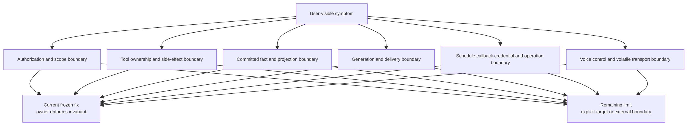
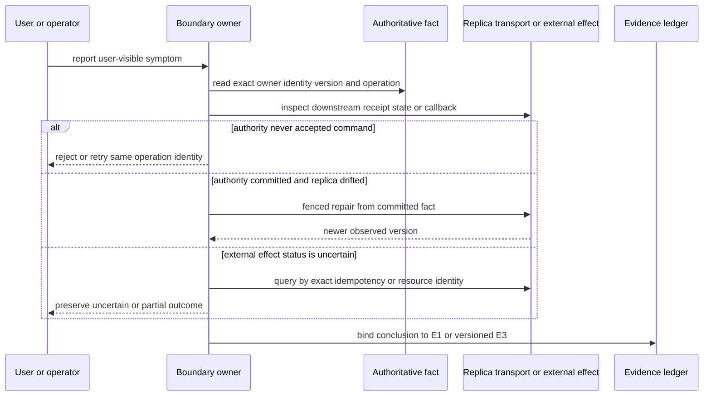

# 事故案例：症状相似时，先找到真正拥有事实的边界

> 版本与结论：本章为 `mixed`。它保留六类长期有效的事故教训，而不是复刻按周故障日志。每个案例都按“symptom → root boundary → fix → remaining limit”展开：fix 只有在冻结基线存在 E1 才写成 current；历史部署与生产 canary 只证明绑定版本。尤其 schedule 案例保留四类不同根因与四次互相不等价的生产证据，功能成功、credential 使用、cron 自动触发、双轨 audit 与 release provenance 从不互相代替。

## 设计抽象与事实源

- `src/Aevatar.Capabilities/AevatarScopeAccessGuard.cs:18-44`、`:57-75`、`:98-140`：scope claim 唯一性与 requested scope 严格相等的 current trust boundary。
- `src/platform/Aevatar.GAgentService.Application/Responses/ResponsesToolClassificationService.cs:56-170`、`src/platform/Aevatar.GAgentService.Application/Responses/LlmSessionRunObservationAccumulator.cs:18-52`：server-owned 与 client-forwarded tool 分类，以及只在 completion 暴露 forwarded calls 的 current ownership boundary。
- `src/platform/Aevatar.GAgentService.Core/Schedules/ScheduledDispatchGAgent.cs:50-72`、`:941-1008`、`:1877-1908`：重激活按已武装时刻恢复、manual/scheduled fire 分流与 overdue catch-up 的 current schedule owner。

这里按 scope、tool ownership、schedule 三个事故边界分组；第二项同时列出分类与 observation accumulator，因此共有四条路径。它们只属于事实源清单，不构成正文骨架。

## 先建立模型：事故发生在跨边界推断处



为什么不按“403”“没有回复”“没触发”分类？相同 HTTP 状态或用户表象可以来自完全不同的 owner。把症状直接绑定修复会产生跨层补丁：为合法 scope isolation 放宽授权、为 projection lag 重跑业务命令、为 delivery failure 重跑 LLM、为 callback cleanup failure 新建 schedule。正确顺序是先确认哪一层拥有事实，再确定哪种证据能证明它。

## 案例一：scope leakage 与合法隔离的可发现性

### Symptom

这组事故有两个相反表象。其一，scope 内调用者曾能从共享 workflow catalog 枚举其他 scope 的 definition/YAML/prompt；其二，同一 NyxID 用户用 CLI 看不到 Lark bot scope 内的 agent，并得到 `403 SCOPE_ACCESS_DENIED`。前者是真越权可见，后者是按设计隔离但缺少可发现性。

### Root boundary

共享 catalog 的根边界是 projection scope：若 scope-owned definition 进入 name-keyed global read model，不同 tenant 会互相覆盖并泄露内容。合法 403 的根边界则是 identity：token 中必须只有一个 canonical/workflow scope claim，且与 URL requested scope 精确相等；bot registration scope 与个人 subject-derived scope 本来就可能不同。

### Fix

冻结 `WorkflowCatalogCurrentStateProjector` 在 `state.ScopeId` 非空时直接跳过，只物化 global definition；scope-owned workflow 走 scope-filtered Studio member read model。`AevatarScopeAccessGuard` 对缺失、歧义和不匹配 claim fail closed。issue `#2913` 的 current landing 见 [06/03](../06/03-catalog-visibility-and-scope-authorization.md)。

### Remaining limit

合法隔离仍不够可解释：CLI/错误面没有稳定展示“当前 claimed scope 与目标 scope 的关系”，用户容易把边界当成资源丢失。退出方向是更好的 identity/profile 选择与诊断，不是放宽相等守卫。另一个边界是 registration 本身可见不等于其 scope 内 runtime 可见；两类资源不能由客户端合并成一套权限。

为什么由 projection 和 auth guard 各自修，而不是前端过滤？前端过滤无法阻止直接 API 调用；共享 read model 一旦写入私有 YAML，泄漏已经发生。数据范围必须在物化与查询授权两道服务端边界同时收窄。

## 案例二：tool ownership——选对工具后仍可能在错误一侧执行

### Symptom

当 Codex 等 agentic client 把 Aevatar 当 model 时，模型可能选择 Aevatar 自有 Ornn/skill tool。旧路径却把 raw tool-call delta 原样写进客户端 SSE；客户端没有这个 server tool，尝试本地执行后返回 `Tool not found`。相邻但不同的现象是模型直接选择 client shell：那是两层 agent prompt/toolset 的选择张力，不是同一泄漏 bug。

### Root boundary

“模型 emit 了 tool call”不是 ownership fact。Responses ingress 必须先把声明和发现结果分成 `forwarded`、`substituted`、`additive` 与 `owned`，持久化同一 plan，再决定由 server 执行还是交给 client。raw streaming delta 位于分类之前或分类之外，不能成为 client execution instruction。

### Fix

冻结 classifier 将 Aevatar-owned name 留在 server effective tool map，只有非 owned client declaration 进入 forwarded set；completion accumulator 清空 raw observed tool calls，只从 `LlmRunCompleted.ForwardedToolCalls` 构造客户端结果。current 边界见 [04/03](../04/03-tool-loop-catalog-and-presentation.md)。Workflow 侧 `#2451` 又把 tool result 中的 typed failure 映射为 step/run failure，防止“调用结束”伪装成成功，见 [03/03](../03/03-execution-kernel-and-outcomes.md)。

### Remaining limit

模型在 shell 与 Aevatar tool 之间的选择仍受外层 system prompt 影响，协议不能保证每次选中 server tool。审批恢复也仍按 tool name 从 actor-level manager 重找实例，没有把批准绑定到原 turn 的 exact catalog instance/digest；长等待跨越 source refresh 时，需重新 fence。并且副作用 tool 返回 error 不证明外部状态已回滚，必须用 provider 幂等键与查询对账。

为什么不简单隐藏所有 tool calls？client-owned shell/file tool 必须回到 client 执行；全隐藏会破坏 agentic client，全转发则泄漏 server credential/actor context。非对称 ownership plan 是必要信息，不是渲染偏好。

## 案例三：projection / index drift——成功事实与可查询副本分离

### Symptom

历史事故出现过三种表象：recent run 被 actor-id 式隐式排序挤出有界窗口；protobuf `map<>` 的任意 key 被 Elasticsearch 动态映射，超过 field limit 后所有 upsert 停止；错误 read-model document 的高版本又让权威 actor 的较低版本无法单调覆盖。业务 run 可以成功，而 Observatory/Studio 仍显示缺失、旧值或卡住。

### Root boundary

actor committed state 是事实，projection/read model 是可重建副本。查询端必须显式定义稳定 sort；mapping fingerprint/alias lifecycle 必须拥有 schema drift；write dispatcher 必须按 actor id、state version 与 event id 拒绝异源/倒退覆盖。运维直接改 actor 或让 query path 暗中 replay，都会把读侧提升为第二事实源。

### Fix

冻结 provider 对 alias/fingerprint mismatch fail closed，startup reconcile 才能 reindex 并原子切 alias；current store 用 version/result 区分 applied/stale/conflict。业务 map 采用不索引的 object shape，稳定字段数；catalog/current-state 的受控 repair 要求 exact identity/version fence，再由正式 projection 重建。当前合同见 [05/04](../05/04-readmodel-stores-versioning-and-rebuild.md) 与 [10/07](../10/07-observability-status-and-observatory.md)。

### Remaining limit

通用 DR rebuild 尚未存在：冻结基线只有少数 actor 的显式 current-state re-publication/repair，不是任意 read model 的 replay 服务。多 backing alias、incompatible mapping、partial reindex 仍 fail closed。生产 canary 前的 code-owned repair还缺更强的 signed inspection token / durable repair request provenance；这类缺口不能用“最终页面正常”掩盖。

为什么修副本而不重跑命令？重跑命令可能再次产生外部副作用，并改变 actor authority；显式 repair 只删除/重建受 fence 约束的副本，让原 committed fact重新物化。

## 案例四：delivery repair——生成完成不等于用户收到

### Symptom

Lark 事故曾表现为 workflow 成功却回到错误 bot 窗口、长回复只剩残片、callback scope 解析失败导致全程 401，或旧 registration 缺 workflow terminal delivery credential。它们都发生在“入站 → 生成 → 出站”链上，但 owner 分别可能在外部 relay routing、一次性 token TTL、scope resolution 或 registration credential lifecycle。

### Root boundary

`accepted`、generation committed、platform delivered 与 conversation finalized 是四个事实。一次性 `reply_token` 不能承诺覆盖无界生成时长；callback JWT、api-key mirror 与 owner binding 是有顺序的 scope resolution sources；registration repair 横跨 NyxID、Vault、route 与 actor，没有共同事务，必须由 committed phase 前滚。

### Fix

冻结实现已把 workflow notification 收敛为 channel-neutral intent/native adapter，Conversation 保存 user-visible delivery ledger；`#2862` 从 binding read model携带 canonical owner scope。旧 registration 的 repair 在原 registration 上依次提交 request、rotate、Vault prepare、route rebind 与 actor completion，失败后从 committed phase恢复，而不是删 bot 重建。current 链路见 [08/03](../08/03-lark-delivery-interaction-and-repair.md)。

### Remaining limit

错误 bot 窗口若由 NyxID relay选择目标，Aevatar 无权把外部平台事实改写成本地修复。token-expiry 型长回复仍与生成时长耦合；Lark CardKit state仍在 `AgentRunGAgent`，且两个 partial terminal 分支会误记 succeeded。workflow `notify accepted` 也没有 durable platform ACK 回写。repair只修既有 registration handle，不解决重复 provisioning 泄漏旧 key/route。

为什么使用 forward-only repair 而不是“回滚”外部资源？rotate 后旧 key可能已经不可用，Vault put与route rebind又不共享事务；声称原子回滚只会隐藏半完成状态。显式 phase、request id 与 typed failure让重试知道从哪里继续。

## 案例五：schedule credential / callback——“没触发”至少有四种死法

### Symptom

受保护事故输入记录四类不可合并的表象：

1. actor 在到点附近重激活，从 `now` 重算导致已到期的一拍被静默跳过；
2. Orleans membership 被部署覆盖为 per-pod `Localhost`，多个孤立 silo 共用 Garnet，reminder 投递冲突后大批 cron 冻结；
3. 历史 provision 同时写入两种 credential source，违反 exactly-one validation，create 在注册前失败；
4. one-shot callback 已发布 fired event，但收尾注销跨 `await` 丢 grain context，tick 被记为投递错误、物理 reminder 行未删并重放。

同一句“任务没有正常跑”分别指向 actor activation、部署 membership、application credential contract 与 Orleans grain execution context。第四类尤其不能压成“没触发”：业务事件已经触发，失败的是 teardown。

### Root boundary

`NextFireAt` 是已武装事实，activation 不能用当前时钟覆盖；reminder 的确定性身份依赖所有 pod 共享同一 membership/config；schedule state只允许一种与 owner contract 匹配的 credential locator；需要 grain context 的 reminder register/unregister必须由 grain本身持有，普通 singleton不能把隐式线程/调度器前置条件抽走。

### Fix

冻结 `ScheduledDispatchGAgent.OnActivateAsync` 对已存在 `NextFireAt` 按精确时刻 re-arm，过期且没有 terminal record 时 catch up；current credential surface把 one-call subject exchange与 Member Automation Agent Key分开，拒绝 legacy durable bearer；`RuntimeCallbackSchedulerGrain` 自己执行查询/注销并用 generation/slot epoch吸收 stale callback。当前设计见 [09/02](../09/02-scheduled-actor-callback-and-fire.md)、[09/03](../09/03-owner-authorization-and-agent-key.md) 与 [09/04](../09/04-vault-reference-and-revocation-compensation.md)。

配置 split-brain 不是代码修复：仓库默认配置只能说明期望，部署时仍需核对 effective Orleans/Garnet source。exactly-one 的历史 `RunCredentialKind` 止血也不是 current contract；不能把它写回新 API。

### Remaining limit：四次 canary 必须分别读

| 执行 | 绑定版本 | 实际证明 | 明确缺口 / 不可外推 |
|---|---|---|---|
| 首次 audited `run-now` | source `f1a18bac0c86df2dd5e1f1fd20bbe32e41c97330`；image `sha256:cffd1aef30b1dff7ede81ebd780dced55a7697928703d9199b11e7d909d6cc75` | exact grant → dedicated key；same-key `last_used_at` 变化；`6201` binding；`6202` NyxID/Vault `Completed/Completed`；cleanup | `run-now` 不证明 wall-clock cron；release provenance 使用一次性 exception |
| functional repeat | source `4e0def2c231b7074209b852b855954b3db7d3e71`；image `sha256:dbaccff2cac9184fb65f8e71f7e6b22b86d7c09397e4c890a2f59143e7ebf796` | operator 观察 run/marker 与 same-key transition；删除后 404/key absent/list 0/0 | 缺 `6201/6202`，不能称 audited canary |
| wall-clock cron | source `c70f284908fd352cd64719349abae128ee8da0b2`；tag `c70f2849`；image `sha256:22ee592d65a2974f73c2fb313f87dcc9f2321a6de574ee341a2986de1650836f` | 预先不调用 `run-now`；唯一 fire `manual=false`；`0/0/[] → 1/0/1`；same-key `last_used_at` 变化；`6201` | 缺 `6202`；terminal state可由 owner view/key absence三角验证，但 operational audit不完整 |
| reminder fix 后第四次 | source `198fe84ec44e997ac3b4c45bff597cc5a5f6bcc5`；tag `198fe84e`；image `sha256:f3c0fea51e2330bf32480b112f08777753e3e72d062aacbb1880eb22761dcec0` | mutation 前可信时钟探针返回 `401 UNAUTHENTICATED`，owner readback确认零新增资源 | 只能是 `FAIL / featureConclusion=not_evaluated`；没有 reminder/cron功能证据，也不是 cleanup failure |

第三次 canary 前还发生了 read-model version regression；修复通过 code-owned、带 identity/version fence 的 store操作删除错误 Elasticsearch document，再由正式 projection/refresh重建，没有回写 actor authority。这个事实属于 projection repair 案例，不应被归因成 Garnet故障。

为什么第四次不能绕过可信时钟探针？要证明“在 previewed UTC minute 自动触发”，目标时间必须来自受控可核验时钟；让模型自述时间会把结论降成自证。fail closed并在 mutation 前停止，比制造一份看似绿色但不可复核的 canary更诚实。完整版本化证据见 [09/05](../09/05-production-canary-and-recovery.md)。

## 案例六：voice cancel / reconnect——幂等竞态不是致命错误，restart 也不是 resume

### Symptom

用户 barge-in 时，provider自动取消当前 response，Aevatar又显式发 `response.cancel`；后者晚到会收到 `response_cancel_not_active`。旧路径把这个满足后置条件的竞态映射成用户可见致命错误。另一类表象是网络抖动或 pod restart 后 voice socket结束，客户端必须手工重开，无法从旧媒体 offset继续。

### Root boundary

cancel的业务后置条件是“旧 response不再 active”，不要求每个竞争 cancel都返回成功。provider adapter拥有错误码到 domain signal的映射，应吸收精确 benign race。WebSocket/PCM则是 volatile transport，actor只拥有 session/lease/response/drain/tool control facts；没有 resume token、replay cursor与provider buffer证明时，新 attach不能冒充断点续传。

### Fix

冻结 OpenAI adapter在 `IsBenignRealtimeRaceError` 精确匹配 `response_cancel_not_active` 与 `conversation_already_has_active_response` 并返回 no event，其余 auth/rate-limit错误继续上抛。Voice actor用 response id、session/owner/transport lease与 epoch fence cancel、drain ACK、timeout和迟到 signal；新连接可得到 `Restarted` 并接管新 lease。current 边界见 [08/05](../08/05-voice-control-and-media-planes.md)。

### Remaining limit

`WebSocketVoiceTransport` 在 exception/close时直接结束 receive loop，没有 server reconnect循环；`Restarted` 只表示新 session/epoch 接管，不恢复未播 PCM、provider buffer、transcript、pending client tool或旧 socket offset。客户端对任意 error帧仍较脆弱，完整首次连接也依赖既有 chat route。真正 reconnect/current-state contract仍是 target。

为什么不持久化 PCM来实现 resume？音频高频且只对实时播放有意义，写入 EventStore会放大容量和重放成本，也不能还原客户端已经播放到哪里。正确恢复需要显式 cursor/ack/provider能力，而不是把 volatile bytes误当业务事实。

## 沿一条恢复链路走读



这条恢复链刻意不包含“换一个 ID 再试”。如果第一次命令可能已产生副作用，新 identity会隐藏原操作并制造重复资源。schedule delete/retry、Channel repair、tool side effect和projection repair都需要沿原 identity或受控 fence继续。

## 最小 demo：受保护输入哈希与 current owner 静态核验

```bash
AEVATAR_FROZEN=$(bash scripts/materialize-frozen-upstream.sh \
  --repo /Users/eanzhao/Code/aevatar \
  --sha f02aa690bbebb9cabeac30a553d737486b0eb661)

ledger=docs/migration/2026-07-25-protected-worktree.md
for hash in \
  1eb1dc5c6b559347b881117a8136c47770e9de6d001ca3dd560d7dc3a09673a1 \
  c9cf3458f5b8d8c0b9c9f8b1f6a7c758470e7fcb09ddb1839780cdaba23e7192 \
  cb2ae417ad2d3bf7796b91a7a5f6a3620bb6623dc574312f58efb02d6dbb5d8e \
  c2551412e7ac21fb639751d3a57af9a776e080cf2a30ddb50dfb1e278d67c9e0; do
  rg -q "$hash" "$ledger"
done
test "$(rg -c '\| `migrated-reviewed` \|' "$ledger")" -ge 4

test -f "$AEVATAR_FROZEN/src/Aevatar.Capabilities/AevatarScopeAccessGuard.cs"
test -f "$AEVATAR_FROZEN/src/platform/Aevatar.GAgentService.Core/Schedules/ScheduledDispatchGAgent.cs"
test -f "$AEVATAR_FROZEN/src/Aevatar.Foundation.VoicePresence.OpenAI/OpenAIRealtimeProvider.cs"
printf '%s\n' 'incident-evidence: protected hashes and frozen owners verified'
```

> Demo status：`verified-static`。本轮实际运行哈希与冻结路径检查；没有连接生产、重放任何 mutation、读取 owner-only evidence artifact，也没有把历史 canary外推到 `f02aa690`。

## 设计正当性、边界与演进

- 为什么只保留六类：它们揭示稳定 owner/trust/recovery边界；纯时间性 UI噪声与一次性环境细节留在 Git历史。
- 为什么保留矛盾：功能完成、read model可见、外部 delivered、audit collected和provenance attested是不同证明对象。
- 为什么不写“已彻底修复”：每个 current fix后仍列 frozen limitation或外部边界；真正开放项统一进入 [12/05](05-open-gaps-and-canon-drift.md)。
- 历史 commit只解释当时 fix；本章的 current句子另有冻结 E1。生产 E3只绑定source/image/date/environment。
- 受保护输入已由 Task 19 协调账本记录为 `migrated-reviewed` 后删除；源内容由 Git 历史归档，本章与账本共同保留新落点、哈希和证据强度。

## 读完应能回答

1. 同样是“看不到资源”，如何区分合法 scope isolation与 catalog leakage？
2. 为什么 raw tool-call delta不能直接成为 client execution instruction？
3. 业务 run成功而页面缺失时，为什么不能通过重跑命令修 projection？
4. 四类“定时任务不触发”分别属于哪四个 owner边界？
5. 四次 schedule canary各自证明什么，为什么第四次只能是 `not_evaluated`？

<details>
<summary>论断—证据映射</summary>

| 案例 | Current E1 / versioned evidence |
|---|---|
| scope leakage / isolation | `src/Aevatar.Capabilities/AevatarScopeAccessGuard.cs:18-44`、`:98-140`；`src/workflow/Aevatar.Workflow.Projection/Projectors/WorkflowCatalogCurrentStateProjector.cs:37-84`；`#2913` |
| tool ownership | `src/platform/Aevatar.GAgentService.Application/Responses/ResponsesToolClassificationService.cs:56-170`；`src/platform/Aevatar.GAgentService.Application/Responses/LlmSessionRunObservationAccumulator.cs:18-52`；`#2451` |
| projection/index drift | `src/Aevatar.CQRS.Projection.Providers.Elasticsearch/Stores/ElasticsearchIndexLifecycleManager.cs:87-263`；`docs/adr/0040-current-state-readmodel-dr-rebuild.md:9-56`；protected canary §5.4/§6 |
| delivery repair | `agents/channels/Aevatar.GAgents.Channel.NyxIdRelay/ChannelWorkflowResultDeliveryRepairService.cs:71-382`；`docs/canon/lark-reply-completion-semantics.md:25-155`；`#2355`、`#2862` |
| schedule callback / credential | `src/platform/Aevatar.GAgentService.Core/Schedules/ScheduledDispatchGAgent.cs:50-72`、`:941-1008`、`:1877-1908`；`src/Aevatar.Foundation.Runtime.Implementations.Orleans/Grains/Callbacks/RuntimeCallbackSchedulerGrain.cs:30-145`；四次 E3 见 [09/05](../09/05-production-canary-and-recovery.md) |
| voice cancel / reconnect | `src/Aevatar.Foundation.VoicePresence.OpenAI/OpenAIRealtimeProvider.cs:135-162`；`src/Aevatar.Foundation.VoicePresence/Transport/WebSocketVoiceTransport.cs:84-140`；[08/05](../08/05-voice-control-and-media-planes.md) |
| 受保护输入完整性 | [受保护工作区账本 §7](../migration/2026-07-25-protected-worktree.md) 与本章 demo中的四个 SHA-256 |

</details>
