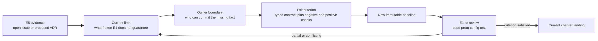
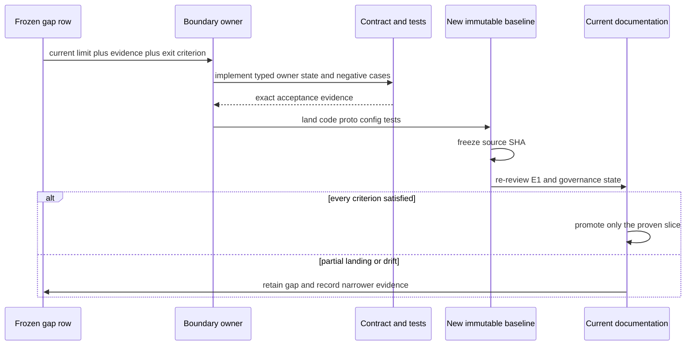

# 开放缺口与 Canon Drift：只登记当前限制，不预支未来能力

> 版本与结论：本章是 `target` 登记表，不是路线承诺。canonical cutoff 时的 126 个 open issue 全部保留：22 个 `confirmed-bug`、8 个 `security-debt`、44 个 `missing-contract`、16 个 `proposal/dispute`、21 个 `ops-ux-test`、15 个 `blocked/duplicate/tracking`。每行只陈述 owner、current limit、evidence 与可检验的 exit criterion；后续 live 状态不倒改本轮成员。

## 设计抽象与事实源

- 本仓库 [Issue 演进账本](../migration/2026-07-25-issue-evidence-ledger.md) §3.2、§5：126 个 frozen-open 成员、分类、current-limit evidence 与落点。
- `docs/adr/0034-workflow-saga-compensation-protocol.md:1-20`：`proposed` 治理状态与已经落地的 saga E1 发生叙述漂移的代表实例。
- `docs/canon/lark-reply-completion-semantics.md:25-155`：delivery terminal 语义；冻结代码仍有 partial terminal 被记为 succeeded 的冲突实例。

## 先建立模型：gap 只能单向晋级



为什么不能在 issue 关闭时直接把 gap 改成 current？关闭可能代表重复、放弃、设计交付或运维动作；即使代码片段存在，也可能只闭合了大 issue 的一部分。晋级需要新的 immutable baseline、完整 E1 与 exit criterion 对照，不允许用 live label、PR title 或单个 DTO 字段跳级。

## 冻结 open 队列覆盖

| 分类 | 数量 | 本章用途 |
|---|---:|---|
| `confirmed-bug` | 22 | 记录与现有合同冲突、可复现或已有强现场信号的行为 |
| `security-debt` | 8 | 记录明确承认的临时信任妥协 |
| `missing-contract` | 44 | 记录当前模型没有表达的 owner、状态、API、read model 或恢复协议 |
| `proposal/dispute` | 16 | 记录候选方向，不选择方案 |
| `ops-ux-test` | 21 | 记录运维证明、测试与可达性，不冒充架构合同 |
| `blocked/duplicate/tracking` | 15 | 只保留覆盖与权威替代关系 |
| **合计** | **126** | **每个 frozen-open issue 至少在下表出现一次** |

## Confirmed bugs（22）

| Owner | Current limit | Evidence | Exit criterion |
|---|---|---|---|
| Studio application / Console | scripts read、provider draft、binding readiness、member draft link 与 YAML apply 状态仍有可见错误，不能把页面 `accepted` 当生命周期闭合 | `#220`、`#222`、`#2080`、`#2386`、`#2853`；[06/02](../06/02-draft-revision-binding-and-published-service.md)、[06/04](../06/04-studio-commands-acks-and-readmodels.md) | 每个入口有服务端 typed error/terminal observation 与浏览器回归；timeout、刷新、重复提交不产生假成功或丢失 draft identity |
| Conversation / Workflow execution | silent chat、foreach aggregate不可消费、tool step error 后成功终态仍被报告 | `#481`、`#2699`、`#2936`；[03/03](../03/03-execution-kernel-and-outcomes.md)、[07/01](../07/01-conversation-turn-and-chat-history.md) | committed timeline对每个已调度 step给出成功/失败/取消之一；silent path产生 typed terminal/error；aggregate shape与大小/并发约束有 parser和执行回归 |
| Production composition / authentication | `Localhost` Orleans + shared Garnet不安全组合缺 fail-fast；service identity claims 缺失仍返回 403 | `#2224`、`#2389`；[10/01](../10/01-production-topology-and-configuration.md)、[10/05](../10/05-authentication-scope-and-admin-authorization.md) | production profile启动期拒绝 split-brain组合；issuer与service API共享可测试的 claim contract，缺失/歧义/错租户均 fail closed |
| Channel / relay | skill续轮、多行 slash、长回复、sender credential与重复 provisioning仍不闭合 | `#2357`、`#2358`、`#2359`、`#2461`、`#2812`；[08/01](../08/01-ingress-normalization-and-routing.md)、[08/03](../08/03-lark-delivery-interaction-and-repair.md) | adapter→runner→workflow保留完整多行/附件；sender binding选择与撤销有E2E；同 owner/app/idempotency重试复用 operation，旧 key/Vault/route/bot/mirror有可查询退役状态 |
| Automation / scheduling | grant、长运行 token、漏拍、provision假成功、catalog snapshot与旧 actor stall仍有已报告失败 | `#2369`、`#2450`、`#2578`、`#2679`、`#2854`、`#2958`；[09/02](../09/02-scheduled-actor-callback-and-fire.md)、[09/03](../09/03-owner-authorization-and-agent-key.md) | 同一 operation下preflight→create→fire→terminal可关联；长运行按外呼解析有效credential；重激活/旧actor/duplicate occurrence有真 reminder负向对照与可查询告警 |
| Workflow observation | Mission Wall graph仍有消失现场，不能从 current projector存在推断所有图状态收敛 | `#2639`；[05/05](../05/05-workflow-agui-and-live-observation.md) | committed timeline与graph materializer E2E覆盖刷新、重连、终态和缺事件；UI不从临时本地状态制造权威节点 |

## Security debt（8）

| Owner | Current limit | Evidence | Exit criterion |
|---|---|---|---|
| Security architecture / credential owners | secret store兼容面、relay committed payload中的runtime credential、artifact/readmodel tool对象级授权仍有结构性债务 | `#375`、`#2580`、`#2591`；[10/08](../10/08-architecture-and-security-guards.md) | durable proto/event全量 secret scan与负向guard通过；所有read tool在SQL/query port按caller scope授权；production不再静默回退plaintext/local file secret |
| Automation authorization | 多种历史credential source与generic/team surface仍需完整单一权威证明 | `#2404`；ADR-0037；[09/03](../09/03-owner-authorization-and-agent-key.md) | 每个schedule kind只接受一个typed source，legacy raw写入被guard拒绝，fire与cleanup按同一owner/generation测试矩阵闭合 |
| Managed Codex admission / delegation | static allowlist、进程内容量事实、persistent key或宽 `proxy:*` delegation只适合受控canary | `#2786`、`#2881`、`#2898`、`#2899`；[10/06](../10/06-managed-codex-sandbox-and-delegation.md) | typed eligibility与distributed capacity owner替代allowlist/semaphore；每次执行使用短期least-privilege token，跨service调用负向测试被拒，revocation与tenant proof可审计 |

## Missing contracts（44）

| Owner | Current limit | Evidence | Exit criterion |
|---|---|---|---|
| Foundation protocol compatibility | legacy TypeUrl alias没有启动期descriptor/wire guard与反向冲突索引 | `#285`、`#286`；[02/02](../02/02-envelope-command-event-query.md) | 启动期枚举所有alias并按full name/field number/wire type验证；重复alias和不兼容变更用fixture fail-fast |
| Workflow authoring / debug / connector / artifact | typed connector operation、Step IO、debug-from-run、pinned artifact、multipart、durable approval、publish→resolve等合同缺失或只有局部切片 | `#2104`、`#2105`、`#2106`、`#2107`、`#2108`、`#2182`、`#2266`、`#2333`、`#2654`、`#2656`、`#2658`、`#2788`、`#2838`、`#2944`、`#2949` | schema、credential ref、artifact provenance、draft-only隔离、approval digest/idempotency与runtime resolver形成一条typed E2E；production invoke明确忽略debug pin；未发布operation fail closed |
| Studio resource / identity / version | binding DTO、member-first cleanup、Team collaboration、NyxID registration、headless owner binding、version provenance与service access review没有统一闭环 | `#244`、`#435`、`#1016`、`#2299`、`#2491`、`#2621`、`#2800` | stable member/revision/service身份、expectedVersion、headless proof与access-review receipt进入actor/read model；旧serviceId入口和悬空exposure由guard/迁移测试消除 |
| Audit / observation stream | 平台级security operation capture与run event reconnect cursor没有完整公开合同 | `#2592`、`#2661`；[05/06](../05/06-audit-trail-lifecycle-and-export.md)、[01/04](../01/04-request-streaming-lifecycle.md) | append-only audit覆盖三类捕获面；run stream定义event id/cursor/retention/gap response，断线与过期cursor有E2E |
| Channel files / grants / content / Voice | zero-config voice、跨消息附件、upload/preview、grant review与revisioned content artifact均不能由现有ref或wire shape冒充 | `#2319`、`#2447`、`#2659`、`#2754`、`#2790` | 首次voice连接有幂等route owner与补偿；pending attachment或file-ref可跨消息消费；content revision不可变且有provenance/citation/current-pointer并发测试；grant review/revoke可审计 |
| Automation API / read side / authorization | fire history、prompt summary、member/schedule过滤历史、typed auth plan与single owner-aware API不完整 | `#2167`、`#2418`、`#2655`、`#2717`、`#2718`、`#2737`、`#2953` | owner-aware route与DTO共享schedule identity；detail/fire/run/prompt字段可按scope SQL/query过滤；authorization plan digest、exact service/node grants与write-time revalidation全链测试闭合 |
| Managed Codex authority | user-scoped eligibility与credential broker合同仍不能由现有allowlist替代 | `#2782`；[10/06](../10/06-managed-codex-sandbox-and-delegation.md) | caller authority、broker capability、sandbox tenant与short-token audience形成typed admission，非eligible用户/跨tenant/过期token负向测试通过 |
| NyxIdChat control plane | actor-owned stop、durable reconnect state、typed steering、task plan与browser-action handoff均没有冻结E1 | `#2954`、`#2955`、`#2956`、`#2957`、`#2961` | stop有fence与side-effect uncertainty；reconnect有stateVersion/cursor；steering绑定turn/checkpoint；plan step终态闭合；handoff有typed request/continue与幂等/replay保护 |

`#2954–#2957` 只属于本 target 章。现有 SSE disconnect、committed progress、普通消息或 UI plan 都不能分别冒充 stop、reconnect current-state、mid-run steering 与 actor-owned task lifecycle。

## Proposal / dispute（16）

| Owner | Current limit | Evidence | Exit criterion |
|---|---|---|---|
| Workflow / AI design | primitives north star、tool schema迁移、draft/member invoke边界、tool-round fallback、external router与layered prompt仍是候选方向 | `#114`、`#192`、`#1899`、`#2210`、`#2424`、`#2462` | 每个决策先给当前问题与非目标，再有accepted ADR或明确拒绝记录；选择后以最小E1和兼容/负向测试验证，不以调研文本晋级 |
| Architecture governance | Studio reverse references、AGUI composition edge、Brooks hygiene与MassTransit residue没有统一清理决定 | `#2112`、`#2113`、`#2114`、`#2209` | dependency graph/guard与实际consumer inventory一致；删除或保留均有ADR/guard更新，零consumer residue不再同时声称受支持 |
| Managed Codex design choice | gVisor + direct token方案与runner contract在snapshot时仍是条件性选择 | `#2921`、`#2922` | accepted decision明确threat model、token audience、filesystem/network boundary与fallback；runner image和tenant proof只验证选定合同 |
| Channel / history generalization | Lark ports、metadata、card operation与API/channel history owner统一仍未定 | `#2932`、`#2933`、`#2934`、`#2952` | provider-neutral typed contract保留wire migration与platform identity；Conversation owner选择有replay/migration/authorization tests，旧双历史不再同时写事实 |

## Ops / UX / test（21）

| Owner | Current limit | Evidence | Exit criterion |
|---|---|---|---|
| Release QA / test maintainers | 两套QA清单、API integration plan与test-suite quality属于验证覆盖，不定义runtime语义 | `#198`、`#199`、`#250`、`#2058` | 清单绑定immutable build与结果；integration tests覆盖auth/scope/negative paths；测试命名和setup不再用coverage占位或sync-over-async |
| Console / product UX | Studio滚动、draft/provider/nav/button/lifecycle/governance/deployment/false affordance/debug/status/history/Markdown table仍有可达性与诚实文案问题 | `#212`、`#219`、`#221`、`#225`、`#227`、`#1665`、`#1667`、`#1676`、`#1696`、`#2657`、`#2700`、`#2719`、`#2883` | 可访问性与状态文案E2E覆盖窄屏/失败/刷新；UI只派生后端事实，不把disabled、本地选择或submitted伪装成持久/serving |
| Operations / canary owners | login错误、managed Codex E2E/tenant proof与NyxID proxy稳定性仍需绑定环境证明 | `#2765`、`#2784`、`#2785`、`#2935` | evidence绑定source/image/date/environment/tenant；失败指纹可追到typed error；成功不从单账号外推全体，cleanup与secret redaction通过 |

## Blocked / duplicate / tracking（15）

| Owner | Current limit | Evidence | Exit criterion |
|---|---|---|---|
| Issue governance / dependency owner | 这些行是question、board、umbrella、blocked fork或output-obligation，不提供current或target contract | `#251`、`#2178`、`#2425`、`#2459`、`#2584`、`#2660`、`#2775`、`#2779`、`#2803`、`#2808`、`#2877`、`#2946`、`#2947`、`#2951`、`#2959` | 每行指向一个权威功能issue/decision/evidence artifact或明确关闭原因；在此之前只进入13/04无损索引，不进入架构叙事 |

## Drift candidates：有局部 E1，仍不从 open 队列移除

| Owner | Current limit | Evidence | Exit criterion |
|---|---|---|---|
| Studio member API（`#435`） | 冻结树已有member list/detail等路由，但issue覆盖的最终de-serviceId、roster与revision lifecycle更大 | [06/04 §边界](../06/04-studio-commands-acks-and-readmodels.md)；frozen-open row `#435` | 按issue acceptance逐项列E1，旧serviceId调用面归零或有明确兼容期限，并由member-first API/Console E2E证明 |
| Automation read model（`#2418`） | `Prompt` 已存在于model/query mapping，不证明全部summary/detail/client round-trip与兼容迁移闭合 | [09/01](../09/01-automation-resource-api-and-readmodels.md)；frozen-open row `#2418` | create/update/read/list/edit round-trip保留prompt，旧document缺字段兼容测试通过，issue验收项逐条有E1 |
| Scheduled authorization plan（`#2737`） | plan abstraction与部分exact grant字段已存在，preflight/digest/issuer/fire revalidation完整链仍需逐项证明 | [09/03](../09/03-owner-authorization-and-agent-key.md)；frozen-open row `#2737` | 同一typed plan贯穿preflight、confirm、create/reauthorize与fire；plan drift、wildcard、错service/node负向测试通过 |

这些是 drift candidate，不是“issue 应当关闭”的判决。本轮成员与分类固定；下一轮只能以新的 dated ledger记录状态与证据变化。

## 章节发现但未由单一 open issue完整拥有的缺口

| Owner | Current limit | Evidence | Exit criterion |
|---|---|---|---|
| Tool approval owner | 批准恢复按tool name重找actor-level instance，未绑定原turn exact catalog/digest，也未重放完整credential fence | [04/04 §边界](../04/04-tool-approval-and-authorization.md) | pending state持可恢复source identity/schema hash/authority version；批准前重物化并比对，替换/撤销/过期均拒绝 |
| Prompt / Conversation owner | typed conversation slot未接production seam，历史compressor summary也缺provenance/untrusted wrapper | [04/05 §边界](../04/05-prompt-overlays-and-agent-context.md) | Conversation actor产出有界typed summary与provenance，只有一条summary路径，恶意历史文本不能提升为system authority |
| CQRS artifact owner | 一个actor-local `StateVersion/LastEventId` 不能表达多origin聚合水位 | [05/01 warning](../05/01-command-event-projection-readmodel.md) | per-origin watermark或可重放序列显式建模；乱序、重复、缺口与child relay测试证明不误报全局完整 |
| Committed-state publication | batch中每个event marker可能配同一个final root，不提供逐event中间snapshot | [05/02 warning](../05/02-committed-state-and-observation.md) | 需要中间root的consumer改读reducer/event history，或协议明确提供原子snapshot并有two-event batch regression |
| Projection lifecycle owner | release缺ref-count、attach-existing只查actor存在、failure replay会生成新failure记录 | [05/03 warnings](../05/03-projection-lifecycle-and-leases.md) | actor-ownedlease/ref-count与active handshake；replay按source identity合并attempt且retention不吞原始failure |
| Team authority | member assignment不完整校验目标Team lifecycle与双侧收敛 | [06/01 warning](../06/01-scope-team-member-resource-model.md) | Team authority提供typed admission/coordination；不存在、archived、并发move与replay有terminal observation |
| Workflow scope admission | 底层compatibility helper在scope-owned definition + empty run scope时仍放行 | [06/03 warning](../06/03-catalog-visibility-and-scope-authorization.md) | 所有非Host caller也必须提供matching scope或typed authorization proof；空scope负向测试拒绝私有definition |
| Conversation state transitions | delivery/abandon/append缺publisher proof、严格predecessor与统一conversation watermark | [07/01 §边界](../07/01-conversation-turn-and-chat-history.md) | typed publisher/actor identity + transition table拒绝forged/misrouted/late event；recovery返回conversation projection version |
| Channel tool-first runtime | route policy携带tool set/choice/prefill，但generation路径只消费model name | [08/01 warning](../08/01-ingress-normalization-and-routing.md) | relay route→actual LLM request regression证明tool set解析、choice pin与trusted prefill conflict fail closed；或canon删除该承诺 |
| Lark delivery owner | CardKit仍在generic run actor，两个partial terminal分支误记succeeded | [08/03 warnings](../08/03-lark-delivery-interaction-and-repair.md) | provider-neutral reply operation由adapter实现；partial/pre/post-send typed outcome进入delivery ledger且不误报成功 |
| Voice session owner | `Restarted`不是resume；transcript wire case没有producer/durable owner | [08/05 warnings](../08/05-voice-control-and-media-planes.md) | resume token/cursor/epoch规则和network/pod/concurrent client E2E；transcript先确定volatile或Conversation owner，再接provider producer |
| Workflow Host composition | README把standalone `/api/chat` 当入口，但Host没有authentication scheme，关闭auth又被trusted-scope admission拒绝 | [11/01 warning](../11/01-run-a-simple-workflow.md) | Host明确组合认证，或提供可测试的development identity injection；README命令在clean环境得到预期SSE而非403/handler缺失 |

## Canon / ADR drift 与 Proposed 边界

| Owner | Current limit | Evidence | Exit criterion |
|---|---|---|---|
| ADR-0034 / Workflow | ADR仍为 `proposed`且保留forward-only历史叙述，冻结代码已有saga ledger、compensation、dead letter与retry | `docs/adr/0034-workflow-saga-compensation-protocol.md:1-20`；[03/06](../03/06-saga-compensation-and-recovery.md) | ADR状态与正文按冻结实现重核，历史段明确标记；accepted/rejected决定、proto/actor/tests与交叉ADR一致 |
| ADR-0033 / Voice security | ephemeral broker ADR仍 `proposed`，代码有resolver，但static provider key fallback与provider差异仍在 | `docs/adr/0033-voice-provider-nyxid-ephemeral-broker.md:1-20`；[08/05](../08/05-voice-control-and-media-planes.md) | 决定broker适用provider与fallback policy；状态、code guard、negative credential tests与production evidence一致 |
| ADR-0041 / Automation | Agent Key credential reference ADR仍 `proposed`，Team Automation已有大量E1；generic/legacy边界与完整治理状态仍未统一 | `docs/adr/0041-scheduled-invocation-agent-key-credential-reference.md:1-37`；[09/03](../09/03-owner-authorization-and-agent-key.md) | ADR逐条对照current proto/state/issuer/Vault/readmodel，明确accepted/superseded范围并清理相反叙述 |
| ADR-0036 / Workflow identity | authoritative runnable model ADR仍 `proposed`，部分actor/catalog/bind语义已落地但不能整体晋级 | `docs/adr/0036-scope-workflow-authoritative-runnable-model.md:1-20`；[03/01](../03/01-workflow-model-and-identities.md) | acceptance矩阵逐项绑定E1；未落地registration/migration保留target，避免一个ADR状态覆盖不同成熟度切片 |
| ADR-0021 + Lark completion canon | canon要求failed-post-send诚实终态，冻结CardKit两个partial terminal仍提交success | `docs/canon/lark-reply-completion-semantics.md:25-155`；[08/03 warning](../08/03-lark-delivery-interaction-and-repair.md) | 两条分支产生typed partial/failure，delivery read model回归不再记succeeded；ADR/canon状态反映实际完成度 |
| ADR-0026 / tool-first ingress | route contract承诺tool set/choice/prefill，generation executor未找到对应消费链 | [08/01 warning](../08/01-ingress-normalization-and-routing.md) | 实现并测试route→catalog→LLM request，或收缩ADR/canon承诺；两边不能继续各说一套 |
| Agent Profile canon | canon描述SHADOW固定recovery prompt/authority，冻结测试要求SHADOW不改变legacy execution | `docs/canon/nyxid-chat-agent-profile-binding.md:9-70`；[07/03 warning](../07/03-agent-profile-and-immutable-binding.md) | 选择并写明SHADOW语义；codec/materializer/execution tests与canon一致，旧snapshot兼容有fixture |
| Foundation canon | canon与Foundation README把`IRunManager`、`RunManager`、`RunContextScope`列为current latest-wins机制，冻结代码却没有这些类型，实际上下文传播只找到`IAgentContextAccessor`与`AsyncLocalAgentContext` | `docs/canon/architecture.md:39`、`:82`；`src/Aevatar.Foundation.Core/README.md:19` | owner选择并落地一种事实：实现有测试的stable run manager contract，或从canon/README删除现役声明并明确替代边界；全树类型清单与文档一致 |
| MassTransit governance | runtime零consumer，但central package、v9 guard与historical ADR/guard语义仍残留 | open `#2209`；[12/03](03-retired-and-superseded-components.md) | 明确删除或保留用途；package/guard/ADR与csproj consumer inventory一致，不再把残留误读为current transport |
| Foundation runtime dedup | 冻结基线与同步目标 `d9db826eb` 的 turn 入口有 `IEventDeduplicator` / `MemoryCacheDeduplicator` 进程内去重，HEAD（`origin/feature/integrate`）已整体移除（以 feature/integrate checkout 核验为准） | `1215ca6b95`（Remove process-local envelope duplicate filtering）；[02/03 warning](../02/03-gagent-event-pipeline.md)、[02/06 warning](../02/06-local-runtime-and-lifecycle.md)、[10/02 warning](../10/02-orleans-runtime.md) | re-baseline 时删除正文中的入口去重节点，明确重复投递防护回归 handler 幂等与 committed state；guard/README 与 HEAD 类型清单一致 |
| AI tool execution | 冻结基线与同步目标 `d9db826eb` 用 middleware 固定链（credential/approval/audit）收敛工具执行，HEAD（`origin/feature/integrate`）重构为 admission ledger + `AdmittedAgentToolExecutor`（ADR-0046，以 feature/integrate checkout 核验为准） | `1eb93b0ab2`（Implement issue #3038）；[04/04 warning](../04/04-tool-approval-and-authorization.md) | re-baseline 时按 ADR-0046 重写 04/04：credential 政策与 approval 决定收敛到 admission ledger，删除已移除 middleware 描述；负向测试与 guard 同步 |

为什么把“Proposed 但代码已部分存在”和“Canon 承诺大于代码”都放在这里？前者缺治理接受，后者缺实现事实；两者都不能让读者只看一侧得到错误 current 结论。退出不是机械改status，而是完成双向对账。

## 沿一次缺口晋级走读



## 最小 demo：证明 126 个 frozen-open 成员没有丢失

```bash
python3 - <<'PY'
from collections import Counter
from pathlib import Path
import re

ledger = Path("docs/migration/2026-07-25-issue-evidence-ledger.md").read_text()
chapter = Path("12/05-open-gaps-and-canon-drift.md").read_text()
rows = []
for line in ledger.splitlines():
    if not line.startswith("| open | #"):
        continue
    escaped = line.strip().strip("|").replace(r"\|", "\0")
    cells = [cell.replace("\0", "|").strip() for cell in escaped.split("|")]
    rows.append(cells)

open_ids = {int(row[1].removeprefix("#")) for row in rows}
mentioned_ids = {int(value) for value in re.findall(r"#(\d+)", chapter)}
assert len(rows) == 126
assert len(open_ids) == 126
assert open_ids <= mentioned_ids
assert Counter(row[7] for row in rows) == {
    "missing-contract": 44, "confirmed-bug": 22, "ops-ux-test": 21,
    "proposal/dispute": 16, "blocked/duplicate/tracking": 15, "security-debt": 8,
}
assert {2954, 2955, 2956, 2957} <= open_ids
print("open-gap-registry: 126/126 frozen-open issues referenced across 6 classes")
PY
```

> Demo status：`verified-static`。本轮实际运行成员覆盖与分类守恒检查；没有访问live GitHub，也没有因为局部E1而移除 `#435`、`#2418` 或 `#2737`。

## 设计正当性、边界与演进

- 为什么用 exit criterion 而不是日期：日期不证明合同、测试或部署；可执行验收才能限制“差不多完成”。
- 为什么 blocked/tracking 也保留：删除噪声会破坏126行覆盖，且可能隐藏权威替代关系；它们只进入索引，不主导设计。
- 为什么不为每个gap新建current章节：没有E1的主题进入主线会让target伪装成产品能力。
- 为什么不改上游ADR/canon：本仓库只读；本章暴露冲突并给出退出条件，不替上游做治理决定。
- 本章冻结于canonical cutoff与`f02aa690`；更新应新增dated delta，而非覆写本轮历史。

## 读完应能回答

1. 一个open issue满足哪些条件后，某个切片才可以进入current章节？
2. `#435`、`#2418`、`#2737` 为什么有局部E1仍留在open队列？
3. `#2954–#2957` 各缺哪个actor-owned contract，为什么不能从现有SSE/progress推断？
4. Canon承诺大于代码与Proposed ADR落后于代码，分别如何收敛？
5. 126个open成员如何在不让administrative/blocked噪声主导叙事的前提下无损覆盖？

<details>
<summary>论断—证据映射</summary>

| 论断 | 证据 |
|---|---|
| frozen-open 126行、六类计数、逐行current-limit evidence | [Issue演进账本 §3.2、§5](../migration/2026-07-25-issue-evidence-ledger.md) |
| `#2954–#2957`只属于target | 账本对应四行；[07/02 §边界](../07/02-nyxid-chat-actor-model-and-progress.md) |
| `#435/#2418/#2737`是局部E1 drift candidate，不改snapshot成员 | 账本对应三行；[06/04](../06/04-studio-commands-acks-and-readmodels.md)、[09/01](../09/01-automation-resource-api-and-readmodels.md)、[09/03](../09/03-owner-authorization-and-agent-key.md) |
| current章节warning的owner/limit/exit criterion | 本章“章节发现”表所链接的各章warning |
| Proposed ADR与code/canon冲突 | 本章“Canon / ADR drift”表列出的冻结ADR/canon与current章节E1 |
| Foundation latest-wins现役声明缺对应类型 | `docs/canon/architecture.md:39`、`:82`；`src/Aevatar.Foundation.Core/README.md:19`；冻结`src/`类型检索零命中 |

</details>
