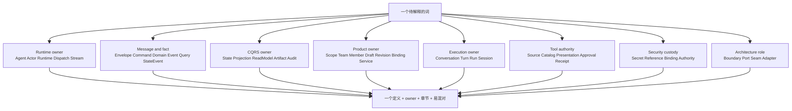
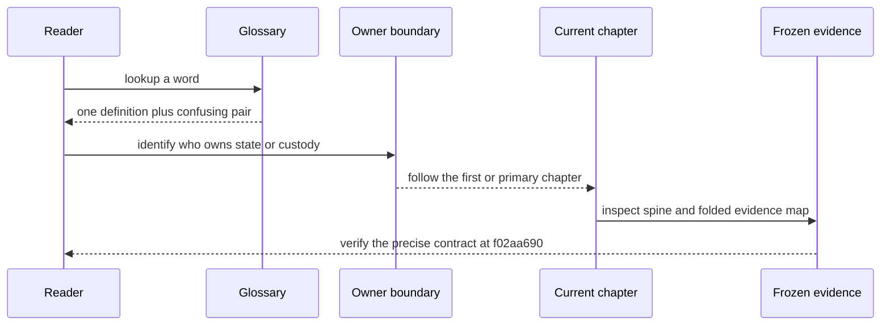

# 术语表：先找事实 owner，再区分名字相近的协议角色

> 版本与结论：本章是 `current` 读者索引，定义绑定冻结基线 `f02aa690`。每个词只给一个本书口径，并标出 owner / boundary、首次或主要章节与易混对象；它不替代各章协议，也不把外部架构词汇强套成运行时类型。

## 设计抽象与事实源

- `docs/canon/architecture-vocabulary.md:9-51`：module、interface、seam、adapter 与 boundary 的规范区分。
- `docs/canon/architecture.md:18-48`：Agent、Actor、Runtime、Event Context 与 Stream 的 Foundation 职责边界。
- `docs/canon/cqrs-projection.md:55-96`：写侧 committed fact、Projection 与 ReadModel 的所有权分层。

## 先建立模型：术语沿 owner 分组，不沿字符串相似度分组



为什么先找 owner？同一个日常词在不同层可能完全不同：`event` 既可能指运行时 envelope 的 payload，也可能指 EventStore 中的 `StateEvent`；`session` 既可能被误用作 conversation，也可能只是一次易失的 observation/transport 生命周期。先确定谁拥有状态、谁能提交事实，再解释名称，能避免把相似字符串拼成一份不存在的合同。

## Runtime、消息与事实

| 术语 | 本书唯一口径 | Owner / boundary | 首次或主要章节 | 易混对象 |
|---|---|---|---|---|
| Agent | 处理业务消息并实现行为的逻辑单元；有状态 Agent 通过领域事件维护自己的状态。 | 业务行为 owner；不拥有邮箱或跨节点寻址。 | [02/01](../02/01-agent-actor-runtime.md) | Actor 是运行容器，不是业务实现。 |
| Actor | 承载一个 Agent 的寻址、激活、邮箱串行与父子拓扑的运行容器。 | Runtime 管理的逻辑实体。 | [02/01](../02/01-agent-actor-runtime.md) | Agent 提供行为；Actor 提供运行语义。 |
| Runtime | 创建、定位、激活 Actor，并保证同一 Actor 的消息处理语义；Local 与 Orleans 是同一组 Port 的不同实现。 | `IActorRuntime` / runtime provider。 | [02/01](../02/01-agent-actor-runtime.md) | Stream 传输 envelope；Runtime 赋予 Actor 语义。 |
| Dispatch | 从 Actor 外把一个已构造的 envelope 定向送进目标 Actor inbox 的能力。 | `IActorDispatchPort` boundary。 | [02/05](../02/05-dispatch-routing-and-topology.md) | Publish 是当前 Actor 执行上下文中的拓扑/observer 传播。 |
| Stream | 搬运 `EventEnvelope` 并承载 forwarding / relay binding 的传输骨架。 | stream provider；不拥有业务状态。 | [02/05](../02/05-dispatch-routing-and-topology.md) | Runtime 不等于 Stream；EventStore 也不是 Stream。 |
| Envelope | 运行时消息信封：携带 payload、route、propagation 与 runtime metadata；payload 可以有多种语义。 | runtime message boundary。 | [02/02](../02/02-envelope-command-event-query.md) | StateEvent 才是事件溯源事实。 |
| Command | 请求某个 owner 尝试改变状态或产生副作用的消息意图；受理不等于成功。 | 被寻址的 Actor / application command owner。 | [02/02](../02/02-envelope-command-event-query.md) | Domain Event 记录已经发生的事实。 |
| Domain Event | 业务 owner 对“某件事已经发生”的不可变陈述；提交后才能驱动状态 fold 与下游观察。 | 产生它的 Actor。 | [02/04](../02/04-state-event-sourcing-and-guard.md) | Envelope 只是运输；Command 是意图。 |
| Query | 读取投影副本的请求，不得借查询路径激活写侧、重放 EventStore 或制造新事实。 | Query Port / ReadModel store。 | [05/01](../05/01-command-event-projection-readmodel.md) | Command 可改变状态；Query 只读。 |
| StateEvent | EventStore 中带版本的 committed 事实增量，payload 通常承载 domain event。 | 单个 Agent 的 EventStore stream。 | [02/04](../02/04-state-event-sourcing-and-guard.md) | Envelope 是 runtime message；State 是 fold 结果。 |
| ACK | 命令被某一边界受理后返回的句柄或 receipt；只证明该边界承诺继续处理。 | 接受命令的 Host / application boundary。 | [06/04](../06/04-studio-commands-acks-and-readmodels.md) | Terminal outcome 或 ReadModel 可见性是后续事实。 |

## State、Projection 与可观察产物

| 术语 | 本书唯一口径 | Owner / boundary | 首次或主要章节 | 易混对象 |
|---|---|---|---|---|
| State | 一个 Agent 将 committed StateEvent 经 reducer fold 得到的当前内存形状；可重建，不是独立事实源。 | Agent / Actor 写侧。 | [02/04](../02/04-state-event-sourcing-and-guard.md) | ReadModel 是查询副本；Artifact 是有身份的输出。 |
| Committed Fact | 已经通过权威 owner 的持久化边界、可被重放或版本核验的事实；不是“消息已收到”。 | 写侧 Actor / EventStore。 | [05/02](../05/02-committed-state-and-observation.md) | Accepted / ACK 不是 committed。 |
| Projection | 把 committed fact 按确定规则物化为查询副本、artifact 或 session observation 的机制。 | Projection scope actor 与 projector/materializer。 | [05/01](../05/01-command-event-projection-readmodel.md) | ReadModel 是结果，不是 pipeline。 |
| ReadModel | 面向查询的持久副本，带自己的版本、水位、索引与重建责任；不得反向成为写侧权威。 | ReadModel store / Query Port。 | [05/01](../05/01-command-event-projection-readmodel.md) | State 属于写侧；ReadModel 允许 eventual consistency。 |
| Artifact | 对一次运行或业务输出的有身份、可查询材料，通常携带 provenance；不是任意日志行。 | 产生它的 projection / artifact store。 | [05/05](../05/05-workflow-agui-and-live-observation.md) | ReadModel 回答当前查询；Audit 记录治理生命周期。 |
| Audit | 追加式记录安全或业务操作生命周期、主体、结果与导出语义的治理事实。 | Audit pipeline / artifact store。 | [05/06](../05/06-audit-trail-lifecycle-and-export.md) | Observability signal 可采样、可丢；Audit 不能被普通日志替代。 |
| Observation | 为在线读者提供的实时或会话级可见性，不自动具有 durable current-state 语义。 | Session projection / live sink。 | [05/02](../05/02-committed-state-and-observation.md) | ReadModel 是 durable 查询副本。 |

## 产品资源与发布身份

| 术语 | 本书唯一口径 | Owner / boundary | 首次或主要章节 | 易混对象 |
|---|---|---|---|---|
| Scope | 多租户资源、授权与目录可见性的顶层所有权边界；请求中的 canonical scope 必须唯一。 | Scope authority / authorization guard。 | [06/01](../06/01-scope-team-member-resource-model.md) | Team 是 scope 内聚合，不是另一个租户根。 |
| Team | Scope 下的一等协作聚合，约束 Member containment 与 roster；不是权限万能容器。 | Studio Team Actor。 | [06/01](../06/01-scope-team-member-resource-model.md) | Scope 决定租户边界；Member 是可绑定执行主体。 |
| Member | Team 中稳定的产品执行主体，可绑定 workflow revision 并对外形成服务身份。 | Studio Member Actor。 | [06/01](../06/01-scope-team-member-resource-model.md) | Service 是发布后的运行入口，不等于 Member 本身。 |
| Draft | 可编辑的 authoring 意图；保存成功不意味着生成了新的 immutable revision 或已 serving。 | Studio authoring boundary。 | [06/02](../06/02-draft-revision-binding-and-published-service.md) | Revision 不可变；Binding Run 有独立终态。 |
| Revision | 从 Draft 产出的不可变版本，作为 binding / provenance 的稳定输入。 | Revision store / authoring owner。 | [06/02](../06/02-draft-revision-binding-and-published-service.md) | Draft 可继续编辑；Service 可能仍指旧 revision。 |
| Binding | 把 Member、Revision 与运行资源关联起来的有状态过程；必须通过 Binding Run 观察结果。 | Studio Member binding owner。 | [06/02](../06/02-draft-revision-binding-and-published-service.md) | Credential Binding 绑定身份/秘密，含义不同。 |
| Service | 本章只指已发布且可按服务合同寻址的 runtime exposure；是否 ready 由权威服务状态证明。 | Service / serving authority。 | [06/02](../06/02-draft-revision-binding-and-published-service.md) | Member 存在、Revision 存在、Binding accepted 都不等于 serving。 |

## Conversation、Turn、Run 与 Session

| 术语 | 本书唯一口径 | Owner / boundary | 首次或主要章节 | 易混对象 |
|---|---|---|---|---|
| Conversation | 跨多轮存在的聊天身份与耐久历史 owner。 | Conversation Actor。 | [07/01](../07/01-conversation-turn-and-chat-history.md) | Session 通常是一次易失连接/观察；Run 是一次执行。 |
| Turn | Conversation 内一次服务端分配的交互身份，冻结本轮 authority、profile 与 tool catalog。 | Turn / conversation authority。 | [01/03](../01/03-chat-conversation-turn-contract.md) | 一个 Turn 可触发 Run；Run 失败不改 Turn identity。 |
| Run | 一次可观察的执行实例，拥有自己的开始、进度、结果与终态。 | Workflow Run Actor 或对应 execution owner。 | [03/01](../03/01-workflow-model-and-identities.md) | Turn 是交互身份；Session 是观察/传输生命周期。 |
| Session | 一次 realtime observation 或 transport attachment 的生命周期；除非合同明确，不保证跨断线恢复。 | Projection session / transport boundary。 | [01/04](../01/04-request-streaming-lifecycle.md) | Conversation 是 durable identity；restart 不是 resume。 |

## Tool 权力与展示事实

| 术语 | 本书唯一口径 | Owner / boundary | 首次或主要章节 | 易混对象 |
|---|---|---|---|---|
| Tool Source | 异步发现候选工具的 provider；发现不等于 Host 注册、当前 Turn 可见或获准执行。 | `IAgentToolSource` implementation。 | [04/03](../04/03-tool-loop-catalog-and-presentation.md) | Tool Catalog 是一次 Turn 的准入结果。 |
| Tool Catalog | 某次请求/Turn 冻结的 allowed names、exact instances 与 authority ceiling。 | Request / Turn authority。 | [04/03](../04/03-tool-loop-catalog-and-presentation.md) | 全局 provider inventory 不是 catalog。 |
| Tool Presentation | 工具卡片的稳定展示身份、kind、availability 与 source reference；不授予执行权。 | Tool/provider presentation descriptor。 | [04/03](../04/03-tool-loop-catalog-and-presentation.md) | Approval 决定是否允许；Receipt 记录发生了什么。 |
| Tool Approval | 对 exact pending invocation 的人或策略决定；恢复时仍需重验 authority 与 tool identity。 | Approval middleware / remote approval owner。 | [04/04](../04/04-tool-approval-and-authorization.md) | Presentation 不是授权；Credential 也不等于批准。 |
| Tool Receipt | 一次调用的 typed outcome、审批/授权状态与可安全展示结果。 | Tool execution lifecycle。 | [04/03](../04/03-tool-loop-catalog-and-presentation.md) | Receipt 不保存可重放 secret，也不自动证明外部副作用已回滚。 |

## Secret、Reference、Binding 与 Authority

| 术语 | 本书唯一口径 | Owner / boundary | 首次或主要章节 | 易混对象 |
|---|---|---|---|---|
| Secret | 可直接用于认证或解密的敏感材料；不得进入普通业务 state、event、read model 或日志。 | Secret Vault / credential broker。 | [09/04](../09/04-vault-reference-and-revocation-compensation.md) | Reference 只定位材料，不能直接认证。 |
| Reference | 指向 secret、file、artifact 或外部资源的 typed locator；本身不拥有被引用对象。 | 各对象的 custody owner。 | [09/04](../09/04-vault-reference-and-revocation-compensation.md) | Secret 是材料；Reference 是定位符。 |
| Credential Binding | 把 caller / owner 身份、用途和某个 credential reference 关联起来的权威关系。 | Identity / credential authority。 | [10/05](../10/05-authentication-scope-and-admin-authorization.md) | Studio Binding 绑定 Member 与 Revision。 |
| Authority | 某个主体在某个版本和范围内允许执行什么的上限；由 claims、policy、binding 与 typed plan共同收窄。 | Authorization owner。 | [07/04](../07/04-turn-authority-tool-catalog-and-retry.md) | Authentication 只证明“是谁”；Approval 只决定一次调用。 |

## 架构讨论中的 Boundary、Port、Seam 与 Adapter

| 术语 | 本书唯一口径 | Owner / boundary | 首次或主要章节 | 易混对象 |
|---|---|---|---|---|
| Boundary | 事实、状态与责任归谁的范围；不是“可替换实现的位置”的同义词。 | 由具体业务 owner 定义。 | [00/03](../00/03-repository-map.md) | Seam 才描述可替换点。 |
| Port | 调用方依赖的窄合同，包含类型、顺序、不变量与错误模式；是 aevatar 中最常见的 seam 形态。 | 合同所属层。 | [02/01](../02/01-agent-actor-runtime.md) | C# `interface` 关键字本身不等于完整合同。 |
| Seam | 不改调用方即可替换行为实现的位置；至少有真实替代实现时才有价值。 | Port + dispatch / protocol contract。 | [00/03](../00/03-repository-map.md) | Boundary 描述所有权，不描述可替换性。 |
| Adapter | 在一个 Port / Seam 上把外部或 provider-specific 语义翻译成内部合同的实现。 | 边界实现，不拥有上游业务事实。 | [03/07](../03/07-connectors-and-capability-admission.md) | Projection 是物化机制，不应统称 adapter。 |

## 沿一次术语查找走读



例如看到“session 恢复”时，词典先要求判断它是 Conversation 的 durable history、Projection Session 的 live observation，还是 Voice transport attachment。只有前者天然跨轮；后两者是否恢复必须另有 cursor / stateVersion / resume token 合同。词典负责阻止越层推断，具体重连行为仍由 [01/04](../01/04-request-streaming-lifecycle.md)、[07/01](../07/01-conversation-turn-and-chat-history.md) 与 [08/05](../08/05-voice-control-and-media-planes.md) 说明。

## 最小 demo：必需易混词每个只有一个定义

```bash
python3 - <<'PY'
from pathlib import Path
import re

text = Path("13/01-glossary.md").read_text()
rows = {}
for line in text.splitlines():
    if not line.startswith("| ") or line.startswith("|---"):
        continue
    cells = [cell.strip() for cell in line.strip("|").split("|")]
    if len(cells) != 5 or cells[0] == "术语":
        continue
    term = cells[0]
    assert term not in rows, f"duplicate definition: {term}"
    rows[term] = cells

required = {
    "Agent", "Actor", "Envelope", "StateEvent", "Command",
    "Domain Event", "Query", "Runtime", "Dispatch", "Stream",
    "State", "ReadModel", "Artifact", "Audit", "Scope", "Team",
    "Member", "Draft", "Revision", "Binding", "Service",
    "Conversation", "Turn", "Run", "Session", "Tool Source",
    "Tool Catalog", "Tool Presentation", "Tool Approval", "Secret",
    "Reference", "Credential Binding", "Authority",
}
assert required <= rows.keys(), sorted(required - rows.keys())
for term in required:
    assert re.search(r"\[[^]]+\]\(\.\./[0-9]{2}/", rows[term][3]), term
    assert rows[term][2] and rows[term][4]
print(f"glossary-contract: {len(rows)} unique definitions, {len(required)} required terms covered")
PY
```

> Demo status：`verified-static`。本轮实际运行定义唯一性、必需词覆盖、owner/boundary 与章节链接形状检查；没有从类型名推断未写明的运行时保证。

## 为什么是它，不是别的

- 为什么不是按字母排序的一行释义：相邻误解通常跨层发生；按 owner 分组能先固定事实边界，字面查找仍可用页面搜索。
- 为什么不复制 canon 段落：canon 是上游治理文本，可能与冻结 E1 漂移；词典只给本书口径并指向可核验章节。
- 为什么一个词只定义一次：多个“局部正确”定义会让读者在边界处自由挑选；具体变体应由所属章节解释，不在词典制造第二合同。
- 为什么保留英文标识符：代码、proto、协议与日志都使用这些名字，中文解释负责语义，不应让检索链断裂。

## 边界与演进

- 本章是读者导航，不是类型清单；新增一个 C# 类型不会自动产生新术语。
- `current` 只表示这些定义与冻结基线和现役章节一致，不表示所有被命名的能力都完备；缺口仍以 [12/05](../12/05-open-gaps-and-canon-drift.md) 为准。
- Canon/ADR 的实际库存与状态见 [13/02](02-canon-and-adr-index.md)，章节证据入口见 [13/03](03-chapter-source-matrix.md)。

## 读完应能回答

1. Agent、Actor、Runtime 与 Stream 各自拥有哪一层语义？
2. Envelope、Domain Event 与 StateEvent 为什么不能互换？
3. State、ReadModel、Artifact 与 Audit 分别是谁的事实或副本？
4. Conversation、Turn、Run 与 Session 的身份和持久性有何不同？
5. Tool Source、Catalog、Presentation、Approval 与 Receipt 为什么不能合并成“工具可用”？

<details>
<summary>论断—证据映射</summary>

| 论断 | 证据 |
|---|---|
| Agent / Actor / Runtime / Stream 分层 | `docs/canon/architecture.md:18-48`；[02/01](../02/01-agent-actor-runtime.md) |
| Envelope 与 StateEvent 分层 | `docs/canon/event-sourcing.md:9-42`；[02/02](../02/02-envelope-command-event-query.md)、[02/04](../02/04-state-event-sourcing-and-guard.md) |
| committed fact / Projection / ReadModel | `docs/canon/cqrs-projection.md:55-96`；[05/01](../05/01-command-event-projection-readmodel.md) |
| product identity 与发布阶段 | [06/01](../06/01-scope-team-member-resource-model.md)、[06/02](../06/02-draft-revision-binding-and-published-service.md) 的冻结 E1 映射 |
| Conversation / Turn / Run / Session | [01/03](../01/03-chat-conversation-turn-contract.md)、[01/04](../01/04-request-streaming-lifecycle.md)、[07/01](../07/01-conversation-turn-and-chat-history.md) |
| Tool source/catalog/presentation/approval | `docs/canon/nyxid-chat-agent-profile-binding.md:9-70`；[04/03](../04/03-tool-loop-catalog-and-presentation.md)、[04/04](../04/04-tool-approval-and-authorization.md) |
| boundary / port / seam / adapter | `docs/canon/architecture-vocabulary.md:9-51` |

</details>
