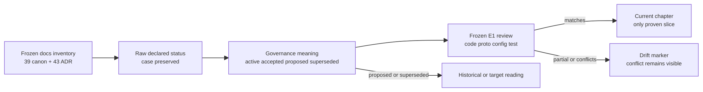
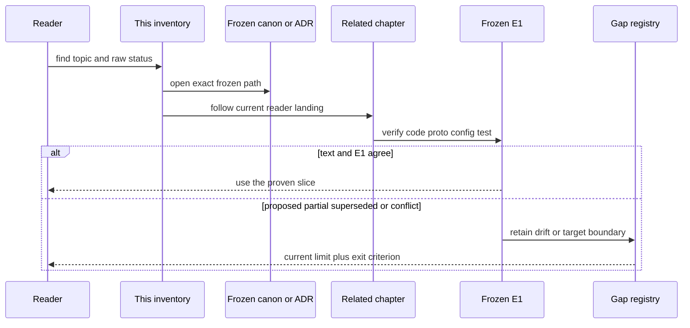

# Canon 与 ADR 索引：状态原样保留，current 结论仍回到冻结 E1

> 版本与结论：本章是 `mixed` 全量索引。冻结树的 `docs/canon` 目录含 39 篇 Markdown，`docs/adr` 目录含 43 篇；表中状态逐文件读取并保留原始大小写。`active`、`canonical`、`accepted` 只说明治理文本的自我声明，不能替代冻结代码；`proposed` 只能说明候选方向；`superseded` 只保留历史。已知 code/canon drift 单列标记，不能靠改索引把冲突“修绿”。

## 设计抽象与事实源

- `docs/canon/overview.md:16-45`：canon 对主链职责与事实层级的当前声明。
- `docs/adr/0001-project-split-strategy.md:1-30`：ADR frontmatter、Context / Decision 与状态读取样例。
- `docs/adr/0034-workflow-saga-compensation-protocol.md:1-20`：`proposed` 文本落后于冻结 E1 的代表性 drift。

## 先建立模型：治理状态与实现证据是两根轴



为什么不把 `accepted` 直接翻译成“已实现”？ADR 决定和代码 landing 可能分批发生；反过来，代码也可能已经落地而 ADR 仍停在 `proposed`。索引保持两根轴：状态回答治理文本怎样自我声明，相关章节和 drift 标记回答冻结实现应该怎样读。

## Canon inventory（39）

| Kind | Path | Raw status | 一行导读 | 相关章节 | Drift / lifecycle |
|---|---|---|---|---|---|
| canon | `docs/canon/actor-evolution.md` | `active` | actor identity、split/merge/re-key 与 retire cleanup 判定矩阵 | [02/01](../02/01-agent-actor-runtime.md) | — |
| canon | `docs/canon/admin-authorization.md` | `active` | platform admin 与 scope access 的独立授权边界 | [10/05](../10/05-authentication-scope-and-admin-authorization.md) | — |
| canon | `docs/canon/aevatar-channel-architecture.md` | `active` | 多 Channel adapter 的中立 activity、transport 与 delivery 分层 RFC | [08/01](../08/01-ingress-normalization-and-routing.md) | 部分 Lark core coupling 仍见 [12/05](../12/05-open-gaps-and-canon-drift.md) |
| canon | `docs/canon/agent-profile-rollout.md` | `active` | profile package provision、SHADOW/ENFORCED artifact 与发布门禁 | [07/03](../07/03-agent-profile-and-immutable-binding.md) | SHADOW 语义 drift |
| canon | `docs/canon/approval-quota-ledger.md` | `active` | approval quota 留在外部或 channel-native owner，不在 Aevatar 复制账本 | [04/04](../04/04-tool-approval-and-authorization.md) | — |
| canon | `docs/canon/architecture-vocabulary.md` | `active` | boundary、port、seam、adapter 与 module 的评审词汇 | [13/01](01-glossary.md) | — |
| canon | `docs/canon/architecture.md` | `active` | Foundation 分层、运行主链与 CQRS 落点 | [02/01](../02/01-agent-actor-runtime.md) | `RunManager` / `RunContextScope` 无冻结类型 |
| canon | `docs/canon/audit-trail.md` | `active` | Audit lifecycle、三类采集面、追加语义与导出 | [05/06](../05/06-audit-trail-lifecycle-and-export.md) | — |
| canon | `docs/canon/backend-console.md` | `active` | checked-in backend console 静态资产与运行配置注入 | [10/07](../10/07-observability-status-and-observatory.md) | — |
| canon | `docs/canon/chat-api.md` | `active` | Workflow `/api/chat` request、SSE 与 terminal observation 合同 | [01/04](../01/04-request-streaming-lifecycle.md) | standalone Host auth composition 仍有限制 |
| canon | `docs/canon/connector.md` | `active` | Connector 配置、operation 解析与受控外呼 | [03/07](../03/07-connectors-and-capability-admission.md) | — |
| canon | `docs/canon/cqrs-projection.md` | `active` | committed fact、projection scope 与 read model 的统一边界 | [05/01](../05/01-command-event-projection-readmodel.md) | — |
| canon | `docs/canon/event-sourcing.md` | `active` | StateEvent、EventStore、reducer 与 replay 基线 | [02/04](../02/04-state-event-sourcing-and-guard.md) | — |
| canon | `docs/canon/external-exposure-receipt.md` | `active` | published service 到 NyxID 的 actor-owned exposure receipt | [06/02](../06/02-draft-revision-binding-and-published-service.md) | registration lifecycle仍有 open gaps |
| canon | `docs/canon/frontend-design.md` | `active` | Console 作为 Team/Platform 工作台的产品与视觉基线 | [06/04](../06/04-studio-commands-acks-and-readmodels.md) | 部分页面事实随 UI 演进 |
| canon | `docs/canon/gagent-registry-ownership.md` | `active` | per-scope registry authority、AgentKind key 与 admission 分离 | [06/03](../06/03-catalog-visibility-and-scope-authorization.md) | — |
| canon | `docs/canon/lark-reply-completion-semantics.md` | `Active` | Lark generation、delivery 与 completion 的诚实终态 | [08/03](../08/03-lark-delivery-interaction-and-repair.md) | partial terminal 仍可能记 succeeded |
| canon | `docs/canon/llm-streaming.md` | `active` | Workflow LLM streaming 与 run-event 投影路径 | [04/01](../04/01-role-agent-and-streaming-run.md) | — |
| canon | `docs/canon/managed-codex-execution.md` | `active` | Codex execution port、sandbox、tenant 与 credential boundary | [10/06](../10/06-managed-codex-sandbox-and-delegation.md) | 当前仍有 allowlist / delegation debt |
| canon | `docs/canon/module-placement-map.md` | `active` | 命名空间、项目层级与能力放置规则 | [00/03](../00/03-repository-map.md) | — |
| canon | `docs/canon/nyxid-chat-agent-profile-binding.md` | `canonical` | NyxIdChat profile snapshot、turn catalog 与 activation mode | [07/03](../07/03-agent-profile-and-immutable-binding.md) | SHADOW 文本与冻结测试冲突 |
| canon | `docs/canon/nyxid-chat-api.md` | `active` | NyxIdChat request identity、progress 与 streaming 字段 | [07/02](../07/02-nyxid-chat-actor-model-and-progress.md) | stop/steering/task/reconnect 不在冻结合同 |
| canon | `docs/canon/nyxid-connected-service-tools.md` | `active` | request-local NyxID service instance、OpenAPI admission 与 proxy tool | [04/03](../04/03-tool-loop-catalog-and-presentation.md) | — |
| canon | `docs/canon/nyxid-llm-integration.md` | `active` | NyxID LLM catalog lifecycle、owner snapshot 与 provider adapter | [04/02](../04/02-llm-providers-and-route-selection.md) | — |
| canon | `docs/canon/nyxid-responses-direct.md` | `active` | 经 NyxID proxy 的 Responses/Messages/Chat 兼容入口 | [01/04](../01/04-request-streaming-lifecycle.md) | legacy streaming-proxy 有 sunset 边界 |
| canon | `docs/canon/observability.md` | `active` | `aevatar.*` OTel 语义、status 与运行观测 | [10/07](../10/07-observability-status-and-observatory.md) | — |
| canon | `docs/canon/overview.md` | `active` | 全局 Actor/Event/CQRS 主线与 Maker 插件化定位 | [00/01](../00/01-reading-guide.md) | — |
| canon | `docs/canon/role-model.md` | `active` | Workflow Role、LLM 与 Connector capability 配置 | [03/01](../03/01-workflow-model-and-identities.md) | — |
| canon | `docs/canon/scheduled-skill-runners.md` | `active` | current Scheduled Workflow Dispatch 与退役 runner token | [09/02](../09/02-scheduled-actor-callback-and-fire.md) | 文件名保留历史词，SkillRunner runtime 已删除 |
| canon | `docs/canon/scripting.md` | `active` | Scripting capability、隔离与 Host opt-in 边界 | [10/08](../10/08-architecture-and-security-guards.md) | — |
| canon | `docs/canon/sdk-dotnet.md` | `active` | .NET Workflow SDK 的 chat/resume/signal transport 用法 | [11/01](../11/01-run-a-simple-workflow.md) | SDK 不拥有 runtime 语义 |
| canon | `docs/canon/secret-vault.md` | `active` | Vault keyring、SecretReference、轮换与 fail-fast | [09/04](../09/04-vault-reference-and-revocation-compensation.md) | — |
| canon | `docs/canon/status-dashboard.md` | `active` | `/status` 展示、`/api/status` read model 与 probe actor 分层 | [10/07](../10/07-observability-status-and-observatory.md) | — |
| canon | `docs/canon/system-skill-overlay-authoring-contract.md` | `active` | system skill overlay 的 authoring、层序与 authority ceiling | [04/05](../04/05-prompt-overlays-and-agent-context.md) | — |
| canon | `docs/canon/voice-presence-integration.md` | `active` | Voice control、volatile media，以及 attach 后按 transport lease 绑定 live relay 的交付合同 | [08/05](../08/05-voice-control-and-media-planes.md) | relay 缺失是 topology gap，不得新开 provider socket；restart 不是 resume |
| canon | `docs/canon/work-orders.md` | `active` | WorkOrder durable intent、approval 与 terminal observation | [06/05](../06/05-work-orders-and-durable-intent.md) | — |
| canon | `docs/canon/workflow-catalog-visibility.md` | `active` | global template 与 scope-owned runnable resource 可见性 | [06/03](../06/03-catalog-visibility-and-scope-authorization.md) | — |
| canon | `docs/canon/workflow-primitives.md` | `active` | canonical primitive names、输入输出与组合约束 | [03/04](../03/04-primitives-catalog.md) | — |
| canon | `docs/canon/workflow-runtime.md` | `active` | definition/run actor、kernel 与 YAML runtime 主线 | [03/03](../03/03-execution-kernel-and-outcomes.md) | 正文保留旧模型段，顶部声明覆盖 |

## ADR inventory（43）

| Kind | Path | Raw status | 一行导读 | 相关章节 | Drift / lifecycle |
|---|---|---|---|---|---|
| ADR | `docs/adr/0001-project-split-strategy.md` | `active` | 项目拆分、依赖方向与 solution 组织 | [00/03](../00/03-repository-map.md) | — |
| ADR | `docs/adr/0002-mainnet-architecture.md` | `active` | Mainnet Host、Orleans、Kafka 与 Garnet 总体部署 | [10/01](../10/01-production-topology-and-configuration.md) | — |
| ADR | `docs/adr/0003-kafka-transport.md` | `active` | Orleans KafkaProvider queue adapter 与分区所有权 | [10/04](../10/04-streaming-transport-and-kafka.md) | — |
| ADR | `docs/adr/0006-multi-agent-evolution.md` | `superseded` | 早期 Workflow 调度 Actor 化与 Maker 演进方案 | [12/03](../12/03-retired-and-superseded-components.md) | superseded，历史阅读 |
| ADR | `docs/adr/0007-stream-forward.md` | `active` | topology publication 的 stream-forward 路由 | [02/05](../02/05-dispatch-routing-and-topology.md) | — |
| ADR | `docs/adr/0008-channel-runtime-multi-token-routing.md` | `superseded` | 早期 Channel 多 token route 模型 | [12/03](../12/03-retired-and-superseded-components.md) | superseded by later Channel ADRs |
| ADR | `docs/adr/0009-channel-bot-callback-architecture.md` | `accepted` | bot callback、registration 与 runtime ingress | [08/02](../08/02-channel-runtime-and-credential-boundary.md) | — |
| ADR | `docs/adr/0010-channel-phase0-provider-validation.md` | `accepted` | Channel provider validation 结果持久化 | [08/02](../08/02-channel-runtime-and-credential-boundary.md) | — |
| ADR | `docs/adr/0011-lark-nyx-relay-webhook.md` | `superseded` | 早期 Lark Nyx relay webhook topology | [12/03](../12/03-retired-and-superseded-components.md) | superseded by unified inbound backbone |
| ADR | `docs/adr/0012-channel-runtime-credential-boundary.md` | `accepted` | Channel credential custody 与 runtime write 边界 | [08/02](../08/02-channel-runtime-and-credential-boundary.md) | — |
| ADR | `docs/adr/0013-unified-channel-inbound-backbone.md` | `accepted` | Lark/Telegram 等入口统一到中立 activity 骨干 | [08/01](../08/01-ingress-normalization-and-routing.md) | — |
| ADR | `docs/adr/0014-interactive-reply-abstraction.md` | `accepted` | 交互回复 intent 与 provider adapter 分离 | [08/03](../08/03-lark-delivery-interaction-and-repair.md) | — |
| ADR | `docs/adr/0015-agui-sse-projection-session-pipeline.md` | `active` | AGUI/SSE 由 projection session pipeline 承载 | [05/05](../05/05-workflow-agui-and-live-observation.md) | — |
| ADR | `docs/adr/0016-studio-member-first-published-service.md` | `accepted` | Member-first published service identity | [06/02](../06/02-draft-revision-binding-and-published-service.md) | — |
| ADR | `docs/adr/0017-studio-team-first-class-aggregate.md` | `accepted` | Scope 下 Team 一等聚合与 Member containment | [06/01](../06/01-scope-team-member-resource-model.md) | — |
| ADR | `docs/adr/0018-per-user-nyxid-binding-via-oauth-broker.md` | `accepted` | per-user NyxID binding 与 OAuth broker | [10/05](../10/05-authentication-scope-and-admin-authorization.md) | headless binding 仍是 gap |
| ADR | `docs/adr/0019-stable-agent-kind-identity.md` | `accepted` | stable AgentKind 取代 CLR type identity | [02/01](../02/01-agent-actor-runtime.md) | — |
| ADR | `docs/adr/0020-actor-state-version-placement.md` | `accepted` | actor state schema version 放在 runtime envelope | [02/04](../02/04-state-event-sourcing-and-guard.md) | — |
| ADR | `docs/adr/0021-lark-reply-chain-completion-semantics.md` | `Proposed` | Lark reply chain 的 honest completion 决策 | [08/03](../08/03-lark-delivery-interaction-and-repair.md) | proposed 且代码仍有 partial-success drift |
| ADR | `docs/adr/0022-otel-aevatar-semantic-conventions.md` | `proposed` | `aevatar.*` OTel semantic conventions | [10/07](../10/07-observability-status-and-observatory.md) | proposed，只作治理候选 |
| ADR | `docs/adr/0023-two-tier-inspector-architecture.md` | `proposed` | canonical read model 与 OTel observation 两级 Inspector | [10/07](../10/07-observability-status-and-observatory.md) | proposed，旧 Inspector demo 已删除 |
| ADR | `docs/adr/0024-chat-route-policy.md` | `Accepted` | config actor + stateless boundary resolver 路由 | [08/01](../08/01-ingress-normalization-and-routing.md) | — |
| ADR | `docs/adr/0025-voice-router-integration.md` | `Accepted` | policy-aware Voice WebSocket route boundary | [08/05](../08/05-voice-control-and-media-planes.md) | — |
| ADR | `docs/adr/0026-tool-first-chat-ingress.md` | `Accepted` | route policy 将执行意图收敛为 model + tools | [08/01](../08/01-ingress-normalization-and-routing.md) | route tool set 尚未完整进入 generation E1 |
| ADR | `docs/adr/0027-lark-reply-run-dispatcher-plain-task-handoff.md` | `Accepted` | Lark reply run dispatcher 与 plain task handoff | [08/03](../08/03-lark-delivery-interaction-and-repair.md) | — |
| ADR | `docs/adr/0028-studio-team-accepted-receipt-semantics.md` | `accepted` | Studio Team command accepted receipt | [06/04](../06/04-studio-commands-acks-and-readmodels.md) | ACK 不等于 terminal |
| ADR | `docs/adr/0029-identity-oauth-accepted-ack-semantics.md` | `accepted` | Identity OAuth accepted ACK 与 completion 分离 | [10/05](../10/05-authentication-scope-and-admin-authorization.md) | — |
| ADR | `docs/adr/0030-gagent-registry-agent-kind-key.md` | `accepted` | GAgent registry 以 AgentKind 为业务 key | [06/03](../06/03-catalog-visibility-and-scope-authorization.md) | — |
| ADR | `docs/adr/0031-voice-edge-local-tools.md` | `Accepted` | Voice edge local tools 与 brain/edge 权限边界 | [08/05](../08/05-voice-control-and-media-planes.md) | — |
| ADR | `docs/adr/0032-mainnet-garnet-clustering.md` | `accepted` | Mainnet 使用共享 Garnet membership/persistence | [10/03](../10/03-garnet-clustering-and-secret-storage.md) | — |
| ADR | `docs/adr/0033-voice-provider-nyxid-ephemeral-broker.md` | `proposed` | Voice provider 经 NyxID ephemeral broker 取凭证 | [08/05](../08/05-voice-control-and-media-planes.md) | resolver 已有 E1，static fallback 边界未统一 |
| ADR | `docs/adr/0034-workflow-saga-compensation-protocol.md` | `proposed` | Workflow saga ledger、反向补偿与 dead letter | [03/06](../03/06-saga-compensation-and-recovery.md) | 大量 E1 已落地，ADR 仍 proposed |
| ADR | `docs/adr/0035-auto-register-published-service-to-nyxid.md` | `accepted` | published service 自动注册 NyxID 的 exposure lifecycle | [06/02](../06/02-draft-revision-binding-and-published-service.md) | landing/registration 边界仍不完整 |
| ADR | `docs/adr/0036-scope-workflow-authoritative-runnable-model.md` | `proposed` | Scope Workflow 作为 authoritative runnable model | [03/01](../03/01-workflow-model-and-identities.md) | 部分 identity/bind E1，整体仍 proposed |
| ADR | `docs/adr/0037-scheduled-invocation-credential-source-model.md` | `accepted` | schedule kind 对应唯一 typed credential source | [09/03](../09/03-owner-authorization-and-agent-key.md) | accepted 不替代逐项 landing |
| ADR | `docs/adr/0038-scripting-capability-opt-in-disabled-on-mainnet.md` | `accepted` | Scripting opt-in 且 Mainnet 默认关闭 | [10/08](../10/08-architecture-and-security-guards.md) | — |
| ADR | `docs/adr/0039-platform-audit-trail.md` | `accepted` | Platform Audit Trail 的 append-only lifecycle | [05/06](../05/06-audit-trail-lifecycle-and-export.md) | — |
| ADR | `docs/adr/0040-current-state-readmodel-dr-rebuild.md` | `accepted` | 用 committed-state re-publication 重建 current read model | [05/04](../05/04-readmodel-stores-versioning-and-rebuild.md) | 不是通用 event replay DR |
| ADR | `docs/adr/0041-scheduled-invocation-agent-key-credential-reference.md` | `proposed` | schedule Agent Key 的 typed credential reference | [09/03](../09/03-owner-authorization-and-agent-key.md) | 大量 Team Automation E1，治理范围未统一 |
| ADR | `docs/adr/0042-scheduled-invocation-durable-secret-reference.md` | `accepted` | durable schedule credential 使用 SecretReference | [09/04](../09/04-vault-reference-and-revocation-compensation.md) | — |
| ADR | `docs/adr/0043-scheduled-credential-lifecycle-compensation.md` | `accepted` | candidate/active/pending revocation 与补偿 | [09/04](../09/04-vault-reference-and-revocation-compensation.md) | — |
| ADR | `docs/adr/0044-managed-codex-gvisor-direct-token.md` | `accepted` | gVisor runner 注入短期 delegated token | [10/06](../10/06-managed-codex-sandbox-and-delegation.md) | broad delegation / admission debt 仍在 |
| ADR | `docs/adr/2026-06-04-agent-kind-primary-only-identity.md` | `accepted` | primary-only AgentKind identity 与 alias 边界 | [02/01](../02/01-agent-actor-runtime.md) | — |

## 状态统计与已知 drift

状态大小写原样保留，但统计时只做小写归一化：canon 为 `active=38`、`canonical=1`；ADR 为 `accepted=28`、`proposed=7`、`active=5`、`superseded=3`。`canonical` 不是额外的实现等级；它只是该文件选择的原始 frontmatter 值。

已知 drift 的集中出口是 [12/05](../12/05-open-gaps-and-canon-drift.md)：Foundation latest-wins 类型缺失、Lark completion partial-success、Agent Profile SHADOW、tool-first route 消费链、ADR-0033/0034/0036/0041 的治理/实现成熟度不一致。MassTransit residue 和被删除组件则见 [12/03](../12/03-retired-and-superseded-components.md)。

## 沿一次索引读取走读



## 最小 demo：库存与状态逐文件对账

```bash
python3 - <<'PY'
from collections import Counter
from pathlib import Path

root = Path(".git/aevatar-frozen/f02aa690bbebb9cabeac30a553d737486b0eb661")
chapter = Path("13/02-canon-and-adr-index.md").read_text()

indexed = {}
for line in chapter.splitlines():
    if not (line.startswith("| canon |") or line.startswith("| ADR |")):
        continue
    cells = [cell.strip() for cell in line.strip("|").split("|")]
    kind, path, status = cells[:3]
    path = path.strip("`")
    assert path not in indexed
    indexed[path] = (kind, status.strip("`"))

actual = {}
for kind in ("canon", "adr"):
    for path in sorted((root / "docs" / kind).glob("*.md")):
        text = path.read_text()
        status = next(
            line.split(":", 1)[1].strip().strip(chr(34)).strip(chr(39))
            for line in text.split("---", 2)[1].splitlines()
            if line.lower().startswith("status:")
        )
        actual[f"docs/{kind}/{path.name}"] = ("canon" if kind == "canon" else "ADR", status)

assert indexed == actual
assert Counter(kind for kind, _ in indexed.values()) == {"canon": 39, "ADR": 43}
assert Counter(status.lower() for kind, status in indexed.values() if kind == "ADR") == {
    "accepted": 28, "proposed": 7, "active": 5, "superseded": 3,
}
print("canon-adr-index: 39 canon + 43 ADR paths and raw statuses match frozen inventory")
PY
```

> Demo status：`verified-static`。本轮实际从冻结 checkout 枚举 82 个文件并对照表格路径、原始 status 与归一化计数；没有从文件名、issue 状态或 live 上游推断治理状态。

## 为什么是它，不是别的

- 为什么保留原始大小写：索引首先是审计记录；静默规范化会掩盖上游文档治理不一致。
- 为什么仍给相关章节：上游文档解释治理边界，本书章节负责把它与冻结 E1、历史和 gap 分层。
- 为什么不贴上游全文：复制会制造第二份 canon；一行导读足以选择入口，细节回原文件。
- 为什么 `proposed` 也全列：删除未决文本会让读者误以为争议不存在；但它们不得支撑 current 行为。

## 边界与演进

- 本章只对应 `f02aa690`；上游新增、删除或改状态时，应重新生成库存差异，不手工猜计数。
- `Drift / lifecycle` 是本轮复核结论，不修改上游状态，也不承诺修复日期。
- 章节—事实源反向入口见 [13/03](03-chapter-source-matrix.md)，issue 演进证据见 [13/04](04-issue-evolution-index.md)。

## 读完应能回答

1. 冻结基线有多少 canon 与 ADR，状态如何取得？
2. `accepted`、`active` 与 `current E1` 为什么不能互相替代？
3. 哪些 Proposed ADR 已出现部分代码 landing，为什么仍不能整体晋级？
4. Canon 与代码冲突时，读者应沿哪条链核验？
5. Superseded ADR 为什么仍保留在索引？

<details>
<summary>论断—证据映射</summary>

| 论断 | 证据 |
|---|---|
| 39 canon、43 ADR 与逐文件 raw status | 本章 demo 对冻结 canon / ADR 两个目录的 Markdown 枚举结果 |
| governance status 不替代 E1 | [00/02](../00/02-version-evidence-and-status.md)、[12/01](../12/01-evolution-method-and-timeline.md) |
| Proposed / canon drift 清单 | [12/05 Canon / ADR drift](../12/05-open-gaps-and-canon-drift.md) |
| retired / superseded implementation history | [12/03](../12/03-retired-and-superseded-components.md) |

</details>
