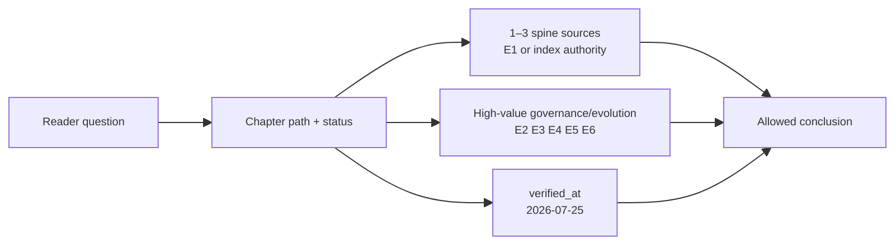
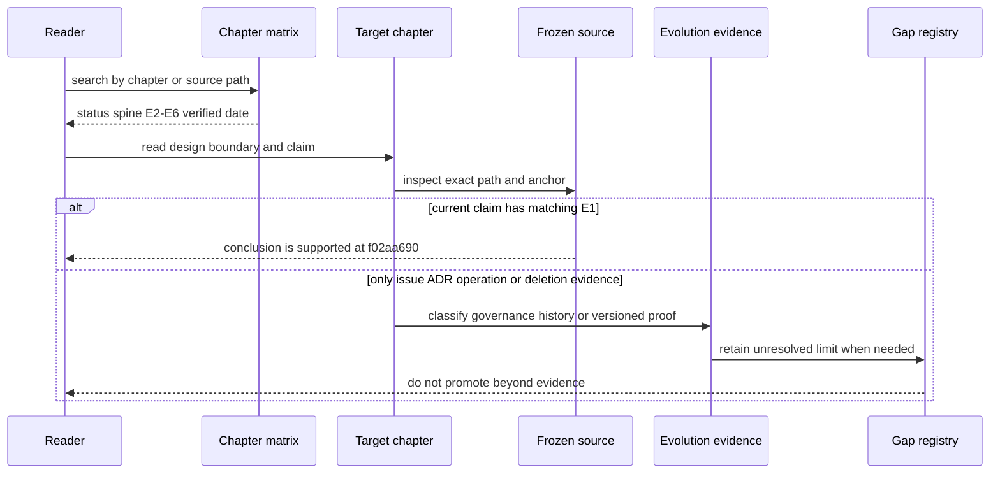

# 章节—事实源矩阵：72 个阅读入口怎样回到冻结证据

> 版本与结论：本章是 `current` 读者索引。它无损展开 72 篇实质章节的状态、1–3 条 spine source、E2–E6 高价值证据与统一核验日期；逐行事实源仍由迁移期章节事实源矩阵维护，本章不建立第二套分类。路径与行号都绑定 `f02aa690`，`historical` / `target` 行的索引证据不能被用来证明 current 行为。

## 设计抽象与事实源

- 本仓库 [章节事实源矩阵](../migration/2026-07-25-source-matrix.md)：72 行 status、spine、E2–E6 与 verified 状态的实施记录。
- `docs/canon/overview.md:16-45`：Command、EventEnvelope、Domain Event、Projection、ReadModel 主链，是 source spine 分层的基准。
- `docs/canon/module-placement-map.md:9-45`：项目/能力放置与路径语义，帮助读者从章节反查实现区域。

## 先建立模型：一行不是“引用列表”，而是论断许可



`current` / `mixed` 行的 current 论断必须回到 spine 中的冻结 E1；E2/E4 解释设计和演进，E3 只证明绑定部署，E5 只允许写缺口，E6 只允许写历史。`historical` / `target` 行可能以 ledger、ADR 或删除 commit 为 spine，它们的作用是限制历史与目标叙述，不是替 current 章节补位。

## 72 章读者索引

### `00`

| 章节 | status | 1–3 spine sources | 高价值 E2–E6 | verified_at |
|---|---|---|---|---|
| [00/01-reading-guide.md](../00/01-reading-guide.md) | `current` | `docs/canon/overview.md:16`; `docs/canon/architecture.md:9`; `README.md:3` | — | `2026-07-25` |
| [00/02-version-evidence-and-status.md](../00/02-version-evidence-and-status.md) | `current` | `AGENTS.md:34`; `AGENTS.md:39`; `docs/adr/0034-workflow-saga-compensation-protocol.md:3` | — | `2026-07-25` |
| [00/03-repository-map.md](../00/03-repository-map.md) | `current` | `aevatar.slnx:46`; `docs/canon/module-placement-map.md:32`; `AGENTS.md:4` | — | `2026-07-25` |

### `01`

| 章节 | status | 1–3 spine sources | 高价值 E2–E6 | verified_at |
|---|---|---|---|---|
| [01/01-quick-start.md](../01/01-quick-start.md) | `current` | `src/workflow/Aevatar.Workflow.Host.Api/README.md:3`; `src/Aevatar.Mainnet.Host.Api/README.md:5`; `workflows/simple_qa.yaml:1` | E4: #1948 | `2026-07-25` |
| [01/02-hosts-and-composition.md](../01/02-hosts-and-composition.md) | `current` | `docs/canon/overview.md:76`; `src/Aevatar.Mainnet.Host.Api/Hosting/MainnetHostBuilderExtensions.cs:91`; `src/workflow/Aevatar.Workflow.Host.Api/Program.cs:20` | — | `2026-07-25` |
| [01/03-chat-conversation-turn-contract.md](../01/03-chat-conversation-turn-contract.md) | `current` | `docs/canon/chat-api.md:322`; `src/workflow/Aevatar.Workflow.Infrastructure/CapabilityApi/ChatEndpoints.cs:786`; `agents/Aevatar.GAgents.ChatHistory/chat_history_messages.proto:67` | E4: #2834; #2920<br/>E5: #2936 | `2026-07-25` |
| [01/04-request-streaming-lifecycle.md](../01/04-request-streaming-lifecycle.md) | `mixed` | `src/workflow/Aevatar.Workflow.Infrastructure/CapabilityApi/ChatSseResponseWriter.cs:52`; `src/Aevatar.AGUI.Contracts/agui_events.proto:15`; `docs/canon/llm-streaming.md:30` | E4: #2834<br/>E5: #2661 | `2026-07-25` |

### `02`

| 章节 | status | 1–3 spine sources | 高价值 E2–E6 | verified_at |
|---|---|---|---|---|
| [02/01-agent-actor-runtime.md](../02/01-agent-actor-runtime.md) | `current` | `src/Aevatar.Foundation.Abstractions/README.md:66`; `src/Aevatar.Foundation.Abstractions/IActorRuntime.cs:3`; `src/Aevatar.Foundation.Abstractions/runtime_actor_identity.proto:24` | — | `2026-07-25` |
| [02/02-envelope-command-event-query.md](../02/02-envelope-command-event-query.md) | `current` | `src/Aevatar.Foundation.Abstractions/agent_messages.proto:44`; `src/Aevatar.Foundation.Abstractions/EnvelopeRouteSemantics.cs:43`; `AGENTS.md:52` | E5: #285; #286 | `2026-07-25` |
| [02/03-gagent-event-pipeline.md](../02/03-gagent-event-pipeline.md) | `current` | `src/Aevatar.Foundation.Core/GAgentBase.cs:121`; `src/Aevatar.Foundation.Abstractions/EventModules/IEventModule.cs:13`; `src/Aevatar.Foundation.Abstractions/Attributes/EventHandlerAttribute.cs:10` | — | `2026-07-25` |
| [02/04-state-event-sourcing-and-guard.md](../02/04-state-event-sourcing-and-guard.md) | `current` | `src/Aevatar.Foundation.Core/StateGuard.cs:14`; `src/Aevatar.Foundation.Abstractions/Persistence/IEventStore.cs:17`; `src/Aevatar.Foundation.Core/GAgentBase.TState.cs:29` | — | `2026-07-25` |
| [02/05-dispatch-routing-and-topology.md](../02/05-dispatch-routing-and-topology.md) | `current` | `src/Aevatar.Foundation.Abstractions/IActorDispatchPort.cs:51`; `src/Aevatar.Foundation.Abstractions/EventEnvelopePublishOptions.cs:6`; `src/Aevatar.Foundation.Abstractions/EnvelopeRouteSemantics.cs:5` | — | `2026-07-25` |
| [02/06-local-runtime-and-lifecycle.md](../02/06-local-runtime-and-lifecycle.md) | `current` | `src/Aevatar.Foundation.Runtime.Implementations.Local/Actors/LocalActor.cs:13`; `src/Aevatar.Foundation.Runtime.Implementations.Local/README.md:3`; `src/Aevatar.Foundation.Runtime.Implementations.Local/Actors/LocalActorRuntime.cs:280` | — | `2026-07-25` |

### `03`

| 章节 | status | 1–3 spine sources | 高价值 E2–E6 | verified_at |
|---|---|---|---|---|
| [03/01-workflow-model-and-identities.md](../03/01-workflow-model-and-identities.md) | `current` | `src/workflow/Aevatar.Workflow.Core/WorkflowGAgent.cs:13`; `src/workflow/Aevatar.Workflow.Core/WorkflowRunGAgent.cs:397`; `src/workflow/Aevatar.Workflow.Core/workflow_state.proto:86` | E4: #2315 | `2026-07-25` |
| [03/02-yaml-schema-and-validation.md](../03/02-yaml-schema-and-validation.md) | `current` | `src/workflow/Aevatar.Workflow.Abstractions/Workflows/WorkflowYamlRootSchema.cs:5`; `src/workflow/Aevatar.Workflow.Core/Primitives/WorkflowParser.cs:86`; `src/workflow/Aevatar.Workflow.Core/WorkflowGAgent.cs:193` | E4: #2678; #2769; #2861 | `2026-07-25` |
| [03/03-execution-kernel-and-outcomes.md](../03/03-execution-kernel-and-outcomes.md) | `current` | `src/workflow/Aevatar.Workflow.Core/Execution/WorkflowExecutionKernel.cs:14`; `src/workflow/Aevatar.Workflow.Abstractions/workflow_execution_messages.proto:536`; `src/workflow/Aevatar.Workflow.Core/WorkflowRunGAgent.cs:1006` | E4: #2451; #2873<br/>E5: #2108; #2658; #2699; #2936 | `2026-07-25` |
| [03/04-primitives-catalog.md](../03/04-primitives-catalog.md) | `current` | `src/workflow/Aevatar.Workflow.Core/Primitives/WorkflowPrimitiveCatalog.cs:12`; `src/workflow/Aevatar.Workflow.Core/WorkflowCoreModulePack.cs:8`; `docs/canon/workflow-primitives.md:148` | E5: #2104; #2699 | `2026-07-25` |
| [03/05-pause-signal-approval-and-resume.md](../03/05-pause-signal-approval-and-resume.md) | `current` | `src/workflow/Aevatar.Workflow.Core/Modules/WaitSignalModule.cs:47`; `src/workflow/Aevatar.Workflow.Core/Modules/HumanApprovalModule.cs:66`; `src/workflow/Aevatar.Workflow.Core/workflow_state.proto:86` | E5: #2182; #2788 | `2026-07-25` |
| [03/06-saga-compensation-and-recovery.md](../03/06-saga-compensation-and-recovery.md) | `mixed` | `src/workflow/Aevatar.Workflow.Core/workflow_state.proto:163`; `src/workflow/Aevatar.Workflow.Core/WorkflowRunGAgent.cs:224`; `docs/adr/0034-workflow-saga-compensation-protocol.md:1` | E5: #2182 | `2026-07-25` |
| [03/07-connectors-and-capability-admission.md](../03/07-connectors-and-capability-admission.md) | `current` | `src/workflow/Aevatar.Workflow.Abstractions/workflow_capability_admission.proto:9`; `src/workflow/Aevatar.Workflow.Application/ExternalCapabilities/WorkflowExternalCapabilityAdmissionService.cs:25`; `docs/canon/connector.md:115` | E4: #2667; #2895<br/>E5: #2104; #2656; #2788; #2838; #2944; #2949 | `2026-07-25` |

### `04`

| 章节 | status | 1–3 spine sources | 高价值 E2–E6 | verified_at |
|---|---|---|---|---|
| [04/01-role-agent-and-streaming-run.md](../04/01-role-agent-and-streaming-run.md) | `current` | `src/Aevatar.AI.Core/RoleGAgent.cs:39`; `src/Aevatar.AI.Abstractions/ai_messages.proto:363`; `src/Aevatar.AI.Core/Chat/ChatRuntime.cs:95` | — | `2026-07-25` |
| [04/02-llm-providers-and-route-selection.md](../04/02-llm-providers-and-route-selection.md) | `current` | `src/Aevatar.AI.Abstractions/LLMProviders/ILLMProvider.cs:9`; `src/Aevatar.AI.Core/LLMProviders/OwnerLlmConfigApplier.cs:20`; `src/Aevatar.Bootstrap.Extensions.AI/CompositeLLMProviderFactory.cs:31` | — | `2026-07-25` |
| [04/03-tool-loop-catalog-and-presentation.md](../04/03-tool-loop-catalog-and-presentation.md) | `current` | `src/Aevatar.AI.Core/Tools/ToolCallLoop.cs:20`; `src/Aevatar.Foundation.Abstractions/Tools/tool_presentation.proto:22`; `src/Aevatar.AI.Abstractions/ToolProviders/IAgentToolSource.cs:11` | E4: #2816; #2843; #2856; #2872; #2893 | `2026-07-25` |
| [04/04-tool-approval-and-authorization.md](../04/04-tool-approval-and-authorization.md) | `current` | `src/Aevatar.AI.Core/Middleware/ToolCallCredentialPolicyMiddleware.cs:12`; `src/Aevatar.AI.Core/Middleware/ToolApprovalMiddleware.cs:34`; `src/Aevatar.AI.Abstractions/ToolProviders/IRemoteToolApprovalPort.cs:7` | — | `2026-07-25` |
| [04/05-prompt-overlays-and-agent-context.md](../04/05-prompt-overlays-and-agent-context.md) | `current` | `src/Aevatar.AI.Abstractions/Prompting/SystemPromptLayers.cs:5`; `src/Aevatar.AI.Core/Prompting/SystemPromptLayerComposer.cs:11`; `docs/canon/system-skill-overlay-authoring-contract.md:63` | E4: #2814; #2818; #2846 | `2026-07-25` |

### `05`

| 章节 | status | 1–3 spine sources | 高价值 E2–E6 | verified_at |
|---|---|---|---|---|
| [05/01-command-event-projection-readmodel.md](../05/01-command-event-projection-readmodel.md) | `current` | `docs/canon/cqrs-projection.md:55`; `src/Aevatar.CQRS.Projection.Core/README.md:3`; `src/Aevatar.CQRS.Projection.Core.Abstractions/Abstractions/Orchestration/CommittedStateEventEnvelope.cs:7` | — | `2026-07-25` |
| [05/02-committed-state-and-observation.md](../05/02-committed-state-and-observation.md) | `current` | `src/Aevatar.Foundation.Abstractions/agent_messages.proto:140`; `src/Aevatar.CQRS.Projection.Core/Orchestration/CommittedStateProjectionActivationHook.cs:8`; `src/Aevatar.CQRS.Projection.Core/Streaming/ProjectionSessionEventHub.cs:7` | — | `2026-07-25` |
| [05/03-projection-lifecycle-and-leases.md](../05/03-projection-lifecycle-and-leases.md) | `current` | `src/Aevatar.CQRS.Projection.Core/Orchestration/ProjectionScopeGAgentBase.cs:14`; `src/Aevatar.CQRS.Projection.Core/Orchestration/ProjectionRuntimeLeaseBase.cs:3`; `src/Aevatar.CQRS.Projection.Core.Abstractions/Abstractions/Activation/ProjectionActivationPlan.cs:3` | — | `2026-07-25` |
| [05/04-readmodel-stores-versioning-and-rebuild.md](../05/04-readmodel-stores-versioning-and-rebuild.md) | `mixed` | `src/Aevatar.CQRS.Projection.Stores.Abstractions/Abstractions/ReadModels/ProjectionWriteResult.cs:3`; `src/Aevatar.CQRS.Projection.Providers.Elasticsearch/Stores/ElasticsearchIndexLifecycleManager.cs:87`; `docs/adr/0040-current-state-readmodel-dr-rebuild.md:9` | E4: #2925 | `2026-07-25` |
| [05/05-workflow-agui-and-live-observation.md](../05/05-workflow-agui-and-live-observation.md) | `current` | `src/workflow/Aevatar.Workflow.Projection/README.md:3`; `src/workflow/Aevatar.Workflow.Presentation.AGUIAdapter/EventEnvelopeToWorkflowRunEventMapper.cs:31`; `src/Aevatar.AGUI.Contracts/agui_events.proto:11` | E4: #2103; #2472; #2638; #2915<br/>E5: #2105; #2106; #2333; #2639; #2654; #2661 | `2026-07-25` |
| [05/06-audit-trail-lifecycle-and-export.md](../05/06-audit-trail-lifecycle-and-export.md) | `current` | `src/Aevatar.Audit.Abstractions/audit_messages.proto:55`; `src/Aevatar.Audit.Core/CommittedFacts/CommittedAuditArtifactMaterializer.cs:38`; `docs/canon/audit-trail.md:11` | E4: #2589; #2787<br/>E5: #2592 | `2026-07-25` |

### `06`

| 章节 | status | 1–3 spine sources | 高价值 E2–E6 | verified_at |
|---|---|---|---|---|
| [06/01-scope-team-member-resource-model.md](../06/01-scope-team-member-resource-model.md) | `current` | `agents/Aevatar.GAgents.StudioTeam/studio_team_messages.proto:7`; `agents/Aevatar.GAgents.StudioMember/studio_member_messages.proto:176`; `src/Aevatar.Studio.Hosting/Endpoints/StudioTeamEndpoints.cs:307` | E4: #1969; #2725<br/>E5: #435; #1016 | `2026-07-25` |
| [06/02-draft-revision-binding-and-published-service.md](../06/02-draft-revision-binding-and-published-service.md) | `current` | `src/Aevatar.Studio.Application/Studio/Services/StudioMemberWorkflowBindingPort.cs:33`; `agents/Aevatar.GAgents.StudioMember/StudioMemberBindingRunGAgent.cs:29`; `src/platform/Aevatar.GAgentService.Abstractions/Protos/service_revision.proto:31` | E4: #1948; #2006; #2368; #2926<br/>E5: #244; #2080; #2107; #2299; #2386 | `2026-07-25` |
| [06/03-catalog-visibility-and-scope-authorization.md](../06/03-catalog-visibility-and-scope-authorization.md) | `current` | `docs/canon/workflow-catalog-visibility.md:13`; `src/workflow/Aevatar.Workflow.Projection/Projectors/WorkflowCatalogCurrentStateProjector.cs:40`; `src/workflow/Aevatar.Workflow.Projection/Workflows/WorkflowCatalogReadModelQueryPort.cs:23` | E4: #2913; #2925<br/>E5: #2389 | `2026-07-25` |
| [06/04-studio-commands-acks-and-readmodels.md](../06/04-studio-commands-acks-and-readmodels.md) | `current` | `src/Aevatar.Studio.Hosting/Endpoints/StudioMemberEndpoints.cs:46`; `src/Aevatar.Studio.Projection/CommandServices/ActorDispatchStudioMemberCommandService.cs:259`; `src/Aevatar.Studio.Projection/QueryPorts/ProjectionStudioMemberQueryPort.cs:37` | E4: #1969; #2103; #2244; #2777; #2828; #2861; #2873; #2892<br/>E5: #220; #222; #435; #1016; #2266; #2621; #2655; #2679; #2717; #2853 | `2026-07-25` |
| [06/05-work-orders-and-durable-intent.md](../06/05-work-orders-and-durable-intent.md) | `current` | `agents/Aevatar.GAgents.WorkOrder/work_order_messages.proto:79`; `agents/Aevatar.GAgents.WorkOrder/WorkOrderGAgent.cs:45`; `docs/canon/work-orders.md:9` | E4: #2789<br/>E5: #2949 | `2026-07-25` |

### `07`

| 章节 | status | 1–3 spine sources | 高价值 E2–E6 | verified_at |
|---|---|---|---|---|
| [07/01-conversation-turn-and-chat-history.md](../07/01-conversation-turn-and-chat-history.md) | `current` | `agents/Aevatar.GAgents.ChatHistory/chat_history_messages.proto:67`; `agents/Aevatar.GAgents.ChatHistory/ChatConversationGAgent.cs:19`; `agents/Aevatar.GAgents.ChatHistory/ChatTurnHistoryDeliveryGAgent.cs:31` | E4: #2573; #2792（替代 #2778）; #2874; #2876; #2888; #2920<br/>E5: #481 | `2026-07-25` |
| [07/02-nyxid-chat-actor-model-and-progress.md](../07/02-nyxid-chat-actor-model-and-progress.md) | `current` | `agents/Aevatar.GAgents.NyxidChat/NyxIdChatGAgent.cs:585`; `agents/Aevatar.GAgents.NyxidChat/NyxIdChatProjectionSession.cs:228`; `docs/canon/nyxid-chat-api.md:9` | E4: #2891; #2893 | `2026-07-25` |
| [07/03-agent-profile-and-immutable-binding.md](../07/03-agent-profile-and-immutable-binding.md) | `current` | `docs/canon/nyxid-chat-agent-profile-binding.md:9`; `src/Aevatar.AI.Core/AgentProfiles/AgentProfileSnapshotCodec.cs:11`; `agents/Aevatar.GAgents.NyxidChat/AgentProfiles/AgentProfileTurnCatalogMaterializer.cs:39` | E4: #2804; #2813; #2815; #2818; #2842; #2844; #2846; #2871 | `2026-07-25` |
| [07/04-turn-authority-tool-catalog-and-retry.md](../07/04-turn-authority-tool-catalog-and-retry.md) | `current` | `src/Aevatar.AI.Core/RoleGAgent.cs:963`; `src/Aevatar.AI.Core/AgentProfiles/AgentProfileTurnCatalog.cs:28`; `agents/Aevatar.GAgents.NyxidChat/AgentProfiles/AgentProfileTurnCatalogMaterializer.cs:39` | E4: #2816; #2842; #2844; #2845; #2871; #2872; #2891 | `2026-07-25` |

### `08`

| 章节 | status | 1–3 spine sources | 高价值 E2–E6 | verified_at |
|---|---|---|---|---|
| [08/01-ingress-normalization-and-routing.md](../08/01-ingress-normalization-and-routing.md) | `current` | `agents/Aevatar.GAgents.Channel.Abstractions/protos/chat_activity.proto:133`; `agents/Aevatar.GAgents.Channel.Runtime/ConversationDispatchMiddleware.cs:25`; `src/Aevatar.ChatRouting.Core/ChatRouteResolver.cs:26` | E5: #2358 | `2026-07-25` |
| [08/02-channel-runtime-and-credential-boundary.md](../08/02-channel-runtime-and-credential-boundary.md) | `current` | `agents/Aevatar.GAgents.Channel.Abstractions/protos/channel_contracts.proto:34`; `agents/Aevatar.GAgents.Channel.Runtime/Conversation/ConversationGAgent.cs:118`; `docs/adr/0012-channel-runtime-credential-boundary.md:31` | E4: #2609; #2617; #2627; #2684; #2685; #2686; #2734; #2810; #2824; #2850; #2931<br/>E5: #2461; #2812 | `2026-07-25` |
| [08/03-lark-delivery-interaction-and-repair.md](../08/03-lark-delivery-interaction-and-repair.md) | `mixed` | `agents/channels/Aevatar.GAgents.Channel.NyxIdRelay/ChannelCallbackEndpoints.cs:29`; `agents/channels/Aevatar.GAgents.Channel.NyxIdRelay/ChannelWorkflowResultDeliveryRepairService.cs:71`; `docs/canon/lark-reply-completion-semantics.md:25` | E4: #2355; #2412; #2617; #2653; #2675; #2850; #2862<br/>E5: #2357; #2358; #2359; #2754; #2812 | `2026-07-25` |
| [08/04-file-artifacts-and-attachments.md](../08/04-file-artifacts-and-attachments.md) | `current` | `src/workflow/Aevatar.Workflow.Abstractions/workflow_execution_messages.proto:129`; `src/workflow/Aevatar.Workflow.Infrastructure/CapabilityApi/WorkflowMultipartFileInputParser.cs:21`; `agents/Aevatar.GAgents.Channel.Runtime/protos/conversation_state.proto:11` | E4: #2412; #2673<br/>E5: #2447; #2659; #2790 | `2026-07-25` |
| [08/05-voice-control-and-media-planes.md](../08/05-voice-control-and-media-planes.md) | `mixed` | `src/Aevatar.Foundation.VoicePresence.Abstractions/Protos/voice_presence.proto:150`; `src/Aevatar.Foundation.VoicePresence.Abstractions/Sessions/IVoiceVolatileMediaStreamPort.cs:3`; `src/Aevatar.Mainnet.Host.Api/Voice/PolicyAwareVoiceEndpoints.cs:190` | E5: #2319 | `2026-07-25` |

### `09`

| 章节 | status | 1–3 spine sources | 高价值 E2–E6 | verified_at |
|---|---|---|---|---|
| [09/01-automation-resource-api-and-readmodels.md](../09/01-automation-resource-api-and-readmodels.md) | `current` | `src/Aevatar.Studio.Hosting/Endpoints/StudioMemberAutomationEndpoints.cs:19`; `src/platform/Aevatar.GAgentService.Abstractions/Schedules/TeamAutomationOperationObservationContracts.cs:5`; `src/platform/Aevatar.GAgentService.Projection/Queries/ScheduledDispatchQueryPort.cs:47` | E4: #2739; #2900<br/>E5: #2167; #2418; #2718; #2953<br/>E6: #2350 | `2026-07-25` |
| [09/02-scheduled-actor-callback-and-fire.md](../09/02-scheduled-actor-callback-and-fire.md) | `current` | `src/platform/Aevatar.GAgentService.Core/Schedules/ScheduledDispatchGAgent.cs:50`; `src/Aevatar.Foundation.Runtime.Implementations.Orleans/Grains/Callbacks/RuntimeCallbackSchedulerGrain.cs:30`; `src/platform/Aevatar.GAgentService.Abstractions/Schedules/ScheduledDispatchCalculator.cs:22` | E4: #2731; #2732; #2733<br/>E5: #2167; #2450; #2578; #2679; #2717; #2854; #2958<br/>E6: #2683 | `2026-07-25` |
| [09/03-owner-authorization-and-agent-key.md](../09/03-owner-authorization-and-agent-key.md) | `current` | `src/platform/Aevatar.GAgentService.Abstractions/Protos/scheduled_invocation_authorization_plan.proto:56`; `src/platform/Aevatar.GAgentService.Application/Schedules/Authorization/ScheduledInvocationAuthorizationPlanner.cs:32`; `docs/adr/0041-scheduled-invocation-agent-key-credential-reference.md:24` | E2: ADR-0037 accepted（#2688 交付）<br/>E4: #2405; #2406; #2407; #2408; #2409; #2667; #2690; #2691; #2734; #2736; #2738; #2739; #2772; #2773; #2774; #2776; #2777; #2810; #2811; #2900; #2907; #2909<br/>E5: #2369; #2450; #2491; #2737<br/>E6: #2676; #2742 | `2026-07-25` |
| [09/04-vault-reference-and-revocation-compensation.md](../09/04-vault-reference-and-revocation-compensation.md) | `current` | `src/platform/Aevatar.GAgentService.Core/Schedules/scheduled_dispatch_state.proto:12`; `src/Aevatar.Foundation.Abstractions/Credentials/credential_secret_references.proto:7`; `docs/adr/0043-scheduled-credential-lifecycle-compensation.md:20` | E2: ADR-0037 accepted（#2688 交付）<br/>E4: #2405; #2407; #2408; #2409; #2689; #2690; #2691; #2692; #2728; #2736; #2738; #2774; #2777; #2811; #2896; #2907 | `2026-07-25` |
| [09/05-production-canary-and-recovery.md](../09/05-production-canary-and-recovery.md) | `mixed` | `docs/operations/2026-07-23-scheduled-agent-key-production-canary.md:9`; `docs/operations/2026-07-23-scheduled-agent-key-runtime-integrity-rollout.md:14`; protected `09/03/provision-and-observe-via-nyxid/02-scheduled-agent-key-production-canary.md:236` | E3: 2026-07-24 audited canary：source `f1a18bac0c86df2dd5e1f1fd20bbe32e41c97330`、image `sha256:cffd1aef30b1dff7ede81ebd780dced55a7697928703d9199b11e7d909d6cc75`，exact grant→dedicated key→run-now→same-key `last_used_at`→`6201/6202`→cleanup，provenance 使用一次性 exception；2026-07-24 functional repeat：source `4e0def2c231b7074209b852b855954b3db7d3e71`、image `sha256:dbaccff2cac9184fb65f8e71f7e6b22b86d7c09397e4c890a2f59143e7ebf796`，只有 operator-attested key-use/cleanup，无 `6201/6202`；2026-07-26 wall-clock cron：source `c70f284908fd352cd64719349abae128ee8da0b2`、tag `c70f2849`、image `sha256:22ee592d65a2974f73c2fb313f87dcc9f2321a6de574ee341a2986de1650836f`，唯一 fire `manual=false`、same-key `last_used_at` 变化且有 `6201`，缺 `6202`；2026-07-27：source `198fe84ec44e997ac3b4c45bff597cc5a5f6bcc5`、tag `198fe84e`、image `sha256:f3c0fea51e2330bf32480b112f08777753e3e72d062aacbb1880eb22761dcec0`，可信时钟探针 `401 UNAUTHENTICATED`，mutation 前停止且 owner-scoped readback 为零新增资源，结论 `FAIL / featureConclusion=not_evaluated / errorCode=PREREQUISITE_CODE_EXECUTE_UNAVAILABLE` | `2026-07-25` |

### `10`

| 章节 | status | 1–3 spine sources | 高价值 E2–E6 | verified_at |
|---|---|---|---|---|
| [10/01-production-topology-and-configuration.md](../10/01-production-topology-and-configuration.md) | `current` | `src/Aevatar.Mainnet.Host.Api/Hosting/MainnetHostBuilderExtensions.cs:91-152`; `src/Aevatar.Mainnet.Host.Api/README.md:15-49`、`:61-129`; `docs/canon/overview.md:71-101` | — | `2026-07-25` |
| [10/02-orleans-runtime.md](../10/02-orleans-runtime.md) | `current` | `src/Aevatar.Foundation.Runtime.Implementations.Orleans/Grains/RuntimeActorGrain.cs:24-76`、`:165-291`; `src/Aevatar.Foundation.Runtime.Implementations.Orleans/Actors/OrleansActorRuntime.cs:37-159`; `src/Aevatar.Foundation.Runtime.Implementations.Orleans/README.md:1-22`、`:40-85` | E5: #2224 | `2026-07-25` |
| [10/03-garnet-clustering-and-secret-storage.md](../10/03-garnet-clustering-and-secret-storage.md) | `current` | `src/Aevatar.Foundation.Runtime.Persistence.Implementations.Garnet/GarnetEventStore.cs:11-147`、`:150-266`; `src/Aevatar.Foundation.Runtime.Persistence.Implementations.Garnet/GarnetBackedSecretVault.cs:31-164`、`:191-285`; `docs/adr/0032-mainnet-garnet-clustering.md:8-62` | E4: #2689; #2692; #2703; #2829<br/>E5: #2224 | `2026-07-25` |
| [10/04-streaming-transport-and-kafka.md](../10/04-streaming-transport-and-kafka.md) | `mixed` | `src/Aevatar.Foundation.Runtime.Implementations.Orleans.Streaming/Streaming/OrleansActorStream.cs:12-61`、`:84-145`; `src/Aevatar.Foundation.Runtime.Implementations.Orleans.Transport.KafkaProvider/Streaming/KafkaProviderQueueAdapter.cs:10-85`; `docs/adr/0003-kafka-transport.md:9-37`、`:116-157` | — | `2026-07-25` |
| [10/05-authentication-scope-and-admin-authorization.md](../10/05-authentication-scope-and-admin-authorization.md) | `current` | `src/Aevatar.Authentication.Hosting/AevatarAuthenticationHostExtensions.cs:26-159`、`:238-341`; `src/Aevatar.Authentication.Hosting/DPoPProofValidator.cs:23-178`; `src/Aevatar.Authentication.Abstractions/IPlatformAdminAuthorizer.cs:3-30` | E4: #2303; #2612; #2670; #2806<br/>E5: #2389; #2404; #2591; #2800 | `2026-07-25` |
| [10/06-managed-codex-sandbox-and-delegation.md](../10/06-managed-codex-sandbox-and-delegation.md) | `mixed` | `src/Aevatar.AI.Abstractions/CodexExecution/codex_execution.proto:7-27`; `src/Aevatar.AI.Abstractions/CodexExecution/ICodexExecutionPort.cs:3-90`; `src/Aevatar.AI.Infrastructure.ChronoSandbox/ChronoSandboxCodexExecutionAdapter.cs:26-95`; `src/Aevatar.AI.Infrastructure.ChronoSandbox/NyxIdChronoSandboxCodexClient.cs:31-100`; `docs/canon/managed-codex-execution.md:16-115` | E3: #2783（Ornn 发布 live 验证，2026-07-16，部署 ddd79993a）<br/>E4: #2781; #2896; #2897<br/>E5: #2782; #2784; #2786; #2881; #2898; #2899 | `2026-07-25` |
| [10/07-observability-status-and-observatory.md](../10/07-observability-status-and-observatory.md) | `current` | `docs/canon/observability.md:9-45`、`:253-356`; `src/Aevatar.Mainnet.Host.Api/Status/StatusEndpoints.cs:31-126`、`:153-248`; `src/workflow/Aevatar.Workflow.Infrastructure/CapabilityApi/WorkflowRunObservatoryEndpoints.cs:15-137`、`:149-388` | E4: #2611 | `2026-07-25` |
| [10/08-architecture-and-security-guards.md](../10/08-architecture-and-security-guards.md) | `current` | `tools/ci/architecture_guards.sh:39-68`、`:932-961`、`:2140-2176`; `tools/ci/README.md:1-59`; `tools/ci/audit_trail_guards.sh:1-76` | E5: #375; #2580 | `2026-07-25` |

### `11`

| 章节 | status | 1–3 spine sources | 高价值 E2–E6 | verified_at |
|---|---|---|---|---|
| [11/01-run-a-simple-workflow.md](../11/01-run-a-simple-workflow.md) | `current` | `workflows/simple_qa.yaml:1-9`; `src/workflow/Aevatar.Workflow.Host.Api/README.md:3-22`、`:61-80`; `src/workflow/Aevatar.Workflow.Infrastructure/CapabilityApi/ChatEndpoints.cs:31-58`、`:271-375`、`:1013-1052` | — | `2026-07-25` |
| [11/02-build-a-branching-tool-workflow.md](../11/02-build-a-branching-tool-workflow.md) | `current` | `src/workflow/Aevatar.Workflow.Core/Primitives/WorkflowPrimitiveCatalog.cs:12-59`、`:71-118`; `src/workflow/Aevatar.Workflow.Core/Primitives/WorkflowYamlValidatorImpl.cs:5-44`; `workflows/firecrawl_agent_async_poll.yaml:1-87` | — | `2026-07-25` |
| [11/03-create-bind-and-invoke-a-team-member.md](../11/03-create-bind-and-invoke-a-team-member.md) | `current` | `src/Aevatar.Studio.Hosting/Endpoints/StudioMemberEndpoints.cs:46-77`、`:154-228`; `src/Aevatar.Studio.Application/Studio/Services/StudioMemberWorkflowBindingPort.cs:33-79`、`:83-174`; `src/platform/Aevatar.GAgentService.Hosting/Endpoints/ScopeServiceEndpoints.cs:56-132`、`:861-900`、`:2296-2419` | — | `2026-07-25` |
| [11/04-connect-a-channel-and-handle-files.md](../11/04-connect-a-channel-and-handle-files.md) | `current` | `agents/channels/Aevatar.GAgents.Channel.NyxIdRelay/ChannelCallbackEndpoints.cs:29-75`、`:92-179`、`:336-445`; `agents/Aevatar.GAgents.Channel.Abstractions/protos/channel_contracts.proto:96-154`; `src/workflow/Aevatar.Workflow.Infrastructure/CapabilityApi/WorkflowMultipartFileInputParser.cs:21-97`、`:150-190` | — | `2026-07-25` |
| [11/05-create-verify-and-troubleshoot-automation.md](../11/05-create-verify-and-troubleshoot-automation.md) | `current` | `src/Aevatar.Studio.Hosting/Endpoints/StudioMemberAutomationEndpoints.cs:19-47`、`:50-167`、`:203-400`、`:558-598`; `src/platform/Aevatar.GAgentService.Projection/Queries/ScheduledDispatchQueryPort.cs:16-49`、`:158-250`; `docs/operations/2026-07-23-scheduled-agent-key-production-canary.md:1208-1324`、`:1414-1622`、`:1624-1855` | E3: 版本化生产证据统一回指 `09/05-production-canary-and-recovery.md`：首次 audited `run-now`、第三次 `manual=false` cron 缺 `6202`、第四次 mutation 前 `FAIL/not_evaluated`，均不外推到冻结基线 | `2026-07-25` |

### `12`

| 章节 | status | 1–3 spine sources | 高价值 E2–E6 | verified_at |
|---|---|---|---|---|
| [12/01-evolution-method-and-timeline.md](../12/01-evolution-method-and-timeline.md) | `historical` | `docs/adr/0006-multi-agent-evolution.md:1-28`; `docs/adr/0037-scheduled-invocation-credential-source-model.md:1-60`; `docs/adr/0041-scheduled-invocation-agent-key-credential-reference.md:1-37` | E2: ADR-0006 `superseded`、ADR-0037 `accepted`、ADR-0041 `proposed`，仅支撑治理时钟<br/>E4: 冻结 closed 队列 154 行（issue 账本 §4）<br/>E5: 冻结 open 队列 126 行（issue 账本 §5）<br/>E6: immutable commit、删除事实与版本化 operation 共同解释历史，不互相替代 | `2026-07-25` |
| [12/02-issue-decisions-by-theme.md](../12/02-issue-decisions-by-theme.md) | `mixed` | `docs/canon/cqrs-projection.md:55-96`; `docs/canon/nyxid-chat-agent-profile-binding.md:9-70` | E2: 两条 canon 只支撑 current landing 的职责边界，主题成员仍以 issue 账本为准<br/>E4: 冻结 closed 队列 154 行按七类与八个主题守恒聚合<br/>E5: 冻结 open 队列 126 行按六类与八个主题守恒聚合，`#2954–#2957` 只落 target<br/>E6: 删除/替代事实由 `12/03` 承接 | `2026-07-25` |
| [12/03-retired-and-superseded-components.md](../12/03-retired-and-superseded-components.md) | `historical` | `tools/ci/architecture_guards.sh:578-592`、`:1501-1531`; `docs/canon/cqrs-projection.md:9-32`、`:104-129`; `agents/Aevatar.GAgents.Channel.Runtime/ChannelMetadataKeys.cs:24-78` | E2: CQRS canon 与 architecture guards 说明现役替代边界；Lark 中立化仍是 partial<br/>E4: `#2731`、`#2732`、`#2733` 支撑旧 SkillRunner 路径删除与防回流<br/>E5: `#2209` 记录 MassTransit residue 未决<br/>E6: `#2350`、`#2676`、`#2683`、`#2735`、`#2742`、`#2778` 与历史删除 commits | `2026-07-25` |
| [12/04-incident-case-studies.md](../12/04-incident-case-studies.md) | `mixed` | `src/Aevatar.Capabilities/AevatarScopeAccessGuard.cs:18-44`、`:57-75`、`:98-140`; `src/platform/Aevatar.GAgentService.Application/Responses/ResponsesToolClassificationService.cs:56-170`; `src/platform/Aevatar.GAgentService.Core/Schedules/ScheduledDispatchGAgent.cs:50-72`、`:904-1008`、`:1833-1854` | E3: 四次 canary 严格绑定 source/image/date/environment；功能、cron、6201/6202 与 provenance 不互相代替<br/>E4: `#2355`、`#2377`、`#2451`、`#2620`、`#2670`、`#2673`、`#2678`、`#2703`、`#2829`、`#2862`、`#2913`<br/>E6: 旧 `10/*` 与四份受保护 schedule/canary 输入逐节保留为事故证据 | `2026-07-25` |
| [12/05-open-gaps-and-canon-drift.md](../12/05-open-gaps-and-canon-drift.md) | `target` | `docs/adr/0034-workflow-saga-compensation-protocol.md:1-20`; `docs/canon/lark-reply-completion-semantics.md:25-155` | E2: Proposed ADR 落后于 E1、canon 承诺大于 E1 都只登记 drift，不晋级 current<br/>E4: 12 个 frozen-closed drift/failed 证据行（issue 账本 §4）<br/>E5: frozen-open 126 行六类无损覆盖，含 target-only `#2954–#2957` | `2026-07-25` |

### `13`

| 章节 | status | 1–3 spine sources | 高价值 E2–E6 | verified_at |
|---|---|---|---|---|
| [13/01-glossary.md](../13/01-glossary.md) | `current` | 索引章：证据来自本表与 issue 账本，不单列代码脊柱 | — | `2026-07-25` |
| [13/02-canon-and-adr-index.md](../13/02-canon-and-adr-index.md) | `mixed` | 索引章：证据来自本表与 issue 账本，不单列代码脊柱 | — | `2026-07-25` |
| [13/03-chapter-source-matrix.md](../13/03-chapter-source-matrix.md) | `current` | 索引章：证据来自本表与 issue 账本，不单列代码脊柱 | — | `2026-07-25` |
| [13/04-issue-evolution-index.md](../13/04-issue-evolution-index.md) | `mixed` | 索引章：证据来自本表与 issue 账本，不单列代码脊柱 | — | `2026-07-25` |

## 沿一次反向核验走读



## 最小 demo：72 行与实施矩阵无损一致

```bash
python3 - <<'PY'
from pathlib import Path
import re

manifest = Path("docs/migration/2026-07-25-target-chapters.md").read_text()
source = Path("docs/migration/2026-07-25-source-matrix.md").read_text()
chapter = Path("13/03-chapter-source-matrix.md").read_text()

paths = re.findall(
    r"^- \[[ x]\] `([0-9]{2}/[0-9]{2}-[^`]+\.md)`", manifest, re.M
)
assert len(paths) == len(set(paths)) == 72

reader_rows = {}
for line in chapter.splitlines():
    match = re.match(r"^\| \[([0-9]{2}/[0-9]{2}-[^]]+\.md)\]\(\.\./[^)]+\) \|", line)
    if not match:
        continue
    cells = [cell.strip() for cell in line.strip("|").split("|")]
    assert len(cells) == 5
    reader_rows[match.group(1)] = cells

assert list(reader_rows) == paths
assert len(reader_rows) == 72
for path in paths:
    raw = next(line for line in source.splitlines() if line.startswith(f"| `{path}` |"))
    cells = [cell.strip() for cell in raw.strip("|").split("|")]
    status, spine = cells[1], cells[2]
    high = []
    for level, value in zip(("E2", "E3", "E4", "E5", "E6"), cells[3:8]):
        if value != "—":
            high.append(f"{level}: {value}")
    expected_high = "<br/>".join(high) if high else "—"
    row = reader_rows[path]
    assert row[1] == f"`{status}`", path
    assert row[2] == spine, path
    assert row[3] == expected_high, path
    assert row[4] == "`2026-07-25`", path
print("chapter-source-index: 72/72 paths, statuses, spines and E2-E6 cells preserved")
PY
```

> Demo status：`verified-static`。本轮实际比较目标清单、实施事实源矩阵与本章 72 行；没有访问 live upstream，也没有把 index row、issue 或生产 canary 改写为 E1。

## 为什么是它，不是别的

- 为什么按 block 分段：72 行必须无损，但读者通常先知道主题目录；分段保留唯一行的同时避免另建标签体系。
- 为什么不复制章末全部证据：spine 是进入事实源的最短路径；E2–E6 只保留能改变结论等级的高价值证据。
- 为什么保留 `verified_at`：路径存在不等于论断仍新鲜；日期和 commit 一起界定可复核窗口。
- 为什么不自动跟随 HEAD：自动刷新路径却不重审语义，会把漂移伪装成更新；新基线必须重新做逐章 evidence review。

## 边界与演进

- 本章是实施矩阵的读者视图；Task 19 切换导航后，实施账本仍作为审计记录保留。
- `13/01–04` 自身属于索引章，source matrix 明确不为它们伪造代码脊柱；它们分别由词汇、冻结文档库存、72 行矩阵与 280 行 issue ledger 驱动。
- Canon/ADR 的逐文件状态见 [13/02](02-canon-and-adr-index.md)，issue 的逐行演进证据见 [13/04](04-issue-evolution-index.md)。

## 读完应能回答

1. 怎样从一个章节反查最短的冻结实现入口？
2. E2、E3、E4、E5、E6 各能补充什么，又不能替代什么？
3. 为什么 `verified_at` 与 `upstream_commit` 必须同时存在？
4. Historical/target 章节的 spine 为什么不能支撑 current 论断？
5. source matrix 与本章是什么关系，为什么不构成双事实源？

<details>
<summary>论断—证据映射</summary>

| 论断 | 证据 |
|---|---|
| 72 个唯一目标路径与 status | [目标章节清单](../migration/2026-07-25-target-chapters.md) |
| 每章 spine、E2–E6 与 resolved 状态 | [实施事实源矩阵](../migration/2026-07-25-source-matrix.md) |
| 证据等级与合法表述 | [00/02](../00/02-version-evidence-and-status.md) |
| current / history / operation / target 分层 | [12/01](../12/01-evolution-method-and-timeline.md) |

</details>
