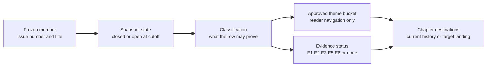
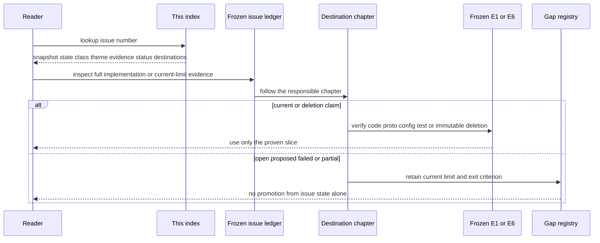

# Issue 演进索引：280 个冻结成员，一个都不靠状态猜实现

> 版本与结论：本章是 `mixed` 无损索引，成员固定为 154 个 closed + 126 个 open。每行保留 snapshot state、issue/title、classification、八桶主题、implementation evidence status 与章节 destinations；完整 evidence 文本仍由唯一 [Issue 演进账本](../migration/2026-07-25-issue-evidence-ledger.md) 持有。Closed 不自动等于 landed，open 也不自动等于“没有任何基础设施”。

## 设计抽象与事实源

- 本仓库 [Issue 演进账本](../migration/2026-07-25-issue-evidence-ledger.md) §3–5 与 `docs/canon/overview.md:16-45`：280 个冻结成员、分类/evidence/destination，以及 current landing 应回到的主链边界。
- `docs/adr/0037-scheduled-invocation-credential-source-model.md:1-60`：closed `design-only` 的代表，说明 accepted 决策不能冒充完整代码 landing。
- `docs/canon/scheduled-skill-runners.md:9-32`：删除/替代型 landing 的代表，说明“实现完成”也可能表现为旧 runtime 消失。

## 先建立模型：state、classification、theme 与 destination 各管一件事



Snapshot state 只回答 cutoff 时 GitHub 如何标记该成员；classification 限制句子类型；theme 只负责读者导航；destination 指向负责解释 current、history 或 target 的章节。把四者压成一个“已完成/未完成”布尔值，会同时丢失 abandoned、design-only、ops-verified、superseded 与 partial drift。

## 覆盖矩阵

| 主题 | Closed | Open | 主要阅读落点 |
|---|---:|---:|---|
| Actor / CQRS | 6 | 12 | [02](../02/01-agent-actor-runtime.md)、[05](../05/01-command-event-projection-readmodel.md) |
| Workflow | 13 | 16 | [03](../03/01-workflow-model-and-identities.md)、[04](../04/03-tool-loop-catalog-and-presentation.md) |
| Identity / resources | 23 | 27 | [06](../06/01-scope-team-member-resource-model.md) |
| Channel | 17 | 12 | [08](../08/01-ingress-normalization-and-routing.md) |
| NyxIdChat / profile | 20 | 10 | [07](../07/01-conversation-turn-and-chat-history.md) |
| Automation | 36 | 13 | [09](../09/01-automation-resource-api-and-readmodels.md) |
| Security / production | 23 | 21 | [10](../10/01-production-topology-and-configuration.md) |
| Coverage noise | 16 | 15 | 本章明细；不主导架构叙事 |
| **合计** | **154** | **126** | **280 个唯一成员** |

## Evidence status 怎么读

| Evidence status | 合法解释 |
|---|---|
| `E1 reviewed` | frozen code/proto/config/test 支撑该 closed row 的 current slice；仍需读 destination 中的设计边界 |
| `E6 superseded landing` | 某历史实现曾落地，冻结基线已由别的 owner 替代 |
| `E2 design only` | 交付物是 ADR / 设计决定，不是完整实现 |
| `E3 versioned operation` | 只证明绑定版本/环境的生产观察 |
| `replacement pointer` | 本行由另一权威 issue 取代 |
| `no current E1` | closed 但失败、放弃或未进入冻结基线 |
| `no implementation claim` | 行政/看板动作，不支持产品论断 |
| `E5 ...` | open row 的 bug/debt/gap/proposal/ops/tracking 证据；只允许写 current limit 或 target |

## Closed 明细（154）

<details>
<summary>展开 154 个 frozen-closed 成员</summary>

| State | Issue | Title | Classification | Theme | Evidence status | Destinations |
|---|---|---|---|---|---|---|
| `closed` | [#1948](https://github.com/aevatarAI/aevatar/issues/1948) | Fix local demo service serving activation | `landed-current` | Workflow | E1 reviewed | [01/01-quick-start.md](../01/01-quick-start.md), [06/02-draft-revision-binding-and-published-service.md](../06/02-draft-revision-binding-and-published-service.md) |
| `closed` | [#1969](https://github.com/aevatarAI/aevatar/issues/1969) | Support physical deletion of Studio members | `landed-current` | Identity / resources | E1 reviewed | [06/01-scope-team-member-resource-model.md](../06/01-scope-team-member-resource-model.md), [06/04-studio-commands-acks-and-readmodels.md](../06/04-studio-commands-acks-and-readmodels.md) |
| `closed` | [#2006](https://github.com/aevatarAI/aevatar/issues/2006) | Fix scoped workflow first-edit draft identity merge | `landed-current` | Identity / resources | E1 reviewed | [06/02-draft-revision-binding-and-published-service.md](../06/02-draft-revision-binding-and-published-service.md), [12/02-issue-decisions-by-theme.md](../12/02-issue-decisions-by-theme.md) |
| `closed` | [#2082](https://github.com/aevatarAI/aevatar/issues/2082) | feat(frontend): Platform 导航 P0 任务化入口与概览 | `failed/abandoned` | Security / production | no current E1 | [12/02-issue-decisions-by-theme.md](../12/02-issue-decisions-by-theme.md), [12/05-open-gaps-and-canon-drift.md](../12/05-open-gaps-and-canon-drift.md) |
| `closed` | [#2091](https://github.com/aevatarAI/aevatar/issues/2091) | feat(frontend): Platform Overview 智能下一步入口 | `failed/abandoned` | Security / production | no current E1 | [12/05-open-gaps-and-canon-drift.md](../12/05-open-gaps-and-canon-drift.md) |
| `closed` | [#2103](https://github.com/aevatarAI/aevatar/issues/2103) | feat(studio/workflow-debug): show manual and scheduled member workflow run history | `landed-current` | Identity / resources | E1 reviewed | [06/04-studio-commands-acks-and-readmodels.md](../06/04-studio-commands-acks-and-readmodels.md), [05/05-workflow-agui-and-live-observation.md](../05/05-workflow-agui-and-live-observation.md), [12/02-issue-decisions-by-theme.md](../12/02-issue-decisions-by-theme.md) |
| `closed` | [#2244](https://github.com/aevatarAI/aevatar/issues/2244) | Clarify Studio member bind async ACK and observable admission result | `landed-current` | Identity / resources | E1 reviewed | [06/04-studio-commands-acks-and-readmodels.md](../06/04-studio-commands-acks-and-readmodels.md), [12/02-issue-decisions-by-theme.md](../12/02-issue-decisions-by-theme.md) |
| `closed` | [#2303](https://github.com/aevatarAI/aevatar/issues/2303) | Align Console NyxID login client with backend finalization | `landed-current` | Security / production | E1 reviewed | [10/05-authentication-scope-and-admin-authorization.md](../10/05-authentication-scope-and-admin-authorization.md), [12/02-issue-decisions-by-theme.md](../12/02-issue-decisions-by-theme.md) |
| `closed` | [#2315](https://github.com/aevatarAI/aevatar/issues/2315) | Treat Ornn workflow YAML as templates with explicit mount/import into scope workflows | `landed-current` | Workflow | E1 reviewed | [03/01-workflow-model-and-identities.md](../03/01-workflow-model-and-identities.md), [12/02-issue-decisions-by-theme.md](../12/02-issue-decisions-by-theme.md) |
| `closed` | [#2350](https://github.com/aevatarAI/aevatar/issues/2350) | Expose Lark-created scheduled agents in team automations UI | `landed-superseded` | Automation | E6 superseded landing | [12/03-retired-and-superseded-components.md](../12/03-retired-and-superseded-components.md), [09/01-automation-resource-api-and-readmodels.md](../09/01-automation-resource-api-and-readmodels.md) |
| `closed` | [#2355](https://github.com/aevatarAI/aevatar/issues/2355) | Inbound Lark bot relay does not run the bound workflow/skill (routes to generic agent; use_skill tool-call leaks as text; message not passed) | `landed-current` | Channel | E1 reviewed | [08/03-lark-delivery-interaction-and-repair.md](../08/03-lark-delivery-interaction-and-repair.md), [12/04-incident-case-studies.md](../12/04-incident-case-studies.md) |
| `closed` | [#2368](https://github.com/aevatarAI/aevatar/issues/2368) | Update Studio workflow publish flow to use save-and-bind API | `landed-current` | Identity / resources | E1 reviewed | [06/02-draft-revision-binding-and-published-service.md](../06/02-draft-revision-binding-and-published-service.md), [12/02-issue-decisions-by-theme.md](../12/02-issue-decisions-by-theme.md) |
| `closed` | [#2377](https://github.com/aevatarAI/aevatar/issues/2377) | NyxID proxy: all services return HTTP 402 'billing_not_configured (11301): billing wallet is missing' mid-session (worked minutes earlier; how to configure the wallet?) | `failed/abandoned` | Security / production | no current E1 | [12/04-incident-case-studies.md](../12/04-incident-case-studies.md) |
| `closed` | [#2405](https://github.com/aevatarAI/aevatar/issues/2405) | 定时调用凭证：proto 收敛为 oneof + role（契约先行） | `landed-current` | Automation | E1 reviewed | [09/03-owner-authorization-and-agent-key.md](../09/03-owner-authorization-and-agent-key.md), [09/04-vault-reference-and-revocation-compensation.md](../09/04-vault-reference-and-revocation-compensation.md) |
| `closed` | [#2406](https://github.com/aevatarAI/aevatar/issues/2406) | 定时调用凭证：校验下沉 application/domain 并对齐各入口 | `landed-current` | Automation | E1 reviewed | [09/03-owner-authorization-and-agent-key.md](../09/03-owner-authorization-and-agent-key.md), [12/02-issue-decisions-by-theme.md](../12/02-issue-decisions-by-theme.md) |
| `closed` | [#2407](https://github.com/aevatarAI/aevatar/issues/2407) | 定时调用凭证：durable 降级为 reference，关闭通用 API raw token 入口 | `landed-current` | Automation | E1 reviewed | [09/03-owner-authorization-and-agent-key.md](../09/03-owner-authorization-and-agent-key.md), [09/04-vault-reference-and-revocation-compensation.md](../09/04-vault-reference-and-revocation-compensation.md), [12/02-issue-decisions-by-theme.md](../12/02-issue-decisions-by-theme.md) |
| `closed` | [#2408](https://github.com/aevatarAI/aevatar/issues/2408) | 定时调用凭证：fire 注入按 role 收敛，清理双轨与 legacy | `landed-current` | Automation | E1 reviewed | [09/03-owner-authorization-and-agent-key.md](../09/03-owner-authorization-and-agent-key.md), [09/04-vault-reference-and-revocation-compensation.md](../09/04-vault-reference-and-revocation-compensation.md), [12/02-issue-decisions-by-theme.md](../12/02-issue-decisions-by-theme.md) |
| `closed` | [#2409](https://github.com/aevatarAI/aevatar/issues/2409) | 定时调用凭证：required-credential policy 与测试矩阵硬化 | `landed-current` | Automation | E1 reviewed | [09/03-owner-authorization-and-agent-key.md](../09/03-owner-authorization-and-agent-key.md), [09/04-vault-reference-and-revocation-compensation.md](../09/04-vault-reference-and-revocation-compensation.md), [12/02-issue-decisions-by-theme.md](../12/02-issue-decisions-by-theme.md) |
| `closed` | [#2412](https://github.com/aevatarAI/aevatar/issues/2412) | Lark relay: message attachments not passed to skill agent as input_parts; replies truncated to first token | `landed-current` | Channel | E1 reviewed | [08/03-lark-delivery-interaction-and-repair.md](../08/03-lark-delivery-interaction-and-repair.md), [08/04-file-artifacts-and-attachments.md](../08/04-file-artifacts-and-attachments.md) |
| `closed` | [#2451](https://github.com/aevatarAI/aevatar/issues/2451) | Workflow engine: tool_call reports success when its tool result carries an error (non-2xx / {"error":true}) — silent false-success across all workflows | `landed-current` | Workflow | E1 reviewed | [03/03-execution-kernel-and-outcomes.md](../03/03-execution-kernel-and-outcomes.md), [12/04-incident-case-studies.md](../12/04-incident-case-studies.md) |
| `closed` | [#2472](https://github.com/aevatarAI/aevatar/issues/2472) | Backend: Add Mission Wall scope/team latest workflow run feed | `landed-current` | Actor / CQRS | E1 reviewed | [05/05-workflow-agui-and-live-observation.md](../05/05-workflow-agui-and-live-observation.md), [12/02-issue-decisions-by-theme.md](../12/02-issue-decisions-by-theme.md) |
| `closed` | [#2475](https://github.com/aevatarAI/aevatar/issues/2475) | Backend: Add Mission Wall top status summary contract | `failed/abandoned` | Security / production | no current E1 | [12/05-open-gaps-and-canon-drift.md](../12/05-open-gaps-and-canon-drift.md) |
| `closed` | [#2500](https://github.com/aevatarAI/aevatar/issues/2500) | Fix 404 return action SPA navigation | `landed-current` | Identity / resources | E1 reviewed | [12/02-issue-decisions-by-theme.md](../12/02-issue-decisions-by-theme.md) |
| `closed` | [#2573](https://github.com/aevatarAI/aevatar/issues/2573) | Implement Chat MVP session creation and local history | `landed-current` | NyxIdChat / profile | E1 reviewed | [07/01-conversation-turn-and-chat-history.md](../07/01-conversation-turn-and-chat-history.md), [12/02-issue-decisions-by-theme.md](../12/02-issue-decisions-by-theme.md) |
| `closed` | [#2589](https://github.com/aevatarAI/aevatar/issues/2589) | Design unified audit log for sensitive operations | `landed-current` | Actor / CQRS | E1 reviewed | [05/06-audit-trail-lifecycle-and-export.md](../05/06-audit-trail-lifecycle-and-export.md), [12/02-issue-decisions-by-theme.md](../12/02-issue-decisions-by-theme.md) |
| `closed` | [#2609](https://github.com/aevatarAI/aevatar/issues/2609) | Unify channel relay abstraction for AI-facing message I/O | `landed-current` | Channel | E1 reviewed | [08/02-channel-runtime-and-credential-boundary.md](../08/02-channel-runtime-and-credential-boundary.md), [12/02-issue-decisions-by-theme.md](../12/02-issue-decisions-by-theme.md) |
| `closed` | [#2611](https://github.com/aevatarAI/aevatar/issues/2611) | Backend console: split the 313KB single-file /admin asset, unify console page organization, inject host facts | `landed-current` | Security / production | E1 reviewed | [10/07-observability-status-and-observatory.md](../10/07-observability-status-and-observatory.md), [12/02-issue-decisions-by-theme.md](../12/02-issue-decisions-by-theme.md) |
| `closed` | [#2612](https://github.com/aevatarAI/aevatar/issues/2612) | Admin authorization: config-backed aevatar admin allowlist as the single source of truth | `landed-current` | Security / production | E1 reviewed | [10/05-authentication-scope-and-admin-authorization.md](../10/05-authentication-scope-and-admin-authorization.md), [12/02-issue-decisions-by-theme.md](../12/02-issue-decisions-by-theme.md) |
| `closed` | [#2617](https://github.com/aevatarAI/aevatar/issues/2617) | Refactor Nyx relay notification delivery to channel sender plugins | `landed-current` | Channel | E1 reviewed | [08/02-channel-runtime-and-credential-boundary.md](../08/02-channel-runtime-and-credential-boundary.md), [08/03-lark-delivery-interaction-and-repair.md](../08/03-lark-delivery-interaction-and-repair.md) |
| `closed` | [#2620](https://github.com/aevatarAI/aevatar/issues/2620) | code_execute returns HTTP 500 internal_error (1006) for every call after service recovery; same-run nyxid_proxy calls all succeed | `failed/abandoned` | Security / production | no current E1 | [12/04-incident-case-studies.md](../12/04-incident-case-studies.md) |
| `closed` | [#2627](https://github.com/aevatarAI/aevatar/issues/2627) | Keep channel native delivery target free of platform-specific fields | `landed-current` | Channel | E1 reviewed | [08/02-channel-runtime-and-credential-boundary.md](../08/02-channel-runtime-and-credential-boundary.md), [12/02-issue-decisions-by-theme.md](../12/02-issue-decisions-by-theme.md) |
| `closed` | [#2629](https://github.com/aevatarAI/aevatar/issues/2629) | Fork of #2500: Fix 404 return action SPA navigation | `administrative` | Coverage noise | no implementation claim | — |
| `closed` | [#2630](https://github.com/aevatarAI/aevatar/issues/2630) | Redirect missing Team member published-runs routes home | `landed-current` | Identity / resources | E1 reviewed | [12/02-issue-decisions-by-theme.md](../12/02-issue-decisions-by-theme.md) |
| `closed` | [#2632](https://github.com/aevatarAI/aevatar/issues/2632) | Refactor Lark outbound delivery behind platform boundary | `failed/abandoned` | Channel | no current E1 | [08/03-lark-delivery-interaction-and-repair.md](../08/03-lark-delivery-interaction-and-repair.md), [12/05-open-gaps-and-canon-drift.md](../12/05-open-gaps-and-canon-drift.md) |
| `closed` | [#2633](https://github.com/aevatarAI/aevatar/issues/2633) | Fork of #2580: Harden channel-relay credential trust boundary (aevatar-side): strip persisted per-step credentials + gate human-only NyxID tools in relay turns | `administrative` | Coverage noise | no implementation claim | — |
| `closed` | [#2638](https://github.com/aevatarAI/aevatar/issues/2638) | Mission Wall: 新增 workflow 首次执行出现在左侧列表后，右侧拓扑图未自动展示 | `landed-current` | Actor / CQRS | E1 reviewed | [05/05-workflow-agui-and-live-observation.md](../05/05-workflow-agui-and-live-observation.md), [12/02-issue-decisions-by-theme.md](../12/02-issue-decisions-by-theme.md) |
| `closed` | [#2645](https://github.com/aevatarAI/aevatar/issues/2645) | FKST fix loop cannot parse review-result dedup with review loop suffix | `failed/abandoned` | Security / production | no current E1 | [12/02-issue-decisions-by-theme.md](../12/02-issue-decisions-by-theme.md) |
| `closed` | [#2646](https://github.com/aevatarAI/aevatar/issues/2646) | Add Team Overview run actions and recent execution history | `landed-current` | Identity / resources | E1 reviewed | [12/02-issue-decisions-by-theme.md](../12/02-issue-decisions-by-theme.md) |
| `closed` | [#2653](https://github.com/aevatarAI/aevatar/issues/2653) | 让 Lark workflow 附件下载使用入站 channel bot 的 provider slug | `landed-current` | Channel | E1 reviewed | [08/03-lark-delivery-interaction-and-repair.md](../08/03-lark-delivery-interaction-and-repair.md), [12/02-issue-decisions-by-theme.md](../12/02-issue-decisions-by-theme.md) |
| `closed` | [#2663](https://github.com/aevatarAI/aevatar/issues/2663) | Trim explanatory copy from Team overview | `failed/abandoned` | Identity / resources | no current E1 | [12/02-issue-decisions-by-theme.md](../12/02-issue-decisions-by-theme.md) |
| `closed` | [#2666](https://github.com/aevatarAI/aevatar/issues/2666) | Allow Team Test entry selection before prompt entry | `landed-current` | Identity / resources | E1 reviewed | [12/02-issue-decisions-by-theme.md](../12/02-issue-decisions-by-theme.md) |
| `closed` | [#2667](https://github.com/aevatarAI/aevatar/issues/2667) | Fix long-running workflow NyxID token refresh | `landed-current` | Automation | E1 reviewed | [09/03-owner-authorization-and-agent-key.md](../09/03-owner-authorization-and-agent-key.md), [03/07-connectors-and-capability-admission.md](../03/07-connectors-and-capability-admission.md), [12/02-issue-decisions-by-theme.md](../12/02-issue-decisions-by-theme.md) |
| `closed` | [#2670](https://github.com/aevatarAI/aevatar/issues/2670) | Prevent repeated NyxID DCR from redirect URI drift | `landed-current` | Security / production | E1 reviewed | [10/05-authentication-scope-and-admin-authorization.md](../10/05-authentication-scope-and-admin-authorization.md), [12/04-incident-case-studies.md](../12/04-incident-case-studies.md) |
| `closed` | [#2673](https://github.com/aevatarAI/aevatar/issues/2673) | AgentRun 将图片 base64 持久化到 durable state，导致 projection 消息可能超过 Kafka 大小限制 | `landed-current` | Channel | E1 reviewed | [08/04-file-artifacts-and-attachments.md](../08/04-file-artifacts-and-attachments.md), [12/04-incident-case-studies.md](../12/04-incident-case-studies.md) |
| `closed` | [#2675](https://github.com/aevatarAI/aevatar/issues/2675) | Lark skill-triggered workflow defaults to wait=stream and fails on missing durable reply credential | `landed-current` | Channel | E1 reviewed | [08/03-lark-delivery-interaction-and-repair.md](../08/03-lark-delivery-interaction-and-repair.md), [12/02-issue-decisions-by-theme.md](../12/02-issue-decisions-by-theme.md) |
| `closed` | [#2676](https://github.com/aevatarAI/aevatar/issues/2676) | Frontend: 定时任务创建前显式授权 dedicated Agent Key（Milestone 33 follow-up） | `landed-superseded` | Automation | E6 superseded landing | [09/03-owner-authorization-and-agent-key.md](../09/03-owner-authorization-and-agent-key.md), [12/03-retired-and-superseded-components.md](../12/03-retired-and-superseded-components.md) |
| `closed` | [#2678](https://github.com/aevatarAI/aevatar/issues/2678) | Studio workflow generator emits YAML rejected by platform parser | `landed-current` | Workflow | E1 reviewed | [03/02-yaml-schema-and-validation.md](../03/02-yaml-schema-and-validation.md), [12/04-incident-case-studies.md](../12/04-incident-case-studies.md) |
| `closed` | [#2682](https://github.com/aevatarAI/aevatar/issues/2682) | fkst-dev board | `administrative` | Coverage noise | no implementation claim | — |
| `closed` | [#2683](https://github.com/aevatarAI/aevatar/issues/2683) | Decouple SkillRunner outbound delivery from Lark transport | `landed-superseded` | Automation | E6 superseded landing | [12/03-retired-and-superseded-components.md](../12/03-retired-and-superseded-components.md), [09/02-scheduled-actor-callback-and-fire.md](../09/02-scheduled-actor-callback-and-fire.md) |
| `closed` | [#2684](https://github.com/aevatarAI/aevatar/issues/2684) | Replace Lark-specific delivery target fields with generic channel address model | `landed-current` | Channel | E1 reviewed | [08/02-channel-runtime-and-credential-boundary.md](../08/02-channel-runtime-and-credential-boundary.md), [12/02-issue-decisions-by-theme.md](../12/02-issue-decisions-by-theme.md) |
| `closed` | [#2685](https://github.com/aevatarAI/aevatar/issues/2685) | Move Lark routed target details out of generic channel target resolver | `landed-current` | Channel | E1 reviewed | [08/02-channel-runtime-and-credential-boundary.md](../08/02-channel-runtime-and-credential-boundary.md), [12/02-issue-decisions-by-theme.md](../12/02-issue-decisions-by-theme.md) |
| `closed` | [#2686](https://github.com/aevatarAI/aevatar/issues/2686) | Generalize channel registration tool beyond register_lark_via_nyx | `landed-current` | Channel | E1 reviewed | [08/02-channel-runtime-and-credential-boundary.md](../08/02-channel-runtime-and-credential-boundary.md), [12/02-issue-decisions-by-theme.md](../12/02-issue-decisions-by-theme.md) |
| `closed` | [#2688](https://github.com/aevatarAI/aevatar/issues/2688) | 定时调用凭证：修订 ADR-0037——durable 语义更正为 vault 引用（硬前置） | `design-only` | Automation | E2 design only | [09/03-owner-authorization-and-agent-key.md](../09/03-owner-authorization-and-agent-key.md), [09/04-vault-reference-and-revocation-compensation.md](../09/04-vault-reference-and-revocation-compensation.md), [12/02-issue-decisions-by-theme.md](../12/02-issue-decisions-by-theme.md) |
| `closed` | [#2689](https://github.com/aevatarAI/aevatar/issues/2689) | 定时调用凭证：vault 撤销/轮换基建（Garnet CAS Revoke + NyxID 撤销 outbox） | `landed-current` | Automation | E1 reviewed | [09/04-vault-reference-and-revocation-compensation.md](../09/04-vault-reference-and-revocation-compensation.md), [10/03-garnet-clustering-and-secret-storage.md](../10/03-garnet-clustering-and-secret-storage.md), [12/02-issue-decisions-by-theme.md](../12/02-issue-decisions-by-theme.md) |
| `closed` | [#2690](https://github.com/aevatarAI/aevatar/issues/2690) | 定时调用凭证：agent key provisioning 与 issuer 最小权限收紧 + gagent 类 fire 注入 | `landed-current` | Automation | E1 reviewed | [09/03-owner-authorization-and-agent-key.md](../09/03-owner-authorization-and-agent-key.md), [09/04-vault-reference-and-revocation-compensation.md](../09/04-vault-reference-and-revocation-compensation.md) |
| `closed` | [#2691](https://github.com/aevatarAI/aevatar/issues/2691) | 定时调用凭证：workflow handle 传递与逐步 vault 解析 + 泄漏守卫（>5min 主场景） | `landed-current` | Automation | E1 reviewed | [09/03-owner-authorization-and-agent-key.md](../09/03-owner-authorization-and-agent-key.md), [09/04-vault-reference-and-revocation-compensation.md](../09/04-vault-reference-and-revocation-compensation.md) |
| `closed` | [#2692](https://github.com/aevatarAI/aevatar/issues/2692) | 定时调用凭证：secret 基础设施硬化（keyring 强制 fingerprintKey / 工具链 / runbook / canon） | `landed-current` | Automation | E1 reviewed | [09/04-vault-reference-and-revocation-compensation.md](../09/04-vault-reference-and-revocation-compensation.md), [10/03-garnet-clustering-and-secret-storage.md](../10/03-garnet-clustering-and-secret-storage.md), [12/02-issue-decisions-by-theme.md](../12/02-issue-decisions-by-theme.md) |
| `closed` | [#2695](https://github.com/aevatarAI/aevatar/issues/2695) | Fix loading indicators missing animation | `landed-current` | Security / production | E1 reviewed | [12/02-issue-decisions-by-theme.md](../12/02-issue-decisions-by-theme.md) |
| `closed` | [#2703](https://github.com/aevatarAI/aevatar/issues/2703) | Publish gate：修复 LocalSecretProtectionOptions NoKeychain 语义导致的 TEST_CMD 红 | `landed-current` | Security / production | E1 reviewed | [10/03-garnet-clustering-and-secret-storage.md](../10/03-garnet-clustering-and-secret-storage.md), [12/04-incident-case-studies.md](../12/04-incident-case-studies.md) |
| `closed` | [#2723](https://github.com/aevatarAI/aevatar/issues/2723) | fkst-dev board | `administrative` | Coverage noise | no implementation claim | — |
| `closed` | [#2725](https://github.com/aevatarAI/aevatar/issues/2725) | Fix responsive clipping across Team console surfaces | `landed-current` | Identity / resources | E1 reviewed | [12/02-issue-decisions-by-theme.md](../12/02-issue-decisions-by-theme.md), [06/01-scope-team-member-resource-model.md](../06/01-scope-team-member-resource-model.md) |
| `closed` | [#2728](https://github.com/aevatarAI/aevatar/issues/2728) | 定时调用凭证：补齐 agent key 双轨撤销、失败补偿与 allowlist fail-closed | `landed-current` | Automation | E1 reviewed | [09/04-vault-reference-and-revocation-compensation.md](../09/04-vault-reference-and-revocation-compensation.md), [12/02-issue-decisions-by-theme.md](../12/02-issue-decisions-by-theme.md) |
| `closed` | [#2731](https://github.com/aevatarAI/aevatar/issues/2731) | Remove SkillRunner lifecycle surfaces from scheduled automation | `landed-current` | Automation | E1 reviewed | [09/02-scheduled-actor-callback-and-fire.md](../09/02-scheduled-actor-callback-and-fire.md), [12/03-retired-and-superseded-components.md](../12/03-retired-and-superseded-components.md) |
| `closed` | [#2732](https://github.com/aevatarAI/aevatar/issues/2732) | Move external trigger admission off SkillRunnerGAgent | `landed-current` | Automation | E1 reviewed | [09/02-scheduled-actor-callback-and-fire.md](../09/02-scheduled-actor-callback-and-fire.md), [12/03-retired-and-superseded-components.md](../12/03-retired-and-superseded-components.md) |
| `closed` | [#2733](https://github.com/aevatarAI/aevatar/issues/2733) | Delete SkillRunnerGAgent runtime and legacy scheduled runner model | `landed-current` | Automation | E1 reviewed | [12/03-retired-and-superseded-components.md](../12/03-retired-and-superseded-components.md), [09/02-scheduled-actor-callback-and-fire.md](../09/02-scheduled-actor-callback-and-fire.md) |
| `closed` | [#2734](https://github.com/aevatarAI/aevatar/issues/2734) | Move GAgent auth flows onto generic identity and credential contracts | `landed-current` | Channel | E1 reviewed | [08/02-channel-runtime-and-credential-boundary.md](../08/02-channel-runtime-and-credential-boundary.md), [09/03-owner-authorization-and-agent-key.md](../09/03-owner-authorization-and-agent-key.md), [12/02-issue-decisions-by-theme.md](../12/02-issue-decisions-by-theme.md) |
| `closed` | [#2735](https://github.com/aevatarAI/aevatar/issues/2735) | Remove standalone Lark authoring package | `landed-superseded` | Automation | E6 superseded landing | [12/03-retired-and-superseded-components.md](../12/03-retired-and-superseded-components.md) |
| `closed` | [#2736](https://github.com/aevatarAI/aevatar/issues/2736) | 定时调用凭证：修复 workflow Agent Key 的 DurableCallerCredentialRef 不变量 | `landed-current` | Automation | E1 reviewed | [09/03-owner-authorization-and-agent-key.md](../09/03-owner-authorization-and-agent-key.md), [09/04-vault-reference-and-revocation-compensation.md](../09/04-vault-reference-and-revocation-compensation.md) |
| `closed` | [#2738](https://github.com/aevatarAI/aevatar/issues/2738) | Team Automation：将 scheduled credential lifecycle 扩展到 schedule actor | `landed-current` | Automation | E1 reviewed | [09/03-owner-authorization-and-agent-key.md](../09/03-owner-authorization-and-agent-key.md), [09/04-vault-reference-and-revocation-compensation.md](../09/04-vault-reference-and-revocation-compensation.md), [12/02-issue-decisions-by-theme.md](../12/02-issue-decisions-by-theme.md) |
| `closed` | [#2739](https://github.com/aevatarAI/aevatar/issues/2739) | Team Automation：提供 canonical command API 与 credential health current-state read model | `landed-current` | Automation | E1 reviewed | [09/01-automation-resource-api-and-readmodels.md](../09/01-automation-resource-api-and-readmodels.md), [09/03-owner-authorization-and-agent-key.md](../09/03-owner-authorization-and-agent-key.md) |
| `closed` | [#2742](https://github.com/aevatarAI/aevatar/issues/2742) | Frontend: Team Automations AgentKey consent UI 与 mock contract（可先做） | `landed-superseded` | Automation | E6 superseded landing | [12/03-retired-and-superseded-components.md](../12/03-retired-and-superseded-components.md), [09/03-owner-authorization-and-agent-key.md](../09/03-owner-authorization-and-agent-key.md) |
| `closed` | [#2743](https://github.com/aevatarAI/aevatar/issues/2743) | Frontend: Team Automations scoped AgentKey API 接入（blocked on backend contract） | `failed/abandoned` | Automation | no current E1 | [09/01-automation-resource-api-and-readmodels.md](../09/01-automation-resource-api-and-readmodels.md), [12/05-open-gaps-and-canon-drift.md](../12/05-open-gaps-and-canon-drift.md) |
| `closed` | [#2745](https://github.com/aevatarAI/aevatar/issues/2745) | Escalate blocked output obligation: state-output-obligation-timeout for #2732 | `administrative` | Coverage noise | no implementation claim | — |
| `closed` | [#2747](https://github.com/aevatarAI/aevatar/issues/2747) | [Studio] Add transactional YAML editing to the Team member workflow editor | `landed-current` | Identity / resources | E1 reviewed | [12/02-issue-decisions-by-theme.md](../12/02-issue-decisions-by-theme.md) |
| `closed` | [#2753](https://github.com/aevatarAI/aevatar/issues/2753) | [fkst-stability] 持续失败: identity.login.finalize (fp:7f51706b) | `administrative` | Coverage noise | no implementation claim | — |
| `closed` | [#2755](https://github.com/aevatarAI/aevatar/issues/2755) | Fork of #2447: [channel][lark] No working path to run a workflow on an uploaded file: /workflow run needs the file on the command message (Lark sends files separately); skill/aevatar_invoke_team path drops attachments | `administrative` | Coverage noise | no implementation claim | — |
| `closed` | [#2756](https://github.com/aevatarAI/aevatar/issues/2756) | Fork of #2592: [Epic] Platform audit trail: unified recording of security-relevant operations | `administrative` | Coverage noise | no implementation claim | — |
| `closed` | [#2757](https://github.com/aevatarAI/aevatar/issues/2757) | Fork of #2699: foreach fan-out → aggregate is unusable: downstream code_execute can't read a foreach's aggregated output (+ broker size limit, no code_execute concurrency/~60s cold-start, undocumented output shape) | `administrative` | Coverage noise | no implementation claim | — |
| `closed` | [#2758](https://github.com/aevatarAI/aevatar/issues/2758) | Fork of #2462: [Epic] Layered context architecture for agent system prompts: minimal stable kernel + host-extensible forced overlay | `administrative` | Coverage noise | no implementation claim | — |
| `closed` | [#2759](https://github.com/aevatarAI/aevatar/issues/2759) | Fork of #2738: Team Automation：将 scheduled credential lifecycle 扩展到 schedule actor | `administrative` | Coverage noise | no implementation claim | — |
| `closed` | [#2760](https://github.com/aevatarAI/aevatar/issues/2760) | Fork of #2580: Harden channel-relay credential trust boundary (aevatar-side): strip persisted per-step credentials + gate human-only NyxID tools in relay turns | `administrative` | Coverage noise | no implementation claim | — |
| `closed` | [#2761](https://github.com/aevatarAI/aevatar/issues/2761) | Fork of #2386: [PQL][Aevatar][Workflow] Published workflow member cannot run because no draft steps are linked | `administrative` | Coverage noise | no implementation claim | — |
| `closed` | [#2762](https://github.com/aevatarAI/aevatar/issues/2762) | Fork of #2358: /whatsapp-reply-draft <multi-line message>: only the first line is passed to the workflow (remaining lines dropped) | `administrative` | Coverage noise | no implementation claim | — |
| `closed` | [#2763](https://github.com/aevatarAI/aevatar/issues/2763) | Fork of #2178: 接入外部系统的请求定义：固化交互契约（definition id + 字段映射 + 事件订阅方） | `administrative` | Coverage noise | no implementation claim | — |
| `closed` | [#2766](https://github.com/aevatarAI/aevatar/issues/2766) | Remove Lark-specific semantics from GAgent-facing contracts | `failed/abandoned` | Automation | no current E1 | [12/05-open-gaps-and-canon-drift.md](../12/05-open-gaps-and-canon-drift.md), [12/02-issue-decisions-by-theme.md](../12/02-issue-decisions-by-theme.md) |
| `closed` | [#2769](https://github.com/aevatarAI/aevatar/issues/2769) | Unify workflow YAML root schema ownership between parser and Studio | `landed-current` | Workflow | E1 reviewed | [03/02-yaml-schema-and-validation.md](../03/02-yaml-schema-and-validation.md), [12/02-issue-decisions-by-theme.md](../12/02-issue-decisions-by-theme.md) |
| `closed` | [#2772](https://github.com/aevatarAI/aevatar/issues/2772) | 物化 owner-scoped NyxID 授权事实 | `landed-current` | Automation | E1 reviewed | [09/03-owner-authorization-and-agent-key.md](../09/03-owner-authorization-and-agent-key.md), [12/02-issue-decisions-by-theme.md](../12/02-issue-decisions-by-theme.md) |
| `closed` | [#2773](https://github.com/aevatarAI/aevatar/issues/2773) | 单一 plan、digest 与写侧重验证 | `landed-current` | Automation | E1 reviewed | [09/03-owner-authorization-and-agent-key.md](../09/03-owner-authorization-and-agent-key.md), [12/02-issue-decisions-by-theme.md](../12/02-issue-decisions-by-theme.md) |
| `closed` | [#2774](https://github.com/aevatarAI/aevatar/issues/2774) | 原子迁移 issuer、Studio 与 Team UI | `landed-current` | Automation | E1 reviewed | [09/03-owner-authorization-and-agent-key.md](../09/03-owner-authorization-and-agent-key.md), [09/04-vault-reference-and-revocation-compensation.md](../09/04-vault-reference-and-revocation-compensation.md), [12/02-issue-decisions-by-theme.md](../12/02-issue-decisions-by-theme.md) |
| `closed` | [#2776](https://github.com/aevatarAI/aevatar/issues/2776) | 单一 plan、digest 与写侧重验证 | `landed-current` | Automation | E1 reviewed | [09/03-owner-authorization-and-agent-key.md](../09/03-owner-authorization-and-agent-key.md), [12/02-issue-decisions-by-theme.md](../12/02-issue-decisions-by-theme.md) |
| `closed` | [#2777](https://github.com/aevatarAI/aevatar/issues/2777) | 原子迁移 issuer、Studio 与 Team UI | `landed-current` | Automation | E1 reviewed | [09/03-owner-authorization-and-agent-key.md](../09/03-owner-authorization-and-agent-key.md), [09/04-vault-reference-and-revocation-compensation.md](../09/04-vault-reference-and-revocation-compensation.md), [06/04-studio-commands-acks-and-readmodels.md](../06/04-studio-commands-acks-and-readmodels.md) |
| `closed` | [#2778](https://github.com/aevatarAI/aevatar/issues/2778) | Refactor Studio actor-backed ChatHistory to backend terminal append writes | `duplicate/replaced` | NyxIdChat / profile | replacement pointer | [07/01-conversation-turn-and-chat-history.md](../07/01-conversation-turn-and-chat-history.md), [12/03-retired-and-superseded-components.md](../12/03-retired-and-superseded-components.md) |
| `closed` | [#2781](https://github.com/aevatarAI/aevatar/issues/2781) | Add managed_sandbox target and runtime-neutral Codex execution port | `landed-current` | Security / production | E1 reviewed | [10/06-managed-codex-sandbox-and-delegation.md](../10/06-managed-codex-sandbox-and-delegation.md), [12/02-issue-decisions-by-theme.md](../12/02-issue-decisions-by-theme.md) |
| `closed` | [#2783](https://github.com/aevatarAI/aevatar/issues/2783) | Publish managed-sandbox codex_exec readiness workflow and setup skill | `ops-verified` | Security / production | E3 versioned operation | [10/06-managed-codex-sandbox-and-delegation.md](../10/06-managed-codex-sandbox-and-delegation.md), [12/02-issue-decisions-by-theme.md](../12/02-issue-decisions-by-theme.md) |
| `closed` | [#2787](https://github.com/aevatarAI/aevatar/issues/2787) | Add explicit audit lifecycle, terminal outcomes, and CloudEvents-compatible export semantics | `landed-current` | Actor / CQRS | E1 reviewed | [05/06-audit-trail-lifecycle-and-export.md](../05/06-audit-trail-lifecycle-and-export.md) |
| `closed` | [#2789](https://github.com/aevatarAI/aevatar/issues/2789) | Add a first-class WorkOrder resource for authorized Team execution | `landed-current` | Identity / resources | E1 reviewed | [06/05-work-orders-and-durable-intent.md](../06/05-work-orders-and-durable-intent.md), [12/02-issue-decisions-by-theme.md](../12/02-issue-decisions-by-theme.md) |
| `closed` | [#2791](https://github.com/aevatarAI/aevatar/issues/2791) | Add a registered extension model for Team detail tabs | `failed/abandoned` | Identity / resources | no current E1 | [12/02-issue-decisions-by-theme.md](../12/02-issue-decisions-by-theme.md), [12/05-open-gaps-and-canon-drift.md](../12/05-open-gaps-and-canon-drift.md) |
| `closed` | [#2792](https://github.com/aevatarAI/aevatar/issues/2792) | Refactor Studio actor-backed ChatHistory to backend terminal append writes (clean reissue) | `landed-current` | NyxIdChat / profile | E1 reviewed | [07/01-conversation-turn-and-chat-history.md](../07/01-conversation-turn-and-chat-history.md), [12/02-issue-decisions-by-theme.md](../12/02-issue-decisions-by-theme.md) |
| `closed` | [#2797](https://github.com/aevatarAI/aevatar/issues/2797) | Remove workflow debug shortcuts from team cards | `landed-current` | Identity / resources | E1 reviewed | [12/02-issue-decisions-by-theme.md](../12/02-issue-decisions-by-theme.md) |
| `closed` | [#2804](https://github.com/aevatarAI/aevatar/issues/2804) | feat(nyxid-chat): add a server-owned agent profile and deterministic Ornn skill routing | `landed-current` | NyxIdChat / profile | E1 reviewed | [07/03-agent-profile-and-immutable-binding.md](../07/03-agent-profile-and-immutable-binding.md), [12/02-issue-decisions-by-theme.md](../12/02-issue-decisions-by-theme.md) |
| `closed` | [#2806](https://github.com/aevatarAI/aevatar/issues/2806) | Frontend: add NyxID service access review flow on dev | `landed-current` | Security / production | E1 reviewed | [10/05-authentication-scope-and-admin-authorization.md](../10/05-authentication-scope-and-admin-authorization.md), [12/02-issue-decisions-by-theme.md](../12/02-issue-decisions-by-theme.md) |
| `closed` | [#2810](https://github.com/aevatarAI/aevatar/issues/2810) | scheduled_agent_creator one-shot outbound slug is not configurable via required_service_slugs | `landed-current` | Automation | E1 reviewed | [09/03-owner-authorization-and-agent-key.md](../09/03-owner-authorization-and-agent-key.md), [08/02-channel-runtime-and-credential-boundary.md](../08/02-channel-runtime-and-credential-boundary.md), [12/02-issue-decisions-by-theme.md](../12/02-issue-decisions-by-theme.md) |
| `closed` | [#2811](https://github.com/aevatarAI/aevatar/issues/2811) | 外部依赖：NyxID 缺少 owner-scoped UserService 节点拓扑读取契约 | `landed-current` | Automation | E1 reviewed | [09/03-owner-authorization-and-agent-key.md](../09/03-owner-authorization-and-agent-key.md), [09/04-vault-reference-and-revocation-compensation.md](../09/04-vault-reference-and-revocation-compensation.md) |
| `closed` | [#2813](https://github.com/aevatarAI/aevatar/issues/2813) | Add immutable exact Ornn references | `landed-current` | NyxIdChat / profile | E1 reviewed | [07/03-agent-profile-and-immutable-binding.md](../07/03-agent-profile-and-immutable-binding.md), [12/02-issue-decisions-by-theme.md](../12/02-issue-decisions-by-theme.md) |
| `closed` | [#2814](https://github.com/aevatarAI/aevatar/issues/2814) | Compose fixed ordered prompt overlays | `landed-current` | Workflow | E1 reviewed | [04/05-prompt-overlays-and-agent-context.md](../04/05-prompt-overlays-and-agent-context.md), [12/02-issue-decisions-by-theme.md](../12/02-issue-decisions-by-theme.md) |
| `closed` | [#2815](https://github.com/aevatarAI/aevatar/issues/2815) | Bind immutable profiles to conversations | `landed-current` | NyxIdChat / profile | E1 reviewed | [07/03-agent-profile-and-immutable-binding.md](../07/03-agent-profile-and-immutable-binding.md), [12/02-issue-decisions-by-theme.md](../12/02-issue-decisions-by-theme.md) |
| `closed` | [#2816](https://github.com/aevatarAI/aevatar/issues/2816) | Enforce deterministic routing and tool policy | `landed-current` | NyxIdChat / profile | E1 reviewed | [07/04-turn-authority-tool-catalog-and-retry.md](../07/04-turn-authority-tool-catalog-and-retry.md), [04/03-tool-loop-catalog-and-presentation.md](../04/03-tool-loop-catalog-and-presentation.md) |
| `closed` | [#2817](https://github.com/aevatarAI/aevatar/issues/2817) | Resume typed authorization handoffs safely | `failed/abandoned` | Security / production | no current E1 | [12/05-open-gaps-and-canon-drift.md](../12/05-open-gaps-and-canon-drift.md) |
| `closed` | [#2818](https://github.com/aevatarAI/aevatar/issues/2818) | Provision and evaluate profile rollout | `landed-current` | NyxIdChat / profile | E1 reviewed | [07/03-agent-profile-and-immutable-binding.md](../07/03-agent-profile-and-immutable-binding.md), [04/05-prompt-overlays-and-agent-context.md](../04/05-prompt-overlays-and-agent-context.md) |
| `closed` | [#2824](https://github.com/aevatarAI/aevatar/issues/2824) | Unify API login and Lark data ownership scope | `landed-current` | Channel | E1 reviewed | [08/02-channel-runtime-and-credential-boundary.md](../08/02-channel-runtime-and-credential-boundary.md), [12/02-issue-decisions-by-theme.md](../12/02-issue-decisions-by-theme.md) |
| `closed` | [#2828](https://github.com/aevatarAI/aevatar/issues/2828) | Add Studio query tools for teams, members, workflows, and schedules | `landed-current` | Identity / resources | E1 reviewed | [06/04-studio-commands-acks-and-readmodels.md](../06/04-studio-commands-acks-and-readmodels.md), [12/02-issue-decisions-by-theme.md](../12/02-issue-decisions-by-theme.md) |
| `closed` | [#2829](https://github.com/aevatarAI/aevatar/issues/2829) | 修复 Garnet SecretStore CAS 集成测试的稳定失败 | `landed-current` | Security / production | E1 reviewed | [10/03-garnet-clustering-and-secret-storage.md](../10/03-garnet-clustering-and-secret-storage.md), [12/04-incident-case-studies.md](../12/04-incident-case-studies.md) |
| `closed` | [#2834](https://github.com/aevatarAI/aevatar/issues/2834) | 重构 `POST /api/chat` Conversation 契约：由后端拥有 `conversationId` 和 `turnId` | `landed-current` | NyxIdChat / profile | E1 reviewed | [01/03-chat-conversation-turn-contract.md](../01/03-chat-conversation-turn-contract.md), [01/04-request-streaming-lifecycle.md](../01/04-request-streaming-lifecycle.md) |
| `closed` | [#2839](https://github.com/aevatarAI/aevatar/issues/2839) | Close the Team-scoped connector authoring-to-runtime resolution loop | `failed/abandoned` | Workflow | no current E1 | [03/07-connectors-and-capability-admission.md](../03/07-connectors-and-capability-admission.md), [12/05-open-gaps-and-canon-drift.md](../12/05-open-gaps-and-canon-drift.md) |
| `closed` | [#2841](https://github.com/aevatarAI/aevatar/issues/2841) | Define the minimal actor-owned authorization handoff and resume contract | `failed/abandoned` | Security / production | no current E1 | [12/05-open-gaps-and-canon-drift.md](../12/05-open-gaps-and-canon-drift.md), [12/02-issue-decisions-by-theme.md](../12/02-issue-decisions-by-theme.md) |
| `closed` | [#2842](https://github.com/aevatarAI/aevatar/issues/2842) | 落地单一 actor-owned profile turn catalog 与执行准入链 | `landed-current` | NyxIdChat / profile | E1 reviewed | [07/04-turn-authority-tool-catalog-and-retry.md](../07/04-turn-authority-tool-catalog-and-retry.md), [07/03-agent-profile-and-immutable-binding.md](../07/03-agent-profile-and-immutable-binding.md) |
| `closed` | [#2843](https://github.com/aevatarAI/aevatar/issues/2843) | 把窄 NyxID service tools 接入 route-owned catalog | `landed-current` | Workflow | E1 reviewed | [04/03-tool-loop-catalog-and-presentation.md](../04/03-tool-loop-catalog-and-presentation.md), [12/02-issue-decisions-by-theme.md](../12/02-issue-decisions-by-theme.md) |
| `closed` | [#2844](https://github.com/aevatarAI/aevatar/issues/2844) | 落地 turn-local profile catalog 与统一执行准入 | `landed-current` | NyxIdChat / profile | E1 reviewed | [07/04-turn-authority-tool-catalog-and-retry.md](../07/04-turn-authority-tool-catalog-and-retry.md), [07/03-agent-profile-and-immutable-binding.md](../07/03-agent-profile-and-immutable-binding.md) |
| `closed` | [#2845](https://github.com/aevatarAI/aevatar/issues/2845) | 把 profile turn authority 作为 actor-owned 单调 retry 事实 | `landed-current` | NyxIdChat / profile | E1 reviewed | [07/04-turn-authority-tool-catalog-and-retry.md](../07/04-turn-authority-tool-catalog-and-retry.md) |
| `closed` | [#2846](https://github.com/aevatarAI/aevatar/issues/2846) | 实施冻结的 turn-local catalog 39-path vertical slice | `landed-current` | NyxIdChat / profile | E1 reviewed | [07/03-agent-profile-and-immutable-binding.md](../07/03-agent-profile-and-immutable-binding.md), [04/05-prompt-overlays-and-agent-context.md](../04/05-prompt-overlays-and-agent-context.md), [12/02-issue-decisions-by-theme.md](../12/02-issue-decisions-by-theme.md) |
| `closed` | [#2848](https://github.com/aevatarAI/aevatar/issues/2848) | Add a first-class HTTP Request workflow primitive with secret-backed authentication | `failed/abandoned` | Workflow | no current E1 | [12/05-open-gaps-and-canon-drift.md](../12/05-open-gaps-and-canon-drift.md), [03/04-primitives-catalog.md](../03/04-primitives-catalog.md) |
| `closed` | [#2850](https://github.com/aevatarAI/aevatar/issues/2850) | Lark tool context does not receive canonical owner_scope_id after PR 2826 | `landed-current` | Channel | E1 reviewed | [08/02-channel-runtime-and-credential-boundary.md](../08/02-channel-runtime-and-credential-boundary.md), [08/03-lark-delivery-interaction-and-repair.md](../08/03-lark-delivery-interaction-and-repair.md) |
| `closed` | [#2851](https://github.com/aevatarAI/aevatar/issues/2851) | 优化 AGENTS.md 中 NyxID 外部仓库检查规则的适用边界 | `landed-current` | Security / production | E1 reviewed | [12/02-issue-decisions-by-theme.md](../12/02-issue-decisions-by-theme.md) |
| `closed` | [#2855](https://github.com/aevatarAI/aevatar/issues/2855) | Frontend: disable Apply to draft after YAML apply | `landed-current` | Identity / resources | E1 reviewed | [12/02-issue-decisions-by-theme.md](../12/02-issue-decisions-by-theme.md) |
| `closed` | [#2856](https://github.com/aevatarAI/aevatar/issues/2856) | Chat 创建 workflow 前应确认所属 Team，禁止生成不可发现的独立 workflow | `landed-current` | Workflow | E1 reviewed | [04/03-tool-loop-catalog-and-presentation.md](../04/03-tool-loop-catalog-and-presentation.md), [12/02-issue-decisions-by-theme.md](../12/02-issue-decisions-by-theme.md) |
| `closed` | [#2861](https://github.com/aevatarAI/aevatar/issues/2861) | [bug][studio/backend] Studio 拒绝 Runtime 已支持的 roles[].allowed_tools | `landed-current` | Workflow | E1 reviewed | [03/02-yaml-schema-and-validation.md](../03/02-yaml-schema-and-validation.md), [06/04-studio-commands-acks-and-readmodels.md](../06/04-studio-commands-acks-and-readmodels.md), [12/02-issue-decisions-by-theme.md](../12/02-issue-decisions-by-theme.md) |
| `closed` | [#2862](https://github.com/aevatarAI/aevatar/issues/2862) | Fix Lark sender scope fallback after NyxID rebinding | `landed-current` | Channel | E1 reviewed | [08/03-lark-delivery-interaction-and-repair.md](../08/03-lark-delivery-interaction-and-repair.md), [12/04-incident-case-studies.md](../12/04-incident-case-studies.md) |
| `closed` | [#2866](https://github.com/aevatarAI/aevatar/issues/2866) | Improve YAML editor opening feedback | `landed-current` | Identity / resources | E1 reviewed | [12/02-issue-decisions-by-theme.md](../12/02-issue-decisions-by-theme.md) |
| `closed` | [#2869](https://github.com/aevatarAI/aevatar/issues/2869) | Fork of #2639: Fix Mission Wall workflow graph disappearing | `administrative` | Coverage noise | no implementation claim | — |
| `closed` | [#2871](https://github.com/aevatarAI/aevatar/issues/2871) | feat(nyxid-chat): freeze actor-owned turn authority | `landed-current` | NyxIdChat / profile | E1 reviewed | [07/04-turn-authority-tool-catalog-and-retry.md](../07/04-turn-authority-tool-catalog-and-retry.md), [07/03-agent-profile-and-immutable-binding.md](../07/03-agent-profile-and-immutable-binding.md) |
| `closed` | [#2872](https://github.com/aevatarAI/aevatar/issues/2872) | feat(nyxid-chat): freeze request-local NyxID service tools | `landed-current` | Workflow | E1 reviewed | [04/03-tool-loop-catalog-and-presentation.md](../04/03-tool-loop-catalog-and-presentation.md), [07/04-turn-authority-tool-catalog-and-retry.md](../07/04-turn-authority-tool-catalog-and-retry.md) |
| `closed` | [#2873](https://github.com/aevatarAI/aevatar/issues/2873) | feat(studio): allow bound member runs to start without input | `landed-current` | Identity / resources | E1 reviewed | [06/04-studio-commands-acks-and-readmodels.md](../06/04-studio-commands-acks-and-readmodels.md), [03/03-execution-kernel-and-outcomes.md](../03/03-execution-kernel-and-outcomes.md), [12/02-issue-decisions-by-theme.md](../12/02-issue-decisions-by-theme.md) |
| `closed` | [#2874](https://github.com/aevatarAI/aevatar/issues/2874) | [backend][chat-history] Harden ownership, pagination, and idempotent create recovery | `landed-current` | NyxIdChat / profile | E1 reviewed | [07/01-conversation-turn-and-chat-history.md](../07/01-conversation-turn-and-chat-history.md), [12/02-issue-decisions-by-theme.md](../12/02-issue-decisions-by-theme.md) |
| `closed` | [#2876](https://github.com/aevatarAI/aevatar/issues/2876) | [backend][chat-history] Harden ownership, pagination, and idempotent create recovery | `landed-current` | NyxIdChat / profile | E1 reviewed | [07/01-conversation-turn-and-chat-history.md](../07/01-conversation-turn-and-chat-history.md), [12/02-issue-decisions-by-theme.md](../12/02-issue-decisions-by-theme.md) |
| `closed` | [#2885](https://github.com/aevatarAI/aevatar/issues/2885) | fix(console): 正确渲染 Chat 消息中的 Markdown 表格 | `landed-current` | Security / production | E1 reviewed | [12/02-issue-decisions-by-theme.md](../12/02-issue-decisions-by-theme.md) |
| `closed` | [#2888](https://github.com/aevatarAI/aevatar/issues/2888) | [backend][chat-history] Harden ownership, pagination, and idempotent create recovery | `landed-current` | NyxIdChat / profile | E1 reviewed | [07/01-conversation-turn-and-chat-history.md](../07/01-conversation-turn-and-chat-history.md), [12/02-issue-decisions-by-theme.md](../12/02-issue-decisions-by-theme.md) |
| `closed` | [#2890](https://github.com/aevatarAI/aevatar/issues/2890) | 支持 Lark Channel 按会话和发送者路由到不同 Studio Member / 已发布 Workflow | `failed/abandoned` | Security / production | no current E1 | [12/05-open-gaps-and-canon-drift.md](../12/05-open-gaps-and-canon-drift.md) |
| `closed` | [#2891](https://github.com/aevatarAI/aevatar/issues/2891) | Chat 创建外部服务 Workflow 时应识别鉴权需求，并引导通过 NyxID Service 与 Tool call 接入 | `landed-current` | NyxIdChat / profile | E1 reviewed | [07/02-nyxid-chat-actor-model-and-progress.md](../07/02-nyxid-chat-actor-model-and-progress.md), [07/04-turn-authority-tool-catalog-and-retry.md](../07/04-turn-authority-tool-catalog-and-retry.md), [12/02-issue-decisions-by-theme.md](../12/02-issue-decisions-by-theme.md) |
| `closed` | [#2892](https://github.com/aevatarAI/aevatar/issues/2892) | Improve Workflow Studio canvas readability and editor polish | `landed-current` | Identity / resources | E1 reviewed | [12/02-issue-decisions-by-theme.md](../12/02-issue-decisions-by-theme.md), [06/04-studio-commands-acks-and-readmodels.md](../06/04-studio-commands-acks-and-readmodels.md) |
| `closed` | [#2893](https://github.com/aevatarAI/aevatar/issues/2893) | Stream committed NyxIdChat progress and type tool-card identity | `landed-current` | NyxIdChat / profile | E1 reviewed | [07/02-nyxid-chat-actor-model-and-progress.md](../07/02-nyxid-chat-actor-model-and-progress.md), [04/03-tool-loop-catalog-and-presentation.md](../04/03-tool-loop-catalog-and-presentation.md) |
| `closed` | [#2895](https://github.com/aevatarAI/aevatar/issues/2895) | [chat][workflow] 引入 typed External Capability Readiness，按 authority owner 选择 Connector/NyxID 并做 bind admission | `landed-current` | Workflow | E1 reviewed | [03/07-connectors-and-capability-admission.md](../03/07-connectors-and-capability-admission.md), [12/02-issue-decisions-by-theme.md](../12/02-issue-decisions-by-theme.md) |
| `closed` | [#2896](https://github.com/aevatarAI/aevatar/issues/2896) | [P0] Provision vault-backed per-user NyxID agent keys for internal managed codex_exec | `landed-current` | Security / production | E1 reviewed | [10/06-managed-codex-sandbox-and-delegation.md](../10/06-managed-codex-sandbox-and-delegation.md), [09/04-vault-reference-and-revocation-compensation.md](../09/04-vault-reference-and-revocation-compensation.md) |
| `closed` | [#2897](https://github.com/aevatarAI/aevatar/issues/2897) | [P0] Run codex-runner through chrono-sandbox with NyxID-injected delegation | `landed-current` | Security / production | E1 reviewed | [10/06-managed-codex-sandbox-and-delegation.md](../10/06-managed-codex-sandbox-and-delegation.md) |
| `closed` | [#2900](https://github.com/aevatarAI/aevatar/issues/2900) | Fix scheduled workflow NyxID catalog refresh for agent-key provisioning | `landed-current` | Automation | E1 reviewed | [09/03-owner-authorization-and-agent-key.md](../09/03-owner-authorization-and-agent-key.md), [09/01-automation-resource-api-and-readmodels.md](../09/01-automation-resource-api-and-readmodels.md), [12/02-issue-decisions-by-theme.md](../12/02-issue-decisions-by-theme.md) |
| `closed` | [#2907](https://github.com/aevatarAI/aevatar/issues/2907) | Resolve owner LLM exact service identity from binding for schedules | `landed-current` | Automation | E1 reviewed | [09/03-owner-authorization-and-agent-key.md](../09/03-owner-authorization-and-agent-key.md), [09/04-vault-reference-and-revocation-compensation.md](../09/04-vault-reference-and-revocation-compensation.md) |
| `closed` | [#2909](https://github.com/aevatarAI/aevatar/issues/2909) | Unify workflow schedule authorization through Studio member path | `landed-current` | Automation | E1 reviewed | [09/03-owner-authorization-and-agent-key.md](../09/03-owner-authorization-and-agent-key.md), [12/02-issue-decisions-by-theme.md](../12/02-issue-decisions-by-theme.md) |
| `closed` | [#2913](https://github.com/aevatarAI/aevatar/issues/2913) | [Security][Chat] Scope 内可枚举全局 workflow，疑似越权可见 | `landed-current` | Identity / resources | E1 reviewed | [06/03-catalog-visibility-and-scope-authorization.md](../06/03-catalog-visibility-and-scope-authorization.md), [12/02-issue-decisions-by-theme.md](../12/02-issue-decisions-by-theme.md), [12/04-incident-case-studies.md](../12/04-incident-case-studies.md) |
| `closed` | [#2915](https://github.com/aevatarAI/aevatar/issues/2915) | [Backend][Chat] Workflow LLM chunks are not projected to SSE text deltas | `landed-current` | Actor / CQRS | E1 reviewed | [05/05-workflow-agui-and-live-observation.md](../05/05-workflow-agui-and-live-observation.md), [12/02-issue-decisions-by-theme.md](../12/02-issue-decisions-by-theme.md) |
| `closed` | [#2920](https://github.com/aevatarAI/aevatar/issues/2920) | [Backend][Chat History] 续聊只归档消息，未把历史上下文注入 Workflow 执行 | `landed-current` | NyxIdChat / profile | E1 reviewed | [07/01-conversation-turn-and-chat-history.md](../07/01-conversation-turn-and-chat-history.md), [01/03-chat-conversation-turn-contract.md](../01/03-chat-conversation-turn-contract.md) |
| `closed` | [#2925](https://github.com/aevatarAI/aevatar/issues/2925) | fix(workflow): scope-owned workflow definitions leak into the global runnable catalog | `landed-current` | Actor / CQRS | E1 reviewed | [06/03-catalog-visibility-and-scope-authorization.md](../06/03-catalog-visibility-and-scope-authorization.md), [05/04-readmodel-stores-versioning-and-rebuild.md](../05/04-readmodel-stores-versioning-and-rebuild.md), [12/02-issue-decisions-by-theme.md](../12/02-issue-decisions-by-theme.md) |
| `closed` | [#2926](https://github.com/aevatarAI/aevatar/issues/2926) | fix(console): Invoke 跳转 Workflow Studio 后丢失已发布 member 的 workflow draft | `landed-current` | Identity / resources | E1 reviewed | [12/02-issue-decisions-by-theme.md](../12/02-issue-decisions-by-theme.md), [06/02-draft-revision-binding-and-published-service.md](../06/02-draft-revision-binding-and-published-service.md) |
| `closed` | [#2929](https://github.com/aevatarAI/aevatar/issues/2929) | Clarify Workflow Studio header action semantics | `landed-current` | Identity / resources | E1 reviewed | [12/02-issue-decisions-by-theme.md](../12/02-issue-decisions-by-theme.md) |
| `closed` | [#2931](https://github.com/aevatarAI/aevatar/issues/2931) | Decouple Lark-specific relay prompt and channel context | `landed-current` | Channel | E1 reviewed | [08/02-channel-runtime-and-credential-boundary.md](../08/02-channel-runtime-and-credential-boundary.md), [12/02-issue-decisions-by-theme.md](../12/02-issue-decisions-by-theme.md) |
| `closed` | [#2942](https://github.com/aevatarAI/aevatar/issues/2942) | Update console schedule queries to pass scope context | `failed/abandoned` | Automation | no current E1 | [09/01-automation-resource-api-and-readmodels.md](../09/01-automation-resource-api-and-readmodels.md), [12/02-issue-decisions-by-theme.md](../12/02-issue-decisions-by-theme.md) |

</details>

## Open 明细（126）

<details>
<summary>展开 126 个 frozen-open 成员</summary>

| State | Issue | Title | Classification | Theme | Evidence status | Destinations |
|---|---|---|---|---|---|---|
| `open` | [#114](https://github.com/aevatarAI/aevatar/issues/114) | feat: workflow primitives enhancement — learnings from Kestra orchestration model | `proposal/dispute` | Workflow | E5 proposal or dispute | [12/02-issue-decisions-by-theme.md](../12/02-issue-decisions-by-theme.md), [12/05-open-gaps-and-canon-drift.md](../12/05-open-gaps-and-canon-drift.md) |
| `open` | [#192](https://github.com/aevatarAI/aevatar/issues/192) | refactor(ai): migrate all IAgentTool implementations to AgentToolBase<TParams> | `proposal/dispute` | Workflow | E5 proposal or dispute | [12/02-issue-decisions-by-theme.md](../12/02-issue-decisions-by-theme.md) |
| `open` | [#198](https://github.com/aevatarAI/aevatar/issues/198) | [Test] #146《前端产品重构 — AI Teams + Studio》QA 执行 Checklist | `ops-ux-test` | Identity / resources | E5 ops UX or test | [12/05-open-gaps-and-canon-drift.md](../12/05-open-gaps-and-canon-drift.md) |
| `open` | [#199](https://github.com/aevatarAI/aevatar/issues/199) | [Test] #150《A0 测试网稳定 / Testnet Stable》QA CheckList | `ops-ux-test` | Automation | E5 ops UX or test | [12/05-open-gaps-and-canon-drift.md](../12/05-open-gaps-and-canon-drift.md) |
| `open` | [#212](https://github.com/aevatarAI/aevatar/issues/212) | [Risk][Studio] 多层 `overflow: hidden` 与固定高度叠加，页面在小窗口下存在滚动归属和内容可达性风险 | `ops-ux-test` | Identity / resources | E5 ops UX or test | [12/05-open-gaps-and-canon-drift.md](../12/05-open-gaps-and-canon-drift.md) |
| `open` | [#219](https://github.com/aevatarAI/aevatar/issues/219) | [Bug][Studio] Settings 中点击 `Add provider` 后无可见效果，新增 provider 被本地状态重置覆盖 | `ops-ux-test` | Identity / resources | E5 ops UX or test | [12/05-open-gaps-and-canon-drift.md](../12/05-open-gaps-and-canon-drift.md) |
| `open` | [#220](https://github.com/aevatarAI/aevatar/issues/220) | [Bug][Studio] `脚本行为` 页面加载时请求 `/api/scopes/{scopeId}/scripts?includeSource=true` 返回 `400 Bad Request`，工作台无法正常获取 scope scripts | `confirmed-bug` | Identity / resources | E5 confirmed bug | [06/04-studio-commands-acks-and-readmodels.md](../06/04-studio-commands-acks-and-readmodels.md), [12/05-open-gaps-and-canon-drift.md](../12/05-open-gaps-and-canon-drift.md) |
| `open` | [#221](https://github.com/aevatarAI/aevatar/issues/221) | [Bug][Studio] 左侧导航与工作区切换不流畅，页面切换过程中存在阻塞感、目标不清和状态跳转不一致 | `ops-ux-test` | Identity / resources | E5 ops UX or test | [12/05-open-gaps-and-canon-drift.md](../12/05-open-gaps-and-canon-drift.md) |
| `open` | [#222](https://github.com/aevatarAI/aevatar/issues/222) | [Bug][Studio] Settings 中点击 `Add provider` 后无可见效果，新增 provider 被本地状态重置覆盖 | `confirmed-bug` | Identity / resources | E5 confirmed bug | [06/04-studio-commands-acks-and-readmodels.md](../06/04-studio-commands-acks-and-readmodels.md), [12/05-open-gaps-and-canon-drift.md](../12/05-open-gaps-and-canon-drift.md) |
| `open` | [#225](https://github.com/aevatarAI/aevatar/issues/225) | [Bug][Studio] 脚本行为页缺少显式的新建草稿与编辑入口，用户无法从当前页面完整创建并编辑 script draft | `ops-ux-test` | Identity / resources | E5 ops UX or test | [12/05-open-gaps-and-canon-drift.md](../12/05-open-gaps-and-canon-drift.md) |
| `open` | [#227](https://github.com/aevatarAI/aevatar/issues/227) | [Bug][Studio] 测试运行页按钮状态判断不一致：未开始时“停止”可点击但无效果，“重新运行”因提示词为空被提前禁用 | `ops-ux-test` | Identity / resources | E5 ops UX or test | [12/05-open-gaps-and-canon-drift.md](../12/05-open-gaps-and-canon-drift.md) |
| `open` | [#244](https://github.com/aevatarAI/aevatar/issues/244) | [Feature][Bindings] BindingDto 补 invokeUrl/env/rate-limit/streaming 等字段，新增 :rotate | `missing-contract` | Identity / resources | E5 missing contract | [06/02-draft-revision-binding-and-published-service.md](../06/02-draft-revision-binding-and-published-service.md), [12/05-open-gaps-and-canon-drift.md](../12/05-open-gaps-and-canon-drift.md) |
| `open` | [#250](https://github.com/aevatarAI/aevatar/issues/250) | [Test Plan] Aevatar API — v1 API 集成测试覆盖 | `ops-ux-test` | Identity / resources | E5 ops UX or test | [12/05-open-gaps-and-canon-drift.md](../12/05-open-gaps-and-canon-drift.md) |
| `open` | [#251](https://github.com/aevatarAI/aevatar/issues/251) | [Bug] API 设计待确认问题 — 8 项需后端团队答复 | `blocked/duplicate/tracking` | Coverage noise | E5 index-only tracking | [13/04-issue-evolution-index.md](../13/04-issue-evolution-index.md) |
| `open` | [#285](https://github.com/aevatarAI/aevatar/issues/285) | Add descriptor compatibility guard for legacy protobuf aliases | `missing-contract` | Actor / CQRS | E5 missing contract | [02/02-envelope-command-event-query.md](../02/02-envelope-command-event-query.md), [12/05-open-gaps-and-canon-drift.md](../12/05-open-gaps-and-canon-drift.md) |
| `open` | [#286](https://github.com/aevatarAI/aevatar/issues/286) | Detect duplicate legacy TypeUrl aliases in ProtobufContractCompatibility | `missing-contract` | Actor / CQRS | E5 missing contract | [02/02-envelope-command-event-query.md](../02/02-envelope-command-event-query.md), [12/05-open-gaps-and-canon-drift.md](../12/05-open-gaps-and-canon-drift.md) |
| `open` | [#375](https://github.com/aevatarAI/aevatar/issues/375) | [RFC] Aevatar 线上零 secret material — 从 Day One 演化到 capability-broker 边界 | `security-debt` | Security / production | E5 security debt | [10/08-architecture-and-security-guards.md](../10/08-architecture-and-security-guards.md), [12/05-open-gaps-and-canon-drift.md](../12/05-open-gaps-and-canon-drift.md) |
| `open` | [#435](https://github.com/aevatarAI/aevatar/issues/435) | [Blocker] Missing member contract and roster APIs block final Studio de-serviceId cleanup | `missing-contract` | Identity / resources | E5 partial E1 drift candidate | [06/01-scope-team-member-resource-model.md](../06/01-scope-team-member-resource-model.md), [06/04-studio-commands-acks-and-readmodels.md](../06/04-studio-commands-acks-and-readmodels.md), [12/05-open-gaps-and-canon-drift.md](../12/05-open-gaps-and-canon-drift.md) |
| `open` | [#481](https://github.com/aevatarAI/aevatar/issues/481) | [Bug] [Aevatar] 自然语言请求“帮我查最近 24 小时 Lark 里提到我的消息”后无回复、无进度、无错误提示 | `confirmed-bug` | NyxIdChat / profile | E5 confirmed bug | [07/01-conversation-turn-and-chat-history.md](../07/01-conversation-turn-and-chat-history.md), [12/05-open-gaps-and-canon-drift.md](../12/05-open-gaps-and-canon-drift.md) |
| `open` | [#1016](https://github.com/aevatarAI/aevatar/issues/1016) | Studio Team-First Console 支持 Static GAgent 协作 | `missing-contract` | Identity / resources | E5 missing contract | [06/01-scope-team-member-resource-model.md](../06/01-scope-team-member-resource-model.md), [06/04-studio-commands-acks-and-readmodels.md](../06/04-studio-commands-acks-and-readmodels.md), [12/05-open-gaps-and-canon-drift.md](../12/05-open-gaps-and-canon-drift.md) |
| `open` | [#1665](https://github.com/aevatarAI/aevatar/issues/1665) | [refactor-design][visible-supervisor] Studio member lifecycle recovery guidance | `ops-ux-test` | Identity / resources | E5 ops UX or test | [12/05-open-gaps-and-canon-drift.md](../12/05-open-gaps-and-canon-drift.md) |
| `open` | [#1667](https://github.com/aevatarAI/aevatar/issues/1667) | [refactor-design][visible-supervisor] Governance exposure and retired-state affordance clarity | `ops-ux-test` | Identity / resources | E5 ops UX or test | [12/05-open-gaps-and-canon-drift.md](../12/05-open-gaps-and-canon-drift.md) |
| `open` | [#1676](https://github.com/aevatarAI/aevatar/issues/1676) | [refactor-design][visible-supervisor] Deployments release action handoff clarity | `ops-ux-test` | Security / production | E5 ops UX or test | [12/05-open-gaps-and-canon-drift.md](../12/05-open-gaps-and-canon-drift.md) |
| `open` | [#1696](https://github.com/aevatarAI/aevatar/issues/1696) | [refactor-design][visible-supervisor] Services and Scopes runtime affordance clarity | `ops-ux-test` | Identity / resources | E5 ops UX or test | [12/05-open-gaps-and-canon-drift.md](../12/05-open-gaps-and-canon-drift.md) |
| `open` | [#1899](https://github.com/aevatarAI/aevatar/issues/1899) | Clarify draft-run vs member invoke semantics and simplify workflow run contracts | `proposal/dispute` | Identity / resources | E5 proposal or dispute | [12/02-issue-decisions-by-theme.md](../12/02-issue-decisions-by-theme.md) |
| `open` | [#2058](https://github.com/aevatarAI/aevatar/issues/2058) | cleanup(test): 测试套件质量整改——*CoverageTests 按覆盖率组织 / 超大测试文件 / setup 里的 GetAwaiter().GetResult() | `ops-ux-test` | Actor / CQRS | E5 ops UX or test | [12/05-open-gaps-and-canon-drift.md](../12/05-open-gaps-and-canon-drift.md) |
| `open` | [#2080](https://github.com/aevatarAI/aevatar/issues/2080) | Studio member binding run can remain in progress after readiness timeout | `confirmed-bug` | Identity / resources | E5 confirmed bug | [06/02-draft-revision-binding-and-published-service.md](../06/02-draft-revision-binding-and-published-service.md), [12/05-open-gaps-and-canon-drift.md](../12/05-open-gaps-and-canon-drift.md) |
| `open` | [#2104](https://github.com/aevatarAI/aevatar/issues/2104) | feat(studio/connectors): add typed connector operation schemas for app operation forms | `missing-contract` | Workflow | E5 missing contract | [03/04-primitives-catalog.md](../03/04-primitives-catalog.md), [03/07-connectors-and-capability-admission.md](../03/07-connectors-and-capability-admission.md), [12/05-open-gaps-and-canon-drift.md](../12/05-open-gaps-and-canon-drift.md) |
| `open` | [#2105](https://github.com/aevatarAI/aevatar/issues/2105) | feat(studio/workflow-debug): add Step IO panel for selected workflow steps | `missing-contract` | Actor / CQRS | E5 missing contract | [05/05-workflow-agui-and-live-observation.md](../05/05-workflow-agui-and-live-observation.md), [12/05-open-gaps-and-canon-drift.md](../12/05-open-gaps-and-canon-drift.md) |
| `open` | [#2106](https://github.com/aevatarAI/aevatar/issues/2106) | feat(studio/workflow-debug): debug workflow drafts from historical runs | `missing-contract` | Actor / CQRS | E5 missing contract | [05/05-workflow-agui-and-live-observation.md](../05/05-workflow-agui-and-live-observation.md), [12/05-open-gaps-and-canon-drift.md](../12/05-open-gaps-and-canon-drift.md) |
| `open` | [#2107](https://github.com/aevatarAI/aevatar/issues/2107) | feat(studio/workflow-debug): support draft-only pinned step artifacts | `missing-contract` | Identity / resources | E5 missing contract | [06/02-draft-revision-binding-and-published-service.md](../06/02-draft-revision-binding-and-published-service.md), [12/05-open-gaps-and-canon-drift.md](../12/05-open-gaps-and-canon-drift.md) |
| `open` | [#2108](https://github.com/aevatarAI/aevatar/issues/2108) | feat(studio/artifacts): add workflow artifact and file port for uploads and step outputs | `missing-contract` | Workflow | E5 missing contract | [03/03-execution-kernel-and-outcomes.md](../03/03-execution-kernel-and-outcomes.md), [12/05-open-gaps-and-canon-drift.md](../12/05-open-gaps-and-canon-drift.md) |
| `open` | [#2112](https://github.com/aevatarAI/aevatar/issues/2112) | [arch] Remove dead reverse ProjectReferences: Studio.Application → Scripting.{Infrastructure,Hosting} | `proposal/dispute` | Actor / CQRS | E5 proposal or dispute | [12/02-issue-decisions-by-theme.md](../12/02-issue-decisions-by-theme.md) |
| `open` | [#2113](https://github.com/aevatarAI/aevatar/issues/2113) | [arch] Relocate Workflow.Infrastructure AGUI-adapter DI wiring to the composition root (Infra→Presentation reverse edge) | `proposal/dispute` | Actor / CQRS | E5 proposal or dispute | [12/02-issue-decisions-by-theme.md](../12/02-issue-decisions-by-theme.md) |
| `open` | [#2114](https://github.com/aevatarAI/aevatar/issues/2114) | [arch] Architecture hygiene (Brooks 06-15): NyxidChat fan-out, Foundation.Runtime naming taxonomy, zero-fan-in assemblies | `proposal/dispute` | Security / production | E5 proposal or dispute | [12/05-open-gaps-and-canon-drift.md](../12/05-open-gaps-and-canon-drift.md) |
| `open` | [#2167](https://github.com/aevatarAI/aevatar/issues/2167) | feat(schedule): expose execution history and full detail payload | `missing-contract` | Automation | E5 missing contract | [09/01-automation-resource-api-and-readmodels.md](../09/01-automation-resource-api-and-readmodels.md), [09/02-scheduled-actor-callback-and-fire.md](../09/02-scheduled-actor-callback-and-fire.md), [12/05-open-gaps-and-canon-drift.md](../12/05-open-gaps-and-canon-drift.md) |
| `open` | [#2178](https://github.com/aevatarAI/aevatar/issues/2178) | 接入外部系统的请求定义：固化交互契约（definition id + 字段映射 + 事件订阅方） | `blocked/duplicate/tracking` | Coverage noise | E5 index-only tracking | [13/04-issue-evolution-index.md](../13/04-issue-evolution-index.md) |
| `open` | [#2182](https://github.com/aevatarAI/aevatar/issues/2182) | [Epic] 外部门控的资源变更闭环：请求 → 前置校验 → 外部确认 → 幂等提交/回滚 → 回写通知 | `missing-contract` | Workflow | E5 missing contract | [03/05-pause-signal-approval-and-resume.md](../03/05-pause-signal-approval-and-resume.md), [03/06-saga-compensation-and-recovery.md](../03/06-saga-compensation-and-recovery.md), [12/05-open-gaps-and-canon-drift.md](../12/05-open-gaps-and-canon-drift.md) |
| `open` | [#2209](https://github.com/aevatarAI/aevatar/issues/2209) | MassTransit 残留清理:props/guard/ADR-0007 均漂移,无活跃 csproj 消费 | `proposal/dispute` | Security / production | E5 proposal or dispute | [12/05-open-gaps-and-canon-drift.md](../12/05-open-gaps-and-canon-drift.md) |
| `open` | [#2210](https://github.com/aevatarAI/aevatar/issues/2210) | ChatRuntime.DefaultMaxToolRounds = int.MaxValue 是无熔断 fallback(实际默认 40,但 fallback 路径无保护) | `proposal/dispute` | Workflow | E5 proposal or dispute | [12/05-open-gaps-and-canon-drift.md](../12/05-open-gaps-and-canon-drift.md) |
| `open` | [#2224](https://github.com/aevatarAI/aevatar/issues/2224) | Prevent Orleans/Garnet split-brain from production config drift | `confirmed-bug` | Security / production | E5 confirmed bug | [10/02-orleans-runtime.md](../10/02-orleans-runtime.md), [10/03-garnet-clustering-and-secret-storage.md](../10/03-garnet-clustering-and-secret-storage.md), [12/05-open-gaps-and-canon-drift.md](../12/05-open-gaps-and-canon-drift.md) |
| `open` | [#2266](https://github.com/aevatarAI/aevatar/issues/2266) | Support multipart uploads for scope workflow draft-run | `missing-contract` | Identity / resources | E5 missing contract | [06/04-studio-commands-acks-and-readmodels.md](../06/04-studio-commands-acks-and-readmodels.md), [12/05-open-gaps-and-canon-drift.md](../12/05-open-gaps-and-canon-drift.md) |
| `open` | [#2299](https://github.com/aevatarAI/aevatar/issues/2299) | Epic: 已发布服务自动注册为 NyxID downstream（发布即被发现） | `missing-contract` | Identity / resources | E5 missing contract | [06/02-draft-revision-binding-and-published-service.md](../06/02-draft-revision-binding-and-published-service.md), [12/05-open-gaps-and-canon-drift.md](../12/05-open-gaps-and-canon-drift.md) |
| `open` | [#2319](https://github.com/aevatarAI/aevatar/issues/2319) | Zero-config voice: /ws/voice should auto-provision a session/actor (drop per-account chat-route + voice-enable setup) | `missing-contract` | Channel | E5 missing contract | [08/05-voice-control-and-media-planes.md](../08/05-voice-control-and-media-planes.md), [12/05-open-gaps-and-canon-drift.md](../12/05-open-gaps-and-canon-drift.md) |
| `open` | [#2333](https://github.com/aevatarAI/aevatar/issues/2333) | Add low-interaction workflow execution display board | `missing-contract` | Actor / CQRS | E5 missing contract | [05/05-workflow-agui-and-live-observation.md](../05/05-workflow-agui-and-live-observation.md), [12/05-open-gaps-and-canon-drift.md](../12/05-open-gaps-and-canon-drift.md) |
| `open` | [#2357](https://github.com/aevatarAI/aevatar/issues/2357) | Lark bot: after /whatsapp-reply-draft loads the skill and asks for input, providing the message does not run the workflow (agent polishes/rephrases instead) | `confirmed-bug` | Channel | E5 confirmed bug | [08/03-lark-delivery-interaction-and-repair.md](../08/03-lark-delivery-interaction-and-repair.md), [12/05-open-gaps-and-canon-drift.md](../12/05-open-gaps-and-canon-drift.md) |
| `open` | [#2358](https://github.com/aevatarAI/aevatar/issues/2358) | /whatsapp-reply-draft <multi-line message>: only the first line is passed to the workflow (remaining lines dropped) | `confirmed-bug` | Channel | E5 confirmed bug | [08/01-ingress-normalization-and-routing.md](../08/01-ingress-normalization-and-routing.md), [08/03-lark-delivery-interaction-and-repair.md](../08/03-lark-delivery-interaction-and-repair.md), [12/05-open-gaps-and-canon-drift.md](../12/05-open-gaps-and-canon-drift.md) |
| `open` | [#2359](https://github.com/aevatarAI/aevatar/issues/2359) | Relay truncates the reply sent to Lark — workflow output is complete in the observatory but the Lark message is cut off mid-output (3rd draft dropped) | `confirmed-bug` | Channel | E5 confirmed bug | [08/03-lark-delivery-interaction-and-repair.md](../08/03-lark-delivery-interaction-and-repair.md), [12/05-open-gaps-and-canon-drift.md](../12/05-open-gaps-and-canon-drift.md) |
| `open` | [#2369](https://github.com/aevatarAI/aevatar/issues/2369) | Scope-owner schedule: create returns 202 but every fire errors 'NyxID binding does not grant the requested schedule scope' (broker_binding+proxy binding insufficient, no self-serve fix) | `confirmed-bug` | Automation | E5 confirmed bug | [09/03-owner-authorization-and-agent-key.md](../09/03-owner-authorization-and-agent-key.md), [12/05-open-gaps-and-canon-drift.md](../12/05-open-gaps-and-canon-drift.md) |
| `open` | [#2386](https://github.com/aevatarAI/aevatar/issues/2386) | [PQL][Aevatar][Workflow] Published workflow member cannot run because no draft steps are linked | `confirmed-bug` | Identity / resources | E5 confirmed bug | [06/02-draft-revision-binding-and-published-service.md](../06/02-draft-revision-binding-and-published-service.md), [12/05-open-gaps-and-canon-drift.md](../12/05-open-gaps-and-canon-drift.md) |
| `open` | [#2389](https://github.com/aevatarAI/aevatar/issues/2389) | [PQL][Aevatar][Console] Services API returns 403 because service identity claims are missing | `confirmed-bug` | Security / production | E5 confirmed bug | [10/05-authentication-scope-and-admin-authorization.md](../10/05-authentication-scope-and-admin-authorization.md), [06/03-catalog-visibility-and-scope-authorization.md](../06/03-catalog-visibility-and-scope-authorization.md), [12/05-open-gaps-and-canon-drift.md](../12/05-open-gaps-and-canon-drift.md) |
| `open` | [#2404](https://github.com/aevatarAI/aevatar/issues/2404) | 定时调用凭证：收敛为单一权威来源模型（ADR-0037 / disc#2402） | `security-debt` | Security / production | E5 security debt | [10/05-authentication-scope-and-admin-authorization.md](../10/05-authentication-scope-and-admin-authorization.md), [12/05-open-gaps-and-canon-drift.md](../12/05-open-gaps-and-canon-drift.md) |
| `open` | [#2418](https://github.com/aevatarAI/aevatar/issues/2418) | Expose scheduled dispatch prompt in backend schedule summaries | `missing-contract` | Automation | E5 partial E1 drift candidate | [09/01-automation-resource-api-and-readmodels.md](../09/01-automation-resource-api-and-readmodels.md), [12/05-open-gaps-and-canon-drift.md](../12/05-open-gaps-and-canon-drift.md) |
| `open` | [#2424](https://github.com/aevatarAI/aevatar/issues/2424) | 支持外部 learned-routing orchestrator 作为 OpenAI 兼容 provider 接入 | `proposal/dispute` | Workflow | E5 proposal or dispute | [12/02-issue-decisions-by-theme.md](../12/02-issue-decisions-by-theme.md) |
| `open` | [#2425](https://github.com/aevatarAI/aevatar/issues/2425) | fkst-dev board | `blocked/duplicate/tracking` | Coverage noise | E5 index-only tracking | [13/04-issue-evolution-index.md](../13/04-issue-evolution-index.md) |
| `open` | [#2447](https://github.com/aevatarAI/aevatar/issues/2447) | [channel][lark] No working path to run a workflow on an uploaded file: /workflow run needs the file on the command message (Lark sends files separately); skill/aevatar_invoke_team path drops attachments | `missing-contract` | Channel | E5 missing contract | [08/04-file-artifacts-and-attachments.md](../08/04-file-artifacts-and-attachments.md), [12/05-open-gaps-and-canon-drift.md](../12/05-open-gaps-and-canon-drift.md) |
| `open` | [#2450](https://github.com/aevatarAI/aevatar/issues/2450) | Scheduled (scopeOwnerNyxId) fire of a ~7-8min workflow fails mid-run with token_expired (2001); identical direct invoke completes | `confirmed-bug` | Automation | E5 confirmed bug | [09/02-scheduled-actor-callback-and-fire.md](../09/02-scheduled-actor-callback-and-fire.md), [09/03-owner-authorization-and-agent-key.md](../09/03-owner-authorization-and-agent-key.md), [12/05-open-gaps-and-canon-drift.md](../12/05-open-gaps-and-canon-drift.md) |
| `open` | [#2459](https://github.com/aevatarAI/aevatar/issues/2459) | [Request] Enable external exposure / NyxID registration for HR email-approval service (scope e56cc992…) | `blocked/duplicate/tracking` | Coverage noise | E5 index-only tracking | [13/04-issue-evolution-index.md](../13/04-issue-evolution-index.md) |
| `open` | [#2461](https://github.com/aevatarAI/aevatar/issues/2461) | Lark relay bot: Ornn skill fails with `credential_denied` — relayed turn can't resolve the bot user's NyxID-connected datasource (post-/init) | `confirmed-bug` | Channel | E5 confirmed bug | [08/02-channel-runtime-and-credential-boundary.md](../08/02-channel-runtime-and-credential-boundary.md), [12/05-open-gaps-and-canon-drift.md](../12/05-open-gaps-and-canon-drift.md) |
| `open` | [#2462](https://github.com/aevatarAI/aevatar/issues/2462) | [Epic] Layered context architecture for agent system prompts: minimal stable kernel + host-extensible forced overlay | `proposal/dispute` | Workflow | E5 proposal or dispute | [12/02-issue-decisions-by-theme.md](../12/02-issue-decisions-by-theme.md) |
| `open` | [#2491](https://github.com/aevatarAI/aevatar/issues/2491) | [aevatar] Feature: a non-console (CLI / REST / device-code) path to establish the scope-owner NyxID broker binding — headless/agent operators currently can't create `scopeOwnerNyxId` schedules | `missing-contract` | Automation | E5 missing contract | [09/03-owner-authorization-and-agent-key.md](../09/03-owner-authorization-and-agent-key.md), [12/05-open-gaps-and-canon-drift.md](../12/05-open-gaps-and-canon-drift.md) |
| `open` | [#2578](https://github.com/aevatarAI/aevatar/issues/2578) | 定时调度静默漏拍复发（#2366 根因未修）：ScheduledDispatchGAgent fire handler 幂等去重仍会误吞合法 occurrence，系统性影响 5+ 条排程 | `confirmed-bug` | Automation | E5 confirmed bug | [09/02-scheduled-actor-callback-and-fire.md](../09/02-scheduled-actor-callback-and-fire.md), [12/05-open-gaps-and-canon-drift.md](../12/05-open-gaps-and-canon-drift.md) |
| `open` | [#2580](https://github.com/aevatarAI/aevatar/issues/2580) | Harden channel-relay credential trust boundary (aevatar-side): strip persisted per-step credentials + gate human-only NyxID tools in relay turns | `security-debt` | Security / production | E5 security debt | [10/08-architecture-and-security-guards.md](../10/08-architecture-and-security-guards.md), [12/05-open-gaps-and-canon-drift.md](../12/05-open-gaps-and-canon-drift.md) |
| `open` | [#2584](https://github.com/aevatarAI/aevatar/issues/2584) | fkst-dev board | `blocked/duplicate/tracking` | Coverage noise | E5 index-only tracking | [13/04-issue-evolution-index.md](../13/04-issue-evolution-index.md) |
| `open` | [#2591](https://github.com/aevatarAI/aevatar/issues/2591) | 为 workflow readmodel/artifact 查询工具补 scope 授权校验 | `security-debt` | Security / production | E5 security debt | [10/05-authentication-scope-and-admin-authorization.md](../10/05-authentication-scope-and-admin-authorization.md), [12/05-open-gaps-and-canon-drift.md](../12/05-open-gaps-and-canon-drift.md) |
| `open` | [#2592](https://github.com/aevatarAI/aevatar/issues/2592) | [Epic] Platform audit trail: unified recording of security-relevant operations | `missing-contract` | Actor / CQRS | E5 missing contract | [05/06-audit-trail-lifecycle-and-export.md](../05/06-audit-trail-lifecycle-and-export.md), [12/05-open-gaps-and-canon-drift.md](../12/05-open-gaps-and-canon-drift.md) |
| `open` | [#2621](https://github.com/aevatarAI/aevatar/issues/2621) | [studio] Backend version contract for editor/server/runtime state consistency | `missing-contract` | Identity / resources | E5 missing contract | [06/04-studio-commands-acks-and-readmodels.md](../06/04-studio-commands-acks-and-readmodels.md), [12/05-open-gaps-and-canon-drift.md](../12/05-open-gaps-and-canon-drift.md) |
| `open` | [#2639](https://github.com/aevatarAI/aevatar/issues/2639) | Fix Mission Wall workflow graph disappearing | `confirmed-bug` | Actor / CQRS | E5 confirmed bug | [05/05-workflow-agui-and-live-observation.md](../05/05-workflow-agui-and-live-observation.md), [12/05-open-gaps-and-canon-drift.md](../12/05-open-gaps-and-canon-drift.md) |
| `open` | [#2654](https://github.com/aevatarAI/aevatar/issues/2654) | [frontend] Add Workflow Studio Step IO panel | `missing-contract` | Actor / CQRS | E5 missing contract | [05/05-workflow-agui-and-live-observation.md](../05/05-workflow-agui-and-live-observation.md), [12/05-open-gaps-and-canon-drift.md](../12/05-open-gaps-and-canon-drift.md) |
| `open` | [#2655](https://github.com/aevatarAI/aevatar/issues/2655) | [frontend] Add member workflow run history in Studio | `missing-contract` | Identity / resources | E5 missing contract | [06/04-studio-commands-acks-and-readmodels.md](../06/04-studio-commands-acks-and-readmodels.md), [12/05-open-gaps-and-canon-drift.md](../12/05-open-gaps-and-canon-drift.md) |
| `open` | [#2656](https://github.com/aevatarAI/aevatar/issues/2656) | [frontend] Render schema-driven connector operation forms | `missing-contract` | Workflow | E5 missing contract | [03/07-connectors-and-capability-admission.md](../03/07-connectors-and-capability-admission.md), [12/05-open-gaps-and-canon-drift.md](../12/05-open-gaps-and-canon-drift.md) |
| `open` | [#2657](https://github.com/aevatarAI/aevatar/issues/2657) | [frontend] Add Debug from run flow for Workflow Studio | `ops-ux-test` | Identity / resources | E5 ops UX or test | [12/05-open-gaps-and-canon-drift.md](../12/05-open-gaps-and-canon-drift.md) |
| `open` | [#2658](https://github.com/aevatarAI/aevatar/issues/2658) | [frontend] Add draft-only pinned step artifact controls | `missing-contract` | Workflow | E5 missing contract | [03/03-execution-kernel-and-outcomes.md](../03/03-execution-kernel-and-outcomes.md), [12/05-open-gaps-and-canon-drift.md](../12/05-open-gaps-and-canon-drift.md) |
| `open` | [#2659](https://github.com/aevatarAI/aevatar/issues/2659) | [frontend] Add workflow artifact upload and preview UI | `missing-contract` | Channel | E5 missing contract | [08/04-file-artifacts-and-attachments.md](../08/04-file-artifacts-and-attachments.md), [12/05-open-gaps-and-canon-drift.md](../12/05-open-gaps-and-canon-drift.md) |
| `open` | [#2660](https://github.com/aevatarAI/aevatar/issues/2660) | [frontend] Consume Studio workflow version and provenance contract | `blocked/duplicate/tracking` | Coverage noise | E5 index-only tracking | [13/04-issue-evolution-index.md](../13/04-issue-evolution-index.md) |
| `open` | [#2661](https://github.com/aevatarAI/aevatar/issues/2661) | Backend: expose run event resume stream for frontend reconnect recovery | `missing-contract` | Actor / CQRS | E5 missing contract | [01/04-request-streaming-lifecycle.md](../01/04-request-streaming-lifecycle.md), [05/05-workflow-agui-and-live-observation.md](../05/05-workflow-agui-and-live-observation.md), [12/05-open-gaps-and-canon-drift.md](../12/05-open-gaps-and-canon-drift.md) |
| `open` | [#2679](https://github.com/aevatarAI/aevatar/issues/2679) | Studio workflow provisioning reports accepted while failed binds leave enabled schedules and duplicate resources | `confirmed-bug` | Identity / resources | E5 confirmed bug | [06/04-studio-commands-acks-and-readmodels.md](../06/04-studio-commands-acks-and-readmodels.md), [09/02-scheduled-actor-callback-and-fire.md](../09/02-scheduled-actor-callback-and-fire.md), [12/05-open-gaps-and-canon-drift.md](../12/05-open-gaps-and-canon-drift.md) |
| `open` | [#2699](https://github.com/aevatarAI/aevatar/issues/2699) | foreach fan-out → aggregate is unusable: downstream code_execute can't read a foreach's aggregated output (+ broker size limit, no code_execute concurrency/~60s cold-start, undocumented output shape) | `confirmed-bug` | Workflow | E5 confirmed bug | [03/03-execution-kernel-and-outcomes.md](../03/03-execution-kernel-and-outcomes.md), [03/04-primitives-catalog.md](../03/04-primitives-catalog.md), [12/05-open-gaps-and-canon-drift.md](../12/05-open-gaps-and-canon-drift.md) |
| `open` | [#2700](https://github.com/aevatarAI/aevatar/issues/2700) | Frontend: make Chat workflow run state and next actions explicit | `ops-ux-test` | NyxIdChat / profile | E5 ops UX or test | [12/05-open-gaps-and-canon-drift.md](../12/05-open-gaps-and-canon-drift.md) |
| `open` | [#2717](https://github.com/aevatarAI/aevatar/issues/2717) | Add schedule-filtered run history for Team member automations | `missing-contract` | Identity / resources | E5 missing contract | [06/04-studio-commands-acks-and-readmodels.md](../06/04-studio-commands-acks-and-readmodels.md), [09/02-scheduled-actor-callback-and-fire.md](../09/02-scheduled-actor-callback-and-fire.md), [12/05-open-gaps-and-canon-drift.md](../12/05-open-gaps-and-canon-drift.md) |
| `open` | [#2718](https://github.com/aevatarAI/aevatar/issues/2718) | Backend: expose schedule-filtered member run history | `missing-contract` | Automation | E5 missing contract | [09/01-automation-resource-api-and-readmodels.md](../09/01-automation-resource-api-and-readmodels.md), [12/05-open-gaps-and-canon-drift.md](../12/05-open-gaps-and-canon-drift.md) |
| `open` | [#2719](https://github.com/aevatarAI/aevatar/issues/2719) | Frontend: add schedule-filtered automation run history | `ops-ux-test` | Automation | E5 ops UX or test | [12/05-open-gaps-and-canon-drift.md](../12/05-open-gaps-and-canon-drift.md) |
| `open` | [#2737](https://github.com/aevatarAI/aevatar/issues/2737) | 定时调用凭证：统一强类型授权计划与 exact NyxID service/node grants | `missing-contract` | Automation | E5 partial E1 drift candidate | [09/03-owner-authorization-and-agent-key.md](../09/03-owner-authorization-and-agent-key.md), [12/05-open-gaps-and-canon-drift.md](../12/05-open-gaps-and-canon-drift.md) |
| `open` | [#2754](https://github.com/aevatarAI/aevatar/issues/2754) | Make NyxID service grants configurable and reviewable from Lark /init | `missing-contract` | Channel | E5 missing contract | [08/03-lark-delivery-interaction-and-repair.md](../08/03-lark-delivery-interaction-and-repair.md), [12/05-open-gaps-and-canon-drift.md](../12/05-open-gaps-and-canon-drift.md) |
| `open` | [#2765](https://github.com/aevatarAI/aevatar/issues/2765) | [fkst-stability] 错误率飙升: identity.login.finalize (fp:01452398) | `ops-ux-test` | Security / production | E5 ops UX or test | [12/05-open-gaps-and-canon-drift.md](../12/05-open-gaps-and-canon-drift.md) |
| `open` | [#2775](https://github.com/aevatarAI/aevatar/issues/2775) | 物化 owner-scoped NyxID 授权事实 | `blocked/duplicate/tracking` | Coverage noise | E5 index-only tracking | [13/04-issue-evolution-index.md](../13/04-issue-evolution-index.md) |
| `open` | [#2779](https://github.com/aevatarAI/aevatar/issues/2779) | 支持 Aevatar 直连 OpenSandbox 执行 managed codex_exec | `blocked/duplicate/tracking` | Coverage noise | E5 index-only tracking | [13/04-issue-evolution-index.md](../13/04-issue-evolution-index.md) |
| `open` | [#2782](https://github.com/aevatarAI/aevatar/issues/2782) | Enable user-scoped managed Codex execution through NyxID | `missing-contract` | Security / production | E5 missing contract | [10/06-managed-codex-sandbox-and-delegation.md](../10/06-managed-codex-sandbox-and-delegation.md), [12/05-open-gaps-and-canon-drift.md](../12/05-open-gaps-and-canon-drift.md) |
| `open` | [#2784](https://github.com/aevatarAI/aevatar/issues/2784) | Prove allowlisted NyxID account can run managed-sandbox codex_exec end to end | `ops-ux-test` | Security / production | E5 ops UX or test | [10/06-managed-codex-sandbox-and-delegation.md](../10/06-managed-codex-sandbox-and-delegation.md), [12/05-open-gaps-and-canon-drift.md](../12/05-open-gaps-and-canon-drift.md) |
| `open` | [#2785](https://github.com/aevatarAI/aevatar/issues/2785) | [OpenSandbox] Provide Codex runner image and validate direct execution | `ops-ux-test` | Security / production | E5 ops UX or test | [12/05-open-gaps-and-canon-drift.md](../12/05-open-gaps-and-canon-drift.md) |
| `open` | [#2786](https://github.com/aevatarAI/aevatar/issues/2786) | [Ops] Enable isolated direct OpenSandbox access for managed codex_exec | `security-debt` | Security / production | E5 security debt | [10/06-managed-codex-sandbox-and-delegation.md](../10/06-managed-codex-sandbox-and-delegation.md), [12/05-open-gaps-and-canon-drift.md](../12/05-open-gaps-and-canon-drift.md) |
| `open` | [#2788](https://github.com/aevatarAI/aevatar/issues/2788) | Add durable approval coordination for deterministic connector calls | `missing-contract` | Workflow | E5 missing contract | [03/05-pause-signal-approval-and-resume.md](../03/05-pause-signal-approval-and-resume.md), [03/07-connectors-and-capability-admission.md](../03/07-connectors-and-capability-admission.md), [12/05-open-gaps-and-canon-drift.md](../12/05-open-gaps-and-canon-drift.md) |
| `open` | [#2790](https://github.com/aevatarAI/aevatar/issues/2790) | Add revisioned content artifacts with provenance and citation support | `missing-contract` | Channel | E5 missing contract | [08/04-file-artifacts-and-attachments.md](../08/04-file-artifacts-and-attachments.md), [12/05-open-gaps-and-canon-drift.md](../12/05-open-gaps-and-canon-drift.md) |
| `open` | [#2800](https://github.com/aevatarAI/aevatar/issues/2800) | Frontend: 从 Studio 发起 NyxID service access review | `missing-contract` | Security / production | E5 missing contract | [10/05-authentication-scope-and-admin-authorization.md](../10/05-authentication-scope-and-admin-authorization.md), [12/05-open-gaps-and-canon-drift.md](../12/05-open-gaps-and-canon-drift.md) |
| `open` | [#2803](https://github.com/aevatarAI/aevatar/issues/2803) | fkst-dev board | `blocked/duplicate/tracking` | Coverage noise | E5 index-only tracking | [13/04-issue-evolution-index.md](../13/04-issue-evolution-index.md) |
| `open` | [#2808](https://github.com/aevatarAI/aevatar/issues/2808) | Escalate blocked output obligation: state-output-obligation-timeout for #2765 | `blocked/duplicate/tracking` | Coverage noise | E5 index-only tracking | [13/04-issue-evolution-index.md](../13/04-issue-evolution-index.md) |
| `open` | [#2812](https://github.com/aevatarAI/aevatar/issues/2812) | Lark channel provisioning is not idempotent and leaks relay Agent Keys | `confirmed-bug` | Channel | E5 confirmed bug | [08/02-channel-runtime-and-credential-boundary.md](../08/02-channel-runtime-and-credential-boundary.md), [08/03-lark-delivery-interaction-and-repair.md](../08/03-lark-delivery-interaction-and-repair.md), [12/05-open-gaps-and-canon-drift.md](../12/05-open-gaps-and-canon-drift.md) |
| `open` | [#2838](https://github.com/aevatarAI/aevatar/issues/2838) | Close the Team-scoped connector authoring-to-runtime resolution loop | `missing-contract` | Workflow | E5 missing contract | [03/07-connectors-and-capability-admission.md](../03/07-connectors-and-capability-admission.md), [12/05-open-gaps-and-canon-drift.md](../12/05-open-gaps-and-canon-drift.md) |
| `open` | [#2853](https://github.com/aevatarAI/aevatar/issues/2853) | fix(console): disable Apply to draft after YAML is successfully applied | `confirmed-bug` | Identity / resources | E5 confirmed bug | [06/04-studio-commands-acks-and-readmodels.md](../06/04-studio-commands-acks-and-readmodels.md), [12/05-open-gaps-and-canon-drift.md](../12/05-open-gaps-and-canon-drift.md) |
| `open` | [#2854](https://github.com/aevatarAI/aevatar/issues/2854) | [Bug] Workflow schedule provisioning fails with nyxid_catalog_snapshot_not_found | `confirmed-bug` | Automation | E5 confirmed bug | [09/02-scheduled-actor-callback-and-fire.md](../09/02-scheduled-actor-callback-and-fire.md), [12/05-open-gaps-and-canon-drift.md](../12/05-open-gaps-and-canon-drift.md) |
| `open` | [#2877](https://github.com/aevatarAI/aevatar/issues/2877) | fkst-dev board | `blocked/duplicate/tracking` | Coverage noise | E5 index-only tracking | [13/04-issue-evolution-index.md](../13/04-issue-evolution-index.md) |
| `open` | [#2881](https://github.com/aevatarAI/aevatar/issues/2881) | Enable managed codex_exec for all eligible workflow users | `security-debt` | Security / production | E5 security debt | [10/06-managed-codex-sandbox-and-delegation.md](../10/06-managed-codex-sandbox-and-delegation.md), [12/05-open-gaps-and-canon-drift.md](../12/05-open-gaps-and-canon-drift.md) |
| `open` | [#2883](https://github.com/aevatarAI/aevatar/issues/2883) | fix(console): 正确渲染 Chat 消息中的 Markdown 表格 | `ops-ux-test` | NyxIdChat / profile | E5 ops UX or test | [12/05-open-gaps-and-canon-drift.md](../12/05-open-gaps-and-canon-drift.md) |
| `open` | [#2898](https://github.com/aevatarAI/aevatar/issues/2898) | [Ops] Deploy and canary internal managed codex_exec through chrono-sandbox | `security-debt` | Security / production | E5 security debt | [10/06-managed-codex-sandbox-and-delegation.md](../10/06-managed-codex-sandbox-and-delegation.md), [12/05-open-gaps-and-canon-drift.md](../12/05-open-gaps-and-canon-drift.md) |
| `open` | [#2899](https://github.com/aevatarAI/aevatar/issues/2899) | [Security debt] Replace managed Codex agent keys and broad proxy delegation | `security-debt` | Security / production | E5 security debt | [10/06-managed-codex-sandbox-and-delegation.md](../10/06-managed-codex-sandbox-and-delegation.md), [12/05-open-gaps-and-canon-drift.md](../12/05-open-gaps-and-canon-drift.md) |
| `open` | [#2921](https://github.com/aevatarAI/aevatar/issues/2921) | [Proposal] Simplify managed codex_exec to gVisor + direct short-lived token (drop runc/Landlock/Vault) | `proposal/dispute` | Security / production | E5 proposal or dispute | [12/02-issue-decisions-by-theme.md](../12/02-issue-decisions-by-theme.md), [12/05-open-gaps-and-canon-drift.md](../12/05-open-gaps-and-canon-drift.md) |
| `open` | [#2922](https://github.com/aevatarAI/aevatar/issues/2922) | [codex-runner] Update image + contract for gVisor model (option B of #2921) | `proposal/dispute` | Security / production | E5 proposal or dispute | [12/02-issue-decisions-by-theme.md](../12/02-issue-decisions-by-theme.md) |
| `open` | [#2932](https://github.com/aevatarAI/aevatar/issues/2932) | Extract Lark resource and identity handling behind channel ports | `proposal/dispute` | Channel | E5 proposal or dispute | [12/02-issue-decisions-by-theme.md](../12/02-issue-decisions-by-theme.md) |
| `open` | [#2933](https://github.com/aevatarAI/aevatar/issues/2933) | Generalize channel runtime metadata and delivery targets | `proposal/dispute` | Channel | E5 proposal or dispute | [12/02-issue-decisions-by-theme.md](../12/02-issue-decisions-by-theme.md) |
| `open` | [#2934](https://github.com/aevatarAI/aevatar/issues/2934) | Generalize Lark card delivery state and operation events | `proposal/dispute` | NyxIdChat / profile | E5 proposal or dispute | [12/02-issue-decisions-by-theme.md](../12/02-issue-decisions-by-theme.md) |
| `open` | [#2935](https://github.com/aevatarAI/aevatar/issues/2935) | [fkst-stability] 持续失败: nyxid_proxy (fp:76379b1a) | `ops-ux-test` | Security / production | E5 ops UX or test | [12/05-open-gaps-and-canon-drift.md](../12/05-open-gaps-and-canon-drift.md) |
| `open` | [#2936](https://github.com/aevatarAI/aevatar/issues/2936) | [Backend][Workflow/Chat] Step 失败后仍继续执行并返回成功终态 | `confirmed-bug` | Workflow | E5 confirmed bug | [03/03-execution-kernel-and-outcomes.md](../03/03-execution-kernel-and-outcomes.md), [01/03-chat-conversation-turn-contract.md](../01/03-chat-conversation-turn-contract.md), [12/05-open-gaps-and-canon-drift.md](../12/05-open-gaps-and-canon-drift.md) |
| `open` | [#2944](https://github.com/aevatarAI/aevatar/issues/2944) | [workflow] #2895 bind admission 已上线，但 Lark bot 服务无已发布 OpenAPI spec —— operation_id 无法满足，存量 nyxid_proxy workflow 全部无法 rebind，求迁移路径 | `missing-contract` | Workflow | E5 missing contract | [03/07-connectors-and-capability-admission.md](../03/07-connectors-and-capability-admission.md), [12/05-open-gaps-and-canon-drift.md](../12/05-open-gaps-and-canon-drift.md) |
| `open` | [#2946](https://github.com/aevatarAI/aevatar/issues/2946) | Escalate blocked output obligation: state-output-obligation-timeout for #2788 | `blocked/duplicate/tracking` | Coverage noise | E5 index-only tracking | [13/04-issue-evolution-index.md](../13/04-issue-evolution-index.md) |
| `open` | [#2947](https://github.com/aevatarAI/aevatar/issues/2947) | Escalate blocked output obligation: state-output-obligation-timeout for #2790 | `blocked/duplicate/tracking` | Coverage noise | E5 index-only tracking | [13/04-issue-evolution-index.md](../13/04-issue-evolution-index.md) |
| `open` | [#2949](https://github.com/aevatarAI/aevatar/issues/2949) | [Epic][Smart Home] 自然语言连接 Xiaomi Home 并生成可执行 Workflow | `missing-contract` | Workflow | E5 missing contract | [03/07-connectors-and-capability-admission.md](../03/07-connectors-and-capability-admission.md), [06/05-work-orders-and-durable-intent.md](../06/05-work-orders-and-durable-intent.md), [12/05-open-gaps-and-canon-drift.md](../12/05-open-gaps-and-canon-drift.md) |
| `open` | [#2951](https://github.com/aevatarAI/aevatar/issues/2951) | Escalate blocked output obligation: state-output-obligation-timeout for #2935 | `blocked/duplicate/tracking` | Coverage noise | E5 index-only tracking | [13/04-issue-evolution-index.md](../13/04-issue-evolution-index.md) |
| `open` | [#2952](https://github.com/aevatarAI/aevatar/issues/2952) | Unify API chat and channel bot history ownership | `proposal/dispute` | NyxIdChat / profile | E5 proposal or dispute | [12/02-issue-decisions-by-theme.md](../12/02-issue-decisions-by-theme.md) |
| `open` | [#2953](https://github.com/aevatarAI/aevatar/issues/2953) | Make /api/schedules the single owner-aware schedule API | `missing-contract` | Automation | E5 missing contract | [09/01-automation-resource-api-and-readmodels.md](../09/01-automation-resource-api-and-readmodels.md), [12/05-open-gaps-and-canon-drift.md](../12/05-open-gaps-and-canon-drift.md) |
| `open` | [#2954](https://github.com/aevatarAI/aevatar/issues/2954) | Add actor-owned stop semantics to NyxIdChat turns | `missing-contract` | NyxIdChat / profile | E5 missing contract | [12/05-open-gaps-and-canon-drift.md](../12/05-open-gaps-and-canon-drift.md) |
| `open` | [#2955](https://github.com/aevatarAI/aevatar/issues/2955) | Expose durable NyxIdChat conversation state and reconnect observation | `missing-contract` | NyxIdChat / profile | E5 missing contract | [12/05-open-gaps-and-canon-drift.md](../12/05-open-gaps-and-canon-drift.md) |
| `open` | [#2956](https://github.com/aevatarAI/aevatar/issues/2956) | Add typed mid-run steering for NyxIdChat conversations | `missing-contract` | NyxIdChat / profile | E5 missing contract | [12/05-open-gaps-and-canon-drift.md](../12/05-open-gaps-and-canon-drift.md) |
| `open` | [#2957](https://github.com/aevatarAI/aevatar/issues/2957) | Expose typed NyxIdChat task plan and step lifecycle | `missing-contract` | NyxIdChat / profile | E5 missing contract | [12/05-open-gaps-and-canon-drift.md](../12/05-open-gaps-and-canon-drift.md), [12/02-issue-decisions-by-theme.md](../12/02-issue-decisions-by-theme.md) |
| `open` | [#2958](https://github.com/aevatarAI/aevatar/issues/2958) | [scheduler] 07-22 前创建的排程 actor 全部停止触发且不自愈：nextFireAt 冻结、零报错；新建排程正常 fire | `confirmed-bug` | Automation | E5 confirmed bug | [09/02-scheduled-actor-callback-and-fire.md](../09/02-scheduled-actor-callback-and-fire.md), [12/05-open-gaps-and-canon-drift.md](../12/05-open-gaps-and-canon-drift.md) |
| `open` | [#2959](https://github.com/aevatarAI/aevatar/issues/2959) | Fork of #2838: [fkst:blocked-github-content:v1 field="title" existed="true" author_login="abigail940404" why="non-whitelisted-author"] | `blocked/duplicate/tracking` | Coverage noise | E5 index-only tracking | [13/04-issue-evolution-index.md](../13/04-issue-evolution-index.md) |
| `open` | [#2961](https://github.com/aevatarAI/aevatar/issues/2961) | Define NyxID browser action handoff for NyxIdChat | `missing-contract` | NyxIdChat / profile | E5 missing contract | [12/05-open-gaps-and-canon-drift.md](../12/05-open-gaps-and-canon-drift.md) |

</details>

`#2954–#2957` 保持 `open / missing-contract / NyxIdChat / profile`，destinations 只在演进层；SSE disconnect、committed progress、普通消息与 UI plan 都不能替它们提供 stop、reconnect-state、steering 或 actor-owned task lifecycle。`#435/#2418/#2737` 保持 open membership，同时 evidence status 标为 partial E1 / drift candidate；这不等于本索引代替 owner 宣布关单。

## 沿一次 issue 查证走读



## 最小 demo：280 行与冻结 ledger 无损一致

```bash
python3 - <<'PY'
from collections import Counter
from pathlib import Path
import re

ledger = Path("docs/migration/2026-07-25-issue-evidence-ledger.md").read_text()
chapter = Path("13/04-issue-evolution-index.md").read_text()

source = {}
for line in ledger.splitlines():
    if not (line.startswith("| closed | #") or line.startswith("| open | #")):
        continue
    escaped = line.strip().strip("|").replace(r"\|", "\0")
    cells = [cell.replace("\0", "|").strip() for cell in escaped.split("|")]
    source[int(cells[1][1:])] = cells

indexed = {}
for line in chapter.splitlines():
    if not (line.startswith("| `closed` |") or line.startswith("| `open` |")):
        continue
    cells = [cell.strip() for cell in line.strip("|").split("|")]
    assert len(cells) == 7
    number = int(re.search(r"#(\d+)", cells[1]).group(1))
    assert number not in indexed
    indexed[number] = cells

assert source.keys() == indexed.keys()
assert len(indexed) == 280
closed_evidence = {
    "landed-current": "E1 reviewed",
    "landed-superseded": "E6 superseded landing",
    "design-only": "E2 design only",
    "ops-verified": "E3 versioned operation",
    "duplicate/replaced": "replacement pointer",
    "failed/abandoned": "no current E1",
    "administrative": "no implementation claim",
}
open_evidence = {
    "confirmed-bug": "E5 confirmed bug",
    "security-debt": "E5 security debt",
    "missing-contract": "E5 missing contract",
    "proposal/dispute": "E5 proposal or dispute",
    "ops-ux-test": "E5 ops UX or test",
    "blocked/duplicate/tracking": "E5 index-only tracking",
}
for number, raw in source.items():
    row = indexed[number]
    assert row[0] == f"`{raw[0]}`"
    assert row[1] == f"[#{number}]({raw[6]})"
    assert row[2] == raw[2].replace("|", "&#124;")
    assert row[3] == f"`{raw[7]}`"
    expected_evidence = (closed_evidence if raw[0] == "closed" else open_evidence)[raw[7]]
    if raw[0] == "open" and number in {435, 2418, 2737}:
        expected_evidence = "E5 partial E1 drift candidate"
    assert row[5] == expected_evidence
    labels = re.findall(r"\[([0-9]{2}/[^]]+\.md)\]\(\.\./[^)]+\)", row[6])
    expected = re.findall(r"`([^`]+)`", raw[9])
    assert labels == expected, (number, labels, expected)

classes = Counter((row[0].strip("`"), row[3].strip("`")) for row in indexed.values())
assert sum(v for (state, _), v in classes.items() if state == "closed") == 154
assert sum(v for (state, _), v in classes.items() if state == "open") == 126
themes = Counter((row[0].strip("`"), row[4]) for row in indexed.values())
assert {theme: n for (state, theme), n in themes.items() if state == "closed"} == {
    "Actor / CQRS": 6, "Workflow": 13, "Identity / resources": 23,
    "Channel": 17, "NyxIdChat / profile": 20, "Automation": 36,
    "Security / production": 23, "Coverage noise": 16,
}
assert {theme: n for (state, theme), n in themes.items() if state == "open"} == {
    "Actor / CQRS": 12, "Workflow": 16, "Identity / resources": 27,
    "Channel": 12, "NyxIdChat / profile": 10, "Automation": 13,
    "Security / production": 21, "Coverage noise": 15,
}
print("issue-evolution-index: 280/280 members, classes, themes and destinations preserved")
PY
```

> Demo status：`verified-static`。本轮实际从唯一 ledger 解析 280 行，并对本章 issue identity、snapshot state、classification、八桶 theme 计数与 destinations 做逐行对账；没有访问 live GitHub 或修改冻结成员。

## 为什么是它，不是别的

- 为什么明细不只链接一张总表：读者需要按 issue 搜索并立即看到分类、主题和 destination；但完整 evidence 仍只留一份，防止漂移。
- 为什么 theme 不是新的事实字段：它只复用 `12/02` 的批准八桶做导航，不改变 ledger classification 或 destinations。
- 为什么行政/blocked 行仍在：删掉它们会让 280 行覆盖不可证，也会把失败/替代历史伪装成从未发生。
- 为什么 open drift candidate 不移出队列：snapshot membership 是历史事实；partial E1 只改变证据备注，不倒改 cutoff。

## 边界与演进

- 本章绑定 canonical cutoff 与 `f02aa690`；后续 live close/reopen/new issues 应进入新的 dated delta，不改本轮 280 行。
- Theme fallback 只用于没有现役章节 destination 的行；路由规则和精确计数由 demo 固定。
- Issue URL 用于阅读原讨论，implementation truth 仍由冻结 ledger evidence 与 destination 章节中的 E1/E6 决定。

## 读完应能回答

1. Snapshot state、classification、theme 与 destination 分别回答什么？
2. 哪些 closed 分类不能支撑 current 行为，为什么？
3. `ops-verified` 与 `landed-current` 为什么必须分开？
4. Open partial-E1 drift candidate 为什么仍留在 open 队列？
5. Coverage noise 为什么不能删除，也不能主导架构叙事？

<details>
<summary>论断—证据映射</summary>

| 论断 | 证据 |
|---|---|
| canonical cutoff、成员恢复与唯一性 | [Issue 演进账本 §1–2](../migration/2026-07-25-issue-evidence-ledger.md) |
| closed 七类与逐行 implementation evidence | [Issue 演进账本 §3.1、§4](../migration/2026-07-25-issue-evidence-ledger.md) |
| open 六类与逐行 current-limit evidence | [Issue 演进账本 §3.2、§5](../migration/2026-07-25-issue-evidence-ledger.md) |
| 八桶主题归并与计数 | [12/02](../12/02-issue-decisions-by-theme.md) |
| open gaps、partial drift 与 exit criterion | [12/05](../12/05-open-gaps-and-canon-drift.md) |

</details>
