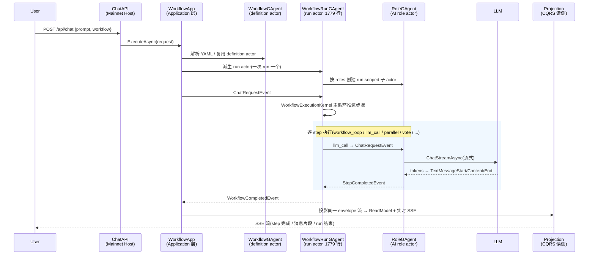

# Aevatar Review

> 自顶向下、以源码为准，全面解读 [`aelf:aevatarAI/aevatar`](https://github.com/aevatarAI/aevatar) 项目的中文技术笔记。
> 配合可复现的 demo,逐层拆解这个**多 Agent 协作运行时 + Workflow YAML 编排层**的设计与实现。

---

## 这个仓库是什么

`aevatar-review` **不是** aevatar 的源码仓库,而是对它的**结构化解读项目**。源码以 `~/Code/aevatar`(对应上游 `aelf:aevatarAI/aevatar.git`)为准。

我们的目标:

- **自顶向下**:从"一个 chat 请求怎么流过整个系统"开始,一路下钻到 Actor 邮箱串行、Event Sourcing 事实持久化、Projection 读模型。
- **以源码为准**:每个论断都指向真实的 `.cs` 文件 / `.yaml` / canon 文档,而不是泛泛而谈。aevatar 仓库自己带了非常完整的 `docs/canon/*` 和 `docs/adr/*`,我们的任务是把这些"按代码事实"的内容**串成一条主线 + 配 demo**。
- **配 demo**:每个关键概念都给一个最小的、可以跑或可以读的例子(`simple_qa.yaml`、`resume_screening.yaml`、Maker sample 等)。

> 详细的写作计划与进度见 [PLAN.md](./PLAN.md)。

---

## Aevatar 一句话概览

> **Aevatar = 多 Agent 协作运行时 + Workflow YAML 编排层**。

- 以 **Actor + Event** 为运行内核:多个角色 Agent 在同一任务中分工、并行、协商、收敛。
- **Workflow YAML** 是默认编排方式:声明 `roles + steps + routes`,无需写代码即可组合顺序、分支、循环、并行、投票、人工审批。
- 通过 **HTTP Chat 接口(SSE / WebSocket)** 触发并流式观察整个协作过程。

### 它解决的核心问题

| 传统 Agent 框架 | Aevatar 的做法 |
|---|---|
| 把"流程"写死在代码里 | 流程用 YAML 声明,运行时按 YAML 派生 Agent 树 |
| 单 Agent 串行 | Actor 模型天然多 Agent 并行 + 父子拓扑 |
| 状态混在业务对象里 | **写侧 State(事件溯源)/ 读侧 ReadModel(CQRS)** 严格分离 |
| 难以分布式扩展 | Runtime 可插拔(Local / Orleans / Kafka transport),同一套 `IActorRuntime` 原语 |

---

## 技术栈一览

| 维度 | 选型 |
|---|---|
| 语言 / 运行时 | **C# (preview LangVersion) / .NET 10** (`global.json: sdk 10.0.100`) |
| 解决方案组织 | `aevatar.slnx` + 10 个按能力域划分的 `*.slnf`(foundation / ai / cqrs / workflow / capabilities / agents / channels / platforms / distributed) |
| 代码规模 | `src/` 约 **2533** 个 C# 文件,`test/` 约 **1107** 个 |
| 内核范式 | Actor 模型 + Event Sourcing + CQRS Projection |
| 分布式实现 | Orleans Runtime + Garnet 持久化 + 可选 Kafka/MassTransit Transport |
| 协议出口 | HTTP `/api/chat` (SSE) / WebSocket / AGUI;另含 A2A 互操作 |
| AI 接入 | Microsoft.Extensions.AI(MEAI)/ NyxId / Tornado 等 LLM Provider;MCP / Skills / Lark / Web 等 Tool Provider |
| 前端控制台 | `apps/aevatar-console-web`(React + Umi/Ant Design Pro + pnpm) |

---

## 主线:一次 Chat 请求的生命周期

这是贯穿整个 review 的主线。理解了它,就理解了 Aevatar 80% 的设计。



对应代码落点(后文逐个展开):

| 阶段 | 关键代码 |
|---|---|
| Host 入口 | `src/Aevatar.Mainnet.Host.Api/Program.cs` → `AddAevatarMainnetHost()` |
| Application 编排 | `src/workflow/Aevatar.Workflow.Application/` |
| definition actor | `src/workflow/Aevatar.Workflow.Core/WorkflowGAgent.cs` |
| run actor | `src/workflow/Aevatar.Workflow.Core/WorkflowRunGAgent.cs` |
| 执行内核 | `src/workflow/Aevatar.Workflow.Core/Execution/WorkflowExecutionKernel*` |
| 步骤模块 | `src/workflow/Aevatar.Workflow.Core/Modules/*.cs`(30+ 模块) |
| role actor | `src/Aevatar.AI.Core/RoleGAgent.cs` |
| 读侧投影 | `src/Aevatar.CQRS.Projection.Core/` + `src/workflow/Aevatar.Workflow.Projection/` |

---

## 一个最小 demo:`simple_qa.yaml`

这是仓库自带的最简工作流,展示了"角色 + 单步 LLM 调用"的最小骨架:

```yaml
# 文件: workflows/simple_qa.yaml
name: simple_qa
roles:
  - id: assistant
    name: Assistant
    system_prompt: "You are a helpful assistant."
steps:
  - id: answer
    type: llm_call
    role: assistant
```

跑起来:

```bash
# 1. 配 LLM Key
export DEEPSEEK_API_KEY="sk-..."   # 或 OPENAI_API_KEY

# 2. 启动 Mainnet(默认统一入口)
dotnet run --project src/Aevatar.Mainnet.Host.Api

# 3. 发请求(SSE 流)
curl -N -X POST http://localhost:5100/api/chat \
  -H "Content-Type: application/json" \
  -H "Accept: text/event-stream" \
  -d '{"prompt": "什么是 MAKER 模式?", "workflow": "simple_qa"}'
```

运行结束后,`artifacts/workflow-executions/` 下会生成本次 run 的 JSON + HTML 报告。

### 一个更"真实"的 demo:`resume_screening.yaml`(分支 + 工具调用)

它展示了 Aevatar 真正的编排能力:`tool_call`(文档抽取)→ `switch` 分支 → `llm_call`(结构化评分)→ `assign` 拼装 → `tool_call`(写飞书 Bitable),全程带错误降级分支。完整 YAML 见 [`workflows/resume_screening.yaml`](https://github.com/aevatarAI/aevatar/blob/main/workflows/resume_screening.yaml),节选:

```yaml
steps:
  - id: extract_resume
    type: tool_call
    parameters: { tool: document_extract, arguments: "${input}" }
    next: route_extract

  - id: route_extract          # 条件分支:抽取成功才继续
    type: switch
    parameters:
      on: "${eq(steps.extract_resume.json.error, '')}"
      branch.true: screen_resume
      branch.false: report_extract_failed

  - id: screen_resume           # LLM 结构化评分
    type: llm_call
    target_role: resume_screener
```

> 后续 review 会专门有一篇 "YAML 步骤类型全图",把 `workflows/` 下 12 个示例逐一拆解。

---

## 解读路线图(自顶向下)

完整计划见 [PLAN.md](./PLAN.md)。主线分 5 个大块:

```
00 序章 ─────────── 这个项目是什么、主线、怎么跑起来(本文 + PLAN)
01 宿主与入口 ────── Mainnet/Workflow Host、/api/chat、SSE/WS、AddAevatarPlatform
02 编排层(Workflow) ── YAML、roles/steps/routes、30+ 步骤模块、Maker 插件
03 运行内核(Foundation) Actor/Runtime/Stream/Event、GAgentBase、StateGuard
04 AI 能力层 ──────── RoleGAgent、LLM Provider、Tool Provider(MCP/Skills/Lark)
05 CQRS 与读侧 ────── Durable Materialization / Session Observation、ReadModel
06 分布式与生产态 ──── Orleans + Garnet + Kafka transport、当前 vs 目标态
07 周边 ──────────── Channel/A2A/ChatRouting/VoicePresence/Console-Web
```

---

## 关于这份笔记

- **事实源**:所有解读以 `~/Code/aevatar` 的代码 + 它自带的 `docs/canon/*`、`docs/adr/*` 为准。如果笔记和源码冲突,以源码为准,并提 issue 修正。
- **不是官方文档**:这是个人学习/解读笔记,aevatar 团队不维护本仓库。
- **License**:aevatar 本身有 LICENSE(Apache-2.0 风格);本解读仓库的笔记内容采用 [CC-BY-4.0](https://creativecommons.org/licenses/by/4.0/),引用的源码片段版权归原作者所有。
