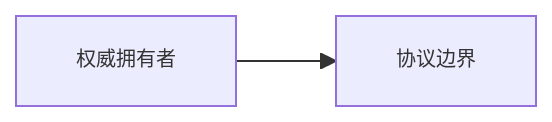
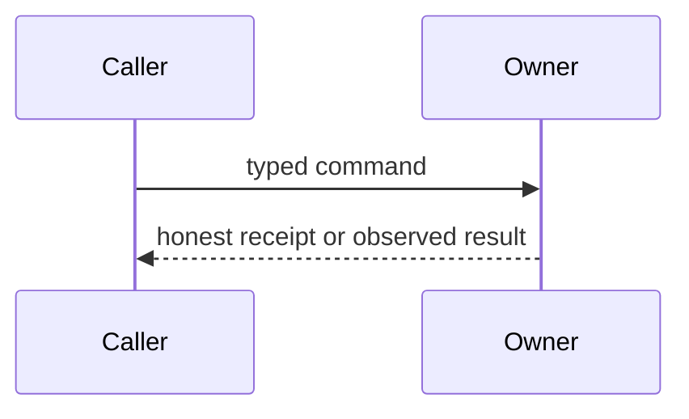

# Aevatar Review 全库重构 Implementation Plan（实施计划）

> **For agentic workers:** REQUIRED SUB-SKILL: Use superpowers:subagent-driven-development (recommended) or superpowers:executing-plans to implement this plan task-by-task. Steps use checkbox (`- [ ]`) syntax for tracking.

**Goal:** 以只读上游 `feature/integrate @ f02aa690bbebb9cabeac30a553d737486b0eb661` 为事实基线，把当前文档重组为 `00–13` 共 72 篇实质章节，并完成 issue 对账、旧章迁移、全量验证和站点切换。

**Architecture:** 先建立可审计的目标清单、受保护工作区快照、迁移账本和验证工具，再按 `00–13` 的依赖顺序逐目录写作。每篇新章节先按单路径 issue 独立创建、核验、review 和提交，再通过目录协调门；只有当迁移账本证明旧内容已有新落点后，才在最后的结构切换任务中删除旧路径、更新导航和启用 CI 全量门禁。

**Tech Stack:** 中文 Markdown、Mermaid 11.15.0、Bash 3.2、Python 3 标准库、MkDocs Material、GitHub CLI、只读 C# / Protobuf / YAML 事实源。

## Global Constraints

- Aevatar 当前事实固定在 `~/Code/aevatar` 的 `feature/integrate @ f02aa690bbebb9cabeac30a553d737486b0eb661`；执行期间不移动基线。
- 执行开始时上游工作树可能已经越过冻结 SHA 或包含其他人的未提交改动。所有事实读取、路径存在性和行号校验必须针对 Git object `f02aa690bbebb9cabeac30a553d737486b0eb661:<path>`；不得把当前上游 working tree 当成冻结快照。需要目录扫描、parser 或静态校验时，只能从该提交 materialize 派生快照；不得 checkout、reset、stash 或清理上游。
- 每个 Task 和每个恢复后的 turn 开始时，都运行 `export AEVATAR_FROZEN="$(bash scripts/materialize-frozen-upstream.sh --repo ~/Code/aevatar --sha f02aa690bbebb9cabeac30a553d737486b0eb661)"`。脚本返回 review 仓库自身 `.git/aevatar-frozen/` 下按 SHA 派生的只读缓存，绝不写入上游仓库；SHA 的 SSOT 仍是目标 manifest/frontmatter，缓存可随时删除重建，不得成为 host 配置或事实源。
- Issue 快照固定为 2026-07-25 的 126 个 open issues，以及关闭日期在 2026-07-06 至 2026-07-25 的 154 个 closed issues。
- 结构切换前，当前仓库权威结构仍是 `PLAN.md` / `mkdocs.yml` 所列 `00–12`、85 篇；`00–13`、72 篇只是已批准并已输出 `SCOPE_EXTEND` 的迁移目标。只有 Task 19 在同一原子提交中更新 `PLAN.md`、`mkdocs.yml`、instructions、索引和旧路径后，72 篇结构才成为 current。
- `~/Code/aevatar` 全程只读；不得修改、格式化、生成或清理其中任何文件。
- 工作语言是中文；代码块、路径、标识符、协议名和枚举值保持英文。
- 每篇实质章节的 frontmatter 必须含 `status`、完整 `upstream_commit` 和 `verified_at: 2026-07-25`。
- `status` 只允许 `current`、`mixed`、`historical`、`target`；目录索引使用 `index`。
- 每篇实质章节开头只列 1–3 个高价值事实源及有效行号锚点；current 论断必须有 E1 当前代码、proto、配置或测试证据。
- 每篇实质章节至少有一张静态边界图和一张动态图；不得用内容近似的图凑数量。
- 每篇实质章节必须包含设计正当性、协议/状态深入、demo 状态、边界与演进、3–5 个读者验收问题。
- 说不清设计正当性时必须写 `!!! warning "设计待论证"`，并在 `12/05-open-gaps-and-canon-drift.md` 登记精确章节/小节、缺失证据、owner 与 exit criterion；不得用 warning 代替核验。最终门禁拒绝未登记 warning。
- Demo 状态只允许 `verified-static`、`verified-local`、`verified-production-versioned`；需要外部凭证而未执行时只能标 `verified-static`。
- Closed issue 只有在当前基线存在对应实现证据时才能支持 current 叙述；open issue 只能进入缺口、风险或目标态。
- NyxID、Chrono Sandbox、Ornn 只从 Aevatar adapter、授权、typed reference、补偿和失败边界解释，不扩写外部产品内部。
- 新章节写作前必须有独立 issue；Task 1 先输出总重构 `SCOPE_EXTEND`，每个目标 issue body 再携带同一 marker、精确目标路径和单路径 `scope_paths`，然后才写正文并在目标清单记录 URL。
- 每个任务开始前重新枚举工作区改动。任何当时存在且不属于本任务的修改自动成为受保护输入，不得 reset、stash、checkout 或覆盖。
- 提交必须按精确路径暂存。禁止无 pathspec 的 `git add .` / `git add -A`；Task 19 仅允许把显式生成且已审阅的 NUL-delimited 清单加载为 Bash 路径数组，再执行 `git add -A -- "${switch_path_args[@]}"`。禁止把并行用户修改混入任务提交。
- 删除旧章节前，迁移账本必须给出其处置、目标落点、保护内容状态和证据状态；不保留“本文已迁移”的空壳文件。
- 文档文件使用 `apply_patch` 编辑；上游只允许只读命令。

## File Structure

### 治理和验证文件

| 路径 | 职责 |
|---|---|
| `docs/migration/2026-07-25-target-chapters.md` | 72 个目标章节的机器可读 Markdown 清单、状态、issue URL |
| `docs/migration/2026-07-25-protected-worktree.md` | 每批开始时的受保护路径、状态、hash 和迁移意图 |
| `docs/migration/2026-07-25-chapter-migration-ledger.md` | 每个旧 Markdown 文件的 `retain-rewrite/merge/split/promote-current/move-evolution/delete` 处置和新落点 |
| `docs/migration/2026-07-25-old-retire-paths.txt` | 最终切换时可安全删除的 85 个旧 tracked 路径；不含将原位重写的 13 个块级 `index.md` |
| `docs/migration/2026-07-25-issue-evidence-ledger.md` | 154 个 closed 与 126 个 open issues 的主题、分类、实现证据和文档落点 |
| `docs/migration/2026-07-25-source-matrix.md` | 72 篇目标章节的 E1/E2/E3/E4/E5/E6 证据矩阵 |
| `scripts/create_issues.py` | 从目标清单幂等创建或复用章节 issue；默认 dry-run，显式 `--create` 才写 GitHub |
| `scripts/snapshot-upstream-issues.py` | 冻结 upstream issue 成员列表；分页、去重、计数并输出可审计 Markdown 原始行，不推断实现状态 |
| `scripts/materialize-frozen-upstream.sh` | 从指定 Git commit 原子生成/复用 `.git/` 派生快照并只输出绝对路径；从不 checkout 或修改上游 |
| `scripts/check-md.sh` | `--changed`、`--paths`、`--all` 三种模式的章节清单、frontmatter、内容契约、事实源和图数量校验 |
| `scripts/check-links.py` | 仓内 Markdown 链接、图片、文件锚点校验；迁移期支持 `--allow-planned` |
| `scripts/check-drift.sh` | 旧路径、旧篇数口径、退役组件当前态误写和未迁移导航扫描 |
| `scripts/tests/test-doc-checks.sh` | 上述校验器的临时 fixture 回归测试 |

### 章节目录

- `00–05`：31 篇当前设计主线。
- `06–10`：27 篇产品、集成与生产深入。
- `11–13`：14 篇场景教程、演进与参考。
- `00/index.md` 至 `13/index.md`：最后结构切换时统一改写；目录写作任务只创建实质章节，避免提前覆盖用户修改的旧索引。
- `docs/00` 至 `docs/12`：现有相对 symlink；最终新增 `docs/13 -> ../13`。

### 最终站点和同步面

- `README.md`、`PLAN.md`、`AGENTS.md`、`CLAUDE.md`、`docs/index.md`、`docs/upstream-sync.md`、`mkdocs.yml`
- `.config/upstream-sync/chapter-source-map.json`
- `.github/workflows/docs.yml`、`scripts/git-hooks/pre-push`

---

## Task 1: 冻结治理基线、目标清单与章节 issues

**Files:**

- Create: `docs/migration/2026-07-25-target-chapters.md`
- Create: `docs/migration/2026-07-25-protected-worktree.md`
- Create: `docs/migration/2026-07-25-chapter-migration-ledger.md`
- Create: `docs/migration/2026-07-25-old-retire-paths.txt`
- Create: `docs/migration/2026-07-25-issue-evidence-ledger.md`
- Create: `docs/migration/2026-07-25-source-matrix.md`
- Modify: `scripts/create_issues.py`
- Create: `scripts/snapshot-upstream-issues.py`
- Create: `scripts/materialize-frozen-upstream.sh`
- Test: `scripts/tests/test-doc-checks.sh`

**Interfaces:**

- Consumes: approved design `docs/superpowers/specs/2026-07-25-aevatar-review-restructure-design.md`; current worktree; GitHub repositories `eanzhao/aevatar-review` and `aevatarAI/aevatar`.
- Produces: exactly 72 target rows; frozen old-file rows; frozen membership for 154 closed + 126 open upstream issues; issue URL for every target; protected-input inventory; schema-complete issue/source ledgers.

- [ ] **Step 1: Print the required scope extension marker and freeze immutable facts**

Run:

```bash
printf '%s\n' 'SCOPE_EXTEND: restructure aevatar-review into 00-13 with 72 target chapters'
git rev-parse HEAD
git status --porcelain=v1
git -C ~/Code/aevatar rev-parse HEAD
git -C ~/Code/aevatar cat-file -e f02aa690bbebb9cabeac30a553d737486b0eb661^{commit}
gh api 'search/issues?q=repo%3AaevatarAI%2Faevatar+is%3Aissue+is%3Aopen&per_page=1' --jq '.total_count'
gh api 'search/issues?q=repo%3AaevatarAI%2Faevatar+is%3Aissue+is%3Aclosed+closed%3A2026-07-06..2026-07-25&per_page=1' --jq '.total_count'
```

Expected: the frozen commit object exists. The live upstream HEAD may differ; record its SHA and dirty paths as external drift, but do not move the approved baseline. Before Task 1 has persisted all 280 membership rows, live query counts must equal `126` and `154`. A mismatch means the approved membership cannot be reconstructed from counts alone: record the drift, stop issue classification, and either recover an immutable raw snapshot or obtain explicit approval for a new snapshot. Never silently substitute a different cohort.

The materializer implementation contract, used after the red fixture in Step 5, is:

```text
bash scripts/materialize-frozen-upstream.sh --repo PATH --sha FULL_SHA [--output PATH]
default output: $(git -C <review-repo> rev-parse --git-path aevatar-frozen)/FULL_SHA
stdout: one absolute snapshot directory and nothing else
stderr: diagnostics
exit 0: requested commit exists and snapshot marker/tree match FULL_SHA
exit 1: malformed SHA, missing commit, archive/extract failure, or marker mismatch
```

The script resolves the review repository from its own location, verifies the upstream `FULL_SHA^{commit}`, extracts `git archive` into a sibling temporary directory under the review repository's Git dir, writes a `.source-commit` marker, then atomically renames into place. It reuses a cache only when the marker and `aevatar.slnx` match; concurrent creators validate and reuse the winning atomic rename. It never runs checkout/reset/stash/clean and never writes under the upstream repository. The `frozen-upstream` fixture in Step 5 creates a temporary Git repository with two commits plus dirty working-tree content and proves the requested first-commit snapshot excludes both later and dirty content.

- [ ] **Step 2: Write the 72-row target manifest**

Use this exact row form in `docs/migration/2026-07-25-target-chapters.md`:

```markdown
- [ ] `00/01-reading-guide.md` — status:current — issue:pending
```

Copy the 72 paths from design §5 without adding index pages. Validate:

```bash
rg -c '^- \[[ x]\] `[0-9]{2}/[0-9]{2}-[a-z0-9-]+\.md` — status:(current|mixed|historical|target) — issue:' docs/migration/2026-07-25-target-chapters.md
```

Expected: `72`.

Copy each row's approved status from the matching topic table in Tasks 5–18. The tutorial rows in Task 16 are all `current`; do not infer status from directory name or demo execution level.

- [ ] **Step 3: Record every protected index/worktree input without exposing content**

Build the union of staged, unstaged and untracked paths with NUL-safe output:

```bash
protected_paths="$(mktemp)"
python3 - <<'PY' > "$protected_paths"
import subprocess

commands = [
    ["git", "diff", "--cached", "--name-only", "-z"],
    ["git", "diff", "--name-only", "-z"],
    ["git", "ls-files", "--others", "--exclude-standard", "-z"],
]
paths = set()
for command in commands:
    output = subprocess.check_output(command)
    paths.update(item for item in output.split(b"\0") if item)
for item in sorted(paths):
    print(item.decode("utf-8", "surrogateescape"), end="\0")
PY
```

For each NUL-delimited path, add one protected-ledger row with porcelain XY status, owner=`user-existing`, planned migration destination and all five non-secret fingerprints below. `MM` and `AM` paths must retain distinct index and worktree fingerprints.

```bash
while IFS= read -r -d '' relpath; do
  printf 'PATH %s\n' "$relpath"
  git status --porcelain=v1 -- "$relpath"
  printf 'HEAD_BLOB %s\n' "$(git rev-parse "HEAD:$relpath" 2>/dev/null || printf absent)"
  index_blob="$(git ls-files --stage -- "$relpath" | awk 'NR == 1 {print $2}')"
  printf 'INDEX_BLOB %s\n' "${index_blob:-absent}"
  test -e "$relpath" && shasum -a 256 "$relpath" | sed 's/^/WORKTREE_SHA256 /' || printf 'WORKTREE_SHA256 absent\n'
  git diff --cached --binary -- "$relpath" | shasum -a 256 | sed 's/^/STAGED_PATCH_SHA256 /'
  git diff --binary -- "$relpath" | shasum -a 256 | sed 's/^/UNSTAGED_PATCH_SHA256 /'
done < "$protected_paths"
rm -f "$protected_paths"
```

Do not paste patches, secrets, bearer values, raw keys, ciphertext or full external inventories into the ledger. The Agent Key canary facts migrate to `09/05-production-canary-and-recovery.md` and `12/04-incident-case-studies.md`.

- [ ] **Step 4: Write the complete old-file migration ledger skeleton**

Generate the source list read-only:

```bash
find 00 01 02 03 04 05 06 07 08 09 10 11 12 -type f -name '*.md' | sort
```

Write one row per result using:

```markdown
| `07/12-scheduled-tasks.md` | protected | promote-current+split | `09/01`, `09/02`, `09/03`, `09/04`, `12/04` | pending | Agent Key current model and fire-time exchange history stay separated |
```

Mandatory group destinations:

| Old group | Required new destinations |
|---|---|
| `00/*` | `00/*`, `01/01`, `01/04` |
| `01/*` | `01/02–04`, `05/06`, `12/03`, `12/05` |
| `02/*` | `03/*`, `11/01–02`, Maker history in `12/03` if no longer current |
| `03/*` | `02/*`, `05/01–02` |
| `04/*` | `04/*`, `07/03–04` where profile/tool authority applies |
| `05/*` | `05/01–05`, provider incidents in `12/04` |
| `06/*` | `09/03–04`, `10/01–05`, `10/08`, retired transport in `12/03` |
| `07/*` | `06/*`, `07/*`, `08/*`, `09/*`, `10/07`, `11/04–05`, `12/03–04` |
| `08/*` | `11/*`, `12/03–05`, `13/01–02` |
| `09/01-*/*` | landed semantics in `06/02`, `03/07`, `11/03`; unlanded registration target in `12/05` |
| `09/02-*/*` | `04/03–04`, `10/06`, `12/04–05` |
| `09/03-*/*` | `09/05`, `10/07`, `11/03`, `11/05`, `12/04` |
| `10/*` | corresponding current boundary in `04`, `06`, `08`, `09`, `10`; durable lesson in `12/04`; unresolved item in `12/05` |
| `11/*` | `04/03`, `04/05`, `11/*`, retired recipe in `12/03` if unsupported |
| `12/*` | `12/01–02`, `12/04` |

Design-freeze worktree count was `82` substantive files and `16` index files. At execution baseline `bab63e8`, the Agent Key canary has entered HEAD, so the tracked count is now `82` substantive files and `16` index files. If new files appear after this execution baseline, add and protect them rather than forcing this count.

Also create `docs/migration/2026-07-25-old-retire-paths.txt` from the 82 tracked old substantive chapters plus the three nested `09/*/index.md` files. Do not include the 13 block-level `00/index.md` through `12/index.md`; Task 19 rewrites those in place. Expected line count: `85`. The canary `09/03-provision-and-observe-via-nyxid/02-scheduled-agent-key-production-canary.md` is now one of these tracked substantive paths; it still requires section-level `migrated-reviewed` evidence before deletion.

- [ ] **Step 5: Add the failing frozen-upstream and issue-snapshot fixtures**

Add the `frozen-upstream` fixture described in Step 1. Extend `scripts/tests/test-doc-checks.sh issue-snapshot` with a fake `gh api` returning two pages, one duplicate issue and one title containing `|`. Assert the CLI de-duplicates by issue number, sorts numerically, escapes Markdown cells, and exits 1 when the unique count differs from `--expect-count`.

Run:

```bash
bash scripts/tests/test-doc-checks.sh frozen-upstream
bash scripts/tests/test-doc-checks.sh issue-snapshot
```

Expected before implementation: non-zero because both new scripts are absent.

- [ ] **Step 6: Implement the materializer and snapshot CLI, then freeze both issue memberships**

Implement `scripts/materialize-frozen-upstream.sh` against the Step 1 contract, then run the red fixture to green and materialize the immutable task snapshot:

```bash
bash scripts/tests/test-doc-checks.sh frozen-upstream
UPSTREAM_SHA=f02aa690bbebb9cabeac30a553d737486b0eb661
export AEVATAR_FROZEN="$(bash scripts/materialize-frozen-upstream.sh --repo ~/Code/aevatar --sha "$UPSTREAM_SHA")"
test -f "$AEVATAR_FROZEN/aevatar.slnx"
test "$(sed -n '1p' "$AEVATAR_FROZEN/.source-commit")" = "$UPSTREAM_SHA"
test "$(git -C ~/Code/aevatar rev-parse "$UPSTREAM_SHA^{commit}")" = "$UPSTREAM_SHA"
```

At every later task/turn, re-run the export command; point validators at it with `AEVATAR_SRC="$AEVATAR_FROZEN"`. Never copy the live upstream worktree over this snapshot.

Implement this exact read-only interface:

```text
python3 scripts/snapshot-upstream-issues.py \
  --repo OWNER/REPO --state open|closed \
  [--from YYYY-MM-DD --through YYYY-MM-DD | --snapshot-date YYYY-MM-DD] \
  --expect-count N --format markdown
output: one escaped Markdown row per unique issue, sorted by issue number
fields: snapshot_state, issue, title, created_at, closed_at, labels, URL,
        classification=unclassified, implementation_evidence=—, destinations=—
exit 0: unique row count equals N
exit 1: malformed arguments, gh/pagination failure, duplicate conflict, or count drift
```

The script uses `gh api --paginate` against REST search and never infers implementation status. Run the fixture to green, then capture the approved memberships to temporary files:

```bash
bash scripts/tests/test-doc-checks.sh frozen-upstream
bash scripts/tests/test-doc-checks.sh issue-snapshot
closed_snapshot="$(mktemp)"
open_snapshot="$(mktemp)"
python3 scripts/snapshot-upstream-issues.py --repo aevatarAI/aevatar --state closed --from 2026-07-06 --through 2026-07-25 --expect-count 154 --format markdown > "$closed_snapshot"
python3 scripts/snapshot-upstream-issues.py --repo aevatarAI/aevatar --state open --snapshot-date 2026-07-25 --expect-count 126 --format markdown > "$open_snapshot"
```

Use `apply_patch` to place both complete outputs under separate frozen-membership headings in `docs/migration/2026-07-25-issue-evidence-ledger.md`, then remove the temporary files. Validate exact membership:

```bash
test "$(rg -c '^\| closed \| #[0-9]+ \|' docs/migration/2026-07-25-issue-evidence-ledger.md)" -eq 154
test "$(rg -c '^\| open \| #[0-9]+ \|' docs/migration/2026-07-25-issue-evidence-ledger.md)" -eq 126
test "$(rg '^\| (closed|open) \| #[0-9]+ \|' docs/migration/2026-07-25-issue-evidence-ledger.md | awk -F'|' '{gsub(/^ +| +$/, "", $2); gsub(/^ +| +$/, "", $3); print $2 ":" $3}' | sort -u | wc -l | tr -d ' ')" -eq 280
```

From this point Tasks 3–4 classify only these rows; live GitHub state is drift telemetry, not membership authority.

- [ ] **Step 7: Replace the obsolete 43-issue generator with an idempotent target-issue CLI**

Implement this CLI in `scripts/create_issues.py`:

```text
python3 scripts/create_issues.py --manifest PATH --repo OWNER/REPO [--create]
default: dry-run, no GitHub mutation
--create: create only rows whose exact target path has no recorded issue
output: CREATE|REUSE|RECORDED <path> <url-or-title>
exit 0: all 72 rows resolved
exit 1: malformed manifest, duplicate path, gh failure, or unresolved row
```

Every new issue body must contain `SCOPE_EXTEND`, the exact target path, approved SHA, and `scope_paths` containing only the exact target chapter. The issue may read governance ledgers, but only the directory coordinator edits them; this prevents chapter workers from racing on shared SSOT. Reuse an existing issue only when its `scope_paths` contains exactly that one target path. Existing issue `#147` has a six-path legacy scope, so create a new exact-scope issue for `09/05-production-canary-and-recovery.md`, cross-reference `#147` as migration evidence, and do not mutate or close `#147` as part of the new chapter work unit.

- [ ] **Step 8: Add fixture tests for manifest parsing and issue idempotency**

Create a two-row temporary manifest and fake `gh` executable. Assert dry-run performs zero creates, first `--create` creates once, second `--create` performs no new create, and a duplicate target path exits 1.

Run:

```bash
bash scripts/tests/test-doc-checks.sh issue-cli
```

Expected: `issue-cli: PASS`.

- [ ] **Step 9: Resolve all target issues and write URLs into the manifest**

Run dry-run, then explicit mutation:

```bash
python3 scripts/create_issues.py --manifest docs/migration/2026-07-25-target-chapters.md --repo eanzhao/aevatar-review
python3 scripts/create_issues.py --manifest docs/migration/2026-07-25-target-chapters.md --repo eanzhao/aevatar-review --create
```

Expected: exactly 72 resolved rows. Replace every `issue:pending` with its URL. A final dry-run must report only `RECORDED` or `REUSE`.

- [ ] **Step 10: Commit only governance artifacts and the two issue CLIs**

```bash
git add -- docs/migration/2026-07-25-target-chapters.md docs/migration/2026-07-25-protected-worktree.md docs/migration/2026-07-25-chapter-migration-ledger.md docs/migration/2026-07-25-old-retire-paths.txt docs/migration/2026-07-25-issue-evidence-ledger.md docs/migration/2026-07-25-source-matrix.md scripts/create_issues.py scripts/snapshot-upstream-issues.py scripts/materialize-frozen-upstream.sh scripts/tests/test-doc-checks.sh
git diff --cached --name-only -- docs/migration/2026-07-25-target-chapters.md docs/migration/2026-07-25-protected-worktree.md docs/migration/2026-07-25-chapter-migration-ledger.md docs/migration/2026-07-25-old-retire-paths.txt docs/migration/2026-07-25-issue-evidence-ledger.md docs/migration/2026-07-25-source-matrix.md scripts/create_issues.py scripts/snapshot-upstream-issues.py scripts/materialize-frozen-upstream.sh scripts/tests/test-doc-checks.sh
git commit --only -m "docs: establish review migration governance" -- docs/migration/2026-07-25-target-chapters.md docs/migration/2026-07-25-protected-worktree.md docs/migration/2026-07-25-chapter-migration-ledger.md docs/migration/2026-07-25-old-retire-paths.txt docs/migration/2026-07-25-issue-evidence-ledger.md docs/migration/2026-07-25-source-matrix.md scripts/create_issues.py scripts/snapshot-upstream-issues.py scripts/materialize-frozen-upstream.sh scripts/tests/test-doc-checks.sh
```

Expected staged paths for this task: exactly those ten paths; no user-modified chapter, PLAN, navigation, or instruction file. Other user-owned paths may already be staged but remain outside the path-limited commit.

## Task 2: 建立迁移期与最终全量文档门禁

**Files:**

- Modify: `scripts/check-md.sh`
- Create: `scripts/check-links.py`
- Create: `scripts/check-drift.sh`
- Modify: `scripts/tests/test-doc-checks.sh`

**Interfaces:**

- Consumes: target manifest and migration ledger from Task 1.
- Produces: partial-directory validation during migration; strict 72-chapter validation at final switch; deterministic link/anchor and drift checks.

- [ ] **Step 1: Add failing fixture cases before changing validators**

Cover missing frontmatter, invalid status, wrong SHA, one diagram, four source-spine paths, out-of-range source line, missing link target, planned target under `--allow-planned`, missing heading fragment, and old path in active nav.

Run:

```bash
bash scripts/tests/test-doc-checks.sh validators
```

Expected before implementation: non-zero because the new modes/scripts do not exist.

- [ ] **Step 2: Implement exact `check-md.sh` modes**

Support:

```text
AEVATAR_SRC="$AEVATAR_FROZEN" bash scripts/check-md.sh --changed
AEVATAR_SRC="$AEVATAR_FROZEN" bash scripts/check-md.sh --paths PATH...
AEVATAR_SRC="$AEVATAR_FROZEN" bash scripts/check-md.sh --all [--allow-retiring]
```

Substantive rules: valid frontmatter; one H1; sections matching `版本与结论`、`设计抽象与事实源`、`为什么`、`边界与演进`、`读完应能回答`; demo marker; at least two diagrams; 1–3 source-spine paths; all upstream paths and numeric line anchors valid. `--paths` allows old/new coexistence. `--all` reads 72 checked manifest rows and rejects missing targets. Default `--all` also rejects orphan substantive chapters. Temporary `--all --allow-retiring` permits only the exact 85 paths in `old-retire-paths.txt` to coexist; it remains strict for targets and every other orphan. This flag is used only in Task 19 before deletion and is forbidden in CI/final verification.

- [ ] **Step 3: Implement `check-links.py` with planned-target support**

Required CLI:

```text
python3 scripts/check-links.py [--all | --paths PATH...] [--allow-planned]
```

Use Python standard library. Ignore external links and code spans/fences; resolve relative Markdown and image links; validate fragments from Markdown headings and explicit HTML ids; report `file:line -> broken target`.

- [ ] **Step 4: Implement `check-drift.sh`**

Final mode scans active reader/docs/governance surfaces but excludes immutable migration evidence under `docs/superpowers/specs/`, `docs/superpowers/plans/` and `docs/migration/`. It fails on deleted old paths in active navigation, old 43/83/85 chapter claims, unresolved `issue:pending`, unchecked target rows, unregistered `设计待论证` warnings, or current chapters presenting A2A, MassTransit, StateMirror, or SkillRunnerGAgent as defaults. Historical/target text may mention them only with an explicit retired marker in the same paragraph.

- [ ] **Step 5: Run fixtures and record the intentional migration red state**

```bash
bash scripts/tests/test-doc-checks.sh validators
AEVATAR_SRC="$AEVATAR_FROZEN" bash scripts/check-md.sh --all
```

Expected: fixture suite prints `validators: PASS`; `--all` fails and lists not-yet-created target chapters.

- [ ] **Step 6: Commit validator changes only**

```bash
git add -- scripts/check-md.sh scripts/check-links.py scripts/check-drift.sh scripts/tests/test-doc-checks.sh
git commit --only -m "test: add full-book documentation gates" -- scripts/check-md.sh scripts/check-links.py scripts/check-drift.sh scripts/tests/test-doc-checks.sh
```

## Task 3: 对账 154 个近期 closed issues

**Files:**

- Modify: `docs/migration/2026-07-25-issue-evidence-ledger.md`
- Modify: `docs/migration/2026-07-25-source-matrix.md`

**Interfaces:**

- Consumes: the exact 154 closed membership rows frozen in Task 1; `$AEVATAR_FROZEN`; associated issue/PR/comment history as explanatory evidence; closed classification rules.
- Produces: exactly 154 unique closed rows, each classified as `landed-current`、`landed-superseded`、`design-only`、`ops-verified`、`duplicate/replaced`、`failed/abandoned` or `administrative`, with code/PR evidence and one or more target chapter paths.

- [ ] **Step 1: Verify the frozen closed membership before classification**

Do not regenerate or replace membership from live GitHub. Validate the frozen rows:

```bash
test "$(rg -c '^\| closed \| #[0-9]+ \|' docs/migration/2026-07-25-issue-evidence-ledger.md)" -eq 154
test "$(rg '^\| closed \| #[0-9]+ \|' docs/migration/2026-07-25-issue-evidence-ledger.md | cut -d'|' -f3 | sort -u | wc -l | tr -d ' ')" -eq 154
```

Optionally run the snapshot CLI into a temporary drift report. Never use the live result to add/drop a frozen row.

- [ ] **Step 2: Classify every frozen closed row**

For each frozen row, inspect its body/comments when necessary, associated PR/commit, and `$AEVATAR_FROZEN`. Apply this gate:

```text
current code/proto/config/test evidence exists and semantics still match -> landed-current
versioned deployment/canary/recovery evidence exists -> ops-verified (E3 only; never current by itself)
implementation existed but is deleted/replaced -> landed-superseded
only ADR/design/consensus exists -> design-only
closure is duplicate/replacement -> duplicate/replaced
closed without landed evidence or explicit failure -> failed/abandoned
board/fork/bot tracking only -> administrative
```

Every non-administrative row must name at least one target chapter. Every `landed-current` row must include one current E1 path in `$AEVATAR_FROZEN`; an exact landed commit is supporting E4 and cannot replace current E1. Every `ops-verified` row must include commit/image/date/environment and belongs to E3; if the same behavior is described as current, add separate current E1. Add high-value E3/E4 references to the corresponding source-matrix rows.

- [ ] **Step 3: Validate closed coverage**

```bash
test "$(rg -c '^\| closed \| #[0-9]+ \|' docs/migration/2026-07-25-issue-evidence-ledger.md)" -eq 154
test "$(rg '^\| closed \| #[0-9]+ \|' docs/migration/2026-07-25-issue-evidence-ledger.md | cut -d'|' -f3 | sort -u | wc -l | tr -d ' ')" -eq 154
! rg '^\| closed \| #[0-9]+ \|.*\| unclassified \|' docs/migration/2026-07-25-issue-evidence-ledger.md
```

Expected: all commands exit 0.

- [ ] **Step 4: Commit only closed classifications and source rows**

```bash
git add -- docs/migration/2026-07-25-issue-evidence-ledger.md docs/migration/2026-07-25-source-matrix.md
git commit --only -m "docs: classify recent closed upstream issues" -- docs/migration/2026-07-25-issue-evidence-ledger.md docs/migration/2026-07-25-source-matrix.md
```

## Task 4: 对账 126 个 open issues

**Files:**

- Modify: `docs/migration/2026-07-25-issue-evidence-ledger.md`
- Modify: `docs/migration/2026-07-25-source-matrix.md`

**Interfaces:**

- Consumes: the exact 126 open membership rows frozen in Task 1; `$AEVATAR_FROZEN`; live issue details only as dated explanatory evidence.
- Produces: exactly 126 unique open rows classified as `confirmed-bug`、`security-debt`、`missing-contract`、`proposal/dispute`、`ops-ux-test` or `blocked/duplicate/tracking`, each assigned to a stable theme and target chapter or marked index-only.

- [ ] **Step 1: Verify the frozen open membership before classification**

```bash
test "$(rg -c '^\| open \| #[0-9]+ \|' docs/migration/2026-07-25-issue-evidence-ledger.md)" -eq 126
test "$(rg '^\| open \| #[0-9]+ \|' docs/migration/2026-07-25-issue-evidence-ledger.md | cut -d'|' -f3 | sort -u | wc -l | tr -d ' ')" -eq 126
```

Expected: 126 unique frozen rows. A live issue that later closes remains in this snapshot's `open` cohort; record the later state as drift/evolution evidence without changing cohort membership.

- [ ] **Step 2: Classify every open issue without turning it into a promise**

Use these exact rules:

| Class | When used | Chapter use |
|---|---|---|
| `confirmed-bug` | reproducible/current behavior contradicts contract | relevant chapter boundary + `12/05` |
| `security-debt` | label/body acknowledges temporary security compromise | `10/05–06`, `10/08`, `12/05` |
| `missing-contract` | current model lacks a required protocol/read model/API | relevant chapter + `12/05` |
| `proposal/dispute` | architecture proposal or unresolved choice | `12/02` or `12/05`, never current prose |
| `ops-ux-test` | operations, UI polish or test stability | `12/05` index unless it changes a design boundary |
| `blocked/duplicate/tracking` | dependency, board, bot fork, duplicate | `13/04` only |

Open NyxIdChat stop/steering/task-plan/reconnect issues `#2954–#2957` remain E5 in `12/05`; they must not be written into `07` as current behavior.

- [ ] **Step 3: Validate open coverage and target discipline**

```bash
test "$(rg -c '^\| open \| #[0-9]+ \|' docs/migration/2026-07-25-issue-evidence-ledger.md)" -eq 126
test "$(rg '^\| open \| #[0-9]+ \|' docs/migration/2026-07-25-issue-evidence-ledger.md | cut -d'|' -f3 | sort -u | wc -l | tr -d ' ')" -eq 126
! rg '^\| open \| #[0-9]+ \|.*\| unclassified \|' docs/migration/2026-07-25-issue-evidence-ledger.md
```

- [ ] **Step 4: Commit open classification**

```bash
git add -- docs/migration/2026-07-25-issue-evidence-ledger.md docs/migration/2026-07-25-source-matrix.md
git commit --only -m "docs: classify open upstream issues" -- docs/migration/2026-07-25-issue-evidence-ledger.md docs/migration/2026-07-25-source-matrix.md
```

## Directory Task Protocol

Tasks 5–18 each implement one numbered directory. Every task must execute this protocol in addition to its directory-specific steps.

### Standard chapter skeleton

````markdown
---
status: current
upstream_commit: f02aa690bbebb9cabeac30a553d737486b0eb661
verified_at: 2026-07-25
---

# <章节标题>

> 版本与结论：本章描述 `<status>`；当前行为以 `f02aa690` 为准。

## 设计抽象与事实源

- `<upstream-path>:<line>`：<整章脊柱职责>。

## 先建立模型



## 沿一条链路走读



## 为什么是它，不是别的

## 协议与状态深入

## 最小示例

> Demo status：`verified-static`

## 边界与演进

## 读完应能回答

1. <本章第一项验收问题>？
2. <本章第二项验收问题>？
3. <本章第三项验收问题>？

<details>
<summary>论断—证据映射</summary>

| 论断 | 等级 | 证据 |
|---|---|---|
| <current 论断> | E1 | `<upstream-path>:<line>` |

</details>
````

The angle-bracket tokens above are structural templates, not content permitted in final chapters. Every directory task must replace them; HTML such as `<details>` remains valid. The exact placeholder scan is `! rg '<(章节标题|status|upstream-path|line|整章脊柱职责|本章第一项验收问题|本章第二项验收问题|本章第三项验收问题|current 论断)>' <target paths>`.

### Per-chapter work-unit protocol

Every target row in Tasks 5–18 is one independent chapter work unit, whether execution is inline or subagent-driven. The task's `Files` list describes the directory's aggregate output; it does not broaden any chapter worker's scope.

For each row, in table order:

1. The directory coordinator reads the target manifest and verifies that the recorded issue is open or otherwise active for implementation, contains the approved SHA, and has `scope_paths` equal to the exact target chapter only. A broad legacy issue is evidence, not implementation authority.
2. Re-run `git status --porcelain=v1`. The coordinator records newly observed non-task paths and SHA-256 hashes in the protected ledger before dispatching or writing the chapter. The chapter worker may read governance ledgers and old chapters but may modify only the exact target file.
3. Resolve the row's 1–3 source-spine paths to exact, valid line anchors at the frozen upstream SHA. Write the one chapter with the standard skeleton and replace every template marker.
4. Validate only that chapter:

   ```bash
   AEVATAR_SRC="$AEVATAR_FROZEN" bash scripts/check-md.sh --paths "$target"
   python3 scripts/check-links.py --paths "$target" --allow-planned
   python3 scripts/check-mermaid.py "$target"
   ! rg '<(章节标题|status|upstream-path|line|整章脊柱职责|本章第一项验收问题|本章第二项验收问题|本章第三项验收问题|current 论断)>' "$target"
   ```

   Here `target` is the exact path in the current topic-table row, not a glob or directory. All four commands must pass.
5. Request an independent content review limited to that exact target. Resolve every factual, state-owner, current-vs-target, design-rationale and demo-honesty finding, then rerun the four checks.
6. Commit only the chapter. First record any pre-existing staged paths so they are never confused with this work unit. Then use path-limited staging and a path-limited commit:

   ```bash
   git status --porcelain=v1
   git add -- "$target"
   git diff --cached --check -- "$target"
   git diff --cached --name-status -- "$target"
   git commit --only -m "docs(${target%%/*}): add ${target##*/}" -- "$target"
   ```

   `git commit --only` is mandatory because user-owned files may already be staged. After the commit, verify with `git show --name-only --format= HEAD` that the commit contains exactly `target`, and verify the pre-existing staged paths are still staged.

### Per-directory coordination gate

After every row in one directory has its own chapter commit, the directory coordinator—and only the coordinator—does the shared-state work:

1. Update that directory's rows in `docs/migration/2026-07-25-target-chapters.md`, `docs/migration/2026-07-25-source-matrix.md` and `docs/migration/2026-07-25-chapter-migration-ledger.md`; update `docs/migration/2026-07-25-protected-worktree.md` only in Tasks 14 and 17.
2. Mark a target row checked only when its chapter commit and independent review both exist. Record old-section destinations losslessly; do not make a chapter worker edit shared ledgers.
3. Run `AEVATAR_SRC="$AEVATAR_FROZEN" bash scripts/check-md.sh --paths <the directory's exact target list>`, `python3 scripts/check-links.py --paths <the same exact list> --allow-planned`, and `python3 scripts/check-mermaid.py <directory>`.
4. Review cross-chapter vocabulary and link consistency for the directory. Resolve any defect in a new path-limited fix commit for the affected chapter; do not squash it into a shared-ledger commit.
5. Stage only the exact shared ledgers named by that task, run `git diff --cached --check -- <those ledgers>`, and commit them with `git commit --only`. Confirm the coordinator commit contains no chapter and that all pre-existing user-staged paths remain staged.

## Task 5: 重写 `00` 导读与证据基线

**Files:**

- Create: `00/01-reading-guide.md`
- Create: `00/02-version-evidence-and-status.md`
- Create: `00/03-repository-map.md`
- Modify: target/source/migration ledger rows for `00/*`

**Interfaces:**

- Consumes: old `00/01-what-is-aevatar.md`、`00/02-repo-map.md`、`00/03-quick-start.md`、`00/04-chat-request-lifecycle.md`; frozen SHA and issue ledgers.
- Produces: the vocabulary and evidence contract every later chapter cites; a repository map generated from the frozen source rather than stale project counts.

| Target | Status | E1/E2 spine (choose 1–3) | Must establish |
|---|---|---|---|
| `00/01-reading-guide.md` | `current` | `README.md`; `docs/canon/overview.md`; `docs/canon/architecture.md` | three reading routes, current/mixed/historical/target semantics, where tutorials stop and maintainer detail begins |
| `00/02-version-evidence-and-status.md` | `current` | `AGENTS.md`; `docs/canon/architecture.md`; `docs/adr/` status headers | E1–E6 hierarchy, code/canon/issue/production conflicts, frozen baseline and demo statuses |
| `00/03-repository-map.md` | `current` | `aevatar.slnx`; `docs/canon/module-placement-map.md`; `AGENTS.md` | actual solution filters/project counts at `f02aa690`, Domain/Application/Infrastructure/Host boundaries, how to choose a reading surface |

- [ ] **Step 1: Resolve baseline numbers from source instead of copying old prose**

```bash
find "$AEVATAR_FROZEN/src" -type f -name '*.csproj' | wc -l
find "$AEVATAR_FROZEN/src" -type f -name '*.cs' | wc -l
find "$AEVATAR_FROZEN/test" -type f -name '*.cs' | wc -l
find "$AEVATAR_FROZEN" -maxdepth 1 -type f \( -name '*.slnx' -o -name '*.slnf' \) -print | sort
```

Record commands and counts in the evidence mapping; state that counts belong to `f02aa690`, not timeless architecture.

- [ ] **Step 2: Implement and commit the three chapter rows independently**

`00/01` must show reading-route branching and evidence flow. `00/02` must show the three independent evidence streams and a state-classification decision tree. `00/03` must show solution-filter topology and dependency direction.

- [ ] **Step 3: Run the directory coordination gate**

Follow the Per-chapter work-unit protocol for each row, then the Per-directory coordination gate. The reviewer must specifically reject any statement that calls an issue state proof of implementation or treats a project count as permanent.

- [ ] **Step 4: Commit only the `00` shared-ledger rows**

```bash
git add -- docs/migration/2026-07-25-target-chapters.md docs/migration/2026-07-25-source-matrix.md docs/migration/2026-07-25-chapter-migration-ledger.md
git commit --only -m "docs(00): record reading and evidence baseline" -- docs/migration/2026-07-25-target-chapters.md docs/migration/2026-07-25-source-matrix.md docs/migration/2026-07-25-chapter-migration-ledger.md
```

## Task 6: 重写 `01` 启动、Host 与请求生命周期

**Files:**

- Create: `01/01-quick-start.md`
- Create: `01/02-hosts-and-composition.md`
- Create: `01/03-chat-conversation-turn-contract.md`
- Create: `01/04-request-streaming-lifecycle.md`
- Modify: target/source/migration ledger rows for `01/*`

**Interfaces:**

- Consumes: old `00/03`、`00/04`、`01/01–03`; current chat/history changes represented by upstream issues `#2834`、`#2915`、`#2920`.
- Produces: one verified-static quick start and one canonical request map used by Workflow, ChatHistory, NyxIdChat and Channel chapters.

| Target | Status | Source spine | Must establish |
|---|---|---|---|
| `01/01-quick-start.md` | `current` | `src/Aevatar.Mainnet.Host.Api/README.md`; `src/workflow/Aevatar.Workflow.Host.Api/README.md`; `workflows/simple_qa.yaml` | supported local entry, actual port/config contract, exact curl/SSE expectations, why `/api/chat` is a framework learning surface rather than every product's canonical API |
| `01/02-hosts-and-composition.md` | `current` | `src/Aevatar.Mainnet.Host.Api/Hosting/MainnetHostBuilderExtensions.cs`; `src/Aevatar.Mainnet.Host.Api/Program.cs`; `docs/canon/overview.md` | Host as protocol/composition only, Mainnet vs Workflow Host capability boundary, no business orchestration in Host |
| `01/03-chat-conversation-turn-contract.md` | `current` | `docs/canon/chat-api.md`; `src/workflow/Aevatar.Workflow.Infrastructure/CapabilityApi/ChatEndpoints.cs`; `agents/Aevatar.GAgents.ChatHistory/chat_history_messages.proto` | server ownership of conversation/turn identities, continuation admission, conversation vs run vs session, ownership and scope checks |
| `01/04-request-streaming-lifecycle.md` | `mixed` | `src/workflow/Aevatar.Workflow.Infrastructure/CapabilityApi/ChatSseResponseWriter.cs`; `src/Aevatar.AGUI.Contracts/agui_events.proto`; `docs/canon/llm-streaming.md` | POST/WS normalization, dispatch receipt vs terminal observation, SSE/AGUI frames, reconnect/legacy streaming-proxy boundary |

- [ ] **Step 1: Statically verify every command and endpoint**

Resolve current port and required fields from Host/readme/config. If no LLM credential is available, mark the quick start `verified-static`; do not claim a local run.

- [ ] **Step 2: Implement and commit the four chapter rows independently**

Use these exact distinctions throughout: `conversationId` owns multi-turn history; `turnId` identifies one user turn; `runId` identifies execution; `actorId` identifies the state owner; `correlationId/commandId` trace messages. Never present them as interchangeable.

- [ ] **Step 3: Run the directory coordination gate and commit only shared-ledger rows**

```bash
git add -- docs/migration/2026-07-25-target-chapters.md docs/migration/2026-07-25-source-matrix.md docs/migration/2026-07-25-chapter-migration-ledger.md
git commit --only -m "docs(01): record hosts and request lifecycle" -- docs/migration/2026-07-25-target-chapters.md docs/migration/2026-07-25-source-matrix.md docs/migration/2026-07-25-chapter-migration-ledger.md
```

## Task 7: 重写 `02` Actor 运行内核

**Files:**

- Create: `02/01-agent-actor-runtime.md`
- Create: `02/02-envelope-command-event-query.md`
- Create: `02/03-gagent-event-pipeline.md`
- Create: `02/04-state-event-sourcing-and-guard.md`
- Create: `02/05-dispatch-routing-and-topology.md`
- Create: `02/06-local-runtime-and-lifecycle.md`
- Modify: target/source/migration ledger rows for `02/*`

**Interfaces:**

- Consumes: old `03/01–08`, relevant portions of old `05/01`; upstream `AGENTS.md` command/envelope and actor invariants.
- Produces: authoritative definitions of message semantics, state ownership, routing and lifecycle referenced by every later directory.

| Target | Status | Source spine | Must establish |
|---|---|---|---|
| `02/01-agent-actor-runtime.md` | `current` | `src/Aevatar.Foundation.Abstractions/README.md`; `src/Aevatar.Foundation.Abstractions/IActorRuntime.cs`; `src/Aevatar.Foundation.Abstractions/runtime_actor_identity.proto` | Agent logic vs Actor container vs Runtime lifecycle/lookup vs Stream transport; actorId opaque |
| `02/02-envelope-command-event-query.md` | `current` | `src/Aevatar.Foundation.Abstractions/agent_messages.proto`; `src/Aevatar.Foundation.Abstractions/EnvelopeRouteSemantics.cs`; `AGENTS.md` | Envelope is transport shell; typed payload defines command/reply/signal/domain-event/query; query goes to read model, not generic actor request-reply |
| `02/03-gagent-event-pipeline.md` | `current` | `src/Aevatar.Foundation.Core/GAgentBase.cs`; `src/Aevatar.Foundation.Abstractions/EventModules/IEventModule.cs`; `src/Aevatar.Foundation.Abstractions/Attributes/EventHandlerAttribute.cs` | static/dynamic handlers, priority, hooks, turn boundary, self continuation through inbox |
| `02/04-state-event-sourcing-and-guard.md` | `current` | `src/Aevatar.Foundation.Core/StateGuard.cs`; `src/Aevatar.Foundation.Abstractions/Persistence/IEventStore.cs`; `src/Aevatar.Foundation.Core/GAgentBase.TState.cs` | committed StateEvent as fact, reducer/fold, StateGuard scopes, replay/activation writes, optimistic version checks |
| `02/05-dispatch-routing-and-topology.md` | `current` | `src/Aevatar.Foundation.Abstractions/IActorDispatchPort.cs`; `src/Aevatar.Foundation.Abstractions/EventEnvelopePublishOptions.cs`; `src/Aevatar.Foundation.Abstractions/EnvelopeRouteSemantics.cs` | Runtime vs Dispatch responsibility, direct/topology/observer semantics, publish means inbox delivery, no inline self shortcut |
| `02/06-local-runtime-and-lifecycle.md` | `current` | `src/Aevatar.Foundation.Runtime.Implementations.Local/Actors/LocalActor.cs`; `src/Aevatar.Foundation.Runtime.Implementations.Local/README.md`; `src/Aevatar.Foundation.Runtime.Implementations.Local/Actors/LocalActorRuntime.cs` | mailbox serialization, activation/deactivation, local limitations, migration to Orleans without changing business protocol |

- [ ] **Step 1: Build a glossary cross-check before prose**

Make a private review checklist for `Agent / Actor / Runtime / Stream / EventEnvelope / StateEvent / committed / projection / query`. All six chapters and later source-matrix rows must use the same definitions.

- [ ] **Step 2: Implement, review and commit the six chapter rows independently**

The reviewer must challenge generic actor query/reply, stream-as-RPC, event-envelope-as-event-store, and callbacks mutating actor state. Any such wording is a blocking defect.

- [ ] **Step 3: Run the directory coordination gate and commit only shared-ledger rows**

```bash
git add -- docs/migration/2026-07-25-target-chapters.md docs/migration/2026-07-25-source-matrix.md docs/migration/2026-07-25-chapter-migration-ledger.md
git commit --only -m "docs(02): record actor runtime chapters" -- docs/migration/2026-07-25-target-chapters.md docs/migration/2026-07-25-source-matrix.md docs/migration/2026-07-25-chapter-migration-ledger.md
```

## Task 8: 重写 `03` Workflow 编排

**Files:**

- Create: `03/01-workflow-model-and-identities.md`
- Create: `03/02-yaml-schema-and-validation.md`
- Create: `03/03-execution-kernel-and-outcomes.md`
- Create: `03/04-primitives-catalog.md`
- Create: `03/05-pause-signal-approval-and-resume.md`
- Create: `03/06-saga-compensation-and-recovery.md`
- Create: `03/07-connectors-and-capability-admission.md`
- Modify: target/source/migration ledger rows for `03/*`

**Interfaces:**

- Consumes: old `02/01–08`, workflow-related content from old `09/01`, current failures/issues `#2451`、`#2678`、`#2769`、`#2895`、`#2936`.
- Produces: current Workflow definition/run identities, schema, terminal outcomes, suspension/recovery and external capability admission used by `06`, `09`, and `11`.

| Target | Status | Source spine | Must establish |
|---|---|---|---|
| `03/01-workflow-model-and-identities.md` | `current` | `src/workflow/Aevatar.Workflow.Core/WorkflowGAgent.cs`; `src/workflow/Aevatar.Workflow.Core/WorkflowRunGAgent.cs`; `src/workflow/Aevatar.Workflow.Core/workflow_state.proto` | definition actor, run actor, draft workflow, published service and binding identities are distinct; one run owns execution facts |
| `03/02-yaml-schema-and-validation.md` | `current` | `src/workflow/Aevatar.Workflow.Core/Primitives/WorkflowParser.cs`; `src/workflow/Aevatar.Workflow.Core/Primitives/WorkflowYamlValidatorImpl.cs`; `docs/canon/workflow-primitives.md` | one authoritative root schema, parse/validate/admit phases, roles/steps/routes, scalar preservation, Studio/runtime agreement |
| `03/03-execution-kernel-and-outcomes.md` | `current` | `src/workflow/Aevatar.Workflow.Core/Execution/WorkflowExecutionKernel.cs`; `src/workflow/Aevatar.Workflow.Abstractions/workflow_execution_messages.proto`; `src/workflow/Aevatar.Workflow.Core/WorkflowRunGAgent.cs` | actor-owned main loop, success/failure/terminal convergence, typed tool errors, retry/timeout/internal signal reconciliation |
| `03/04-primitives-catalog.md` | `current` | `src/workflow/Aevatar.Workflow.Core/Primitives/WorkflowPrimitiveCatalog.cs`; `src/workflow/Aevatar.Workflow.Core/Modules/`; `docs/canon/workflow-primitives.md` | frozen list at SHA, categories and output shapes, minimum YAML per primitive, no stale “30+” timeless claim |
| `03/05-pause-signal-approval-and-resume.md` | `current` | `src/workflow/Aevatar.Workflow.Core/Modules/WaitSignalModule.cs`; `src/workflow/Aevatar.Workflow.Core/Modules/HumanApprovalModule.cs`; `src/workflow/Aevatar.Workflow.Core/workflow_state.proto` | durable suspension, correlation keys, external approval continuation, timeout/stale signal behavior, delivery target boundary |
| `03/06-saga-compensation-and-recovery.md` | `mixed` | `src/workflow/Aevatar.Workflow.Core/workflow_state.proto`; `src/workflow/Aevatar.Workflow.Core/WorkflowRunGAgent.cs`; `docs/adr/0034-workflow-saga-compensation-protocol.md` | provisional/committed effects, reverse compensation cursor, OutcomeUncertain, dead letter/recovery, ADR status drift separated from code |
| `03/07-connectors-and-capability-admission.md` | `current` | `src/workflow/Aevatar.Workflow.Abstractions/workflow_capability_admission.proto`; `src/workflow/Aevatar.Workflow.Application/ExternalCapabilities/WorkflowExternalCapabilityAdmissionService.cs`; `docs/canon/connector.md` | connector vs NyxID authority, interactive vs durable readiness, source stamps, bind/startup admission, no query-time refresh/priming |

- [ ] **Step 1: Generate the primitive inventory from the current code**

```bash
rg -n 'new\(|Register|Type|Primitive' "$AEVATAR_FROZEN/src/workflow/Aevatar.Workflow.Core/Primitives/WorkflowPrimitiveCatalog.cs"
find "$AEVATAR_FROZEN/src/workflow/Aevatar.Workflow.Core/Modules" -maxdepth 1 -type f -name '*.cs' | sort
```

Use the catalog as authority; module filenames alone do not prove a YAML `type` is public.

- [ ] **Step 2: Implement and commit the seven chapter rows independently**

Every YAML fragment must be parseable under current schema. Examples with external services remain `verified-static` unless actually executed.

- [ ] **Step 3: Run the directory coordination gate and commit only shared-ledger rows**

```bash
git add -- docs/migration/2026-07-25-target-chapters.md docs/migration/2026-07-25-source-matrix.md docs/migration/2026-07-25-chapter-migration-ledger.md
git commit --only -m "docs(03): record workflow chapters" -- docs/migration/2026-07-25-target-chapters.md docs/migration/2026-07-25-source-matrix.md docs/migration/2026-07-25-chapter-migration-ledger.md
```

## Task 9: 重写 `04` AI 执行、LLM 与工具

**Files:**

- Create: `04/01-role-agent-and-streaming-run.md`
- Create: `04/02-llm-providers-and-route-selection.md`
- Create: `04/03-tool-loop-catalog-and-presentation.md`
- Create: `04/04-tool-approval-and-authorization.md`
- Create: `04/05-prompt-overlays-and-agent-context.md`
- Modify: target/source/migration ledger rows for `04/*`

**Interfaces:**

- Consumes: old `04/01–04`, old `09/02`, old `10/02–04`, old `11/01–02`; profile material that becomes authoritative only in `07`.
- Produces: one AI execution model separating LLM routing, tool ownership, approval, prompt layering and turn authority.

| Target | Status | Source spine | Must establish |
|---|---|---|---|
| `04/01-role-agent-and-streaming-run.md` | `current` | `src/Aevatar.AI.Core/RoleGAgent.cs`; `src/Aevatar.AI.Abstractions/ai_messages.proto`; `src/Aevatar.AI.Core/Chat/ChatRuntime.cs` | RoleGAgent identity/config, ChatStreamAsync-only user-facing path, off-turn execution folding into actor signals, AGUI/text/tool completion |
| `04/02-llm-providers-and-route-selection.md` | `current` | `src/Aevatar.AI.Abstractions/LLMProviders/ILLMProvider.cs`; `src/Aevatar.AI.Core/LLMProviders/OwnerLlmConfigApplier.cs`; `src/Aevatar.Bootstrap.Extensions.AI/CompositeLLMProviderFactory.cs` | provider abstraction, exact owner selection, defaults/failover, route/model/service identity separation, NyxID as adapter not universal backend |
| `04/03-tool-loop-catalog-and-presentation.md` | `current` | `src/Aevatar.AI.Core/Tools/ToolCallLoop.cs`; `src/Aevatar.Foundation.Abstractions/Tools/tool_presentation.proto`; `src/Aevatar.AI.Abstractions/ToolProviders/IAgentToolSource.cs` | LLM→tool→result loop, request/turn-local catalog freeze, client-owned vs server-owned tools, typed presentation identity and receipts |
| `04/04-tool-approval-and-authorization.md` | `current` | `src/Aevatar.AI.Core/Middleware/ToolApprovalMiddleware.cs`; `src/Aevatar.AI.Core/Middleware/ToolCallCredentialPolicyMiddleware.cs`; `src/Aevatar.AI.Abstractions/ToolProviders/IRemoteToolApprovalPort.cs` | approval is actor/event continuation not synchronous UI pause; credential and side-effect admission; failure/denial terminal semantics |
| `04/05-prompt-overlays-and-agent-context.md` | `current` | `src/Aevatar.AI.Abstractions/Prompting/SystemPromptLayers.cs`; `src/Aevatar.AI.Core/Prompting/SystemPromptLayerComposer.cs`; `docs/canon/system-skill-overlay-authoring-contract.md` | fixed ordered layers, stable kernel vs host overlay, bounded profile/skill/conversation context, no project facts hardcoded in generic engine |

- [ ] **Step 1: Inventory current ToolSource and Provider implementations**

Use `find "$AEVATAR_FROZEN/src" -maxdepth 1 -type d -name 'Aevatar.AI.ToolProviders.*'` and provider directories. Present the result as a baseline inventory grouped by ownership, not a promise that every package is enabled in every Host.

- [ ] **Step 2: Implement, review and commit the five chapter rows independently**

The reviewer must reject any prose that exposes Aevatar-owned tool calls to clients as the normal path, treats approval UI as fact owner, or allows prompt overlays to override typed authorization.

- [ ] **Step 3: Run the directory coordination gate and commit only shared-ledger rows**

```bash
git add -- docs/migration/2026-07-25-target-chapters.md docs/migration/2026-07-25-source-matrix.md docs/migration/2026-07-25-chapter-migration-ledger.md
git commit --only -m "docs(04): record AI and tool chapters" -- docs/migration/2026-07-25-target-chapters.md docs/migration/2026-07-25-source-matrix.md docs/migration/2026-07-25-chapter-migration-ledger.md
```

## Task 10: 重写 `05` CQRS、Projection、AGUI 与 Audit

**Files:**

- Create: `05/01-command-event-projection-readmodel.md`
- Create: `05/02-committed-state-and-observation.md`
- Create: `05/03-projection-lifecycle-and-leases.md`
- Create: `05/04-readmodel-stores-versioning-and-rebuild.md`
- Create: `05/05-workflow-agui-and-live-observation.md`
- Create: `05/06-audit-trail-lifecycle-and-export.md`
- Modify: target/source/migration ledger rows for `05/*`

**Interfaces:**

- Consumes: old `05/01–04`, old `01/04`, projection/audit incidents from old `10/08–09` and `09/03`.
- Produces: the only read-side model used by product, automation, Channel, observatory and audit chapters.

| Target | Status | Source spine | Must establish |
|---|---|---|---|
| `05/01-command-event-projection-readmodel.md` | `current` | `docs/canon/cqrs-projection.md`; `src/Aevatar.CQRS.Projection.Core/README.md`; `src/Aevatar.CQRS.Projection.Core.Abstractions/Abstractions/Orchestration/CommittedStateEventEnvelope.cs` | command/write facts vs query/read replica, one actor state to many consumer-specific read models, no query-time replay |
| `05/02-committed-state-and-observation.md` | `current` | `src/Aevatar.Foundation.Abstractions/agent_messages.proto`; `src/Aevatar.CQRS.Projection.Core/Orchestration/CommittedStateProjectionActivationHook.cs`; `src/Aevatar.CQRS.Projection.Core/Streaming/ProjectionSessionEventHub.cs` | `CommittedStateEventPublished(state_event + state_root)` as durable input, session observation as non-authoritative live stream, committed-only rule |
| `05/03-projection-lifecycle-and-leases.md` | `current` | `src/Aevatar.CQRS.Projection.Core/Orchestration/ProjectionScopeGAgentBase.cs`; `src/Aevatar.CQRS.Projection.Core/Orchestration/ProjectionRuntimeLeaseBase.cs`; `src/Aevatar.CQRS.Projection.Core.Abstractions/Abstractions/Activation/ProjectionActivationPlan.cs` | actor-owned lifecycle, explicit lease/session handles, attach/activate/release, failure retention/replay boundary, no actorId→context registry |
| `05/04-readmodel-stores-versioning-and-rebuild.md` | `mixed` | `src/Aevatar.CQRS.Projection.Stores.Abstractions/Abstractions/ReadModels/ProjectionWriteResult.cs`; `src/Aevatar.CQRS.Projection.Providers.Elasticsearch/Stores/ElasticsearchIndexLifecycleManager.cs`; `docs/adr/0040-current-state-readmodel-dr-rebuild.md` | authoritative StateVersion, monotonic overwrite/idempotency, InMemory vs ES roles, schema drift/reconcile, DR rebuild is repair not normal query path |
| `05/05-workflow-agui-and-live-observation.md` | `current` | `src/workflow/Aevatar.Workflow.Projection/README.md`; `src/workflow/Aevatar.Workflow.Presentation.AGUIAdapter/EventEnvelopeToWorkflowRunEventMapper.cs`; `src/Aevatar.AGUI.Contracts/agui_events.proto` | current-state vs artifact vs session event, SSE/AGUI mapping, terminal/delta observation and reconnect limits |
| `05/06-audit-trail-lifecycle-and-export.md` | `current` | `src/Aevatar.Audit.Abstractions/audit_messages.proto`; `src/Aevatar.Audit.Core/CommittedFacts/CommittedAuditArtifactMaterializer.cs`; `docs/canon/audit-trail.md` | audit as append-only governance artifact from committed/end-point/tool surfaces, lifecycle/terminal outcomes, sanitization/hash identity, CloudEvents-compatible export semantics |

- [ ] **Step 1: Build a state-owner/read-model consumer table**

For every read model named in these chapters, record its authoritative actor, committed version source, consumer and query port. Do not introduce a read model without a stable consumer.

- [ ] **Step 2: Implement, review and commit the six chapter rows independently**

Blocking review findings: query-time event-store reads, projection inventing business state, session events called durable truth, accepted ACK called committed, or audit records containing raw credentials.

- [ ] **Step 3: Run the directory coordination gate and commit only shared-ledger rows**

```bash
git add -- docs/migration/2026-07-25-target-chapters.md docs/migration/2026-07-25-source-matrix.md docs/migration/2026-07-25-chapter-migration-ledger.md
git commit --only -m "docs(05): record projection and audit chapters" -- docs/migration/2026-07-25-target-chapters.md docs/migration/2026-07-25-source-matrix.md docs/migration/2026-07-25-chapter-migration-ledger.md
```

## Task 11: 重写 `06` 产品资源、身份与 WorkOrder

**Files:**

- Create: `06/01-scope-team-member-resource-model.md`
- Create: `06/02-draft-revision-binding-and-published-service.md`
- Create: `06/03-catalog-visibility-and-scope-authorization.md`
- Create: `06/04-studio-commands-acks-and-readmodels.md`
- Create: `06/05-work-orders-and-durable-intent.md`
- Modify: target/source/migration ledger rows for `06/*`

**Interfaces:**

- Consumes: old `07/05–06`, old `09/01`, identity lessons from old `10/01`、`10/06`、`10/09`; approved Studio identity rules in upstream `AGENTS.md`.
- Produces: canonical resource and identity map used by NyxIdChat, Channel, Automation and tutorial chapters.

| Target | Status | Source spine | Must establish |
|---|---|---|---|
| `06/01-scope-team-member-resource-model.md` | `current` | `agents/Aevatar.GAgents.StudioTeam/studio_team_messages.proto`; `agents/Aevatar.GAgents.StudioMember/studio_member_messages.proto`; `src/Aevatar.Studio.Hosting/Endpoints/StudioTeamEndpoints.cs` | scope→team→member ownership, Team aggregate vs member authority, canonical routes, IDs intentionally differ |
| `06/02-draft-revision-binding-and-published-service.md` | `current` | `src/Aevatar.Studio.Application/Studio/Services/StudioMemberWorkflowBindingPort.cs`; `agents/Aevatar.GAgents.StudioMember/StudioMemberBindingRunGAgent.cs`; `src/platform/Aevatar.GAgentService.Abstractions/Protos/service_revision.proto` | draftWorkflowId, revision, memberId, binding run and publishedServiceId are isolated identities; bind ACK vs observed readiness |
| `06/03-catalog-visibility-and-scope-authorization.md` | `current` | `docs/canon/workflow-catalog-visibility.md`; `src/workflow/Aevatar.Workflow.Projection/Projectors/WorkflowCatalogCurrentStateProjector.cs`; `src/workflow/Aevatar.Workflow.Projection/Workflows/WorkflowCatalogReadModelQueryPort.cs` | built-in/global vs scope-owned visibility, runnable classification, no cross-scope enumeration, no definition mutation during run provisioning |
| `06/04-studio-commands-acks-and-readmodels.md` | `current` | `src/Aevatar.Studio.Hosting/Endpoints/StudioMemberEndpoints.cs`; `src/Aevatar.Studio.Projection/CommandServices/ActorDispatchStudioMemberCommandService.cs`; `src/Aevatar.Studio.Projection/QueryPorts/ProjectionStudioMemberQueryPort.cs` | canonical command skeleton, 202 accepted semantics, eventual read model, no query-time priming, explicit identity candidates before resolution |
| `06/05-work-orders-and-durable-intent.md` | `current` | `agents/Aevatar.GAgents.WorkOrder/work_order_messages.proto`; `agents/Aevatar.GAgents.WorkOrder/WorkOrderGAgent.cs`; `docs/canon/work-orders.md` | WorkOrder as durable authorized intent coordination, assignment and execution boundaries, retries/outcomes, not a generic task queue or replacement for Workflow |

- [ ] **Step 1: Create an identity fixture table with deliberately unequal IDs**

Use `scopeId=scope-alpha`, `teamId=team-alpha`, `memberId=m-alpha`, `draftWorkflowId=wf-alpha`, `revisionId=rev-alpha`, `publishedServiceId=svc-alpha`, `workOrderId=wo-alpha`. All diagrams, examples and test questions must preserve these distinctions.

- [ ] **Step 2: Implement, review and commit the five chapter rows independently**

The reviewer must reject any route or helper that sends workflow IDs to member APIs, member IDs to draft APIs, or guesses published service identity from string shape.

- [ ] **Step 3: Run the directory coordination gate and commit only shared-ledger rows**

```bash
git add -- docs/migration/2026-07-25-target-chapters.md docs/migration/2026-07-25-source-matrix.md docs/migration/2026-07-25-chapter-migration-ledger.md
git commit --only -m "docs(06): record product resource chapters" -- docs/migration/2026-07-25-target-chapters.md docs/migration/2026-07-25-source-matrix.md docs/migration/2026-07-25-chapter-migration-ledger.md
```

## Task 12: 新建 `07` Conversation、NyxIdChat 与 Agent Profile

**Files:**

- Create: `07/01-conversation-turn-and-chat-history.md`
- Create: `07/02-nyxid-chat-actor-model-and-progress.md`
- Create: `07/03-agent-profile-and-immutable-binding.md`
- Create: `07/04-turn-authority-tool-catalog-and-retry.md`
- Modify: target/source/migration ledger rows for `07/*`

**Interfaces:**

- Consumes: old `07/08`, old `10/09`, ChatHistory fixes `#2834`、`#2876`、`#2920`, NyxIdChat/Profile landed issues `#2813–#2818`、`#2842–#2847`、`#2871–#2872`、`#2893`; E5 issues `#2954–#2957` only for `12/05`.
- Produces: a complete multi-turn conversation model without borrowing future stop/steering/reconnect behavior.

| Target | Status | Source spine | Must establish |
|---|---|---|---|
| `07/01-conversation-turn-and-chat-history.md` | `current` | `agents/Aevatar.GAgents.ChatHistory/chat_history_messages.proto`; `agents/Aevatar.GAgents.ChatHistory/ChatConversationGAgent.cs`; `agents/Aevatar.GAgents.ChatHistory/ChatTurnHistoryDeliveryGAgent.cs` | conversation owns ordered history, backend-owned turn identity, terminal append delivery, continuation admission, pagination/idempotent create recovery |
| `07/02-nyxid-chat-actor-model-and-progress.md` | `current` | `agents/Aevatar.GAgents.NyxidChat/NyxIdChatGAgent.cs`; `agents/Aevatar.GAgents.NyxidChat/NyxIdChatProjectionSession.cs`; `docs/canon/nyxid-chat-api.md` | one durable NyxIdChat conversation actor handles direct HTTP turns; actor-committed per-turn progress flows through projection to SSE; `turnId` is execution/replay identity, not a second actor; Channel deferred replies use a separate AgentRun actor path and must not be generalized to direct NyxIdChat |
| `07/03-agent-profile-and-immutable-binding.md` | `current` | `docs/canon/nyxid-chat-agent-profile-binding.md`; `src/Aevatar.AI.Core/AgentProfiles/AgentProfileSnapshotCodec.cs`; `agents/Aevatar.GAgents.NyxidChat/AgentProfiles/AgentProfileTurnCatalogMaterializer.cs` | immutable profile snapshot bound to conversation, exact skill/Ornn references, version and activation mode, prompt/tool materialization, no cross-conversation leakage |
| `07/04-turn-authority-tool-catalog-and-retry.md` | `current` | `src/Aevatar.AI.Core/RoleGAgent.cs`; `src/Aevatar.AI.Core/AgentProfiles/AgentProfileTurnCatalog.cs`; `agents/Aevatar.GAgents.NyxidChat/AgentProfiles/AgentProfileTurnCatalogMaterializer.cs` | actor-owned turn-authority fencing and reconcile, frozen request-local tool/prompt catalog, selected/recovery/restricted-empty modes, deterministic clientRequestId replay and conflict; Channel AgentRun empty-reply retry is a separate `08` path, not direct-chat semantics |

- [ ] **Step 1: Separate current task state from open product proposals**

Create a review note from `NyxIdChatGAgent.cs`, `ai_messages.proto`, `NyxIdChatProjectionSession.cs` and `docs/canon/nyxid-chat-api.md`, listing only direct-chat turn/progress/terminal fields present at `f02aa690`. `nyxid_chat_task.proto` and its task-state machine first appear after the frozen SHA, so they are forbidden as current E1 in this book. Any stop, steering, plan-step lifecycle or reconnect guarantee absent from frozen E1 must be excluded from current chapters and linked only through `12/05`.

- [ ] **Step 2: Implement, review and commit the four chapter rows independently**

Use frozen tests such as `NyxIdChatCommittedProgressProjectionTests`, `NyxIdChatProjectionSessionTests` and `NyxIdChatProfileRolloutEvaluationTests` as supporting E1. Do not use test fixture names as the prose skeleton, and do not cite post-baseline `NyxIdChatTaskContractTests`.

- [ ] **Step 3: Run the directory coordination gate and commit only shared-ledger rows**

```bash
git add -- docs/migration/2026-07-25-target-chapters.md docs/migration/2026-07-25-source-matrix.md docs/migration/2026-07-25-chapter-migration-ledger.md
git commit --only -m "docs(07): record conversation and profile chapters" -- docs/migration/2026-07-25-target-chapters.md docs/migration/2026-07-25-source-matrix.md docs/migration/2026-07-25-chapter-migration-ledger.md
```

## Task 13: 重写 `08` Ingress、Channel、文件与语音

**Files:**

- Create: `08/01-ingress-normalization-and-routing.md`
- Create: `08/02-channel-runtime-and-credential-boundary.md`
- Create: `08/03-lark-delivery-interaction-and-repair.md`
- Create: `08/04-file-artifacts-and-attachments.md`
- Create: `08/05-voice-control-and-media-planes.md`
- Modify: target/source/migration ledger rows for `08/*`

**Interfaces:**

- Consumes: old `07/01`、`07/03–04`、`07/08–11`、`07/13`; durable lessons from old `10/05–06`、`10/10`; deleted A2A only for `12/03`.
- Produces: one ingress/delivery backbone with Lark as adapter, references rather than bytes in durable facts, and separate voice control/media planes.

| Target | Status | Source spine | Must establish |
|---|---|---|---|
| `08/01-ingress-normalization-and-routing.md` | `current` | `agents/Aevatar.GAgents.Channel.Abstractions/protos/chat_activity.proto`; `agents/Aevatar.GAgents.Channel.Runtime/ConversationDispatchMiddleware.cs`; `src/Aevatar.ChatRouting.Core/ChatRouteResolver.cs` | boundary normalization, owner scope resolution, route policy vs workflow target resolution, command skeleton, adapter-specific data stops at boundary |
| `08/02-channel-runtime-and-credential-boundary.md` | `current` | `agents/Aevatar.GAgents.Channel.Abstractions/protos/channel_contracts.proto`; `agents/Aevatar.GAgents.Channel.Runtime/Conversation/ConversationGAgent.cs`; `docs/adr/0012-channel-runtime-credential-boundary.md` | bot registration/conversation facts, relay/bot credential ownership, raw credentials outside actor events/read models, channel-neutral native delivery target |
| `08/03-lark-delivery-interaction-and-repair.md` | `mixed` | `agents/channels/Aevatar.GAgents.Channel.NyxIdRelay/ChannelCallbackEndpoints.cs`; `agents/channels/Aevatar.GAgents.Channel.NyxIdRelay/ChannelWorkflowResultDeliveryRepairService.cs`; `docs/canon/lark-reply-completion-semantics.md` | Lark relay as platform adapter, typed interaction intent, streaming/final delivery ledger, in-place repair and honest failure; old Lark-specific generic contracts marked superseded |
| `08/04-file-artifacts-and-attachments.md` | `current` | `src/workflow/Aevatar.Workflow.Abstractions/workflow_execution_messages.proto`; `src/workflow/Aevatar.Workflow.Infrastructure/CapabilityApi/WorkflowMultipartFileInputParser.cs`; `agents/Aevatar.GAgents.Channel.Runtime/protos/conversation_state.proto` | bytes stay at ingress/storage/extract/multimodal/submit boundaries, durable facts use references, MIME/size/ownership, multi-attachment aggregation and cleanup |
| `08/05-voice-control-and-media-planes.md` | `mixed` | `src/Aevatar.Foundation.VoicePresence.Abstractions/Protos/voice_presence.proto`; `src/Aevatar.Foundation.VoicePresence.Abstractions/Sessions/IVoiceVolatileMediaStreamPort.cs`; `src/Aevatar.Mainnet.Host.Api/Voice/PolicyAwareVoiceEndpoints.cs` | actor-owned control/transcript/tool state vs volatile raw PCM, lease/attach/reconnect, provider credential broker, clean cancellation; open zero-config/reconnect gaps explicit |

- [ ] **Step 1: Trace one normalized message, one attachment and one voice session**

For each trace, list boundary input, typed internal identity, authoritative actor, committed facts, volatile data and outbound adapter. Use this trace as the basis for the dynamic diagrams.

- [ ] **Step 2: Implement, review and commit the five chapter rows independently**

Reject generic contracts containing Lark-only identity or card fields, any durable raw file/audio bytes, and any claim that A2A is current.

- [ ] **Step 3: Run the directory coordination gate and commit only shared-ledger rows**

```bash
git add -- docs/migration/2026-07-25-target-chapters.md docs/migration/2026-07-25-source-matrix.md docs/migration/2026-07-25-chapter-migration-ledger.md
git commit --only -m "docs(08): record ingress channel and voice chapters" -- docs/migration/2026-07-25-target-chapters.md docs/migration/2026-07-25-source-matrix.md docs/migration/2026-07-25-chapter-migration-ledger.md
```

## Task 14: 重写 `09` Automation、调度与凭证生命周期

**Files:**

- Create: `09/01-automation-resource-api-and-readmodels.md`
- Create: `09/02-scheduled-actor-callback-and-fire.md`
- Create: `09/03-owner-authorization-and-agent-key.md`
- Create: `09/04-vault-reference-and-revocation-compensation.md`
- Create: `09/05-production-canary-and-recovery.md`
- Modify: target/source/migration/protected ledger rows for `09/*`

**Interfaces:**

- Consumes: protected old `07/12`, `09/03/02`, related changes in `06/06`, `09/03/01`, `10/07`; `docs/canon/scheduled-skill-runners.md`; ADR-0037/0041/0042/0043; production runbooks.
- Produces: canonical Team Member Automation model; explicit separation from one-call provisioning and retired SkillRunner; lossless preservation of versioned canary evidence.

| Target | Status | Source spine | Must establish |
|---|---|---|---|
| `09/01-automation-resource-api-and-readmodels.md` | `current` | `src/Aevatar.Studio.Hosting/Endpoints/StudioMemberAutomationEndpoints.cs`; `src/platform/Aevatar.GAgentService.Abstractions/Schedules/TeamAutomationOperationObservationContracts.cs`; `src/platform/Aevatar.GAgentService.Projection/Queries/ScheduledDispatchQueryPort.cs` | canonical owner-aware member automation routes, preflight/create/update/pause/resume/run-now/delete/retry, 202 vs projected states, scope/team/member containment |
| `09/02-scheduled-actor-callback-and-fire.md` | `current` | `src/platform/Aevatar.GAgentService.Core/Schedules/ScheduledDispatchGAgent.cs`; `src/Aevatar.Foundation.Runtime.Implementations.Orleans/Grains/Callbacks/RuntimeCallbackSchedulerGrain.cs`; `src/platform/Aevatar.GAgentService.Abstractions/Schedules/ScheduledDispatchCalculator.cs` | schedule actor owns definition/fire facts, durable callback only wakes actor, generation/lease/idempotency, cron vs run-now evidence, stale callbacks rejected |
| `09/03-owner-authorization-and-agent-key.md` | `current` | `src/platform/Aevatar.GAgentService.Abstractions/Protos/scheduled_invocation_authorization_plan.proto`; `src/platform/Aevatar.GAgentService.Application/Schedules/Authorization/ScheduledInvocationAuthorizationPlanner.cs`; `docs/adr/0041-scheduled-invocation-agent-key-credential-reference.md` | exact owner UserService selection, catalog/content/permission/scope-plan digests, create-time dedicated key, durable vs interactive readiness, fail closed on drift |
| `09/04-vault-reference-and-revocation-compensation.md` | `current` | `src/platform/Aevatar.GAgentService.Core/Schedules/scheduled_dispatch_state.proto`; `src/Aevatar.Foundation.Abstractions/Credentials/credential_secret_references.proto`; `docs/adr/0043-scheduled-credential-lifecycle-compensation.md` | raw key only in Vault, typed locator in actor state, public read model redaction, tombstone-first NyxID/Vault tracks, retry same operation identity, blocked repair for missing locator |
| `09/05-production-canary-and-recovery.md` | `mixed` | `docs/operations/2026-07-23-scheduled-agent-key-production-canary.md`; `docs/operations/2026-07-23-scheduled-agent-key-runtime-integrity-rollout.md`; protected `09/03/.../02-scheduled-agent-key-production-canary.md` | strict canary vs functional repeat, commit/image/date/environment binding, `last_used_at` and 6201/6202 evidence layers, provenance exception, failure recovery and cleanup order |

- [ ] **Step 1: Re-hash protected scheduling inputs immediately before migration**

Compare current hashes with `docs/migration/2026-07-25-protected-worktree.md`. If content changed, append a new snapshot row and incorporate the newest user content. Do not assume the design-time file list is complete.

- [ ] **Step 2: Implement and commit the five chapter rows independently, current model first**

`09/01–04` must be supported by current E1. `09/05` must label every production conclusion with its specific commit/image/date/environment. The functional repeat without 6201/6202 remains explicitly weaker than strict canary.

- [ ] **Step 3: Prove protected facts were migrated**

In the protected ledger, map each section of the old schedule and canary files to one of `09/01–05` or `12/04`. A reviewer must compare the source worktree files and targets, especially exact key `last_used_at`, revocation tracks, audit gaps, provenance caveats and cleanup order.

- [ ] **Step 4: Run the directory coordination gate and commit only shared/protected-ledger rows**

```bash
git add -- docs/migration/2026-07-25-target-chapters.md docs/migration/2026-07-25-source-matrix.md docs/migration/2026-07-25-chapter-migration-ledger.md docs/migration/2026-07-25-protected-worktree.md
git diff --cached --name-only -- docs/migration/2026-07-25-target-chapters.md docs/migration/2026-07-25-source-matrix.md docs/migration/2026-07-25-chapter-migration-ledger.md docs/migration/2026-07-25-protected-worktree.md
git commit --only -m "docs(09): record automation and credential chapters" -- docs/migration/2026-07-25-target-chapters.md docs/migration/2026-07-25-source-matrix.md docs/migration/2026-07-25-chapter-migration-ledger.md docs/migration/2026-07-25-protected-worktree.md
```

Expected: no old protected chapter is staged; its content stays in the worktree until Task 19 performs the reviewed structural switch.

## Task 15: 重写 `10` 分布式、安全与生产运行

**Files:**

- Create: `10/01-production-topology-and-configuration.md`
- Create: `10/02-orleans-runtime.md`
- Create: `10/03-garnet-clustering-and-secret-storage.md`
- Create: `10/04-streaming-transport-and-kafka.md`
- Create: `10/05-authentication-scope-and-admin-authorization.md`
- Create: `10/06-managed-codex-sandbox-and-delegation.md`
- Create: `10/07-observability-status-and-observatory.md`
- Create: `10/08-architecture-and-security-guards.md`
- Modify: target/source/migration ledger rows for `10/*`

**Interfaces:**

- Consumes: old `06/01–06`, old `07/06–07`, old `09/02–03`, old `10/02–04`、`10/08`、`10/11–12`; current operations docs and security-debt issues.
- Produces: one honest production model separating runtime, persistence, transport, auth, sandbox delegation, observability and executable architecture governance.

| Target | Status | Source spine | Must establish |
|---|---|---|---|
| `10/01-production-topology-and-configuration.md` | `current` | `src/Aevatar.Mainnet.Host.Api/Hosting/MainnetHostBuilderExtensions.cs`; `src/Aevatar.Mainnet.Host.Api/README.md`; `docs/canon/overview.md` | Host composition, Local vs distributed profiles, production dependencies and fail-fast configuration, no stale “current vs target” table unsupported by code |
| `10/02-orleans-runtime.md` | `current` | `src/Aevatar.Foundation.Runtime.Implementations.Orleans/Grains/RuntimeActorGrain.cs`; `src/Aevatar.Foundation.Runtime.Implementations.Orleans/Actors/OrleansActorRuntime.cs`; `src/Aevatar.Foundation.Runtime.Implementations.Orleans/README.md` | one actor ID/global activation, grain inbox turn semantics, event store/snapshot/topology, retries and runtime-neutral dispatch |
| `10/03-garnet-clustering-and-secret-storage.md` | `current` | `src/Aevatar.Foundation.Runtime.Persistence.Implementations.Garnet/GarnetEventStore.cs`; `src/Aevatar.Foundation.Runtime.Persistence.Implementations.Garnet/GarnetBackedSecretVault.cs`; `docs/adr/0032-mainnet-garnet-clustering.md` | clustering/persistence roles, EventStore vs SecretVault separation, encryption/keyring/CAS/TTL, shared production state and failure boundaries |
| `10/04-streaming-transport-and-kafka.md` | `mixed` | `src/Aevatar.Foundation.Runtime.Implementations.Orleans.Streaming/Streaming/OrleansActorStream.cs`; `src/Aevatar.Foundation.Runtime.Implementations.Orleans.Transport.KafkaProvider/Streaming/KafkaProviderQueueAdapter.cs`; `docs/adr/0003-kafka-transport.md` | Orleans stream abstraction, current KafkaProvider adapter and headers/partitioning, at-least-once/idempotency, MassTransit explicitly historical |
| `10/05-authentication-scope-and-admin-authorization.md` | `current` | `src/Aevatar.Authentication.Hosting/AevatarAuthenticationHostExtensions.cs`; `src/Aevatar.Authentication.Hosting/DPoPProofValidator.cs`; `src/Aevatar.Authentication.Abstractions/IPlatformAdminAuthorizer.cs` | OAuth/JWT/DPoP authentication, canonical scope resolution, owner vs admin authorization, WebSocket token boundary, fail-closed unresolved scope |
| `10/06-managed-codex-sandbox-and-delegation.md` | `mixed` | `src/Aevatar.AI.Abstractions/CodexExecution/codex_execution.proto`; `src/Aevatar.AI.Infrastructure.ChronoSandbox/ChronoSandboxCodexExecutionAdapter.cs`; `docs/canon/managed-codex-execution.md` | runtime-neutral execution port, Aevatar-owned credential lifecycle, Chrono Sandbox adapter and NyxID-injected delegation, gVisor/direct-token current choice, explicit security debt |
| `10/07-observability-status-and-observatory.md` | `current` | `docs/canon/observability.md`; `src/Aevatar.Mainnet.Host.Api/Status/StatusEndpoints.cs`; `src/workflow/Aevatar.Workflow.Infrastructure/CapabilityApi/WorkflowRunObservatoryEndpoints.cs` | OTel live signals vs canonical read models, status health targets, scope/admin observatory queries, filtering/deep links, observation not fact ownership |
| `10/08-architecture-and-security-guards.md` | `current` | `tools/ci/architecture_guards.sh`; `tools/ci/README.md`; `tools/ci/audit_trail_guards.sh` | automated dependency, CQRS, projection, callback, profile, tool, audit and security invariants; guards as executable governance, not exhaustive correctness proof |

- [ ] **Step 1: Generate current topology and guard inventories**

List current runtime projects, production configuration profiles and all `tools/ci/*guard*.sh`; group guards by invariant rather than dumping filenames into prose. Verify the default transport/persistence selections from current Host configuration.

- [ ] **Step 2: Implement and commit the eight chapter rows independently**

MassTransit, removed StateMirror and retired ingress behavior go to historical sections only. Open managed Codex broad-delegation debt remains E5; do not imply it is resolved because the sandbox adapter landed.

- [ ] **Step 3: Run the directory coordination gate and commit only shared-ledger rows**

```bash
git add -- docs/migration/2026-07-25-target-chapters.md docs/migration/2026-07-25-source-matrix.md docs/migration/2026-07-25-chapter-migration-ledger.md
git commit --only -m "docs(10): record distributed production chapters" -- docs/migration/2026-07-25-target-chapters.md docs/migration/2026-07-25-source-matrix.md docs/migration/2026-07-25-chapter-migration-ledger.md
```

## Task 16: 新建 `11` 可复现场景教程

**Files:**

- Create: `11/01-run-a-simple-workflow.md`
- Create: `11/02-build-a-branching-tool-workflow.md`
- Create: `11/03-create-bind-and-invoke-a-team-member.md`
- Create: `11/04-connect-a-channel-and-handle-files.md`
- Create: `11/05-create-verify-and-troubleshoot-automation.md`
- Modify: target/source/migration ledger rows for `11/*`

**Interfaces:**

- Consumes: verified contracts from Tasks 6–15, current `workflows/` examples, old `02/05`, `08/03`, `09/03`, and supported portions of old Skills recipes.
- Produces: five progressive tutorials whose commands and expected results are explicitly tagged static/local/production-versioned.

| Target | Status | Source spine | Scenario and honest finish condition |
|---|---|---|---|
| `11/01-run-a-simple-workflow.md` | `current` | `workflows/simple_qa.yaml`; `src/workflow/Aevatar.Workflow.Host.Api/README.md`; `src/workflow/Aevatar.Workflow.Infrastructure/CapabilityApi/ChatEndpoints.cs` | configure supported LLM, start Host, POST chat, read SSE and read model; if no credential/run, finish at `verified-static` |
| `11/02-build-a-branching-tool-workflow.md` | `current` | `src/workflow/Aevatar.Workflow.Core/Primitives/WorkflowPrimitiveCatalog.cs`; `src/workflow/Aevatar.Workflow.Core/Primitives/WorkflowYamlValidatorImpl.cs`; `workflows/firecrawl_agent_async_poll.yaml` | author validate branch/tool workflow, explain outputs/errors and test parser; no external call claim without execution |
| `11/03-create-bind-and-invoke-a-team-member.md` | `current` | `src/Aevatar.Studio.Hosting/Endpoints/StudioTeamEndpoints.cs`; `src/Aevatar.Studio.Hosting/Endpoints/StudioMemberEndpoints.cs`; `src/Aevatar.Studio.Application/Studio/Services/StudioMemberWorkflowBindingPort.cs` | create distinct IDs, save draft/revision, bind, observe readiness, invoke, inspect run; distinguish each 202 from observed completion |
| `11/04-connect-a-channel-and-handle-files.md` | `current` | `agents/Aevatar.GAgents.Channel.Abstractions/protos/channel_contracts.proto`; `agents/channels/Aevatar.GAgents.Channel.NyxIdRelay/ChannelCallbackEndpoints.cs`; `src/workflow/Aevatar.Workflow.Infrastructure/CapabilityApi/WorkflowMultipartFileInputParser.cs` | register bot/relay through released surface, normalize message and attachment references, observe delivery; external setup remains static unless credentials are available |
| `11/05-create-verify-and-troubleshoot-automation.md` | `current` | `src/Aevatar.Studio.Hosting/Endpoints/StudioMemberAutomationEndpoints.cs`; `src/platform/Aevatar.GAgentService.Projection/Queries/ScheduledDispatchQueryPort.cs`; `docs/operations/2026-07-23-scheduled-agent-key-production-canary.md` | preflight/create/run-now/delete, exact key evidence levels, cron vs manual distinction, recovery matrix and cleanup |

- [ ] **Step 1: Validate every command and payload against current contracts**

For each code block, cite the endpoint/parser/config source in the folded evidence map. Use placeholders only for user-provided secrets/IDs and label them clearly as shell variables; do not embed real scope IDs, bearer tokens or canary resources.

- [ ] **Step 2: Execute only safe local steps available in the environment**

Always run YAML/parser/static checks. Run Hosts or external calls only when dependencies and credentials already exist and the action is non-destructive. Record exact commands/results for `verified-local`; otherwise retain `verified-static` and state the missing prerequisite.

- [ ] **Step 3: Cross-link, independently review and commit every tutorial row**

Tutorial prose may summarize, but must not redefine identity, ACK, credential or read-model semantics. Each “why” link points back to `01–10`.

- [ ] **Step 4: Run the directory coordination gate and commit only shared-ledger rows**

```bash
git add -- docs/migration/2026-07-25-target-chapters.md docs/migration/2026-07-25-source-matrix.md docs/migration/2026-07-25-chapter-migration-ledger.md
git commit --only -m "docs(11): record verified scenario tutorials" -- docs/migration/2026-07-25-target-chapters.md docs/migration/2026-07-25-source-matrix.md docs/migration/2026-07-25-chapter-migration-ledger.md
```

## Task 17: 新建 `12` 架构演进、事故案例与开放缺口

**Files:**

- Create: `12/01-evolution-method-and-timeline.md`
- Create: `12/02-issue-decisions-by-theme.md`
- Create: `12/03-retired-and-superseded-components.md`
- Create: `12/04-incident-case-studies.md`
- Create: `12/05-open-gaps-and-canon-drift.md`
- Modify: target/source/migration/protected ledger rows for `12/*`

**Interfaces:**

- Consumes: complete issue ledger from Tasks 3–4, old `08/04–05`, old `09` target designs, old `10` incidents, old `12/01`, all protected content mappings.
- Produces: thematic evolution record that never confuses issue closure with implementation and preserves durable production/incident lessons without weekly duplication.

| Target | Status | Primary evidence | Must establish |
|---|---|---|---|
| `12/01-evolution-method-and-timeline.md` | `historical` | issue ledger; git commits; ADR status history | how to read chronology, accepted/rejected/superseded/closed distinctions, dated thematic milestones rather than a feature checklist |
| `12/02-issue-decisions-by-theme.md` | `mixed` | 280 classified issue rows; associated PR/commit/ADR | themes: Actor/CQRS, Workflow, identity/resources, Channel, NyxIdChat/profile, Automation, security/production; current landing linked to current chapters |
| `12/03-retired-and-superseded-components.md` | `historical` | current deletion facts; historical commits/ADR | A2A, MassTransit, StateMirror, SkillRunnerGAgent, old Lark-specific contracts, obsolete demos/paths; what replaced each and what lesson remains |
| `12/04-incident-case-studies.md` | `mixed` | old `10/*`; canary; production operations docs; current fixes | scope leakage, tool ownership, projection/index drift, delivery repair, schedule credential/callback, voice cancel/reconnect; symptom→root boundary→fix→remaining limit |
| `12/05-open-gaps-and-canon-drift.md` | `target` | open issue classes; Proposed ADR; code/canon conflicts | confirmed bugs, security debt, missing contracts, proposals; owner/current limit/evidence/exit criterion; no promise language |

- [ ] **Step 1: Prove issue ledger coverage before writing summaries**

Run Task 3–4 count checks again. Every issue linked from prose must resolve to a ledger row. Every theme table includes counts by classification so administrative noise remains accounted for without dominating prose.

- [ ] **Step 2: Migrate protected incident and canary lessons section by section**

Compare old protected files against `09/05` and `12/04`. Preserve contradictions such as “functional repeat passed but operational audit evidence was missing.” Mark each protected-ledger row `migrated-reviewed` only after the comparison.

- [ ] **Step 3: Implement, review and commit the five chapter rows independently**

`12/05` uses “当前缺少 / issue 提议 / exit criterion” and never “将会 / 已支持” without E1. Retired components cannot be described as usable tutorials.

- [ ] **Step 4: Run the directory coordination gate and commit only shared/protected-ledger rows**

```bash
git add -- docs/migration/2026-07-25-target-chapters.md docs/migration/2026-07-25-source-matrix.md docs/migration/2026-07-25-chapter-migration-ledger.md docs/migration/2026-07-25-protected-worktree.md
git commit --only -m "docs(12): record evolution incidents and gaps" -- docs/migration/2026-07-25-target-chapters.md docs/migration/2026-07-25-source-matrix.md docs/migration/2026-07-25-chapter-migration-ledger.md docs/migration/2026-07-25-protected-worktree.md
```

## Task 18: 新建 `13` 术语与证据索引

**Files:**

- Create: `13/01-glossary.md`
- Create: `13/02-canon-and-adr-index.md`
- Create: `13/03-chapter-source-matrix.md`
- Create: `13/04-issue-evolution-index.md`
- Modify: target/source/migration ledger rows for `13/*`

**Interfaces:**

- Consumes: all completed chapters, source matrix, issue ledger, full current `docs/canon/*` and `docs/adr/*` inventory.
- Produces: complete cross-book vocabulary and audit indexes without duplicating upstream docs or hiding administrative issue rows.

| Target | Status | Must establish |
|---|---|---|
| `13/01-glossary.md` | `current` | one definition per term, owner/boundary where relevant, first/current chapter link, confusing-pair cross references |
| `13/02-canon-and-adr-index.md` | `mixed` | every current canon and ADR at SHA, actual status, one-line guide, related chapter, drift/superseded marker; no copied full text |
| `13/03-chapter-source-matrix.md` | `current` | reader-facing form of all 72 source rows: status, 1–3 spine sources, high-value canon/ADR/issues, verification date |
| `13/04-issue-evolution-index.md` | `mixed` | all 154 closed + 126 open issue rows or lossless links to grouped rows, classification, theme, chapter destination and implementation evidence status |

- [ ] **Step 1: Generate complete canon/ADR inventory from the frozen checkout**

```bash
find "$AEVATAR_FROZEN/docs/canon" "$AEVATAR_FROZEN/docs/adr" -maxdepth 1 -type f -name '*.md' | sort
```

Compare with index rows; counts must match actual files at the frozen checkout. Parse ADR status from content; do not infer it from filename or issue state.

- [ ] **Step 2: Build glossary from completed prose and upstream vocabulary**

Required confusing pairs include Agent/Actor, Envelope/StateEvent, command/domain event/query, Runtime/Dispatch/Stream, state/read model/artifact/audit, scope/team/member/draft/revision/service, conversation/turn/run/session, tool source/catalog/presentation/approval, secret/reference/binding/authority.

- [ ] **Step 3: Render, independently review and commit each index chapter row**

Keep the migration ledgers as implementation records. `13/03–04` present stable reader navigation but must preserve all rows and classifications. Administrative issues may be collapsed into a `<details>` table, not dropped.

- [ ] **Step 4: Run the directory coordination gate and commit only shared-ledger rows**

```bash
git add -- docs/migration/2026-07-25-target-chapters.md docs/migration/2026-07-25-source-matrix.md docs/migration/2026-07-25-chapter-migration-ledger.md
git commit --only -m "docs(13): record glossary and evidence indexes" -- docs/migration/2026-07-25-target-chapters.md docs/migration/2026-07-25-source-matrix.md docs/migration/2026-07-25-chapter-migration-ledger.md
```

## Task 19: 完成结构切换、删除旧路径并更新站点/同步面

**Files:**

- Modify: `00/index.md` through `12/index.md`
- Create: `13/index.md`
- Create: symlink `docs/13 -> ../13`
- Modify: `README.md`
- Modify: `PLAN.md`
- Modify: `AGENTS.md`
- Modify: `CLAUDE.md`
- Modify: `docs/index.md`
- Modify: `docs/upstream-sync.md`
- Modify: `mkdocs.yml`
- Modify: `.config/upstream-sync/chapter-source-map.json`
- Modify: `scripts/git-hooks/pre-push`
- Modify: `.github/workflows/docs.yml`
- Delete: every path listed in `docs/migration/2026-07-25-old-retire-paths.txt`
- Delete: tracked `09/03-provision-and-observe-via-nyxid/02-scheduled-agent-key-production-canary.md` through the 85-row retire list only after its protected/migration-ledger row is `migrated-reviewed`
- Modify: migration/protected/target ledgers to final state

**Interfaces:**

- Consumes: 72 validated target chapters; all migration rows; reviewed protected-input mappings; complete issue/source indexes.
- Produces: only the `00–13` target chapters and 14 block indexes as active book content; zero active links to deleted paths; full nav and upstream-sync coverage.

- [ ] **Step 1: Run the pre-delete gate**

```bash
test "$(rg -c '^- \[x\] `[0-9]{2}/[0-9]{2}-[a-z0-9-]+\.md`' docs/migration/2026-07-25-target-chapters.md)" -eq 72
! rg '\| pending \|' docs/migration/2026-07-25-chapter-migration-ledger.md
! rg '\| protected \|.*\| (pending|unreviewed) \|' docs/migration/2026-07-25-protected-worktree.md
test "$(wc -l < docs/migration/2026-07-25-old-retire-paths.txt | tr -d ' ')" -eq 85
AEVATAR_SRC="$AEVATAR_FROZEN" bash scripts/check-md.sh --all --allow-retiring
python3 scripts/check-links.py --all --allow-planned
```

Expected: all commands pass before any deletion. If a protected row is unresolved, stop; do not delete its source.

- [ ] **Step 2: Rewrite the 14 block indexes**

Each `index.md` uses `status: index`, states the block purpose, reader prerequisites, ordered chapter links, current/historical/target legend and next block. It does not repeat chapter prose or add diagrams merely to meet a quota.

- [ ] **Step 3: Rewrite README, PLAN, instructions and site landing pages**

Required final facts:

```text
14 blocks (00–13)
72 substantive chapters
upstream baseline f02aa690bbebb9cabeac30a553d737486b0eb661
current/mixed/historical/target status model
check command: AEVATAR_SRC=<frozen-f02aa690-archive> bash scripts/check-md.sh --all
```

`PLAN.md` becomes the authoritative 72-row reader/implementation checklist rather than retaining the old 43/83/85 counts. Preserve any current user wording or facts by merging, not overwriting, and update the protected ledger with exact new destinations.

- [ ] **Step 4: Replace `mkdocs.yml` navigation atomically**

The nav must enumerate exactly 14 index pages and 72 target chapters, with no old nested solution/problem/week tree. Keep site/theme settings unless a user modification intentionally changed them. Add `docs/13` as a relative symlink using:

```bash
ln -s ../13 docs/13
```

Verify the symlink resolves inside the repository.

- [ ] **Step 5: Rebuild the upstream source map for all current/mixed chapters**

For every target manifest row with `current` or `mixed`, add one mapping entry whose paths equal that chapter's 1–3 source-spine paths, normalized without line anchors. Historical/target chapters are index-driven and need no automatic change trigger unless their source matrix names a current code path.

Validate JSON and exact coverage:

```bash
jq empty .config/upstream-sync/chapter-source-map.json
target_count=$(rg '^- \[x\].*status:(current|mixed)' docs/migration/2026-07-25-target-chapters.md | wc -l | tr -d ' ')
map_count=$(jq '[.chapters | to_entries[] | select(.key | startswith("_doc") | not)] | length' .config/upstream-sync/chapter-source-map.json)
test "$target_count" -eq "$map_count"
```

- [ ] **Step 6: Update local/CI gates to run the full book checks**

`.github/workflows/docs.yml` runs, in this order:

```yaml
- name: Checkout frozen upstream
  uses: actions/checkout@v4
  with:
    repository: aevatarAI/aevatar
    ref: f02aa690bbebb9cabeac30a553d737486b0eb661
    path: .ci-upstream/aevatar
    fetch-depth: 1
- name: Materialize frozen upstream
  run: |
    mkdir -p "$RUNNER_TEMP/aevatar-f02aa690"
    git -C .ci-upstream/aevatar cat-file -e f02aa690bbebb9cabeac30a553d737486b0eb661^{commit}
    git -C .ci-upstream/aevatar archive f02aa690bbebb9cabeac30a553d737486b0eb661 | tar -x -C "$RUNNER_TEMP/aevatar-f02aa690"
    rm -rf .ci-upstream
- name: Validate chapter contracts
  run: AEVATAR_SRC="$RUNNER_TEMP/aevatar-f02aa690" bash scripts/check-md.sh --all
- name: Validate links and anchors
  run: python3 scripts/check-links.py --all
- name: Validate documentation drift
  run: bash scripts/check-drift.sh
- name: Validate mermaid diagrams
  run: python3 scripts/check-mermaid.py
- name: Build site
  run: mkdocs build --strict --clean
```

The second checkout is a disposable CI copy, not the developer's `~/Code/aevatar`; it is removed before validators scan the review repository. CI materializes the frozen object into `$RUNNER_TEMP/aevatar-f02aa690`; if the commit object is unavailable, it fails explicitly. Update `scripts/git-hooks/pre-push` to materialize or reuse the same frozen archive and run the same four validation commands before MkDocs. Missing frozen upstream, Mermaid or MkDocs remains an explicitly reported environment limitation locally; CI must fail if dependencies are missing.

- [ ] **Step 7: Delete only reviewed old paths**

First inspect:

```bash
sed -n '1,200p' docs/migration/2026-07-25-old-retire-paths.txt
```

Then remove tracked paths non-interactively:

```bash
while IFS= read -r relpath; do
  test -n "$relpath" && git rm -f -- "$relpath"
done < docs/migration/2026-07-25-old-retire-paths.txt
```

`-f` is permitted here only because the pre-delete gate proves every protected staged/unstaged version has been section-mapped and reviewed; it must never be used earlier to bypass a conflict. The tracked canary is removed by the same retire-list loop only after its hashes and `migrated-reviewed` status are checked again. Do not delete block-level indexes rewritten in Step 2.

- [ ] **Step 8: Run structural validation before commit**

```bash
AEVATAR_SRC="$AEVATAR_FROZEN" bash scripts/check-md.sh --all
python3 scripts/check-links.py --all
bash scripts/check-drift.sh
python3 scripts/check-mermaid.py
mkdocs build --strict --clean
```

Expected: all five commands exit 0. The Mermaid command may take several minutes; keep it running with periodic user updates rather than interrupting and claiming success.

- [ ] **Step 9: Verify staged scope and commit the atomic switch**

Create a NUL-delimited switch pathspec containing exactly the 14 index pages, site/instruction/sync files, final ledgers, `docs/13`, and all 85 retire paths. Stage only those paths and deletions; never stage unrelated user files blindly. Inspect only that pathspec:

```bash
switch_paths="$(mktemp)"
{
  find 00 01 02 03 04 05 06 07 08 09 10 11 12 13 -maxdepth 1 -name index.md -print0
  printf '%s\0' README.md PLAN.md AGENTS.md CLAUDE.md docs/index.md docs/upstream-sync.md docs/13 mkdocs.yml .config/upstream-sync/chapter-source-map.json scripts/git-hooks/pre-push .github/workflows/docs.yml docs/migration/2026-07-25-target-chapters.md docs/migration/2026-07-25-protected-worktree.md docs/migration/2026-07-25-chapter-migration-ledger.md docs/migration/2026-07-25-old-retire-paths.txt
  while IFS= read -r relpath; do printf '%s\0' "$relpath"; done < docs/migration/2026-07-25-old-retire-paths.txt
} > "$switch_paths"
switch_path_args=()
while IFS= read -r -d '' relpath; do switch_path_args+=("$relpath"); done < "$switch_paths"
test "${#switch_path_args[@]}" -eq 114
git add -A -- "${switch_path_args[@]}"
git diff --cached --name-status -- "${switch_path_args[@]}"
git diff --cached --check -- "${switch_path_args[@]}"
```

The expected path-array count is 114: 14 indexes + 11 site/instruction/sync paths + 4 final ledgers + 85 retire paths. Expected diff: all retired paths deleted, 14 indexes active, site/config/ledger changes present, and no unexplained path in the switch array. Commit only that array so unrelated pre-existing staged changes stay staged:

```bash
git commit --only -m "docs: switch to the restructured aevatar review" -- "${switch_path_args[@]}"
rm -f "$switch_paths"
```

## Task 20: 全书事实、一致性与独立验收

**Files:**

- Modify: any target chapter or governance file with a verified defect
- Create: `docs/migration/2026-07-25-final-verification-report.md`

**Interfaces:**

- Consumes: final `00–13` book, all automated validators, frozen upstream and issue snapshots.
- Produces: fresh full-book evidence that satisfies the design completion definition, plus a report of verified, static-only and unresolved items.

- [ ] **Step 1: Verify upstream remained read-only and baseline remained frozen**

Record before/after facts available from Task 1 and run:

```bash
git -C ~/Code/aevatar cat-file -e f02aa690bbebb9cabeac30a553d737486b0eb661^{commit}
git -C ~/Code/aevatar rev-parse HEAD
git -C ~/Code/aevatar status --porcelain=v1
test "$(git -C ~/Code/aevatar rev-parse f02aa690bbebb9cabeac30a553d737486b0eb661^{commit})" = f02aa690bbebb9cabeac30a553d737486b0eb661
test -f "$AEVATAR_FROZEN/aevatar.slnx"
```

Expected: the approved commit object and frozen archive still exist and match. Live HEAD is allowed to differ and existing upstream dirt may remain; record both before/after snapshots and require no upstream mutation attributable to this documentation task. All final fact checks use `git -C ~/Code/aevatar show f02aa690bbebb9cabeac30a553d737486b0eb661:<path>` or `$AEVATAR_FROZEN`, never the live working tree.

- [ ] **Step 2: Run the complete automated suite fresh**

```bash
bash scripts/tests/test-doc-checks.sh all
AEVATAR_SRC="$AEVATAR_FROZEN" bash scripts/check-md.sh --all
python3 scripts/check-links.py --all
bash scripts/check-drift.sh
python3 scripts/check-mermaid.py
mkdocs build --strict --clean
```

Expected: every command exits 0. Record command, timestamp, exit code, chapter/diagram counts and any environment version in the final report.

- [ ] **Step 3: Audit target, issue, migration and source coverage**

```bash
test "$(rg -c '^- \[x\] `[0-9]{2}/[0-9]{2}-[a-z0-9-]+\.md`' docs/migration/2026-07-25-target-chapters.md)" -eq 72
test "$(rg -c '^\| closed \| #[0-9]+ \|' docs/migration/2026-07-25-issue-evidence-ledger.md)" -eq 154
test "$(rg -c '^\| open \| #[0-9]+ \|' docs/migration/2026-07-25-issue-evidence-ledger.md)" -eq 126
! rg '\| (pending|unreviewed|unclassified) \|' docs/migration/2026-07-25-*.md
```

Expected: all pass.

- [ ] **Step 4: Perform four independent semantic reviews**

Review these slices independently, without allowing a reviewer to edit outside its slice:

1. `00–05`: message/state/query/projection/ACK semantics.
2. `06–07`: identity and Conversation/NyxIdChat/Profile semantics.
3. `08–10`: Channel/files/voice/Automation/security/production semantics and protected canary facts.
4. `11–13`: command reproducibility, historical/target language, index completeness.

Each review reports requirement failures before style suggestions. For every affected chapter, reopen/use that chapter's exact-scope issue, modify only that chapter, rerun its per-chapter checks, obtain independent re-review, and create a path-limited fix commit. Reviewers may report a slice together; implementers may not turn the slice into a multi-chapter work unit. Governance-row corrections are committed separately by the coordinator.

- [ ] **Step 5: Verify demo honesty**

Build a report table listing all five tutorials and any chapter demos with status, command actually run, result, and missing prerequisite. Search for unsupported success language around static demos:

```bash
rg -n 'verified-static|verified-local|verified-production-versioned|已跑通|生产验证|端到端通过' 00 01 02 03 04 05 06 07 08 09 10 11 12 13
```

Every “已跑通/通过” statement must carry a local command result or versioned production evidence.

- [ ] **Step 6: Write and commit the final verification report**

The report contains:

- upstream and issue baselines;
- added/merged/deleted chapter counts and migration-ledger link;
- all verification commands/results;
- independent review findings and resolutions;
- demos actually executed vs static-only;
- facts intentionally left uncertain;
- open upstream gaps by theme;
- confirmation that protected inputs were migrated and no upstream source was modified.

Commit:

```bash
git add -- docs/migration/2026-07-25-final-verification-report.md
git diff --cached --check -- docs/migration/2026-07-25-final-verification-report.md
git commit --only -m "docs: record full-book verification evidence" -- docs/migration/2026-07-25-final-verification-report.md
```

- [ ] **Step 7: Run one final post-commit verification**

```bash
AEVATAR_SRC="$AEVATAR_FROZEN" bash scripts/check-md.sh --all
python3 scripts/check-links.py --all
bash scripts/check-drift.sh
python3 scripts/check-mermaid.py
mkdocs build --strict --clean
git status --short --branch
```

Only after these fresh commands pass may the implementation be reported complete. Any remaining working-tree changes must match the protected ledger as user-owned or be fixed before handoff. The derived `.git/aevatar-frozen/<sha>` cache may remain; it is rebuildable, ignored by Git and never an SSOT or host configuration.
