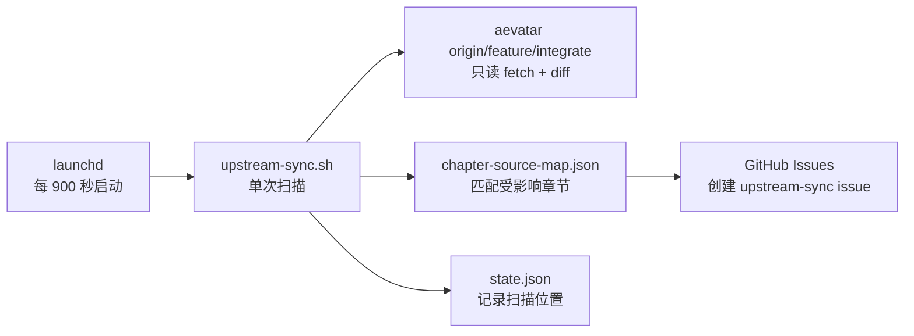

# Upstream Sync Operations Implementation Plan

> **For agentic workers:** REQUIRED SUB-SKILL: Use superpowers:subagent-driven-development (recommended) or superpowers:executing-plans to implement this plan task-by-task. Steps use checkbox (`- [ ]`) syntax for tracking.

**Goal:** 把现有 upstream-sync 手册改成任意 macOS 可执行的安装运维指南，并新增一个只负责触发、决策和安全边界的仓库级 skill。

**Architecture:** `docs/upstream-sync.md` 是唯一详细运维事实源，现有 shell 脚本和 plist 模板分别拥有同步行为与调度配置。`skills/upstream-sync-ops/SKILL.md` 只要求 agent 读取事实源、先检查后操作并按用户授权控制副作用，不复制整套命令。

**Tech Stack:** Markdown、Bash 3.2、macOS launchd、Git、GitHub CLI、jq、Agent Skills (`SKILL.md` + `agents/openai.yaml`)

## Global Constraints

- 只修改 `/Users/zhaoyiqi/Code/aevatar-review`，不得修改 `~/Code/aevatar`。
- 不修改 `scripts/upstream-sync.sh`、`.config/upstream-sync/chapter-source-map.json` 或 launchd plist 模板。
- 手册只保证 upstream-sync 定时扫描并创建 GitHub issue，不要求配置或启动 consensus-loop。
- 命令不得写死当前用户名或仓库安装目录；运行时从 `$HOME` 和 `git rev-parse --show-toplevel` 推导。
- `host.env`、生成后的 plist、日志和 `state.json` 不加入 Git。
- 默认安装标签固定为 `com.eanzhao.aevatar-review.upstream-sync`，默认间隔固定为 `900` 秒。
- 正常同步可能创建 GitHub issue；`--init` 会重建基线；卸载会改变用户 launchd 状态。执行前必须让副作用与用户请求相符。

## File Map

- Modify: `docs/upstream-sync.md` - 唯一的人类安装、验收、运维和排障手册。
- Create: `skills/upstream-sync-ops/SKILL.md` - agent 的触发条件、决策流程和安全边界。
- Create: `skills/upstream-sync-ops/agents/openai.yaml` - skill 的 UI 名称、简介和默认提示词。
- Verify only: `scripts/upstream-sync.sh` - 确认文档描述与参数、退出码、状态更新一致。
- Verify only: `.config/upstream-sync/launchd.plist.template` - 确认文档安装命令与 Label、间隔、日志路径一致。

---

### Task 1: 建立无 skill 的行为基线

**Files:**
- Create: none
- Modify: none
- Test: three isolated agent scenarios recorded verbatim in the task transcript

**Interfaces:**
- Consumes: `docs/upstream-sync.md`, `scripts/upstream-sync.sh`, `.config/upstream-sync/launchd.plist.template`
- Produces: 一份观察结果清单，列出 agent 在没有 `upstream-sync-ops` 时的实际遗漏、误判或不安全倾向；Task 3 只能针对这些结果增加指导。

- [ ] **Step 1: 启动状态判断基线场景**

使用一个不继承本次设计结论的 fresh subagent，给出下面的原始提示。要求它只输出判断过程，不执行命令或修改文件：

```text
你在 /Users/zhaoyiqi/Code/aevatar-review 工作。用户问：“这台机器有跑 upstream-sync 吗？”
只说明你会怎样查并给出结论；不要真正执行命令，不要改文件。
```

- [ ] **Step 2: 记录状态场景输出中的实际缺口**

逐字保存 subagent 的回答到任务记录，并按下列可观察标准打勾；不得把预期答案改写成实际结果：

```text
[ ] 检查 launchctl 的用户 domain，而不只看 ps
[ ] 解释短任务显示 not running 可能正常
[ ] 查看 runs 与 last exit code
[ ] 查看 stdout/stderr 日志的最近修改时间
[ ] 不执行 start、kickstart、load、bootstrap 或脚本
```

- [ ] **Step 3: 启动通用安装基线场景**

使用第二个 fresh subagent，给出下面的原始提示，并保持纯方案推演：

```text
一个新用户把 aevatar-review 克隆到 /opt/work/aevatar-review，家目录是 /Users/alice。
他要在 macOS 上每 15 分钟运行 upstream-sync，并允许它在 owner/review-repo 创建 issue。
请给出从零跑起来的操作方案。不要真正执行命令。
```

- [ ] **Step 4: 记录安装场景输出中的实际缺口**

逐字保存回答，并按下列标准检查：

```text
[ ] 检查 git、gh、jq、gh auth、目标仓库 Issues 与上游分支
[ ] host.env 只要求 AEVATAR_UPSTREAM_ROOT 与 GH_REPO_SLUG
[ ] 不写死 ~/Code/aevatar-review
[ ] 从模板生成 plist 后先运行 plutil -lint
[ ] 使用 launchctl bootstrap/kickstart/print/bootout
[ ] 不把 consensus-loop 当成前置条件
[ ] 说明普通同步可能创建真实 issue
```

- [ ] **Step 5: 启动排障安全基线场景**

使用第三个 fresh subagent，给出下面的原始提示：

```text
upstream-sync 的 launchctl 状态是 not running，runs 大于 100，last exit code 是 0，
日志显示 8 分钟前“无新提交，退出”。用户说“修好它，确保别漏 issue”。
只输出你会怎样判断和处理，不真正执行命令。
```

- [ ] **Step 6: 判定 RED 是否成立**

前面任一可观察标准失败，或出现以下任意一项，都属于可复现基线缺口；记录 subagent
原话，不得用预期答案替换实际结果：

```text
- 把 not running 当成故障并建议重启
- 未核对 last exit code、运行次数或日志时间
- 建议删除、覆盖或重新初始化 state.json
- 建议直接正常运行脚本却没有说明可能创建 issue
- 把 consensus-loop 配置列为 upstream-sync 必需条件
- 安装命令依赖固定 checkout 路径
```

如果三份回答均满足全部标准，停止创建 skill，只执行 Task 2 和 Task 5，并在交付说明中写明“基线未证明需要 skill”。这是 `writing-skills` 的 no-guidance control 要求。

---

### Task 2: 把现有手册改成通用 macOS runbook

**Files:**
- Modify: `docs/upstream-sync.md`
- Test: `scripts/check-md.sh`

**Interfaces:**
- Consumes: `scripts/upstream-sync.sh` 的 `--init`、`--dry-run`、默认模式和退出码；plist 模板的 Label、`StartInterval=900`、日志路径。
- Produces: Task 3 唯一引用的详细操作手册，章节锚点包括“安装前检查”“首次初始化”“安装 LaunchAgent”“验收”“排障”“卸载”。

- [ ] **Step 1: 重写标题、边界和任务模型**

用下面的开头替换现有的 consensus-loop 导向开头。流程图只画 upstream-sync 到 GitHub issue：

```markdown
# upstream-sync macOS 安装与运维手册

> 本文档说明如何在任意 macOS 上安装、验证和维护
> `scripts/upstream-sync.sh`。目标是每 15 分钟扫描 aevatar 上游
> `feature/integrate`，并为受影响章节创建 GitHub issue。

`upstream-sync` 不是常驻进程。launchd 每 900 秒启动脚本一次，脚本完成 fetch、diff、
映射和建 issue 后退出。因此空闲时看到 `state = not running` 通常是正常现象；是否健康要
结合 `runs`、`last exit code` 和日志时间判断。
```

紧接着加入 Mermaid 流程：



- [ ] **Step 2: 写安装前检查**

加入可直接执行的变量与检查命令。变量名固定如下：

```bash
REVIEW_ROOT="$(git rev-parse --show-toplevel)"
UPSTREAM_ROOT="/absolute/path/to/aevatar"
GH_REPO_SLUG="owner/aevatar-review"
LAUNCH_LABEL="com.eanzhao.aevatar-review.upstream-sync"
LAUNCH_DOMAIN="gui/$(id -u)"
PLIST_PATH="$HOME/Library/LaunchAgents/$LAUNCH_LABEL.plist"
```

依赖和权限检查固定如下，并说明预期结果：

```bash
test "$(uname -s)" = "Darwin"
command -v git
command -v gh
command -v jq
gh auth status
git -C "$UPSTREAM_ROOT" rev-parse --is-inside-work-tree
git -C "$UPSTREAM_ROOT" ls-remote --exit-code origin refs/heads/feature/integrate
gh repo view "$GH_REPO_SLUG" --json nameWithOwner,viewerPermission,hasIssuesEnabled
```

说明 `hasIssuesEnabled` 必须为 `true`；操作者需要足以创建并添加 `upstream-sync` label 的权限。不得要求 `DEFAULT_ISSUE_INTAKE_AUTHOR_ALLOWLIST`。

- [ ] **Step 3: 写最小 host.env 和基线初始化**

要求用户在 `$REVIEW_ROOT/.config/consensus-rnd/host.env` 中保存下面两项，不加入 Git：

```bash
export AEVATAR_UPSTREAM_ROOT="/absolute/path/to/aevatar"
export GH_REPO_SLUG="owner/aevatar-review"
```

初始化命令固定为：

```bash
cd "$REVIEW_ROOT"
export CONSENSUS_RND_HOST_ENV="$REVIEW_ROOT/.config/consensus-rnd/host.env"
bash scripts/upstream-sync.sh --init
jq '{last_processed_sha, last_run_at, filed_issue_count: (.filed_issues | length)}' \
  .config/upstream-sync/state.json
```

在命令前写明：`--init` 会用当前上游 HEAD 覆盖基线并清空 `filed_issues`，只在首次启用或明确重建基线时使用，不创建 issue。

- [ ] **Step 4: 写手动验证与状态语义表**

给出以下两种命令：

```bash
cd "$REVIEW_ROOT"
export CONSENSUS_RND_HOST_ENV="$REVIEW_ROOT/.config/consensus-rnd/host.env"
bash scripts/upstream-sync.sh --dry-run
```

```bash
cd "$REVIEW_ROOT"
export CONSENSUS_RND_HOST_ENV="$REVIEW_ROOT/.config/consensus-rnd/host.env"
bash scripts/upstream-sync.sh
```

在普通模式前标明它会为命中的新变更创建真实 GitHub issue。加入下面的语义表，准确反映当前脚本：

| 模式 | 创建 issue | 影响状态 |
|---|---:|---|
| `--init` | 否 | 覆盖基线 SHA、运行时间和已建 issue 记录 |
| `--dry-run` | 否 | 有候选 issue 时不推进 SHA；无候选的提前退出分支可能更新时间或推进 SHA |
| 默认模式 | 可能 | 扫描结束后推进 SHA，并记录成功创建的 issue |

再加入警告：当前默认模式即使某个 `gh issue create` 失败，最后仍可能推进扫描 SHA；遇到 `WARN: 建 issue 失败` 时要立即保留日志并人工核对，不得用 `--init` 处理。

- [ ] **Step 5: 写 LaunchAgent 安装**

使用当前 checkout 路径和 `$HOME` 生成 plist，不修改 Git 中的模板：

```bash
mkdir -p "$HOME/Library/LaunchAgents" "$HOME/Library/Logs"
sed \
  -e "s|YOUR_HOME/Code/aevatar-review|$REVIEW_ROOT|g" \
  -e "s|YOUR_HOME|$HOME|g" \
  "$REVIEW_ROOT/.config/upstream-sync/launchd.plist.template" > "$PLIST_PATH"
plutil -lint "$PLIST_PATH"
launchctl bootstrap "$LAUNCH_DOMAIN" "$PLIST_PATH"
launchctl kickstart -k "$LAUNCH_DOMAIN/$LAUNCH_LABEL"
```

说明路径中包含 `|` 或 `&` 时不要使用上述 `sed` 命令，应手动复制模板并替换路径后再运行 `plutil -lint`。重复安装遇到 `service already loaded` 时转到重载步骤。

- [ ] **Step 6: 写验收步骤和状态判读**

验收命令固定为：

```bash
launchctl print "$LAUNCH_DOMAIN/$LAUNCH_LABEL"
tail -n 50 "$HOME/Library/Logs/aevatar-review-upstream-sync.log"
tail -n 50 "$HOME/Library/Logs/aevatar-review-upstream-sync.err.log"
stat -f '%N | modified=%Sm | size=%z' -t '%Y-%m-%d %H:%M:%S %z' \
  "$HOME/Library/Logs/aevatar-review-upstream-sync.log" \
  "$HOME/Library/Logs/aevatar-review-upstream-sync.err.log"
jq '{last_processed_sha, last_run_at, filed_issue_count: (.filed_issues | length)}' \
  "$REVIEW_ROOT/.config/upstream-sync/state.json"
gh issue list --repo "$GH_REPO_SLUG" --label upstream-sync --state all --limit 20
```

判读表必须包含：

| 现象 | 结论 |
|---|---|
| `state = not running`、`last exit code = 0`、日志在一个间隔内更新 | 正常空闲 |
| `state = running` | 本轮脚本正在执行 |
| `last exit code != 0` | 最近一轮失败，查看 stderr |
| `launchctl print` 找不到 service | 未加载或加载到错误 domain |
| 日志超过两个间隔未更新 | 调度、休眠或配置可能异常 |

明确说明：`--dry-run` 不能证明 GitHub 写权限；真正的端到端成功标准是出现新的匹配上游变更后，日志记录 `CREATED #...`，且 `gh issue list` 能看到对应 issue。

- [ ] **Step 7: 写重载、卸载与排障**

plist 修改后的重载命令：

```bash
launchctl bootout "$LAUNCH_DOMAIN" "$PLIST_PATH"
plutil -lint "$PLIST_PATH"
launchctl bootstrap "$LAUNCH_DOMAIN" "$PLIST_PATH"
launchctl kickstart -k "$LAUNCH_DOMAIN/$LAUNCH_LABEL"
```

仅卸载调度、不删除运行状态：

```bash
launchctl bootout "$LAUNCH_DOMAIN" "$PLIST_PATH"
rm "$PLIST_PATH"
```

排障至少覆盖并给出具体检查命令：`gh auth status` 失败、上游 fetch 失败、`bootstrap failed: 5`、任务已加载但 `not running`、日志不更新、`WARN: 建 issue 失败`、重复 issue、未命中章节映射。删除现有 consensus-loop 节流旋钮和 claim 配置内容。

- [ ] **Step 8: 验证并提交手册**

Run:

```bash
git diff --check
bash scripts/check-md.sh
rg -n 'DEFAULT_ISSUE_INTAKE|ACTIVE_DESIGN_CAP|CLAIM_COOLDOWN' docs/upstream-sync.md
```

Expected:

```text
git diff --check 无输出并返回 0
check-md: OK
rg 无匹配并返回 1
```

抽查所有文档引用：

```bash
rg -n 'scripts/upstream-sync.sh|launchd.plist.template|chapter-source-map.json|state.json' docs/upstream-sync.md
```

Commit:

```bash
git add docs/upstream-sync.md
git commit -m "docs: rewrite upstream sync macOS runbook"
```

---

### Task 3: 创建最小 upstream-sync-ops skill

**Files:**
- Create: `skills/upstream-sync-ops/SKILL.md`
- Create: `skills/upstream-sync-ops/agents/openai.yaml`
- Test: `/Users/zhaoyiqi/.codex/skills/.system/skill-creator/scripts/quick_validate.py`

**Interfaces:**
- Consumes: Task 1 的实际基线缺口；Task 2 的 `docs/upstream-sync.md`。
- Produces: 可被 Codex 发现的 `upstream-sync-ops` skill，不新增运行脚本或参考文档。

- [ ] **Step 1: 用官方脚手架初始化 skill**

只有 Task 1 判定 RED 成立时执行：

```bash
python3 /Users/zhaoyiqi/.codex/skills/.system/skill-creator/scripts/init_skill.py \
  upstream-sync-ops \
  --path skills \
  --interface 'display_name=Upstream Sync 运维' \
  --interface 'short_description=安装、检查并排查 upstream-sync 定时任务' \
  --interface 'default_prompt=使用 $upstream-sync-ops 检查并维护当前仓库的 upstream-sync 定时任务。'
```

Expected: 创建 `skills/upstream-sync-ops/SKILL.md` 和 `skills/upstream-sync-ops/agents/openai.yaml`，不创建 `scripts/`、`references/` 或 `assets/`。

- [ ] **Step 2: 写最小 SKILL.md**

先删除脚手架占位内容，再写下面的骨架。`Observed baseline failures` 中只保留 Task 1 实际发生的条目，未发生的条目必须删除：

```markdown
---
name: upstream-sync-ops
description: Use when an agent is asked to install, enable, run, inspect, troubleshoot, reload, or uninstall the aevatar-review upstream-sync launchd job on macOS, including GitHub issue creation, logs, state.json, or a not-running status.
---

# Upstream Sync Operations

## Core principle

Treat `docs/upstream-sync.md` as the operational source of truth. Inspect before acting, preserve
the read-only upstream boundary, and match every side effect to the user's request.

## Required context

1. Resolve the repository root with `git rev-parse --show-toplevel`.
2. Read `docs/upstream-sync.md` completely.
3. Read `scripts/upstream-sync.sh` or `.config/upstream-sync/launchd.plist.template` only when the
   request depends on their current behavior.

Do not copy host paths, usernames, repository slugs, or branch facts into this skill.

## Operation contract

| Request | Allowed action |
|---|---|
| Status or troubleshooting | Read-only checks only |
| Install, enable, reload, or start | Follow the matching runbook section after resolving exact paths and launchd domain |
| Initialize | Explain that `--init` replaces the baseline and filed-issue ledger before running it |
| Run a scan | Explain that default mode may create GitHub issues; use `--dry-run` only when previewing is requested |
| Uninstall | Resolve the exact label and plist first; remove only launchd registration and plist unless broader deletion is explicit |

Never modify the upstream repository. Never delete or rewrite `state.json` as a generic repair.

## Status interpretation

This is an interval job, not a daemon. `state = not running` is healthy when the last exit code is
zero and logs are recent. Distinguish four states: not installed, loaded and idle, currently
running, and loaded with a failed last run.

## Reporting

Report the resolved LaunchAgent label and domain, loaded/running state, run count, last exit code,
latest stdout/stderr timestamps, state-file timestamp, and whether an actual issue creation was
observed. Do not claim GitHub write success from `--dry-run` alone.
```

根据 Task 1 的实际结果做最小增补，使用下面的确定映射；未出现的失败不得增加对应句子：

| Task 1 的实际失败 | 增加位置 | 增加的原文 |
|---|---|---|
| 只查看进程 | `Status interpretation` | `Query the user launchd domain before checking transient processes.` |
| 把空闲视为故障 | `Status interpretation` | `Do not restart a loaded interval job solely because it is currently idle.` |
| 建议重置状态 | `Operation contract` 后 | `Preserve state.json during troubleshooting unless the user explicitly requests a new baseline.` |
| 未提示普通模式副作用 | `Operation contract` 后 | `Before a default-mode scan, state that matching changes can create real GitHub issues.` |
| 把下游消费当作前置 | `Required context` 后 | `Do not require consensus-loop configuration to install or validate upstream-sync.` |
| 写死 checkout 路径 | `Required context` 后 | `Derive the checkout path from git; never assume ~/Code/aevatar-review.` |

- [ ] **Step 3: 检查并固定 openai.yaml**

最终内容必须是：

```yaml
interface:
  display_name: "Upstream Sync 运维"
  short_description: "安装、检查并排查 upstream-sync 定时任务"
  default_prompt: "使用 $upstream-sync-ops 检查并维护当前仓库的 upstream-sync 定时任务。"
```

- [ ] **Step 4: 运行结构验证**

Run:

```bash
python3 /Users/zhaoyiqi/.codex/skills/.system/skill-creator/scripts/quick_validate.py \
  skills/upstream-sync-ops
rg -n 'T[B]D|T[O]DO|YOUR_HOME|/Users/zhaoyiqi' skills/upstream-sync-ops
```

Expected:

```text
Skill is valid!
rg 无匹配并返回 1
```

- [ ] **Step 5: 提交 skill 初版**

```bash
git add skills/upstream-sync-ops/SKILL.md skills/upstream-sync-ops/agents/openai.yaml
git commit -m "docs: add upstream sync operations skill"
```

---

### Task 4: 用相同场景验证 skill 并收紧指导

**Files:**
- Modify if needed: `skills/upstream-sync-ops/SKILL.md`
- Verify: `skills/upstream-sync-ops/agents/openai.yaml`
- Test: Task 1 的三个原始提示

**Interfaces:**
- Consumes: Task 1 的原始 prompt 和输出；Task 3 的 skill。
- Produces: 能修复已观察缺口、且不扩张为第二份 runbook 的最终 skill。

- [ ] **Step 1: 加载 skill 重跑三个场景**

分别启动 fresh subagent，并用统一前缀加 Task 1 的原始提示：

```text
Use $upstream-sync-ops at skills/upstream-sync-ops/SKILL.md for this request.
```

仍然要求只输出判断或操作方案，不执行命令、不改文件。逐字记录三份回答。

- [ ] **Step 2: 比较 RED 与 GREEN**

对 Task 1 的每个实际失败点建立一一对应结果：

```text
baseline 原话 → skill 中的规则 → GREEN 回答中的改正证据
```

Expected: 所有基线失败点均有改正证据；没有把 `docs/upstream-sync.md` 的完整命令复制进 skill。

- [ ] **Step 3: 只修实际出现的新缺口**

如果 GREEN 回答出现新的不安全操作或状态误判，在对应契约或状态判断段增加一条直接规则，然后只重跑失败场景。不要增加未被场景证明需要的背景说明。

- [ ] **Step 4: 复核 skill 体积和结构**

Run:

```bash
wc -w skills/upstream-sync-ops/SKILL.md
python3 /Users/zhaoyiqi/.codex/skills/.system/skill-creator/scripts/quick_validate.py \
  skills/upstream-sync-ops
git diff --check
```

Expected: `SKILL.md` 少于 500 个英文空格分隔词；skill 验证通过；diff check 无输出。

- [ ] **Step 5: 提交验证后的收紧修改**

只有文件发生变化时执行：

```bash
git add skills/upstream-sync-ops/SKILL.md
git commit -m "docs: tighten upstream sync operations guidance"
```

---

### Task 5: 仓库级最终验证与交付检查

**Files:**
- Verify: `docs/upstream-sync.md`
- Verify: `skills/upstream-sync-ops/SKILL.md`
- Verify: `skills/upstream-sync-ops/agents/openai.yaml`

**Interfaces:**
- Consumes: Tasks 2-4 的最终文件和测试记录。
- Produces: 可交付的通用 runbook 与仓库级 skill；不改变当前机器的 LaunchAgent 或 GitHub issue。

- [ ] **Step 1: 运行完整静态验证**

```bash
bash scripts/check-md.sh
if [ -d skills/upstream-sync-ops ]; then
  python3 /Users/zhaoyiqi/.codex/skills/.system/skill-creator/scripts/quick_validate.py \
    skills/upstream-sync-ops
fi
plutil -lint .config/upstream-sync/launchd.plist.template
git diff --check
```

Expected:

```text
check-md: OK
如果 Task 3 创建了 skill：Skill is valid!
.config/upstream-sync/launchd.plist.template: OK
git diff --check 无输出
```

- [ ] **Step 2: 验证范围边界**

```bash
git status --short
git diff --name-only HEAD~3..HEAD
if [ -d skills/upstream-sync-ops ]; then
  VERIFY_PATHS=(docs/upstream-sync.md skills/upstream-sync-ops)
else
  VERIFY_PATHS=(docs/upstream-sync.md)
fi
rg -n 'DEFAULT_ISSUE_INTAKE|ACTIVE_DESIGN_CAP|CLAIM_COOLDOWN' "${VERIFY_PATHS[@]}"
rg -n '/Users/zhaoyiqi|~/Code/aevatar-review' "${VERIFY_PATHS[@]}"
```

Expected: 变更只涉及设计说明、实施计划、runbook 和 skill；两个 `rg` 命令均无匹配。设计说明中的本地事实不参与这两个扫描。

- [ ] **Step 3: 检查没有意外修改运行态**

```bash
git status --short -- .config/upstream-sync/state.json
stat -f '%N | modified=%Sm' -t '%Y-%m-%d %H:%M:%S %z' \
  "$HOME/Library/LaunchAgents/com.eanzhao.aevatar-review.upstream-sync.plist" \
  "$HOME/Library/Logs/aevatar-review-upstream-sync.log" 2>/dev/null
```

Expected: `state.json` 没有进入 Git 变更；本任务没有执行 bootstrap、bootout、kickstart、`--init` 或普通同步，因此 LaunchAgent 与日志不会因实施动作改变。

- [ ] **Step 4: 给出交付摘要**

最终报告必须包含：

```text
- runbook 的新入口和适用范围
- skill 的触发范围和副作用边界
- RED/GREEN 场景观察到的真实改进
- 所有验证命令及结果
- 明确说明本任务没有重装、重启或卸载当前机器的 LaunchAgent
```

若最后还有未提交的实现变更，按文件归属提交；不要推送远端，除非用户另行明确要求。
