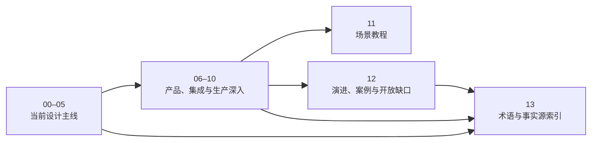
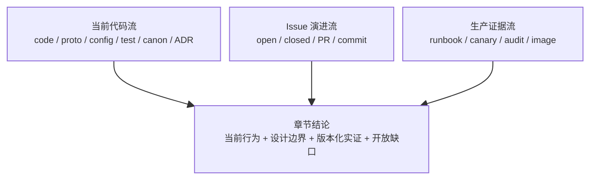

# Aevatar Review 全库重构设计

> 批准日期：2026-07-25
>
> 文档仓库：`~/Code/aevatar-review`
>
> 只读事实源：`~/Code/aevatar`
>
> 上游基线：`feature/integrate @ f02aa690bbebb9cabeac30a553d737486b0eb661`
>
> Issue 快照：2026-07-25 的 126 个 open issues，以及 2026-07-06 至 2026-07-25 关闭的 154 个 issues

## 1. 背景与目标

`aevatar-review` 是 Aevatar 的结构化中文解读仓库，不是 Aevatar 源码仓库。所有关于 Aevatar 当前行为、协议、状态和生产边界的论断，必须能够回指只读事实源 `~/Code/aevatar` 中的代码、配置、proto、测试、canon 或 ADR。

现有仓库已经从最初规划的 43 篇扩展到 83 篇实质章节、约 1.1 万行正文，但目录仍保留了演进过程中的多套分类：基础教程、当前设计、方案草案、已知问题和按周复盘处在平行层级。与此同时，上游在 2026-07-06 之后发生了密集演进，Conversation/Turn、ChatHistory、NyxIdChat、Agent Profile、WorkOrder、workflow capability admission、调度凭证、Audit lifecycle 和 managed Codex 等主题已经成为理解当前系统不可绕过的主链。

本次工作的目标不是逐文件机械刷新，而是：

1. 以当前上游基线重新核验全书事实；
2. 用面向读者心智模型的信息架构替代历史堆积结构；
3. 让新读者能够沿一条主线理解系统，让维护者能够继续下钻协议、状态、不变量和生产故障；
4. 将已落地设计、历史演进、生产实证和开放缺口严格分层；
5. 删除失效和重复章节，合并同一责任边界下的内容，并为新主链补齐章节；
6. 建立可重复的全量校验、迁移账本和 issue 对账机制。

## 2. 已确认的范围与边界

### 2.1 时间和事实基线

- 当前代码事实固定在 `~/Code/aevatar` 的 `feature/integrate @ f02aa690bbebb9cabeac30a553d737486b0eb661`。
- “近期 closed issues”固定为关闭日期落在 2026-07-06 至 2026-07-25 的 154 个 issues。
- Open issues 使用 2026-07-25 的完整快照，共 126 个。
- 执行期间即使上游继续提交，本轮也不移动基线；新变化进入下一轮 upstream sync。

### 2.2 读者模型

全书采用“分层兼顾”模型：

- 新读者先得到概念主线、最小示例和两类图；
- 维护者可以继续阅读 typed contract、状态所有权、ACK 强度、版本、水位、幂等、恢复与生产证据；
- 章节不按源码目录机械切分，而按读者问题、资源所有权和协议边界切分。

### 2.3 Issue 使用口径

- 已关闭且实现已进入当前基线：融入当前设计，issue 只解释演进原因。
- 已关闭但未合并、实现失败、只形成设计或已经被替代：不得写成当前能力。
- Open issue：只作为缺口、风险、争议或目标态，不混入当前主链。
- 故障复盘：只保留能够揭示长期设计边界的案例；纯时间性、已失效且没有独立教训的文章删除或合并。

### 2.4 外部系统边界

NyxID、Chrono Sandbox、Ornn 等外部系统只从 Aevatar 视角解释：

- Aevatar 如何调用已发布契约；
- Aevatar 如何做身份与授权映射；
- Aevatar 如何保存 typed reference；
- Aevatar 如何处理失败、补偿和审计。

本仓库不扩展成外部系统源码解读项目，也不把外部产品的未来路线写成 Aevatar 的当前事实。

### 2.5 源码和工作区边界

- `~/Code/aevatar` 全程只读，不得由本任务修改。
- `aevatar-review` 当前工作区已有用户修改；它们全部视为受保护输入。
- 重组可以新增、删除、合并和拆分章节，但不得通过 reset、checkout 或整文件覆盖丢失用户内容。
- 新增独立主题必须先输出 `SCOPE_EXTEND`、建立对应 issue，再进入正文实施。

## 3. 方案选择

### 3.1 已比较的方案

#### 方案 A：分层重建、择优迁移（采用）

保留准确且有解释力的内容，但不把旧目录结构视为兼容契约。全书重组为当前设计主线、产品与生产深入、实践与演进三层。

优点：

- 能彻底分开当前设计、方案草案、故障记录和历史组件；
- 能保留已有生产案例和关键辨析；
- 新读者和维护者可以共享同一套术语与事实主干。

代价：

- 需要全量迁移链接、索引、导航和事实源映射；
- 需要为每篇旧章做显式处置；
- 必须先建立核心术语，不能同时重写相互定义的章节。

#### 方案 B：原位修订、少量增删（未采用）

保留现有 `00–12` 结构，只更新事实并追加章节。改动面较小，但 NyxIdChat、WorkOrder、调度凭证、Studio 身份和故障案例仍会散落在多个层级，无法解决根本的信息架构问题。

#### 方案 C：全书从零重写（未采用）

删除大部分现有章节后从头规划。结构最干净，但会损失已经核验的生产证据、故障复盘和设计辨析，遗漏风险也最高。

### 3.2 核心取舍

采用方案 A。旧章节不是默认保留对象；只有仍准确、独立且有解释价值的内容才迁入新结构。Git 历史承担被删除内容的归档职责，不保留只写“已迁移”的空壳章节。

## 4. 全书信息架构

新结构分为“当前设计主线 → 产品与生产深入 → 实践、演进与参考”三层。



| 层次 | 目录 | 核心问题 |
|---|---|---|
| 主线 | `00` 导读与版本基线 | 文档讲什么、以哪个提交为准、如何阅读 |
| 主线 | `01` 启动与请求全景 | 如何跑起来；Host、API、Conversation、Turn、SSE 如何串联 |
| 主线 | `02` Actor 运行内核 | Agent、Actor、Runtime、Envelope、EventStore、State、Topology 的边界 |
| 主线 | `03` Workflow 编排 | YAML、definition/run actor、执行内核、primitive、saga 与挂起恢复 |
| 主线 | `04` AI 执行与工具 | LLM streaming、ToolLoop、provider、工具准入、prompt overlay |
| 主线 | `05` CQRS、Projection 与 Audit | committed fact 如何物化为 read model、实时观察与审计事实 |
| 深入 | `06` 产品资源与身份模型 | Scope、Team、Member、draft workflow、published service、binding、WorkOrder 为什么不能混同 |
| 深入 | `07` Conversation、NyxIdChat 与 Agent Profile | ChatHistory、turn authority、profile snapshot、request-local tool catalog 和多轮会话 |
| 深入 | `08` Ingress、Channel、文件与语音 | 通用入站/出站骨干、Lark adapter、附件引用、Voice 媒体与控制面边界 |
| 深入 | `09` Automation、调度与凭证 | Scheduled actor、durable callback、dedicated Agent Key、Vault reference、吊销补偿 |
| 深入 | `10` 分布式与生产运行 | Orleans、Garnet、Kafka 现状、安全与授权、managed Codex sandbox、可观测性 |
| 实践 | `11` 场景教程与 Cookbook | 从最小 workflow 到 Team、Channel、定时任务和生产排障的可复现路径 |
| 演进 | `12` 架构演进、案例与开放缺口 | issue 决策、已退役路径、长期有效的故障案例、open issues 目标态 |
| 参考 | `13` 术语与事实源索引 | 术语表、canon/ADR 导读、章节—事实源映射、版本清单 |

结构规则：

- 现有 `09 方案区` 不再作为平行架构。已落地部分迁入当前章节，未落地部分进入 `12`。
- 现有 `10 已知问题` 取消“一次故障一章”的默认形式；长期案例合并，短期噪声删除。
- 现有按周复盘改为按主题组织，并保留时间和 issue 索引。
- A2A、MassTransit、StateMirror、旧 SkillRunner 等退役组件不再与现役能力等权展示。
- 删除旧路径后同步更新 README、PLAN、导航、索引、资产和 upstream-sync 映射，不留兼容空壳。

## 5. 目标章节清单

目标骨架为 14 个目录、72 篇实质章节。目录 `index.md` 只承担导读和阅读顺序，不计入实质章节。72 是首轮范围边界，不是为凑数量而设定的指标；证据核验后可以合并，新增独立主题则必须重新走 `SCOPE_EXTEND`。

### 5.1 `00–05`：当前设计主线（31 篇）

#### `00` 导读与基线

- `00/01-reading-guide.md`
- `00/02-version-evidence-and-status.md`
- `00/03-repository-map.md`

#### `01` 启动与请求

- `01/01-quick-start.md`
- `01/02-hosts-and-composition.md`
- `01/03-chat-conversation-turn-contract.md`
- `01/04-request-streaming-lifecycle.md`

#### `02` Actor 内核

- `02/01-agent-actor-runtime.md`
- `02/02-envelope-command-event-query.md`
- `02/03-gagent-event-pipeline.md`
- `02/04-state-event-sourcing-and-guard.md`
- `02/05-dispatch-routing-and-topology.md`
- `02/06-local-runtime-and-lifecycle.md`

#### `03` Workflow

- `03/01-workflow-model-and-identities.md`
- `03/02-yaml-schema-and-validation.md`
- `03/03-execution-kernel-and-outcomes.md`
- `03/04-primitives-catalog.md`
- `03/05-pause-signal-approval-and-resume.md`
- `03/06-saga-compensation-and-recovery.md`
- `03/07-connectors-and-capability-admission.md`

#### `04` AI 执行

- `04/01-role-agent-and-streaming-run.md`
- `04/02-llm-providers-and-route-selection.md`
- `04/03-tool-loop-catalog-and-presentation.md`
- `04/04-tool-approval-and-authorization.md`
- `04/05-prompt-overlays-and-agent-context.md`

#### `05` CQRS 与 Audit

- `05/01-command-event-projection-readmodel.md`
- `05/02-committed-state-and-observation.md`
- `05/03-projection-lifecycle-and-leases.md`
- `05/04-readmodel-stores-versioning-and-rebuild.md`
- `05/05-workflow-agui-and-live-observation.md`
- `05/06-audit-trail-lifecycle-and-export.md`

### 5.2 `06–10`：产品、集成与生产深入（27 篇）

#### `06` 产品资源与身份

- `06/01-scope-team-member-resource-model.md`
- `06/02-draft-revision-binding-and-published-service.md`
- `06/03-catalog-visibility-and-scope-authorization.md`
- `06/04-studio-commands-acks-and-readmodels.md`
- `06/05-work-orders-and-durable-intent.md`

#### `07` Conversation 与 NyxIdChat

- `07/01-conversation-turn-and-chat-history.md`
- `07/02-nyxid-chat-actor-model-and-progress.md`
- `07/03-agent-profile-and-immutable-binding.md`
- `07/04-turn-authority-tool-catalog-and-retry.md`

#### `08` Ingress 与 Channel

- `08/01-ingress-normalization-and-routing.md`
- `08/02-channel-runtime-and-credential-boundary.md`
- `08/03-lark-delivery-interaction-and-repair.md`
- `08/04-file-artifacts-and-attachments.md`
- `08/05-voice-control-and-media-planes.md`

#### `09` Automation 与调度

- `09/01-automation-resource-api-and-readmodels.md`
- `09/02-scheduled-actor-callback-and-fire.md`
- `09/03-owner-authorization-and-agent-key.md`
- `09/04-vault-reference-and-revocation-compensation.md`
- `09/05-production-canary-and-recovery.md`

#### `10` 分布式与生产

- `10/01-production-topology-and-configuration.md`
- `10/02-orleans-runtime.md`
- `10/03-garnet-clustering-and-secret-storage.md`
- `10/04-streaming-transport-and-kafka.md`
- `10/05-authentication-scope-and-admin-authorization.md`
- `10/06-managed-codex-sandbox-and-delegation.md`
- `10/07-observability-status-and-observatory.md`
- `10/08-architecture-and-security-guards.md`

### 5.3 `11–13`：实践、演进与参考（14 篇）

#### `11` 场景教程

- `11/01-run-a-simple-workflow.md`
- `11/02-build-a-branching-tool-workflow.md`
- `11/03-create-bind-and-invoke-a-team-member.md`
- `11/04-connect-a-channel-and-handle-files.md`
- `11/05-create-verify-and-troubleshoot-automation.md`

#### `12` 演进与缺口

- `12/01-evolution-method-and-timeline.md`
- `12/02-issue-decisions-by-theme.md`
- `12/03-retired-and-superseded-components.md`
- `12/04-incident-case-studies.md`
- `12/05-open-gaps-and-canon-drift.md`

#### `13` 参考索引

- `13/01-glossary.md`
- `13/02-canon-and-adr-index.md`
- `13/03-chapter-source-matrix.md`
- `13/04-issue-evolution-index.md`

### 5.4 明确新增或提升的主题

- Conversation / Turn 服务端身份契约；
- ChatHistory 的所有权、续聊注入与终态写入；
- NyxIdChat actor、committed progress 与 turn authority；
- Agent Profile immutable binding、版本与 prompt overlay；
- request-local / turn-local tool catalog；
- WorkOrder durable intent coordination；
- workflow capability readiness 与 bind admission；
- workflow catalog 的 scope visibility；
- projection rebuild 与灾备语义；
- Audit lifecycle、terminal outcome 与 export；
- dedicated scheduled Agent Key、Vault reference 与双轨吊销；
- managed Codex sandbox、delegation 与当前安全债务。

Open issues 中尚未落地的 stop、steering、task plan、reconnect observation 等，不预先创建 current 章节；它们进入 `12/05`，待代码落地后再评估提升。

## 6. 章节内容契约

### 6.1 双层阅读结构

每篇实质章节遵循同一套结构：

1. **版本与结论**：上游基线、核验日期、current/historical/target 状态；
2. **设计抽象与事实源**：只列 1–3 个支撑整章的高价值路径和行号锚点；
3. **先建立模型**：用静态图说明职责、状态所有者和依赖方向；
4. **沿一条链路走读**：用时序、流程或状态图解释动态行为；
5. **为什么这样设计**：比较至少一个替代方案，说明不变量与代价；
6. **协议与状态深入**：typed contract、ACK、版本、水位、幂等和失败恢复；
7. **最小示例**：可运行命令、YAML、请求或可验证输入输出；不适用时说明原因；
8. **边界与演进**：当前、历史、生产实证和 open gap 分层；
9. **读完应能回答**：3–5 个章节验收问题。

正文不得退化为源码文件名和行号表。需要补充细粒度证据时，在章末使用折叠的“论断—证据映射”。协议、proto 或核心抽象仅在摘抄能显著帮助理解时放入 `<details>`。

### 6.2 图的内容契约

每篇实质章节至少包含两张职责不同的图：

- 一张静态图：分层、资源关系、状态所有权或信任边界；
- 一张动态图：时序、状态机、数据流或失败恢复。

索引页不机械要求两张图。专题章节不得用两张内容近似的图凑数。复杂拓扑确有必要时才新增 PNG，默认使用 Mermaid，并统一采用上游文档规定的初始化配置。

### 6.3 章节状态

| 状态 | 含义 |
|---|---|
| `current` | 当前设计与可用能力 |
| `mixed` | 主体当前有效，但含明确隔离的历史或目标态 |
| `historical` | 只保留长期设计教训，不可作为使用指南 |
| `target` | 尚未落地，只存在于演进层 |

`current` 章节不得让 open issue 或 Proposed ADR 主导正文；`historical` 和 `target` 章节不得进入新读者默认主线。

### 6.4 最小 frontmatter

所有实质章节使用：

```yaml
---
status: current
upstream_commit: f02aa690bbebb9cabeac30a553d737486b0eb661
verified_at: 2026-07-25
---
```

索引页可以使用 `status: index`，并免除两张图和最小 demo 要求。正文仍应显示“版本与结论”，不能把关键信息只藏在 frontmatter。

## 7. 证据等级与论断规则

| 等级 | 证据 | 可支持的表述 |
|---|---|---|
| E1 | 当前基线中的代码、proto、配置、测试 | 当前实现具有该行为 |
| E2 | 与代码一致的 canon、Accepted ADR、架构门禁 | 这是被声明并治理的设计边界 |
| E3 | 带 commit、镜像或日期的生产运行证据 | 该版本在该环境中被实际验证 |
| E4 | closed issue，且能定位到已落地代码或合并提交 | 为什么演进成当前设计 |
| E5 | open issue、Proposed ADR、未合并方案 | 缺口、风险或目标态 |
| E6 | 已删除代码、历史 commit、被替代 ADR | 历史与设计教训 |

关键规则：

- Issue 的 open/closed 状态本身不证明实现状态。
- Closed issue 无代码、契约或合并证据时，不进入当前设计。
- 当前代码与 canon 冲突时，以代码描述当前行为，并登记 canon drift。
- 生产实测只证明指定部署版本，不能无条件外推到当前 HEAD。
- 外部系统只引用已发布契约和 Aevatar adapter；外部 issue 不定义 Aevatar 当前事实。
- 数量、模块清单、默认端口、API 字段等易漂移信息必须从固定基线重新生成或核验。

## 8. 代码、提交与 issue 对账

### 8.1 三条独立证据流



- 当前代码流回答“`f02aa690` 现在是什么”。
- Issue 演进流回答“为什么变成这样、哪些问题仍未解决”。
- 生产证据流回答“哪个部署版本曾在真实环境中证明了什么”。

三条流冲突时，正文保留冲突，不强行合成一个更整齐但不真实的结论。

### 8.2 Closed issue 分类

154 个近期 closed issues逐个归入一种状态：

| 分类 | 判定依据 | 文档用途 |
|---|---|---|
| `landed-current` | 实现已进入当前基线且语义仍存在 | 融入当前设计，issue 解释演进 |
| `landed-superseded` | 曾经落地但当前已替换或删除 | 只进入历史演进 |
| `design-only` | 形成设计或共识但实现未进入当前基线 | 标为 target/design |
| `ops-verified` | 关闭依据主要是部署、canary 或恢复 | 版本化生产证据 |
| `duplicate/replaced` | 被另一 issue、PR 或契约替代 | 指向权威替代项 |
| `failed/abandoned` | 实现失败、无合并证据或主动放弃 | 失败教训或删除 |
| `administrative` | 看板、自动 fork、跟踪或无设计语义 | 不进入正文 |

Closed 和 `merged` 标签仍不是充分证据；必须在当前基线找到对应类型、字段、路由、测试、门禁或明确删除事实。

### 8.3 Open issue 分类

126 个 open issues按稳定主题归并：

- 影响当前正确性的 confirmed bug；
- 已承认的安全债务；
- 当前模型缺失的协议或产品能力；
- 设计提案与架构争议；
- 运维、前端体验或测试稳定性；
- blocked、duplicate、tracking 等非功能状态。

只有前三类且明确影响某章边界的 issue 才进入该章“开放缺口”；其余集中在 `12` 的主题索引。

### 8.4 单个论断的核验路径

1. 在当前基线找到权威实现或契约；
2. 检查测试、门禁或调用方是否支持同一语义；
3. 检查 canon/ADR 是否一致并记录状态；
4. 查找窗口内相关 closed issues与 PR；
5. 确认实现没有被后续提交取代；
6. 生产结果绑定具体 commit、镜像、日期和环境；
7. 登记章节证据映射，再用设计语言写正文。

如果第 1 步找不到当前实现，即使 issue 已关闭，也不能进入 current 章节。

### 8.5 对账产物

- **迁移账本**：旧章节、处置方式、新落点、保护内容和完成状态；
- **Issue 演进索引**：154 个 closed 与 126 个 open 的主题归属、分类和文档落点；
- **章节事实源矩阵**：每章 1–3 个脊柱事实源、canon/ADR、重要 issue 和核验基线。

这些索引使用中文 Markdown，不引入另一个不透明的私有数据库。行政噪声保留分类结果，但不扩写正文。

### 8.6 异常处理

- GitHub API 超时：重试并使用 REST 搜索回退；仍失败则标为未完整核验。
- Issue 无 PR、PR 不可见或提交关联不清：只能归为 design/unknown。
- Issue 说已修但当前代码不支持：以当前代码为准，issue 归为 superseded 或 drift。
- Canon 与代码冲突：正文描述当前代码，在 `12` 登记 drift。
- 本地代码比 GitHub issue 状态更新：仍以本地基线写当前实现，但注明二者不是同一状态系统。
- 生产 canary 与当前 HEAD 不同：只写指定版本已验证。

## 9. 迁移、合并与删除机制

### 9.1 逐章处置状态

| 状态 | 适用条件 | 处理方式 |
|---|---|---|
| `retain-rewrite` | 主题边界仍正确，但事实或解释已过时 | 在新目录重写并重新核验 |
| `merge` | 多篇围绕同一状态所有者或协议链路 | 合成一篇，删除重复背景和结论 |
| `split` | 一篇同时解释多个独立资源或协议 | 拆成边界清楚的多篇 |
| `promote-current` | 原方案或故障修复已成为正式设计 | 去掉方案口吻，迁入当前设计 |
| `move-evolution` | 有长期价值但不是当前使用路径 | 迁入 `12`，标 historical/target |
| `delete` | 已失效、重复且无独立教训 | 删除文件，由 Git 历史归档 |

迁移依次回答：

1. 该事实在 `f02aa690` 是否仍存在？
2. 唯一所有者、协议和消费场景是什么？
3. 新读者是否需要在主线中知道？
4. 是否有无法被其他章节替代的长期教训？
5. 生产实测是否只适用于特定版本？

### 9.2 重点重组方向

- Actor、Event、State、Projection 的核心辨析重组到 `02` 和 `05`。
- Workflow 更新工具失败终态、scope catalog 和外部能力准入等新事实。
- Studio、Console、workflow service 和身份问题统一进入 `06`。
- Lark、Channel、文件和 Voice 按 ingress/delivery backbone 组织，平台 adapter 不构成第二套架构。
- NyxIdChat、ChatHistory、Agent Profile 和 turn-local catalog 组成完整的 `07`。
- 调度当前 Agent Key 模型进入 `09`；旧换票路径、SkillRunner 历史和版本化 canary 教训进入 `12`。
- WorkOrder、managed Codex、Audit lifecycle 等形成独立契约的能力新增专题。
- workflow-as-NyxID-service 等旧方案重新核验：落地部分转当前模型，未落地自动注册转 target。
- A2A、MassTransit、StateMirror 等退役路径仅在有架构教训时保留短篇历史说明。
- 周复盘不保留重复正文，改成按主题聚合的决策记录和日期/issue 索引。

### 9.3 受保护内容

设计阶段已观察到工作区至少包含以下用户修改，实施开始前必须重新冻结完整状态：

- `07/12-scheduled-tasks.md`
- `07/index.md`
- `09/03-provision-and-observe-via-nyxid/index.md`
- `09/03-provision-and-observe-via-nyxid/02-scheduled-agent-key-production-canary.md`
- `10/index.md`
- `PLAN.md`
- `mkdocs.yml`

上表不是永久封闭清单；实施开始时出现的其他用户改动同样自动成为受保护输入。迁移前记录工作区 diff、文件内容和迁移意图。scheduled Agent Key 的生产证据迁入新 `09/12` 时，不得被覆盖、还原或混入无关提交。

### 9.4 迁移顺序

```text
旧章盘点
  → 当前代码/契约/issue 复核
  → 写入迁移账本
  → 创建新章节并迁移有效内容
  → 核对保护内容与生产证据
  → 更新所有入站链接、索引和资产
  → 确认新结构完整
  → 最后删除旧路径
```

删除旧路径前必须满足：

- 有价值内容已经进入明确新落点；
- 所有仓内链接已改写；
- README、PLAN、导航和事实源映射已同步；
- Git 历史足以追溯旧内容；
- 全仓搜索不到旧路径的活跃引用。

## 10. 实施批次

### 批次 1：治理基线

- 输出 `SCOPE_EXTEND`，为新增章节建立独立 issue；
- 冻结上游 SHA、issue 快照和用户工作区 diff；
- 创建迁移账本、issue 分类账本和事实源矩阵；
- 调整校验脚本，使全量模式可用。

### 批次 2：当前设计脊柱

完成 `00–05`，先建立全书统一术语、消息语义、状态所有权和投影口径。后续章节不得另起冲突模型。

### 批次 3：产品与对话模型

完成 `06–07`，重点处理身份分离、Conversation、ChatHistory、NyxIdChat、Agent Profile 和 WorkOrder。

### 批次 4：集成与生产模型

完成 `08–10`，迁移受保护的 scheduled Agent Key 生产证据，并重新核验 Channel、Voice、Orleans、Garnet、Kafka、安全与 managed Codex。

### 批次 5：教程、演进和参考

完成 `11–13`。教程建立在前四批已核验契约上；演进层归档 issue 决策、历史组件和 open gaps。

### 批次 6：结构切换

更新 README、PLAN、所有 `index.md`、站点导航、资产和 upstream-sync 映射；确认新结构完整后删除旧路径，不保留迁移空壳。

### 批次 7：全书一致性复核

逐章检查身份、术语、版本、状态、图、事实源和链接，最后执行结构、Mermaid、路径、链接和人工内容验收。

每批是独立验收点。前一批建立的术语和事实矩阵是后一批输入，因此不能并行重写相互定义同一核心概念的章节。

## 11. 验证设计

### 11.1 校验工具升级

现有 `scripts/check-md.sh` 优先检查工作区差异，不能证明全书一致。本次同步升级：

- 增加 `bash scripts/check-md.sh --all` 全量模式；
- 从 PLAN 或独立清单读取目标章节，检查缺失、重复和孤儿文件；
- 校验 frontmatter、一级标题、状态和核验基线；
- 校验事实源路径存在，并检查 `:line` 或 `#Lline` 未超过文件实际行数；
- 检查实质章节至少有两张职责不同的图；
- 检查事实源入口、设计正当性、边界与演进、验收问题等内容契约；
- 检查仓内 Markdown 链接、图片和章节锚点；
- 更新 `.config/upstream-sync/chapter-source-map.json`，覆盖 `00–13` 的 current/mixed 章节；
- 使用真实 Mermaid 引擎全量解析，不以超时或跳过冒充通过；
- 增加旧基线、旧数字、旧路径和退役组件的漂移扫描。

这些脚本和配置属于文档系统本身，可以随章节修订；不得因此修改上游源码。

### 11.2 分层验收

| 层级 | 验收内容 |
|---|---|
| 文件级 | 文件存在、非空、frontmatter 合法、标题与状态一致 |
| 章节级 | 事实源、两类图、设计正当性、协议/状态、最小示例、边界、验收问题齐全 |
| 事实级 | 高价值路径与行号有效；current 论断必须有 E1，E2/E4 只能补充设计约束与演进原因 |
| 目录级 | 章节边界不重叠，索引说明阅读顺序和前置知识 |
| 全书级 | 身份、术语、状态所有权、ACK 强度、版本和历史口径一致 |
| 演进级 | 154 个 closed 和 126 个 open issues各分类一次 |
| 迁移级 | 每个旧章节都有处置和新落点；删除路径没有活跃入站链接 |
| 保护级 | 用户修改中的事实、措辞意图和生产证据均有明确新落点 |
| 源码边界 | `~/Code/aevatar` 前后状态一致，没有本任务造成的写入 |
| 独立检查 | 自动门禁后再做独立内容 review，满足 FI-001 |

### 11.3 Demo 的诚实状态

| 状态 | 含义 |
|---|---|
| `verified-static` | 请求、YAML、字段和路径已按当前代码静态核验 |
| `verified-local` | 在本地实际运行并记录命令和结果 |
| `verified-production-versioned` | 有指定版本、日期和环境的生产证据 |

需要真实凭证、外部服务或生产权限而无法执行的 demo 只能标 `verified-static`。编译通过、HTTP `202`、模型自述成功或历史 canary 均不能冒充本次端到端运行结果。

### 11.4 失败与冲突处理

- 找不到当前实现证据：删除论断或降级为 historical/target。
- Issue 与代码矛盾：以代码写现状，在 `12` 记录 drift。
- Canon 与代码矛盾：不替上游修改 canon，只登记差异。
- Demo 无法执行：保留静态核验和具体阻塞条件，不宣称成功。
- Mermaid 或链接失败：修复后重新全量验证，不用局部豁免掩盖。
- 发现新独立主题：先 `SCOPE_EXTEND`、建 issue、更新清单，再写正文。
- 受保护内容无法无损迁移：停止对应删除并报告冲突。
- 上游继续变化：不移动本轮基线。

## 12. 完成定义

只有同时满足以下条件，才可以报告全库修订完成：

1. 新 `00–13` 结构完整，所有计划章节和索引存在；
2. 每个旧章节都有可审计处置，过时路径已删除；
3. README、PLAN、AGENTS.md 中的旧“43 篇”口径、站点入口、导航和 upstream-sync runbook 已同步；
4. 154 个近期 closed issues与 126 个 open issues已完成分类和主题映射；
5. 所有实施开始时存在的用户工作区内容完成无损迁移；
6. `check-md --all`、Mermaid、链接、事实源锚点和漂移扫描全部通过；
7. 关键主线、身份模型、调度凭证和生产证据完成独立内容 review；
8. 最终工作区只包含本任务预期改动及用户原有改动的可解释迁移结果；
9. 最终报告列明新增、合并、删除章节，无法确认的事实，未执行的 demo 和仍开放的上游缺口。

本次交付不得通过缩小验证范围、保留失效空壳、隐藏无法核验的事实或把目标态写成现状来换取“完成”。
