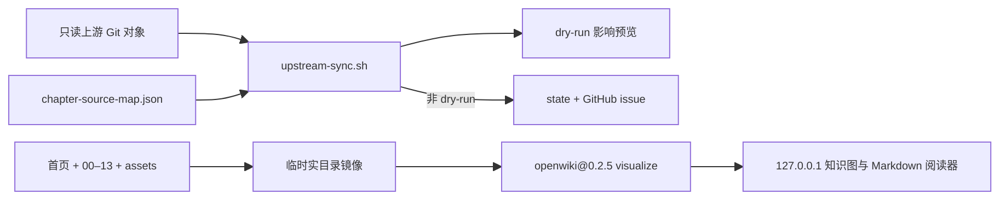

# OpenWiki 薄适配改造设计

> 批准日期：2026-08-03
>
> OpenWiki 调研基线：`0aa6ddcb57464b1541fe3457c4331418c3fdf28e`（npm `openwiki@0.2.5`）
>
> 适用仓库：`~/Code/aevatar-review`

## 目标

保留现有 MkDocs、`PLAN.md`、72 篇实质章节和冻结事实源纪律，只借用 OpenWiki 的两个成熟思路：

1. 上游变化只定位真正受影响的章节，预览不产生运行时状态或 GitHub 写入。
2. 用 Markdown 链接即时投影出可浏览的本地知识图，不建立第二套文档。

成功后，维护者可以安全预览一次上游同步，也可以用一条命令浏览“首页 + 00–13”的章节关系；两种操作都不改章节正文，不写 `~/Code/aevatar` 的工作树，不生成仓库内 `openwiki/`。

## 调研结论

OpenWiki 的 code mode 会读取 Git 变化、由 agent 生成 `openwiki/`、维护 OKF frontmatter，并以内容快照避免无变化时的元数据 churn；其 visualizer 则直接扫描 Markdown 链接，生成 node、edge 和 backlink。相关事实见固定提交下的 [agent workflow](https://github.com/langchain-ai/openwiki/blob/0aa6ddcb57464b1541fe3457c4331418c3fdf28e/openwiki/agent/workflow.md)、[graph implementation](https://github.com/langchain-ai/openwiki/blob/0aa6ddcb57464b1541fe3457c4331418c3fdf28e/src/visualize/graph.ts) 和 [README](https://github.com/langchain-ai/openwiki/blob/0aa6ddcb57464b1541fe3457c4331418c3fdf28e/README.md)。

本仓库已有更严格的上游路径到章节映射、冻结/同步双基准、章节状态和全量门禁。完整引入 OpenWiki code mode 会重复这些职责，还会产生另一套 `openwiki/` 和模型凭据边界。因此不采用生成 agent，只复用独立的 visualizer，并修正现有同步预览的副作用。

## 方案比较

### 方案 A：薄适配层（采用）

- 复用 `.config/upstream-sync/chapter-source-map.json` 与 `scripts/upstream-sync.sh`。
- 让 `--dry-run` 在所有退出路径都不写 `state.json`，不创建 GitHub label 或 issue。
- 用临时实目录镜像运行固定版本的 `openwiki visualize`。

优点是没有第二套事实源、没有模型成本、改动和回滚面最小。代价是图节点采用 OpenWiki 的 `Section` / `Reference` fallback，不提供额外的 OKF 标签筛选。

### 方案 B：为全书补 OKF 元数据（不采用）

给 72 篇正文和 14 个 index 批量加入 `type`、`title`、`description`、`tags`，图谱信息会更丰富，但会制造大范围无语义 diff，并让标签成为需要长期维护的第二套分类。只有出现明确的跨工具 OKF 消费者时再做。

### 方案 C：完整 OpenWiki code mode（不采用）

引入 DeepAgents、模型供应商凭据、定时生成 PR 和 `openwiki/` 输出。它适合从源码自动生成通用 wiki，却弱化本仓库的冻结证据、真实路径行号、章节验收与人工论证边界，因此不接管现有书目。

## 架构



两条链路互相独立：同步脚本负责“哪些章节可能过期”，visualizer 负责“这些章节怎样关联”。两者都不拥有正文事实；正文和 `PLAN.md` 仍是仓库权威内容。

## 组件与行为

### 1. 严格只读的同步预览

修改 `scripts/upstream-sync.sh`，保持现有参数、路径映射、commit 过滤和 issue 内容不变，只收紧 `--dry-run`：

- `--dry-run` 可以 fetch `origin/feature/integrate` 以读取最新 Git 对象，但不得 checkout、switch 或改上游工作树文件。
- 无论进入初始化、无新提交、无相关文件、无设计性 commit、零章节命中或正常命中路径，都不得创建或替换 `.config/upstream-sync/state.json`。
- 可以执行 GitHub 只读查询以保持去重预览准确，但不得调用 label/issue 创建命令。
- 输出继续列出 SHA 区间、命中章节、变更文件和规模；`--init --dry-run` 只说明将采用的基线，不落盘。
- 非 dry-run 行为保持现状：只有明确完成相应处理后才推进 state。

根修复点是把所有 state 持久化统一置于 mutation mode，而不是只保护脚本末尾的写入。

### 2. 本地知识图入口

新增 `scripts/visualize-wiki.sh`：

1. 检查 `node`、`npx` 存在，且 Node major version 至少为 22。
2. 创建进程私有临时目录并立即注册清理 trap。
3. 从 `PLAN.md` 读取恰好 72 个已完成章节路径，逐个复制工作树中的当前内容；再加入 `docs/index.md`、14 个 block `index.md`，以及 `docs/assets` 和 block 内的 `assets` 目录。不复制未列入 `PLAN.md` 的 Markdown、迁移台账、superpowers 文档或用户工作树中的其他文件。
4. 前台执行 `npx --yes openwiki@0.2.5 visualize <临时目录>`；用户附加的 `--port`、`--no-open` 等参数原样交给 OpenWiki。
5. OpenWiki 退出、脚本被中断或启动失败时删除临时目录。

必须把选中的文件物化到真实目录，因为本仓库 `docs/00`–`docs/13` 是 symlink，而 OpenWiki visualizer 的目录遍历有意不跟随 symlink。临时镜像同时保证 visualizer 看不到仓库外路径。

图谱预期包含 87 个 Markdown 节点：1 个首页、14 个 block index、72 篇实质章节。普通页无需新增 OKF 字段；OpenWiki 会从 H1 取标题，并对 index/正文分别使用 `Section` / `Reference` fallback。

## 数据与安全边界

- 不运行 `openwiki --init`、`openwiki --update` 或 OpenWiki agent chat。
- 不创建 `package.json`、lockfile、`.openwikiignore`、`.last-update.json` 或仓库内 `openwiki/`。
- 不读取或配置 LLM/API key，不启用 OpenWiki connector、telemetry 或定时任务。
- `openwiki@0.2.5` 使用精确版本，不使用 `latest`。首次运行需要 npm 网络；visualizer 页面按 OpenWiki 当前实现还会从公共 CDN 加载前端库。
- 服务只沿用 OpenWiki 的 loopback 监听；适配脚本不增加对外监听选项。
- 临时镜像的 Markdown 集合只来自 `PLAN.md` 已完成行、14 个 block index 和站点首页；页面内容取工作树当前值，便于预览尚未提交的正文修改。镜像不是事实源、缓存或可提交产物。

## 错误处理

- Node 低于 22，或缺少 `node` / `npx`：在创建临时镜像前失败，并给出安装要求。
- 任一必需章节目录或首页缺失：列出缺失路径并失败，不启动残缺图谱。
- 复制、npm 解析或 OpenWiki 启动失败：保留原退出码，执行 trap 清理。
- `upstream-sync --dry-run` 的 fetch、配置或只读 GitHub 查询失败：沿用现有非零退出和诊断，不用写 state 掩盖失败。
- 非 dry-run 的 GitHub mutation 结果不明确：沿用现有去重和记录纪律；本改造不扩展 issue orchestration。

## 测试与门禁

在现有 `scripts/tests/test-doc-checks.sh` 增加一个 `openwiki-adapter` suite，并把它加入 `all` 与文档 CI。测试只使用临时 Git 仓库和 PATH 中的 fake `gh` / `node` / `npx`，不访问真实 GitHub、npm 或 `~/Code/aevatar`。

最小覆盖：

1. 有命中章节时，`--dry-run` 输出章节但 state 字节不变，fake `gh` 未收到 label/issue 创建调用。
2. 初始化、无新提交等提前退出时，`--dry-run` 仍不创建或更新 state。
3. visualizer 调用精确的 `openwiki@0.2.5 visualize`，临时镜像恰好包含首页、`PLAN.md` 的 72 篇完成章节、14 个 block index 和相关 assets，不包含书目外 Markdown。
4. fake `npx` 退出后临时目录已删除，仓库内没有生成 `openwiki/`。
5. 缺少目录和 Node 版本不足均在调用 `npx` 前失败。

实施后的验证命令：

```bash
bash scripts/tests/test-doc-checks.sh openwiki-adapter
AEVATAR_SRC=<frozen-f02aa690-archive> bash scripts/check-md.sh --all
python3 scripts/check-links.py --all
bash scripts/check-drift.sh
python3 scripts/check-mermaid.py
mkdocs build --strict --clean
python3 scripts/check-site-ui.py
```

## 文件范围

- 修改：`scripts/upstream-sync.sh`
- 新增：`scripts/visualize-wiki.sh`
- 修改：`scripts/tests/test-doc-checks.sh`
- 修改：`.github/workflows/docs.yml`
- 修改：`README.md`
- 修改：`docs/upstream-sync.md`

不修改 `00`–`13`、`PLAN.md`、`mkdocs.yml`、章节 frontmatter 或 `~/Code/aevatar`。

## 验收标准

- 任意 `--dry-run` 分支都不会改变 state 或创建 GitHub 资源，并能显示受影响章节。
- `scripts/visualize-wiki.sh` 能在 Node 22+ 环境启动 87 节点的本地关系图与 Markdown 阅读器。
- 退出 visualizer 后没有临时目录和仓库产物残留。
- 不需要模型凭据，不出现第二套 wiki，不批量改章节元数据。
- 新适配测试与仓库既有 Markdown、链接、漂移、Mermaid、MkDocs 和站点 UI 门禁全部通过。
