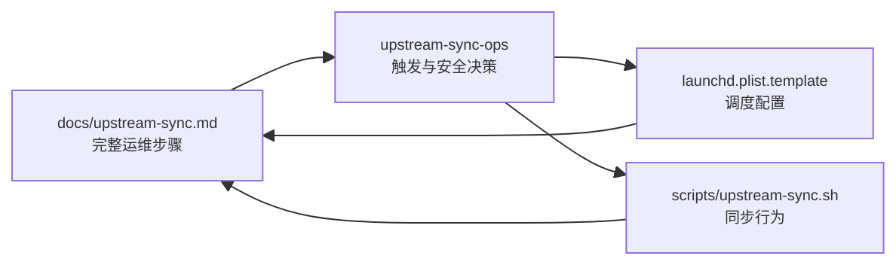

# upstream-sync 通用运维手册与仓库级 skill 设计

## 背景

仓库已有 `scripts/upstream-sync.sh`、launchd plist 模板和
`docs/upstream-sync.md`，但现有文档混入了 `consensus-loop` 的下游配置，安装命令也偏向
当前机器。目标是让任意 macOS 使用者都能从零启用定时扫描，并确认脚本具备创建
GitHub issue 的条件。

## 范围

本次修改包含两项产物：

1. 改写 `docs/upstream-sync.md`，作为唯一的人类运维手册。
2. 新增仓库级 `skills/upstream-sync-ops/`，让 agent 能正确处理安装、启动、状态检查、
   日志查看、排障和卸载请求。

本次不修改 `scripts/upstream-sync.sh`、章节映射规则或 `~/Code/aevatar`，也不负责
`consensus-loop` 如何领取和处理已创建的 issue。

## 信息所有权



- 运维命令、前置条件、验收和排障只在 `docs/upstream-sync.md` 详细维护。
- skill 不复制整套命令，只要求读取手册并根据用户意图选择对应流程。
- 真实同步行为继续由现有脚本负责；launchd 配置继续由现有模板负责。

## 运维手册结构

手册按实际执行顺序组织：

1. 说明任务模型：它是每隔一段时间启动一次的短任务，不是常驻进程。
2. 检查 macOS、Git、GitHub CLI、`jq`、上游仓库、目标仓库权限等前置条件。
3. 创建最小 `host.env`，仅要求 `AEVATAR_UPSTREAM_ROOT` 和 `GH_REPO_SLUG`。
4. 使用 `--init` 建立基线，并解释 `state.json` 的作用。
5. 使用 `--dry-run` 和普通手动运行验证扫描链路；dry-run 绝不改写真实 `state.json`，即使私有临时
   副本在某些分支中被更新也会在退出时丢弃，`git fetch` 仍可能更新上游 checkout 的 Git 元数据。
6. 从仓库模板生成本机 plist，校验后通过 `launchctl bootstrap` 加载；加载本身不要求立即扫描。
7. 使用 `launchctl print`、日志和状态文件完成验收。只有获得明确授权后，才可将 `launchctl kickstart`
   作为一次可选的真实默认模式扫描；它可能创建 GitHub issue 并推进扫描 SHA。
8. 解释重载配置、停止、卸载、重新初始化和常见故障。

命令不得写死用户名或仓库绝对路径。示例统一从当前仓库路径和 `$HOME` 推导，并在可能
创建 GitHub issue 或覆盖运行状态前明确说明副作用。

## skill 设计

skill 名称为 `upstream-sync-ops`，目录结构为：

```text
skills/upstream-sync-ops/
├── SKILL.md
└── agents/openai.yaml
```

它在用户要求安装、启用、运行、检查、排查或卸载本仓库的 `upstream-sync` 时触发。
核心行为如下：

1. 先读取 `docs/upstream-sync.md`，再读取与任务有关的脚本或 plist 模板。
2. 先做只读检查，区分“未安装”“已加载但当前空闲”“正在执行”和“最近执行失败”。
3. 只有用户明确要求安装、启动、重新初始化或卸载时，才执行对应的有副作用操作。
4. 不修改上游仓库，不把本机路径、用户名或仓库标识写入 skill。
5. 完成后报告 LaunchAgent 状态、最近退出码、日志时间和是否观察到 issue 创建条件。

skill 不增加包装脚本或独立参考文档，避免与现有脚本、模板和运维手册形成重复事实源。

## 验收

文档验收：

- 新 macOS 使用者能仅凭手册完成依赖检查、初始化、安装、手动触发和卸载。
- 手册能解释为什么 `launchctl` 显示 `not running` 仍可能是正常状态。
- 手册明确 `--init`、`--dry-run` 和普通运行是否更新状态、是否创建 issue。
- 手册不要求配置或启动 `consensus-loop`。

skill 验收：

- 无 skill 的基线场景能暴露至少一个遗漏或不安全倾向。
- 加载 skill 后，agent 会先检查环境和状态，并按用户授权控制副作用。
- `quick_validate.py` 能通过 skill 结构校验。
- 仓库 Markdown 检查脚本通过。

## 风险与处理

- **配置漂移**：skill 只引用手册，手册只引用脚本和模板，不复制完整配置。
- **误创建 issue**：安装验收优先使用 `--dry-run`；安装或重载后不自动 `kickstart`，只有明确授权的
  真实扫描才可触发它，且其副作用在命令前说明。
- **误判任务故障**：文档和 skill 都区分短任务的空闲状态与异常退出。
- **泄漏本机事实**：`host.env`、生成后的 plist 和 `state.json` 不进入 Git。
