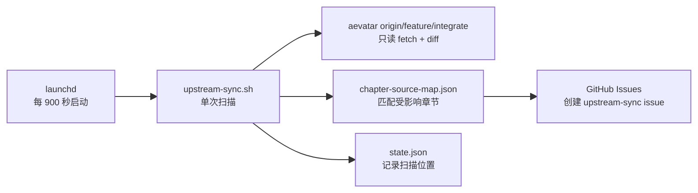

# upstream-sync macOS 安装与运维手册

> 本文档说明如何在任意 macOS 上安装、验证和维护
> `scripts/upstream-sync.sh`。目标是每 15 分钟扫描 aevatar 上游
> `feature/integrate`，并为受影响章节创建 GitHub issue。

`upstream-sync` 不是常驻进程。launchd 每 900 秒启动脚本一次，脚本完成 fetch、diff、
映射和建 issue 后退出。因此空闲时看到 `state = not running` 通常是正常现象；是否健康要
结合 `runs`、`last exit code` 和日志时间判断。

## 任务模型



本手册只覆盖同步脚本及其 LaunchAgent。脚本从上游仓库只读 fetch 与 diff，再按
`.config/upstream-sync/chapter-source-map.json` 找到可能受影响的章节；运行状态仅保存于
`.config/upstream-sync/state.json`。该文件是被 Git 忽略的运行时状态，不得添加到 Git。GitHub
issue 是脚本的最终外部输出，不依赖或配置其他自动化服务。

## 安装前检查

先在本地 shell 中定义以下变量。`UPSTREAM_ROOT` 必须是 aevatar 的本地 checkout，且其
`origin` 能访问 `feature/integrate`；`GH_REPO_SLUG` 填写实际的 GitHub 仓库。

```bash
REVIEW_ROOT="$(git rev-parse --show-toplevel)"
UPSTREAM_ROOT="/absolute/path/to/aevatar"
GH_REPO_SLUG="owner/aevatar-review"
LAUNCH_LABEL="com.eanzhao.aevatar-review.upstream-sync"
LAUNCH_DOMAIN="gui/$(id -u)"
PLIST_PATH="$HOME/Library/LaunchAgents/$LAUNCH_LABEL.plist"
```

执行依赖、网络和 GitHub 权限检查：

```bash
test "$(uname -s)" = "Darwin"
command -v git
command -v gh
command -v jq
gh auth status
git -C "$UPSTREAM_ROOT" rev-parse --is-inside-work-tree
git -C "$UPSTREAM_ROOT" ls-remote --exit-code origin refs/heads/feature/integrate
gh repo view "$GH_REPO_SLUG" --json nameWithOwner,viewerPermission,hasIssuesEnabled
```

前四项分别应确认当前是 macOS、并能找到 `git`、`gh`、`jq`；`gh auth status` 应显示有效登录。
两条 Git 命令应分别输出 `true` 和目标分支的 ref；`gh repo view` 输出中的
`hasIssuesEnabled` 必须为 `true`。操作者还需要足以创建 issue 并添加 `upstream-sync` label
的仓库权限。这里不需要、也不应配置任何 issue intake 的作者白名单。

## 首次初始化

在 `$REVIEW_ROOT/.config/consensus-rnd/host.env` 中保存以下两项，并确保该文件不加入 Git：

```bash
export AEVATAR_UPSTREAM_ROOT="/absolute/path/to/aevatar"
export GH_REPO_SLUG="owner/aevatar-review"
```

`--init` 会用当前上游 HEAD 覆盖基线并清空 `filed_issues`，只在首次启用或明确重建基线时使用，
不创建 issue。执行初始化并检查结果：

```bash
cd "$REVIEW_ROOT"
export CONSENSUS_RND_HOST_ENV="$REVIEW_ROOT/.config/consensus-rnd/host.env"
bash scripts/upstream-sync.sh --init
jq '{last_processed_sha, last_run_at, filed_issue_count: (.filed_issues | length)}' \
  .config/upstream-sync/state.json
```

预期 `filed_issue_count` 为 `0`，并能看到当前上游 HEAD 对应的 `last_processed_sha` 与本次
初始化时间。这样建立基线的理由是只从启用后的新变更开始创建待审查项，避免把既有历史一次性
转为 issue。

## 手动验证

先用 dry-run 检查扫描、差异和映射是否可用。它不会创建 GitHub issue，也绝不改写真实的
`.config/upstream-sync/state.json`；部分分支会更新一份私有临时副本，并在退出时丢弃。脚本仍可能
在上游 checkout 中执行 `git fetch`，因此 Git 元数据可能更新：

```bash
cd "$REVIEW_ROOT"
export CONSENSUS_RND_HOST_ENV="$REVIEW_ROOT/.config/consensus-rnd/host.env"
bash scripts/upstream-sync.sh --dry-run
```

普通模式会为命中的新变更创建真实 GitHub issue：

```bash
cd "$REVIEW_ROOT"
export CONSENSUS_RND_HOST_ENV="$REVIEW_ROOT/.config/consensus-rnd/host.env"
bash scripts/upstream-sync.sh
```

| 模式 | 创建 issue | 影响状态 |
|---|---:|---|
| `--init` | 否 | 覆盖基线 SHA、运行时间和已建 issue 记录 |
| `--dry-run` | 否 | state.json 保持不变；临时副本中的更新会在退出时丢弃 |
| 默认模式 | 可能 | 扫描结束后推进 SHA，并记录成功创建的 issue |

> [!WARNING]
> 当前默认模式即使某个 `gh issue create` 失败，最后仍可能推进扫描 SHA。遇到
> `WARN: 建 issue 失败` 时，应立即保留日志并人工核对，不得用 `--init` 处理；重建基线会清空
> 已建 issue 记录，无法补回被跳过的扫描区间。

## 安装 LaunchAgent

使用当前 checkout 路径与当前用户的 `$HOME` 从模板生成用户级 plist；不要修改 Git 中的
`.config/upstream-sync/launchd.plist.template`：

```bash
mkdir -p "$HOME/Library/LaunchAgents" "$HOME/Library/Logs"
sed \
  -e "s|YOUR_HOME/Code/aevatar-review|$REVIEW_ROOT|g" \
  -e "s|YOUR_HOME|$HOME|g" \
  "$REVIEW_ROOT/.config/upstream-sync/launchd.plist.template" > "$PLIST_PATH"
plutil -lint "$PLIST_PATH"
launchctl bootstrap "$LAUNCH_DOMAIN" "$PLIST_PATH"
```

先 `plutil -lint` 是为了在加载前拦住损坏的 plist，避免把配置错误伪装成调度问题。若路径包含
`|` 或 `&`，不要使用上述 `sed` 命令；应手动复制模板、替换路径后再运行 `plutil -lint`。
重复安装收到 `service already loaded` 时，转到下面的「重载」步骤。加载成功后无需立即触发扫描。

> [!WARNING]
> 以下 `launchctl kickstart` 会以默认模式运行一次真实扫描，可能创建真实 GitHub issue 并推进扫描
> SHA。只有在操作者明确授权这次真实扫描后才执行；它不是安装所必需的步骤。

```bash
launchctl kickstart -k "$LAUNCH_DOMAIN/$LAUNCH_LABEL"
```

## 验收

运行以下命令检查服务、日志、状态和 GitHub 输出：

```bash
launchctl print "$LAUNCH_DOMAIN/$LAUNCH_LABEL"
tail -n 50 "$HOME/Library/Logs/aevatar-review-upstream-sync.log"
tail -n 50 "$HOME/Library/Logs/aevatar-review-upstream-sync.err.log"
stat -f '%N | modified=%Sm | size=%z' -t '%Y-%m-%d %H:%M:%S %z' \
  "$HOME/Library/Logs/aevatar-review-upstream-sync.log" \
  "$HOME/Library/Logs/aevatar-review-upstream-sync.err.log"
jq '{last_processed_sha, last_run_at, filed_issue_count: (.filed_issues | length)}' \
  "$REVIEW_ROOT/.config/upstream-sync/state.json"
gh issue list --repo "$GH_REPO_SLUG" --label upstream-sync --state all --limit 20
```

| 现象 | 结论 |
|---|---|
| `state = not running`、`last exit code = 0`、日志在一个间隔内更新 | 正常空闲 |
| `state = running` | 本轮脚本正在执行 |
| `last exit code != 0` | 最近一轮失败，查看 stderr |
| `launchctl print` 找不到 service | 未加载或加载到错误 domain |
| 日志超过两个间隔未更新 | 调度、休眠或配置可能异常 |

`--dry-run` 不能证明 GitHub 写权限。真正的端到端成功标准是出现新的匹配上游变更后，日志记录
`CREATED #...`，且 `gh issue list` 能看到对应 issue。

## 重载

修改已安装的 plist 后，用相同的用户 domain 卸载、校验并重新加载：

```bash
launchctl bootout "$LAUNCH_DOMAIN" "$PLIST_PATH"
plutil -lint "$PLIST_PATH"
launchctl bootstrap "$LAUNCH_DOMAIN" "$PLIST_PATH"
```

重新加载后无需立即触发扫描。

> [!WARNING]
> 以下 `launchctl kickstart` 会以默认模式运行一次真实扫描，可能创建真实 GitHub issue 并推进扫描
> SHA。只有在操作者明确授权这次真实扫描后才执行；它不是重载所必需的步骤。

```bash
launchctl kickstart -k "$LAUNCH_DOMAIN/$LAUNCH_LABEL"
```

## 卸载

以下操作仅卸载调度，不删除运行状态；保留 `state.json` 可以在未来重新安装时继续从既有扫描
位置开始：

```bash
launchctl bootout "$LAUNCH_DOMAIN" "$PLIST_PATH"
rm "$PLIST_PATH"
```

## 排障

| 问题 | 检查与处理 |
|---|---|
| `gh auth status` 失败 | 运行 `gh auth status` 确认认证错误；按输出执行 `gh auth login`，再运行 `gh repo view "$GH_REPO_SLUG" --json viewerPermission,hasIssuesEnabled` 确认权限与 issue 功能。 |
| 上游 fetch 失败 | 运行 `git -C "$UPSTREAM_ROOT" remote -v` 与 `git -C "$UPSTREAM_ROOT" fetch origin feature/integrate`；确认 `AEVATAR_UPSTREAM_ROOT` 指向同一 checkout，网络和 origin 凭据可用。 |
| `bootstrap failed: 5` | 先运行 `plutil -lint "$PLIST_PATH"`；再用 `launchctl print "$LAUNCH_DOMAIN/$LAUNCH_LABEL"` 检查是否已加载。若已加载，按「重载」流程操作。 |
| 任务已加载但 `not running` | 运行 `launchctl print "$LAUNCH_DOMAIN/$LAUNCH_LABEL"`、`tail -n 50 "$HOME/Library/Logs/aevatar-review-upstream-sync.log"`；无活动且 `last exit code = 0` 通常是单次任务已正常退出。 |
| 日志不更新 | 先只读运行 `stat -f '%N | modified=%Sm | size=%z' "$HOME/Library/Logs/aevatar-review-upstream-sync.log" "$HOME/Library/Logs/aevatar-review-upstream-sync.err.log"`、`launchctl print "$LAUNCH_DOMAIN/$LAUNCH_LABEL"`，并检查电脑是否休眠以及 plist 中的路径和 domain。若这些检查后仍要执行真实扫描，必须先获得明确授权：`launchctl kickstart -k "$LAUNCH_DOMAIN/$LAUNCH_LABEL"` 会以默认模式运行，可能创建 GitHub issue 并推进扫描 SHA；授权后再单独执行它并复查 stderr。 |
| `WARN: 建 issue 失败` | 保留 stdout、stderr 与当前 `state.json`，运行 `gh auth status`、`gh repo view "$GH_REPO_SLUG" --json viewerPermission,hasIssuesEnabled` 和 `gh issue list --repo "$GH_REPO_SLUG" --label upstream-sync --state all --limit 20` 人工核对；不要执行 `--init`。 |
| 重复 issue | 运行 `gh issue list --repo "$GH_REPO_SLUG" --label upstream-sync --state all --limit 20` 与 `jq '.filed_issues' "$REVIEW_ROOT/.config/upstream-sync/state.json"`，确认是否有历史 state 被清空、手工重复运行或已有 open issue 去重未覆盖的情形。 |
| 未命中章节映射 | 运行 `git -C "$UPSTREAM_ROOT" diff --name-only "$(jq -r .last_processed_sha "$REVIEW_ROOT/.config/upstream-sync/state.json")..origin/feature/integrate"`，再查看 `.config/upstream-sync/chapter-source-map.json` 是否覆盖变更路径；映射按目录前缀或精确文件匹配。 |

排障时优先保留日志和状态再采取操作，因为 `state.json` 记录了扫描进度。对写入失败、重复创建或漏报，
先用现有 evidence 人工核对，再决定是否修正映射或恢复运行，避免以重建基线掩盖问题。
